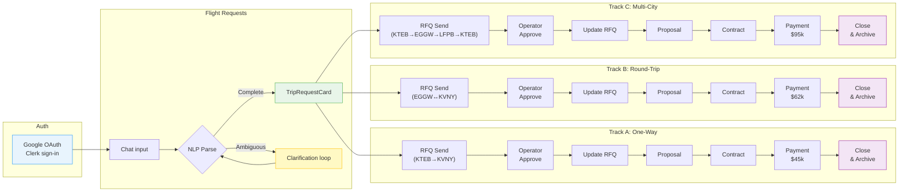
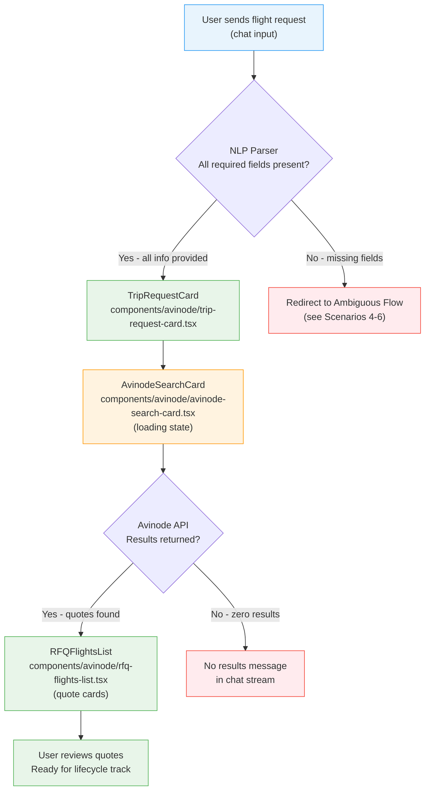
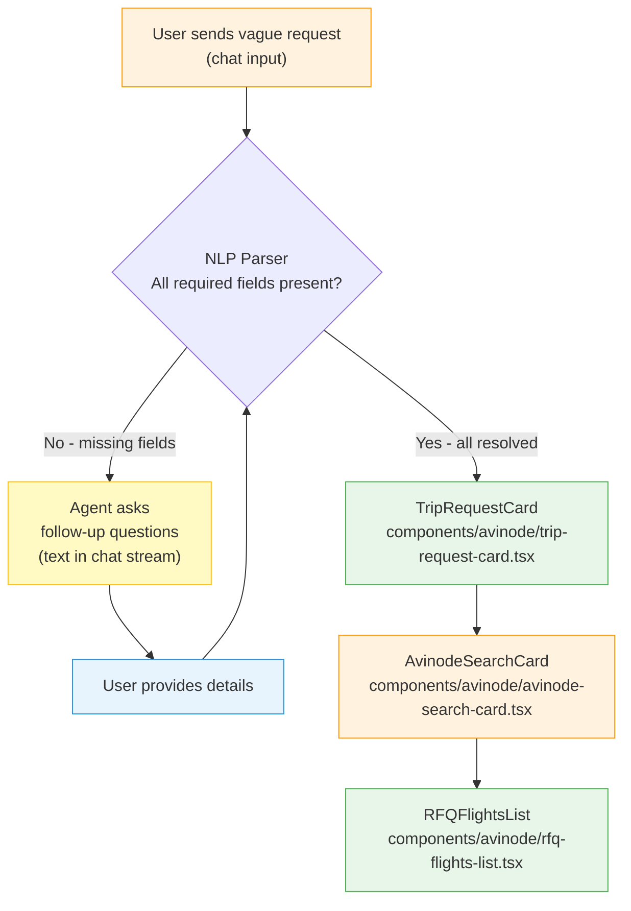
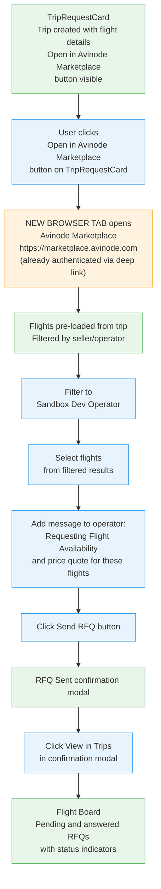
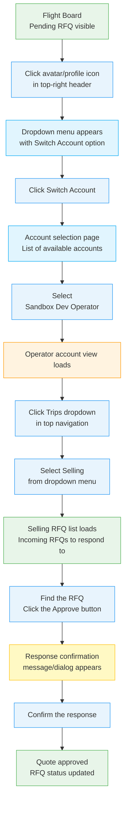
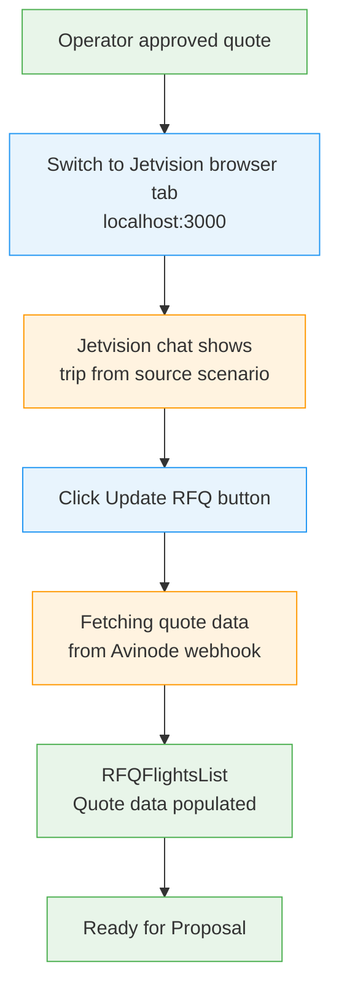
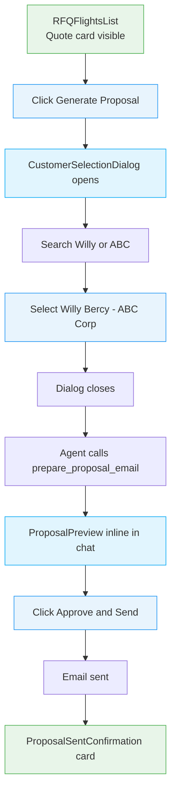
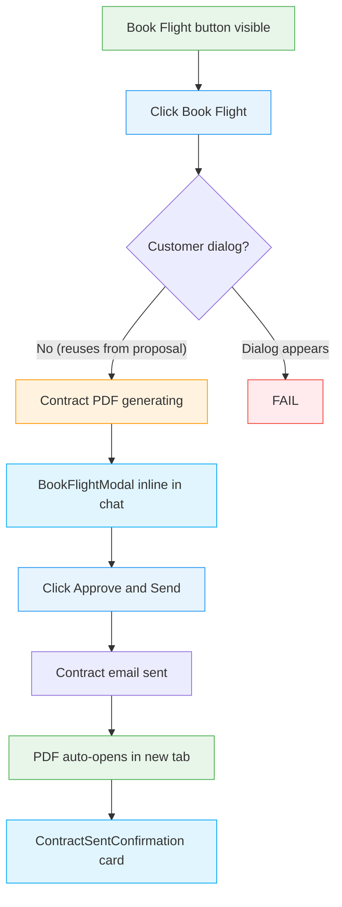

# Demo Recording

Record video demos of the Jetvision charter flight lifecycle using Playwright browser automation. Produces MP4/WebM recordings of each test scenario — useful for sprint demos, stakeholder reviews, and documentation.

## Parameters

### Scope Flags (pick one — most specific wins)

| Flag | Values | Description | Example |
|------|--------|-------------|---------|
| `--scenario` | `1`-`27` | Run a single scenario | `--scenario 10` |
| `--step` | `T1`-`T7` | Run one lifecycle step across all tracks | `--step T4` |
| `--track` | `A`, `B`, `C` | Run all 7 lifecycle steps for one track | `--track B` |
| `--phase` | `1`-`5`, `all` | Run an entire phase (default: `all`) | `--phase 3` |

**Phase values:**

| Phase | Scenarios | Description |
|-------|-----------|-------------|
| `1` | 1-3 | Flight requests (one-way, round-trip, multi-city) |
| `2` | 4-6 | Ambiguous requests with clarification flows |
| `3` | 7-13 | One-way full lifecycle (Track A) |
| `4` | 14-20 | Round-trip full lifecycle (Track B) |
| `5` | 21-27 | Multi-city full lifecycle (Track C) |
| `all` | 1-27 | All phases (default) |

**Step values (within lifecycle tracks):**

| Step | Description | Track A | Track B | Track C |
|------|-------------|---------|---------|---------|
| `T1` | Send RFQ | 7 | 14 | 21 |
| `T2` | Operator Approve | 8 | 15 | 22 |
| `T3` | Update RFQ | 9 | 16 | 23 |
| `T4` | Proposal | 10 | 17 | 24 |
| `T5` | Contract | 11 | 18 | 25 |
| `T6` | Payment | 12 | 19 | 26 |
| `T7` | Closure | 13 | 20 | 27 |

### Combining Flags

`--track` + `--step` narrows to a single scenario. Precedence: `--scenario` > `--track + --step` > `--step` > `--track` > `--phase`.

| Flags | Resolves To | Scenarios Run |
|-------|-------------|---------------|
| `--scenario 17` | Scenario 17 only | 17 |
| `--track B --step T4` | Track B + Proposal step | 17 |
| `--track A` | All of Track A | 7, 8, 9, 10, 11, 12, 13 |
| `--track C --step T1` | Track C + RFQ Send step | 21 |
| `--step T5` | Contract step across all tracks | 11, 18, 25 |
| `--step T6` | Payment step across all tracks | 12, 19, 26 |
| `--step T1` | RFQ Send across all tracks | 7, 14, 21 |
| `--phase 1` | Flight request creation | 1, 2, 3 |
| `--phase 2` | Ambiguous requests | 4, 5, 6 |
| `--phase 3` | Same as `--track A` | 7-13 |
| `--phase 1 --phase 2` | Phases 1 + 2 combined | 1-6 |
| `--track A --track B` | Tracks A + B | 7-20 |
| (no flags) | All phases | 1-27 |

**Invalid combinations** (ignored with warning):
- `--scenario N` + any other scope flag — `--scenario` always wins
- `--phase 1` + `--step T4` — phases 1-2 have no lifecycle steps; step is ignored
- `--track A` + `--phase 1` — `--track` takes precedence over `--phase`

### Mode Flags

| Flag | Description |
|------|-------------|
| `--headless` | Run headless (default, faster) |
| `--headed` | Run with visible browser (for watching live) |
| `--interactive` | Use Claude-in-Chrome for manual step-through with GIF recording |

### Output Flags

| Flag | Values | Description |
|------|--------|-------------|
| `--convert` | `mp4`, `gif` | Post-processing: `mp4` converts WebM→MP4; `gif` converts to both MP4 and GIF |
| `--output-dir` | path | Override default recording output directory |

### Usage

```bash
# ── Full runs ──────────────────────────────────────────────
/demo-record                                  # All 27 scenarios, headless
/demo-record --headed                         # All 27, visible browser
/demo-record --convert gif                    # All 27 + convert to MP4 & GIF

# ── By phase ──────────────────────────────────────────────
/demo-record --phase 1                        # Flight requests only (scenarios 1-3)
/demo-record --phase 2                        # Ambiguous requests only (scenarios 4-6)
/demo-record --phase 1 --phase 2              # Phases 1 + 2 combined (scenarios 1-6)
/demo-record --phase 3                        # One-way lifecycle = Track A (scenarios 7-13)

# ── By track ──────────────────────────────────────────────
/demo-record --track A                        # One-way lifecycle (scenarios 7-13)
/demo-record --track B                        # Round-trip lifecycle (scenarios 14-20)
/demo-record --track C                        # Multi-city lifecycle (scenarios 21-27)
/demo-record --track A --track C              # Tracks A + C (scenarios 7-13, 21-27)

# ── By lifecycle step (across all tracks) ─────────────────
/demo-record --step T1                        # RFQ Send for all 3 tracks (scenarios 7, 14, 21)
/demo-record --step T4                        # Proposal for all 3 tracks (scenarios 10, 17, 24)
/demo-record --step T5                        # Contract for all 3 tracks (scenarios 11, 18, 25)
/demo-record --step T6                        # Payment for all 3 tracks (scenarios 12, 19, 26)
/demo-record --step T7                        # Closure for all 3 tracks (scenarios 13, 20, 27)

# ── Track + step = single scenario ────────────────────────
/demo-record --track A --step T4              # One-way proposal (scenario 10)
/demo-record --track B --step T4              # Round-trip proposal (scenario 17)
/demo-record --track C --step T1              # Multi-city RFQ send (scenario 21)
/demo-record --track B --step T5              # Round-trip contract (scenario 18)
/demo-record --track C --step T6              # Multi-city payment (scenario 26)

# ── Single scenario (most specific) ──────────────────────
/demo-record --scenario 1                     # One-way flight request
/demo-record --scenario 10                    # One-way proposal
/demo-record --scenario 17                    # Round-trip proposal
/demo-record --scenario 21                    # Multi-city RFQ send

# ── With mode flags ──────────────────────────────────────
/demo-record --track A --headed               # Track A with visible browser
/demo-record --phase 1 --headed --convert gif # Phase 1 headed + GIF conversion
/demo-record --scenario 10 --interactive      # Interactive mode (Claude-in-Chrome)
/demo-record --step T4 --interactive          # Interactive proposal step, all tracks

# ── With output flags ────────────────────────────────────
/demo-record --track B --convert mp4          # Track B + convert WebM→MP4
/demo-record --convert gif                    # All scenarios + MP4 + GIF
/demo-record --output-dir ./demos/sprint-5    # Custom output directory
```

## Actions to Execute

**IMPORTANT:** You MUST invoke the `demo-record` skill using the Skill tool BEFORE taking any action. The skill contains the full recording workflow, troubleshooting, and conversion steps.

```txt
Skill: demo-record
Args: $ARGUMENTS
```

Follow the skill's instructions exactly. Do not proceed without loading it first.

### Quick Reference

| Command | What it does |
|---------|-------------|
| `/demo-record` | Record all 27 scenarios headless |
| `/demo-record --phase 1 --headed` | Record Phase 1 with visible browser |
| `/demo-record --track A` | Record Track A (one-way lifecycle, scenarios 7-13) |
| `/demo-record --track B --step T4` | Record round-trip proposal only (scenario 17) |
| `/demo-record --scenario 10` | Record scenario 10 only |
| `/demo-record --step T5` | Record contract step for all 3 tracks (scenarios 11, 18, 25) |
| `/demo-record --convert gif` | Record all + convert to MP4 and GIF |
| `/demo-record --interactive --scenario 7` | Interactive mode for scenario 7 |

**Underlying Playwright commands:**

| Command | What it does |
|---------|-------------|
| `npm run test:e2e:demo` | Record all scenarios headless |
| `npm run test:e2e:demo:headed` | Record all scenarios with visible browser |
| `npx playwright test --project=demo phase1` | Record Phase 1 only |
| `npx playwright test --project=demo -g "Scenario 10"` | Record single scenario by name |
| `bash scripts/convert-recordings.sh` | Convert WebM to MP4 |
| `bash scripts/convert-recordings.sh --gif` | Convert to MP4 + GIF |
| `bash scripts/convert-recordings.sh --phase 3` | Convert Track A recordings only |

---

## Full Scenario Map (27 Scenarios)

### Flight Request Creation (Scenarios 1-6)

| # | Scenario | Phase | Trigger |
|---|----------|-------|---------|
| 1 | One-way flight — full info | Flight request | Chat input |
| 2 | Round-trip flight — full info | Flight request | Chat input |
| 3 | Multi-city trip — full info | Flight request | Chat input |
| 4 | Ambiguous: tomorrow to Canada | Flight request | Chat input |
| 5 | Ambiguous: Florida to California | Flight request | Chat input |
| 6 | Ambiguous: round trip vague date | Flight request | Chat input |

### Track A: One-Way Full Lifecycle (Scenarios 7-13)

| # | Scenario | Phase | Trigger |
|---|----------|-------|---------|
| 7 | Send RFQ — one-way | Avinode RFP exchange | Click "Open in Avinode Marketplace" |
| 8 | Operator approves — one-way | Avinode RFP exchange | Switch account → Selling → Approve |
| 9 | Update RFQ — one-way | Avinode RFP exchange | Click "Update RFQ" |
| 10 | Proposal — one-way | Post-quote lifecycle | Click "Generate Proposal" |
| 11 | Contract — one-way | Post-quote lifecycle | Click "Book Flight" |
| 12 | Payment — one-way | Post-quote lifecycle | Chat input |
| 13 | Closure — one-way | Post-quote lifecycle | Automatic after payment |

### Track B: Round-Trip Full Lifecycle (Scenarios 14-20)

| # | Scenario | Phase | Trigger |
|---|----------|-------|---------|
| 14 | Send RFQ — round-trip | Avinode RFP exchange | Click "Open in Avinode Marketplace" |
| 15 | Operator approves — round-trip | Avinode RFP exchange | Switch account → Selling → Approve |
| 16 | Update RFQ — round-trip | Avinode RFP exchange | Click "Update RFQ" |
| 17 | Proposal — round-trip | Post-quote lifecycle | Click "Generate Proposal" |
| 18 | Contract — round-trip | Post-quote lifecycle | Click "Book Flight" |
| 19 | Payment — round-trip | Post-quote lifecycle | Chat input |
| 20 | Closure — round-trip | Post-quote lifecycle | Automatic after payment |

### Track C: Multi-City Full Lifecycle (Scenarios 21-27)

| # | Scenario | Phase | Trigger |
|---|----------|-------|---------|
| 21 | Send RFQ — multi-city | Avinode RFP exchange | Click "Open in Avinode Marketplace" |
| 22 | Operator approves — multi-city | Avinode RFP exchange | Switch account → Selling → Approve |
| 23 | Update RFQ — multi-city | Avinode RFP exchange | Click "Update RFQ" |
| 24 | Proposal — multi-city | Post-quote lifecycle | Click "Generate Proposal" |
| 25 | Contract — multi-city | Post-quote lifecycle | Click "Book Flight" |
| 26 | Payment — multi-city | Post-quote lifecycle | Chat input |
| 27 | Closure — multi-city | Post-quote lifecycle | Automatic after payment |

---

## Lifecycle Track Parameters

Each lifecycle track runs the same 7-step flow (RFQ → Proposal → Contract → Payment → Closure) with trip-type-specific inputs.

| Parameter | Track A (One-Way) | Track B (Round-Trip) | Track C (Multi-City) |
|-----------|-------------------|---------------------|---------------------|
| **Source Scenario** | 1 | 2 | 3 |
| **Scenarios** | 7-13 | 14-20 | 21-27 |
| **Chat input** | See Scenario 1 | See Scenario 2 | See Scenario 3 |
| **Route** | KTEB → KVNY | EGGW → KVNY → EGGW | KTEB → EGGW → LFPB → KTEB |
| **Legs** | 1 | 2 | 3 |
| **TripRequestCard legs** | 1 leg displayed | 2 legs displayed | 3 legs displayed |
| **RFQ quote grouping** | Single quotes | Round-trip or per-leg | Per-leg, possibly grouped |
| **Payment amount** | $45,000 | $62,000 | $95,000 |
| **Payment reference** | WT-2026-TEST-001 | WT-2026-TEST-002 | WT-2026-TEST-003 |
| **Payment message** | Payment received from ABC Corp - $45,000 wire transfer, reference WT-2026-TEST-001 | Payment received from ABC Corp - $62,000 wire transfer, reference WT-2026-TEST-002 | Payment received from ABC Corp - $95,000 wire transfer, reference WT-2026-TEST-003 |
| **Screenshot folder** | `one-way-lifecycle/` | `round-trip-lifecycle/` | `multi-city-lifecycle/` |

### Track-Specific Verification

| Check | Track A | Track B | Track C |
|-------|---------|---------|---------|
| TripRequestCard legs | 1 leg: KTEB → KVNY | 2 legs: EGGW → KVNY, KVNY → EGGW | 3 legs: KTEB → EGGW, EGGW → LFPB, LFPB → KTEB |
| Airport codes visible | KTEB, KVNY | EGGW, KVNY | KTEB, EGGW, LFPB |
| Quote cards | Standard one-way pricing | Round-trip or per-leg pricing | Per-leg quotes (may show 3 quote groups) |
| Proposal PDF route | KTEB → KVNY | EGGW ↔ KVNY | KTEB → EGGW → LFPB → KTEB |
| Contract amount | ~$45,000 | ~$62,000 | ~$95,000 |
| DB payment_reference | WT-2026-TEST-001 | WT-2026-TEST-002 | WT-2026-TEST-003 |

---

### Test Results by Phase

| Phase | Scenarios | Status | Notes |
|-------|-----------|--------|-------|
| Phase 1: Flight Requests | 1-3 | Stable | One-way, round-trip, multi-city |
| Phase 2: Ambiguous Requests | 4-6 | Stable | Clarification flow testing |
| Phase 3: One-Way Lifecycle (Track A) | 7-13 | Requires sandbox | Full lifecycle for one-way |
| Phase 4: Round-Trip Lifecycle (Track B) | 14-20 | Requires sandbox | Full lifecycle for round-trip |
| Phase 5: Multi-City Lifecycle (Track C) | 21-27 | Requires sandbox | Full lifecycle for multi-city |

---

## Recording Mode (Video Demos)

### Playwright (MP4/WebM) — Automated

```bash
# Record all demo scenarios (headless)
npm run test:e2e:demo

# Record with visible browser
npm run test:e2e:demo:headed

# Convert WebM to MP4
npm run demo:convert

# Convert to both MP4 and GIF
bash scripts/convert-recordings.sh --gif
```

Videos are saved to `test-results/` (WebM) and converted to `e2e-recordings/` (MP4/GIF).

### Recording Output Directory

```
e2e-recordings/
├── phase1-flight-requests/        # Scenarios 1-3
│   ├── scenario-01-one-way.mp4
│   ├── scenario-01-one-way.gif
│   ├── scenario-02-round-trip.mp4
│   └── scenario-03-multi-city.mp4
├── phase2-ambiguous-requests/     # Scenarios 4-6
│   ├── scenario-04-canada.mp4
│   ├── scenario-05-florida.mp4
│   └── scenario-06-vague-date.mp4
├── track-a-one-way/               # Scenarios 7-13
│   ├── scenario-07-rfq-send.mp4
│   ├── scenario-08-operator-approve.mp4
│   ├── scenario-09-update-rfq.mp4
│   ├── scenario-10-proposal.mp4
│   ├── scenario-11-contract.mp4
│   ├── scenario-12-payment.mp4
│   └── scenario-13-closure.mp4
├── track-b-round-trip/            # Scenarios 14-20
│   ├── scenario-14-rfq-send.mp4
│   └── ...
├── track-c-multi-city/            # Scenarios 21-27
│   ├── scenario-21-rfq-send.mp4
│   └── ...
└── full-demo/                     # Concatenated full-length recordings
    ├── full-demo-all.mp4
    ├── track-a-lifecycle.mp4
    ├── track-b-lifecycle.mp4
    └── track-c-lifecycle.mp4
```

### Demo Spec Files

Located in `__tests__/e2e/demo/` split by phase:

| File | Scenarios | Phase |
|------|-----------|-------|
| `phase1-flight-requests.demo.spec.ts` | 1-3 | Flight requests |
| `phase2-ambiguous-requests.demo.spec.ts` | 4-6 | Ambiguous flows |
| `phase3-oneway-lifecycle.demo.spec.ts` | 7-13 | One-way full lifecycle |
| `phase4-roundtrip-lifecycle.demo.spec.ts` | 14-20 | Round-trip full lifecycle |
| `phase5-multicity-lifecycle.demo.spec.ts` | 21-27 | Multi-city full lifecycle |

### gif_creator (Interactive) — Per-Scenario

When running scenarios interactively via Claude-in-Chrome, wrap each scenario with:
1. `gif_creator({ action: "start_recording", tabId })`
2. [Execute scenario steps]
3. `gif_creator({ action: "stop_recording", tabId })`
4. `gif_creator({ action: "export", tabId, filename: "scenario-NN.gif", download: true })`

### Requirements

- **ffmpeg** — Required for WebM-to-MP4/GIF conversion. Install via `brew install ffmpeg`.
- **Playwright browsers** — Run `npx playwright install chromium` if needed.

---

## Prerequisites

1. Chrome browser open with Claude-in-Chrome extension active
2. Jetvision dev server running (`npm run dev:app`) at `http://localhost:3000`
3. Valid Clerk test credentials in `.env.local` (`E2E_CLERK_USER_USERNAME`, `E2E_CLERK_USER_PASSWORD`, `CLERK_SECRET_KEY`)
4. Playwright browsers installed (`npx playwright install chromium`)
5. ffmpeg installed for conversion (`brew install ffmpeg`)
6. Valid Avinode Sandbox credentials (for Phases 3-5)
7. Gmail MCP server configured (for proposal/contract email in lifecycle tracks)
8. Screenshot and recording directories created:

```bash
mkdir -p /Volumes/SeagatePortableDrive/Projects/Software/v0-jetvision-assistant/e2e-screenshots/{auth,one-way,round-trip,multi-city,ambiguous,one-way-lifecycle,round-trip-lifecycle,multi-city-lifecycle}
mkdir -p /Volumes/SeagatePortableDrive/Projects/Software/v0-jetvision-assistant/e2e-recordings/{phase1-flight-requests,phase2-ambiguous-requests,track-a-one-way,track-b-round-trip,track-c-multi-city,full-demo}
```

---

## ID Traceability

Every lifecycle phase captures and verifies tripID/quoteID continuity. Components expose machine-readable `data-*` attributes for test extraction. **All three lifecycle tracks verify the full ID chain.**

### ID Chain

```
request (avinode_trip_id, avinode_rfp_id)
  -> quote (avinode_quote_id)
    -> proposal (request_id, quote_id)
      -> contract (request_id, proposal_id)
```

### `data-*` Attributes

| Component | Attribute | Source |
|-----------|-----------|--------|
| `FlightSearchProgress` | `data-trip-id` | `tripId` prop |
| `RFQFlightCard` | `data-quote-id`, `data-flight-id` | `quoteId`, `flight.id` props |
| `ProposalSentConfirmation` | `data-proposal-id` | `proposalId` prop |
| `ContractSentConfirmation` | `data-contract-id`, `data-contract-number` | `contractId`, `contractNumber` props |
| `BookFlightModal` | `data-quote-id` | `flight.quoteId` prop |

### Per-Track ID Verification

Each lifecycle track (A/B/C) verifies the full chain independently:

| Track | tripId Source | quoteId Source | proposalId Source | contractId Source |
|-------|-------------|---------------|-------------------|-------------------|
| A (One-Way) | Scenario 7 deep link | Scenario 9 RFQ cards | Scenario 10 confirmation | Scenario 11 confirmation |
| B (Round-Trip) | Scenario 14 deep link | Scenario 16 RFQ cards | Scenario 17 confirmation | Scenario 18 confirmation |
| C (Multi-City) | Scenario 21 deep link | Scenario 23 RFQ cards | Scenario 24 confirmation | Scenario 25 confirmation |

---

## Test Customer Profile

| Field | Value |
|-------|-------|
| Company | ABC Corp |
| Contact | Willy Bercy |
| Email | kingler@me.com |
| Customer ID | (create via CustomerSelectionDialog if not in seed data) |
| Role | Recipient for proposal and contract emails |

**Note:** If ABC Corp / Willy Bercy is not in the `client_profiles` table, use the "create new customer" option in the `CustomerSelectionDialog` during the first proposal scenario (Scenario 10) to add them inline. Existing seed customers: Acme Corporation (Bob Johnson), TechStart Inc (Alice Williams), Global Ventures LLC (Charlie Davis).

**Note:** The same customer (Willy Bercy / ABC Corp) is used across all three lifecycle tracks. The CustomerSelectionDialog only appears on the first "Generate Proposal" click within each track — subsequent tracks reuse the same customer.

---

## Avinode Sandbox Credentials

| Field | Value |
|-------|-------|
| Marketplace URL | https://marketplace.avinode.com |
| Email | kingler@me.com |
| Password | 2FRhgGZK3wSy8SY |

**Note:** You do NOT need to login to Avinode separately. The marketplace opens already authenticated when clicking the deep link from Jetvision. Credentials are here as fallback if the session expires.

**Note:** Sandbox API key resets every Monday morning. Run `/avinode-sandbox-reset` if needed.

---

## Complete Lifecycle Overview



---

## Recording Best Practices

### Scroll the Chat Thread

**REQUIRED for every step:** Before taking a screenshot or while recording, scroll the Jetvision chat thread from **top to bottom** so the full conversation is visible in the recording. This ensures viewers can see the complete context — earlier messages, component cards, and the latest response.

**How to scroll:**
1. After each agent response settles, scroll to the **top** of the chat thread first
2. Slowly scroll **down** through the entire conversation to the bottom
3. Pause briefly at key UI components (TripRequestCard, RFQFlightsList, ProposalPreview, etc.) so they are clearly visible
4. Take the screenshot or let the recording capture the full scroll

**Why this matters:**
- Chat responses push earlier content out of view — scrolling reveals the full flow
- Stakeholders reviewing demos need to see the progression of steps
- Screenshots of only the bottom of the chat miss critical context (trip cards, deep links, quote cards)

**In interactive mode (Claude-in-Chrome):** Use `mcp__claude-in-chrome__javascript_tool` to scroll:
```javascript
// Scroll to top of chat
document.querySelector('[data-testid="chat-messages"]')?.scrollTo({ top: 0, behavior: 'smooth' });

// Scroll to bottom of chat
const el = document.querySelector('[data-testid="chat-messages"]');
el?.scrollTo({ top: el.scrollHeight, behavior: 'smooth' });
```

**In Playwright mode:** The test helpers should include scroll actions between assertion steps.

---

## Phase 1: Authentication

1. **Get current tab context:**
   ```
   Tool: mcp__claude-in-chrome__tabs_context_mcp
   ```
   Note which tabs are open. Do NOT reuse tabs from previous sessions.

2. **Create a new tab for Jetvision:**
   ```
   Tool: mcp__claude-in-chrome__tabs_create_mcp
   URL: http://localhost:3000
   ```
   Save the returned `tabId` as `jetvisionTabId`.

3. **Wait for page load and read:**
   ```
   Tool: mcp__claude-in-chrome__read_page
   tabId: <jetvision-tab-id>
   ```
   - If chat interface visible → already authenticated, skip to Phase 3.
   - If Clerk sign-in page → authenticate with Google OAuth (kinglerbercy@gmail.com).
   - If loading → wait 3-5 seconds, read again.

4. **Screenshot:** `e2e-screenshots/auth/01-authenticated.png`

---

## Phase 2: Task List

Create these tasks to track progress:

| # | Subject | ActiveForm | Description |
|---|---------|------------|-------------|
| 1 | Test one-way flight with full info | Testing one-way flight request | Send one-way request, validate assistant response |
| 2 | Test round-trip flight with full info | Testing round-trip flight request | Send round-trip request, validate assistant response |
| 3 | Test multi-city trip with full info | Testing multi-city trip request | Send multi-city request, validate assistant response |
| 4 | Test ambiguous request: tomorrow to Canada | Testing ambiguous Canada request | Send vague request, verify clarifying questions |
| 5 | Test ambiguous request: Florida to California | Testing ambiguous Florida request | Send vague request, verify clarifying questions |
| 6 | Test ambiguous request: round trip vague dates | Testing ambiguous round trip | Send vague request, verify clarifying questions |
| 7 | [Track A] Send RFQ — one-way | Testing one-way RFQ send | Open Avinode Marketplace from one-way trip, filter, send RFQ |
| 8 | [Track A] Operator approves — one-way | Testing one-way operator approval | Switch to operator, approve one-way RFQ |
| 9 | [Track A] Update RFQ — one-way | Testing one-way quote pull-in | Click Update RFQ, verify one-way quote data |
| 10 | [Track A] Proposal — one-way (ABC Corp) | Testing one-way proposal | Generate proposal for one-way, select customer, send |
| 11 | [Track A] Contract — one-way (Book Flight) | Testing one-way contract | Book Flight for one-way, approve and send |
| 12 | [Track A] Payment — one-way | Testing one-way payment | Confirm $45,000 payment, ref WT-2026-TEST-001 |
| 13 | [Track A] Closure — one-way | Testing one-way closure | Verify ClosedWonConfirmation, archive |
| 14 | [Track B] Send RFQ — round-trip | Testing round-trip RFQ send | Open Avinode Marketplace from round-trip, filter, send RFQ |
| 15 | [Track B] Operator approves — round-trip | Testing round-trip operator approval | Switch to operator, approve round-trip RFQ |
| 16 | [Track B] Update RFQ — round-trip | Testing round-trip quote pull-in | Click Update RFQ, verify round-trip quote data |
| 17 | [Track B] Proposal — round-trip (ABC Corp) | Testing round-trip proposal | Generate proposal for round-trip, send |
| 18 | [Track B] Contract — round-trip (Book Flight) | Testing round-trip contract | Book Flight for round-trip, approve and send |
| 19 | [Track B] Payment — round-trip | Testing round-trip payment | Confirm $62,000 payment, ref WT-2026-TEST-002 |
| 20 | [Track B] Closure — round-trip | Testing round-trip closure | Verify ClosedWonConfirmation, archive |
| 21 | [Track C] Send RFQ — multi-city | Testing multi-city RFQ send | Open Avinode Marketplace from multi-city trip, filter, send RFQ |
| 22 | [Track C] Operator approves — multi-city | Testing multi-city operator approval | Switch to operator, approve multi-city RFQ |
| 23 | [Track C] Update RFQ — multi-city | Testing multi-city quote pull-in | Click Update RFQ, verify multi-city quote data |
| 24 | [Track C] Proposal — multi-city (ABC Corp) | Testing multi-city proposal | Generate proposal for multi-city, send |
| 25 | [Track C] Contract — multi-city (Book Flight) | Testing multi-city contract | Book Flight for multi-city, approve and send |
| 26 | [Track C] Payment — multi-city | Testing multi-city payment | Confirm $95,000 payment, ref WT-2026-TEST-003 |
| 27 | [Track C] Closure — multi-city | Testing multi-city closure | Verify ClosedWonConfirmation, archive |
| 28 | Generate E2E test report | Generating test report | Compile all 27 results into summary + 3x DB verification |

---

## Phase 3: Flight Request Scenarios

### Full-Info Flight Request Flow (Scenarios 1-3)



**Per-trip-type differences within this flow:**

| Step | One-Way (Scenario 1) | Round-Trip (Scenario 2) | Multi-City (Scenario 3) |
|------|----------------------|-------------------------|-------------------------|
| **TripRequestCard** | 1 leg: DEP → ARR | 2 legs: DEP → ARR, ARR → DEP | 3+ legs: LEG1 → LEG2 → LEG3 → ... |
| **AvinodeSearchCard** | Single search | Search per direction (or bundled) | Search per leg |
| **RFQFlightsList** | One-way pricing per quote | Round-trip or per-leg pricing | Per-leg quotes, possibly grouped |
| **Edge case** | — | May ask for return date if missing | May ask for per-leg dates within range |

---

### Scenario 1: One-Way Flight — Full Info

**Chat input:**
```
I need a one way flight from KTEB to KVNY for 4 passengers on March 25, 2026 at 4:00pm EST
```

**Expected behavior:**
- Agent creates trip immediately (no clarification needed)
- `TripRequestCard` renders with 1 leg: KTEB → KVNY
- Deep link button ("Open in Avinode Marketplace") visible
- `AvinodeSearchCard` shows loading → results
- `RFQFlightsList` displays available quote cards

**Expected UI Components (in order of appearance):**

| Step | Component | File Path | What to Verify |
|------|-----------|-----------|----------------|
| Request parsed | `TripRequestCard` | `components/avinode/trip-request-card.tsx` | Shows 1 leg: KTEB → KVNY, 4 pax, Mar 25 4pm. "Open in Avinode Marketplace" button visible. |
| Search initiated | `AvinodeSearchCard` | `components/avinode/avinode-search-card.tsx` | Loading spinner → result count. Deep link displayed. |
| Quotes returned | `RFQFlightsList` | `components/avinode/rfq-flights-list.tsx` | Quote cards with price, aircraft, operator via `RFQFlightCard` |

**Browser automation steps:**
1. Type the chat input and press Enter
2. Wait for agent response (up to 60 seconds)
3. **Take a screenshot** → `e2e-screenshots/one-way/01-trip-created.png`
4. Verify `TripRequestCard` shows correct route and passenger count
5. Verify deep link button is visible
6. **Take a screenshot** → `e2e-screenshots/one-way/02-search-results.png`
7. Record result: PASS or FAIL with notes

**Screenshots:** `e2e-screenshots/one-way/`

---

### Scenario 2: Round-Trip Flight — Full Info

**Chat input:**
```
I need a round trip flight from EGGW to KVNY for 4 passengers on March 2, 2026 at 9:00am EST
```

**Expected behavior:**
- Agent creates trip immediately. May prompt for return date/time if not inferred.
- `TripRequestCard` renders with 2 legs: EGGW → KVNY, KVNY → EGGW
- Tests international ICAO code (EGGW = London Luton)

**Expected UI Components (in order of appearance):**

| Step | Component | File Path | What to Verify |
|------|-----------|-----------|----------------|
| Request parsed | `TripRequestCard` | `components/avinode/trip-request-card.tsx` | Shows 2 legs: EGGW → KVNY and KVNY → EGGW. 4 pax. "Open in Avinode Marketplace" button visible. |
| Search initiated | `AvinodeSearchCard` | `components/avinode/avinode-search-card.tsx` | Loading spinner → result count |
| Quotes returned | `RFQFlightsList` | `components/avinode/rfq-flights-list.tsx` | Round-trip or per-leg pricing per quote |

**Browser automation steps:**
1. Type the chat input and press Enter
2. Wait for agent response (up to 60 seconds)
3. If agent asks for return date, provide: `Return on March 5, 2026 at 2:00pm EST`
4. **Take a screenshot** → `e2e-screenshots/round-trip/01-trip-created.png`
5. Verify both legs displayed correctly
6. **Take a screenshot** → `e2e-screenshots/round-trip/02-search-results.png`
7. Record result: PASS or FAIL with notes

**Screenshots:** `e2e-screenshots/round-trip/`

---

### Scenario 3: Multi-City Trip — Full Info

**Chat input:**
```
I need a multi-city trip: KTEB to London Luton (EGGW), then London Luton to Paris Le Bourget (LFPB), then Paris Le Bourget back to KTEB. March 10-15, 4 passengers
```

**Expected behavior:**
- Agent creates trip immediately with all 3 legs
- `TripRequestCard` renders with 3 legs: KTEB → EGGW, EGGW → LFPB, LFPB → KTEB
- International airports resolve correctly

**Expected UI Components (in order of appearance):**

| Step | Component | File Path | What to Verify |
|------|-----------|-----------|----------------|
| Request parsed | `TripRequestCard` | `components/avinode/trip-request-card.tsx` | Shows 3 legs with correct airports. 4 pax. "Open in Avinode Marketplace" button visible. |
| Search initiated | `AvinodeSearchCard` | `components/avinode/avinode-search-card.tsx` | Loading spinner → result count |
| Quotes returned | `RFQFlightsList` | `components/avinode/rfq-flights-list.tsx` | Per-leg quotes, possibly grouped by operator |

**Browser automation steps:**
1. Type the chat input and press Enter
2. Wait for agent response (up to 60 seconds)
3. **Take a screenshot** → `e2e-screenshots/multi-city/01-trip-created.png`
4. Verify all 3 legs displayed correctly
5. **Take a screenshot** → `e2e-screenshots/multi-city/02-search-results.png`
6. Record result: PASS or FAIL with notes

**Screenshots:** `e2e-screenshots/multi-city/`

---

### Ambiguous Request Flow (Scenarios 4-6)



**What triggers clarification per scenario:**

| Scenario | Missing Fields | Expected Clarification Questions |
|----------|---------------|----------------------------------|
| 4 — "New York to Canada" | Airport (both), time, trip type | Which NYC airport? Which Canadian airport? Time? One-way or round-trip? |
| 5 — "Florida to California" | Airport (both), pax count, time, trip type | Which FL airport? Which CA airport? How many passengers? Time? |
| 6 — "New York to Kansas in March" | Airport (both), exact dates, times | Which airports? Which dates in March? Departure/return times? |

**CRITICAL:** `TripRequestCard` must NOT render until ALL clarifying questions are resolved. If it appears before clarification is complete, that is a **FAIL**.

---

### Scenario 4: Ambiguous — Tomorrow to Canada

**Chat input:**
```
Book a flight for tomorrow for three people from New York to Canada
```

**Expected behavior:**
- Agent asks clarifying questions (which airports, time, trip type)
- Does NOT create trip prematurely

**Browser automation steps:**
1. Type the chat input and press Enter
2. Wait for agent response
3. **Take a screenshot** → `e2e-screenshots/ambiguous/01-scenario4-clarification.png`
4. Verify agent asked about airports, time, trip type
5. Verify NO `TripRequestCard` rendered yet
6. Respond to clarification questions with specific answers
7. Wait for trip creation after all fields resolved
8. **Take a screenshot** → `e2e-screenshots/ambiguous/02-scenario4-resolved.png`
9. Record result: PASS or FAIL with notes

**Screenshots:** `e2e-screenshots/ambiguous/`

---

### Scenario 5: Ambiguous — Florida to California

**Chat input:**
```
I need a flight from Florida to California tomorrow
```

**Expected behavior:**
- Agent asks about specific airports, passenger count, time, trip type
- Does NOT create trip prematurely

**Browser automation steps:**
1. Type the chat input and press Enter
2. Wait for agent response
3. **Take a screenshot** → `e2e-screenshots/ambiguous/03-scenario5-clarification.png`
4. Verify agent asked about airports, passengers, time
5. Verify NO `TripRequestCard` rendered yet
6. Respond to clarification questions
7. Wait for trip creation
8. **Take a screenshot** → `e2e-screenshots/ambiguous/04-scenario5-resolved.png`
9. Record result: PASS or FAIL with notes

---

### Scenario 6: Ambiguous — Round Trip Vague Date

**Chat input:**
```
I need a round trip flight from New York to Kansas for 4 passengers in March
```

**Expected behavior:**
- Agent asks about specific airports, exact dates, times
- Does NOT create trip prematurely

**Browser automation steps:**
1. Type the chat input and press Enter
2. Wait for agent response
3. **Take a screenshot** → `e2e-screenshots/ambiguous/05-scenario6-clarification.png`
4. Verify agent asked about airports, dates, times
5. Verify NO `TripRequestCard` rendered yet
6. Respond to clarification questions
7. Wait for trip creation
8. **Take a screenshot** → `e2e-screenshots/ambiguous/06-scenario6-resolved.png`
9. Record result: PASS or FAIL with notes

---

## Lifecycle Track Template

This section defines the 7-step lifecycle flow shared by all three tracks (A/B/C). Each step uses **{PLACEHOLDER}** tokens for track-specific values. When executing a track, substitute the values from the [Lifecycle Track Parameters](#lifecycle-track-parameters) table.

**IMPORTANT:** Each lifecycle track runs in its own chat session. Start a new chat session before beginning each track so the trip data doesn't conflict.

---

### Step T1: Send RFQ via Avinode Marketplace

**Prerequisite:** Flight request (Scenario {SOURCE_SCENARIO}) completed with `TripRequestCard` visible and trip created

> **CRITICAL — Avinode Account Check:** Before clicking the "Open in Avinode Marketplace" button, you MUST verify that Avinode is logged in as **Jetvision LLC** (buyer account, ID 13792), NOT "Sandbox Dev Operator" (seller account, ID 14013). The deep link opens the marketplace in buyer mode. If you are logged in as Sandbox Dev Operator, the marketplace will show the wrong view and the RFQ send will fail. To switch: click the K avatar (top-right) → "Switch company" → select "Jetvision LLC".



**Browser automation steps:**

1. **Locate the "Open in Avinode Marketplace" button** on the `TripRequestCard` — this button appears after the trip is created with flight details
2. **Take a screenshot** → `e2e-screenshots/{SCREENSHOT_FOLDER}/01-trip-card-marketplace-button.png`
3. **VERIFY AVINODE ACCOUNT (REQUIRED):** If Avinode is already open in another tab, check which account is active. You MUST be logged in as **"Jetvision LLC"** (buyer), NOT "Sandbox Dev Operator" (seller). If logged in as the wrong account: switch to the Avinode tab → click K avatar (top-right) → "Switch company" → select "Jetvision LLC" → wait for page to reload. Then switch back to the Jetvision tab to continue.
4. **Click the "Open in Avinode Marketplace" button**
5. **Wait for a NEW BROWSER TAB to open** with the Avinode Marketplace
   - URL should be `https://marketplace.avinode.com/...`
   - The agent should already be authenticated (no login page) via the deep link
   - The trip's flight details should be pre-loaded into the marketplace view
   - Available flights should already be displayed, filtered by seller/operator
5. **Verify** the correct browser tab is active (the new Avinode tab, not the Jetvision tab)
6. **Take a screenshot** of the Avinode Marketplace with pre-loaded flights → `e2e-screenshots/{SCREENSHOT_FOLDER}/02-marketplace-flights-loaded.png`
7. **If the Avinode login page appears instead:** login with sandbox credentials (kingler@me.com / 2FRhgGZK3wSy8SY), then retry the deep link
8. **Verify flights are displayed** with seller/operator information visible
9. **Filter by seller** → select **"Sandbox Dev Operator"** from the seller/operator filter to narrow results to the sandbox test operator
10. **Take a screenshot** showing flights filtered to Sandbox Dev Operator → `e2e-screenshots/{SCREENSHOT_FOLDER}/03-seller-filtered.png`
11. **Select flight(s)** from the filtered results to request a quote
12. **Take a screenshot** of the selected flight(s) → `e2e-screenshots/{SCREENSHOT_FOLDER}/04-flights-selected.png`
13. **Locate the message field** for the operator and type exactly:
    ```
    Requesting Flight Availability and price quote for these flights
    ```
14. **Click the "Send RFQ" button**
15. **Wait** for the RFQ sent confirmation modal to appear
16. **Take a screenshot** → `e2e-screenshots/{SCREENSHOT_FOLDER}/05-rfq-sent-modal.png`
17. **Click "View in Trips"** in the confirmation modal
18. **Wait** for the Flight Board to load (still in the Avinode Marketplace tab)
19. **Take a screenshot** of the Flight Board → `e2e-screenshots/{SCREENSHOT_FOLDER}/06-flight-board.png`
20. **Verify the Flight Board shows:**
    - A list of RFQs with status indicators (pending and answered/approved)
    - The newly sent RFQ in the list with "Pending" status
    - Flight details matching the original trip request
21. **Check browser console** for errors
22. **Record result:** PASS or FAIL with notes

**Track-specific verification:**
- **Track A (One-Way):** Flight Board shows 1-leg trip: KTEB → KVNY
- **Track B (Round-Trip):** Flight Board shows 2-leg trip: EGGW → KVNY, KVNY → EGGW
- **Track C (Multi-City):** Flight Board shows 3-leg trip: KTEB → EGGW, EGGW → LFPB, LFPB → KTEB

**CRITICAL assertions:**
- FAIL if Avinode is logged in as "Sandbox Dev Operator" when clicking the deep link (must be "Jetvision LLC")
- FAIL if "Open in Avinode Marketplace" button is not on the TripRequestCard
- FAIL if clicking the button does NOT open a new browser tab
- FAIL if the new tab shows the Avinode login page instead of the marketplace
- FAIL if flight details from the trip are NOT pre-loaded in the marketplace
- FAIL if "Sandbox Dev Operator" is not available in the seller filter
- FAIL if RFQ does not appear in Flight Board after sending

---

### Step T2: Operator Approves Quote

**Prerequisite:** Step T1 completed (RFQ sent, visible in Flight Board)



**Browser automation steps:**

1. **Verify you are in the Avinode Marketplace browser tab** (NOT the Jetvision tab)
2. **Locate the avatar/profile icon** in the top-right corner of the Avinode header bar
3. **Click the avatar/profile icon** to open the dropdown menu
4. **Take a screenshot** → `e2e-screenshots/{SCREENSHOT_FOLDER}/07-profile-dropdown.png`
5. **Click "Switch Account"** in the dropdown
6. **Wait** for the account selection page to load
7. **Take a screenshot** → `e2e-screenshots/{SCREENSHOT_FOLDER}/08-account-selection.png`
8. **Click on "Sandbox Dev Operator"** in the account list
9. **Wait** for the Operator account view to load
10. **Take a screenshot** → `e2e-screenshots/{SCREENSHOT_FOLDER}/09-operator-view.png`
11. **Click the "Trips" dropdown** in the top navigation bar
12. **Click "Selling"** from the dropdown menu
13. **Wait** for the Selling RFQ list to load
14. **Take a screenshot** → `e2e-screenshots/{SCREENSHOT_FOLDER}/10-selling-list.png`
15. **Find the RFQ** from Step T1 in the list (match by flight details: {ROUTE})
16. **Click the Approve button** on the RFQ
17. **Wait** for the confirmation dialog
18. **Take a screenshot** → `e2e-screenshots/{SCREENSHOT_FOLDER}/11-approve-confirmation.png`
19. **Confirm the response**
20. **Take a screenshot** → `e2e-screenshots/{SCREENSHOT_FOLDER}/12-quote-approved.png`
21. **Verify** RFQ status changed to "Quoted" / "Approved"
22. **Record result:** PASS or FAIL with notes

**CRITICAL assertions:**
- FAIL if "Switch Account" option is not in the profile dropdown
- FAIL if "Sandbox Dev Operator" is not in the account list
- FAIL if "Selling" is not in the Trips dropdown
- FAIL if the RFQ matching {ROUTE} is not in the Selling list
- FAIL if the Approve button does not work or no confirmation appears

---

### Step T3: Update RFQ in Jetvision

**Prerequisite:** Step T2 completed (Operator approved the quote in Avinode)



**Browser automation steps:**

1. **Switch back to the Jetvision browser tab** (localhost:3000)
2. **Take a screenshot** → `e2e-screenshots/{SCREENSHOT_FOLDER}/13-jetvision-before-update.png`
3. **Locate the "Update RFQ" button**
4. **Click the "Update RFQ" button**
5. **Wait** for the app to fetch the quote data
6. **Take a screenshot** → `e2e-screenshots/{SCREENSHOT_FOLDER}/14-rfq-updating.png`
7. **Wait** for `RFQFlightsList` to render with quote data
8. **Take a screenshot** → `e2e-screenshots/{SCREENSHOT_FOLDER}/15-rfq-results-loaded.png`
9. **Verify the RFQFlightsList shows:**
   - Quote price from the Operator
   - Aircraft details
   - Operator name ("Sandbox Dev Operator")
   - "Generate Proposal" button visible
   - "Book Flight" button hidden or disabled (proposal must be sent first)
10. **Record result:** PASS or FAIL with notes

**Post-update database verification:**
- Query `avinode_webhook_events` table: webhook event stored for the quote
- Query `quotes` table: quote record with correct price and operator

**CRITICAL assertions:**
- FAIL if "Update RFQ" button is not visible
- FAIL if RFQFlightsList does not render with quote details
- FAIL if quote price/aircraft/operator doesn't match the approved quote

---

### Step T4: Proposal Generation & Send — ABC Corp

**Prerequisite:** Step T3 completed with quotes visible in `RFQFlightsList`



**Browser automation steps:**

1. **Locate the quote card** in `RFQFlightsList`
2. **Take a screenshot** → `e2e-screenshots/{SCREENSHOT_FOLDER}/16-quote-card-before.png`
3. **Click the "Generate Proposal" button** on the quote card
4. **Wait** for the **CustomerSelectionDialog** to appear
5. **Take a screenshot** → `e2e-screenshots/{SCREENSHOT_FOLDER}/17-customer-dialog.png`
6. **Type "Willy" or "ABC"** into the search/filter field
7. **Take a screenshot** → `e2e-screenshots/{SCREENSHOT_FOLDER}/18-customer-search.png`
8. **Click on "Willy Bercy — ABC Corp"** (or create inline if not in seed data)
9. **Wait** for `ProposalPreview` to render inline in the chat stream
10. **Take a screenshot** → `e2e-screenshots/{SCREENSHOT_FOLDER}/19-email-preview.png`
11. **Verify the ProposalPreview contents:**
    - Recipient = Willy Bercy at ABC Corp
    - Subject line contains proposal number (PROP-YYYY-NNN)
    - Body references the selected quote (route: {ROUTE})
    - PDF attachment is present
12. **Click the "Approve & Send" button**
13. **Wait** for the send confirmation
14. **Take a screenshot** → `e2e-screenshots/{SCREENSHOT_FOLDER}/20-sent-confirmation.png`
15. **Verify:**
    - `ProposalSentConfirmation` card visible
    - "Generate Proposal" button now disabled
    - "View Full Proposal PDF" button visible
16. **Click the "View Full Proposal PDF" button** → verify new tab opens with PDF
17. **Take a screenshot** of the PDF tab → `e2e-screenshots/{SCREENSHOT_FOLDER}/21-proposal-pdf-tab.png`
18. **Switch back to the Jetvision tab**
19. **Record result:** PASS or FAIL with notes

**Post-send database verification:**
- Query `proposals` table: `status = 'sent'`, proposal number matches PROP-YYYY-NNN

**CRITICAL assertions:**
- FAIL if CustomerSelectionDialog does NOT appear
- FAIL if agent uses `send_proposal_email` directly (must use `prepare_proposal_email`)
- FAIL if email sends without "Approve & Send" click
- FAIL if ProposalSentConfirmation does not show "View Full Proposal PDF" button

---

### Step T5: Contract Generation & Send (Book Flight) — ABC Corp

**Prerequisite:** Step T4 completed (proposal sent)

> **Note:** The customer selection dialog does NOT appear. The customer is reused from the proposal. If the dialog appears, that is a **FAIL**.



**Browser automation steps:**

1. **Locate the "Book Flight" button** (visible after proposal sent)
2. **Take a screenshot** → `e2e-screenshots/{SCREENSHOT_FOLDER}/22-book-flight-before.png`
3. **Click the "Book Flight" button**
4. **Verify NO customer selection dialog appears**
5. **Wait** for `BookFlightModal` to render inline
6. **Take a screenshot** → `e2e-screenshots/{SCREENSHOT_FOLDER}/23-email-preview.png`
7. **Verify the BookFlightModal:**
   - Recipient = Willy Bercy at ABC Corp (auto-populated)
   - Subject contains contract number (CONTRACT-YYYY-NNN)
   - PDF contains quote summary, terms & conditions, CC auth form
8. **Click the "Approve & Send" button**
9. **A NEW BROWSER TAB auto-opens** with the contract PDF
10. **Take a screenshot** of the PDF tab → `e2e-screenshots/{SCREENSHOT_FOLDER}/24-contract-pdf-tab.png`
11. **Switch back to Jetvision tab**
12. **Wait** for `ContractSentConfirmation` card
13. **Take a screenshot** → `e2e-screenshots/{SCREENSHOT_FOLDER}/25-sent-confirmation.png`
14. **Verify:** Contract number, pricing, "View Contract PDF" button
15. **Record result:** PASS or FAIL with notes

**Post-send database verification:**
- Query `contracts` table: `status = 'sent'`, contract number matches CONTRACT-YYYY-NNN

**CRITICAL assertions:**
- FAIL if customer selection dialog appears
- FAIL if contract email sends without "Approve & Send"
- FAIL if "Book Flight" was available before proposal was sent
- FAIL if contract PDF missing terms & conditions or CC auth form
- FAIL if no NEW BROWSER TAB auto-opens with the contract PDF

---

### Step T6: Payment Confirmation

**Prerequisite:** Step T5 completed (contract sent)

**Chat input message (type this exactly):**
```
{PAYMENT_MESSAGE}
```

**Browser automation steps:**

1. **Type the payment message** into chat and press Enter
2. **Wait** for `PaymentConfirmedCard` to render
3. **Take a screenshot** → `e2e-screenshots/{SCREENSHOT_FOLDER}/26-payment-confirmed.png`
4. **Verify the PaymentConfirmedCard:**
   - Amount: {PAYMENT_AMOUNT}
   - Method: Wire transfer
   - Reference: {PAYMENT_REFERENCE}
5. **Alternative:** If `PaymentConfirmationModal` appears, fill amount, select "Wire Transfer", enter reference, click confirm.
6. **Record result:** PASS or FAIL with notes

**Post-action database verification:**
- Query `contracts` table: `status = 'paid'`, `payment_reference = '{PAYMENT_REFERENCE}'`

---

### Step T7: Deal Closure & Archive

**Prerequisite:** Step T6 completed (payment confirmed)

**Browser automation steps:**

1. **Wait** for `ClosedWonConfirmation` card. If it doesn't appear automatically, type: `Close the deal`
2. **Take a screenshot** → `e2e-screenshots/{SCREENSHOT_FOLDER}/27-closed-won.png`
3. **Verify the ClosedWonConfirmation card:**
   - Contract number displayed
   - Customer name (Willy Bercy / ABC Corp)
   - Flight route: {ROUTE}
   - Deal value: {PAYMENT_AMOUNT}
   - Deal timeline visible
4. **Find and click the archive button**
5. **Confirm archival** if dialog appears
6. **Verify chat input is disabled** (read-only mode)
7. **Take a screenshot** → `e2e-screenshots/{SCREENSHOT_FOLDER}/28-read-only.png`
8. **Navigate to Archive tab** in sidebar
9. **Verify the session appears** in the archive list
10. **Take a screenshot** → `e2e-screenshots/{SCREENSHOT_FOLDER}/29-archive-tab.png`
11. **Record result:** PASS or FAIL with notes

**Post-action database verification:**
- Query `requests` table: `session_status = 'archived'`, `current_step = 'closed_won'`
- Full FK chain: request → proposal → contract (all linked)

---

## Phase 4: One-Way Full Lifecycle (Track A — Scenarios 7-13)

**Prerequisite:** Scenario 1 completed with `TripRequestCard` visible

Execute Steps T1-T7 from the [Lifecycle Track Template](#lifecycle-track-template) with these parameters:

| Parameter | Value |
|-----------|-------|
| `{SOURCE_SCENARIO}` | 1 |
| `{ROUTE}` | KTEB → KVNY |
| `{SCREENSHOT_FOLDER}` | `one-way-lifecycle` |
| `{PAYMENT_AMOUNT}` | $45,000 |
| `{PAYMENT_REFERENCE}` | WT-2026-TEST-001 |
| `{PAYMENT_MESSAGE}` | Payment received from ABC Corp - $45,000 wire transfer, reference WT-2026-TEST-001 |

**Track A verification (in addition to template checks):**
- TripRequestCard shows 1 leg: KTEB → KVNY
- Flight Board shows single-leg RFQ
- Proposal PDF references one-way route

**Session setup:** Use the same chat session from Scenario 1 (the one-way trip is already created).

---

## Phase 5: Round-Trip Full Lifecycle (Track B — Scenarios 14-20)

**Prerequisite:** Scenario 2 completed with `TripRequestCard` visible

**IMPORTANT:** Start a **new chat session** before beginning Track B. Do NOT reuse the Track A session.

Execute Steps T1-T7 from the [Lifecycle Track Template](#lifecycle-track-template) with these parameters:

| Parameter | Value |
|-----------|-------|
| `{SOURCE_SCENARIO}` | 2 |
| `{ROUTE}` | EGGW → KVNY → EGGW |
| `{SCREENSHOT_FOLDER}` | `round-trip-lifecycle` |
| `{PAYMENT_AMOUNT}` | $62,000 |
| `{PAYMENT_REFERENCE}` | WT-2026-TEST-002 |
| `{PAYMENT_MESSAGE}` | Payment received from ABC Corp - $62,000 wire transfer, reference WT-2026-TEST-002 |

**Track B verification (in addition to template checks):**
- TripRequestCard shows 2 legs: EGGW → KVNY and KVNY → EGGW
- Flight Board shows 2-leg RFQ (round-trip pricing or per-leg)
- Proposal PDF references round-trip route with both legs
- RFQ quote cards may show "round-trip" label or per-leg breakdown

**Track B edge cases:**
- Agent may ask for return date if not inferred from Scenario 2 — provide: `Return on March 5, 2026 at 2:00pm EST`
- Quote grouping may differ from Track A (per-leg vs bundled)

**Session setup:** Recreate the round-trip trip by sending the Scenario 2 chat input in a new session, then proceed with Steps T1-T7.

---

## Phase 6: Multi-City Full Lifecycle (Track C — Scenarios 21-27)

**Prerequisite:** Scenario 3 completed with `TripRequestCard` visible

**IMPORTANT:** Start a **new chat session** before beginning Track C. Do NOT reuse the Track A or B session.

Execute Steps T1-T7 from the [Lifecycle Track Template](#lifecycle-track-template) with these parameters:

| Parameter | Value |
|-----------|-------|
| `{SOURCE_SCENARIO}` | 3 |
| `{ROUTE}` | KTEB → EGGW → LFPB → KTEB |
| `{SCREENSHOT_FOLDER}` | `multi-city-lifecycle` |
| `{PAYMENT_AMOUNT}` | $95,000 |
| `{PAYMENT_REFERENCE}` | WT-2026-TEST-003 |
| `{PAYMENT_MESSAGE}` | Payment received from ABC Corp - $95,000 wire transfer, reference WT-2026-TEST-003 |

**Track C verification (in addition to template checks):**
- TripRequestCard shows 3 legs: KTEB → EGGW, EGGW → LFPB, LFPB → KTEB
- Flight Board shows 3-leg RFQ with per-leg details
- RFQ cards may show per-leg quotes (up to 3 quote groups)
- Proposal PDF references multi-city route with all legs
- International airports (EGGW, LFPB) resolve correctly in all components

**Track C edge cases:**
- Multi-city may produce more quote cards than one-way/round-trip
- Per-leg pricing may vary significantly
- Agent may ask for per-leg departure dates if dates within the range need clarification

**Session setup:** Recreate the multi-city trip by sending the Scenario 3 chat input in a new session, then proceed with Steps T1-T7.

---

## Phase 7: E2E Test Report

## E2E Testing Report — Jetvision Assistant

**Date:** [current date]
**Auth:** Google OAuth (kinglerbercy@gmail.com) — [PASS/FAIL]

### Flight Request Results

| # | Scenario | Status | Notes |
|---|----------|--------|-------|
| 1 | One-way full info | [PASS/FAIL] | [notes] |
| 2 | Round-trip full info | [PASS/FAIL] | [notes] |
| 3 | Multi-city full info | [PASS/FAIL] | [notes] |
| 4 | Ambiguous: tomorrow to Canada | [PASS/FAIL] | [notes] |
| 5 | Ambiguous: Florida to California | [PASS/FAIL] | [notes] |
| 6 | Ambiguous: round trip vague date | [PASS/FAIL] | [notes] |

### Track A: One-Way Lifecycle Results

| # | Scenario | Status | Notes |
|---|----------|--------|-------|
| 7 | Send RFQ — one-way | [PASS/FAIL] | [notes] |
| 8 | Operator approves — one-way | [PASS/FAIL] | [notes] |
| 9 | Update RFQ — one-way | [PASS/FAIL] | [notes] |
| 10 | Proposal — one-way | [PASS/FAIL] | [notes] |
| 11 | Contract — one-way | [PASS/FAIL] | [notes] |
| 12 | Payment — one-way ($45k) | [PASS/FAIL] | [notes] |
| 13 | Closure — one-way | [PASS/FAIL] | [notes] |

### Track B: Round-Trip Lifecycle Results

| # | Scenario | Status | Notes |
|---|----------|--------|-------|
| 14 | Send RFQ — round-trip | [PASS/FAIL] | [notes] |
| 15 | Operator approves — round-trip | [PASS/FAIL] | [notes] |
| 16 | Update RFQ — round-trip | [PASS/FAIL] | [notes] |
| 17 | Proposal — round-trip | [PASS/FAIL] | [notes] |
| 18 | Contract — round-trip | [PASS/FAIL] | [notes] |
| 19 | Payment — round-trip ($62k) | [PASS/FAIL] | [notes] |
| 20 | Closure — round-trip | [PASS/FAIL] | [notes] |

### Track C: Multi-City Lifecycle Results

| # | Scenario | Status | Notes |
|---|----------|--------|-------|
| 21 | Send RFQ — multi-city | [PASS/FAIL] | [notes] |
| 22 | Operator approves — multi-city | [PASS/FAIL] | [notes] |
| 23 | Update RFQ — multi-city | [PASS/FAIL] | [notes] |
| 24 | Proposal — multi-city | [PASS/FAIL] | [notes] |
| 25 | Contract — multi-city | [PASS/FAIL] | [notes] |
| 26 | Payment — multi-city ($95k) | [PASS/FAIL] | [notes] |
| 27 | Closure — multi-city | [PASS/FAIL] | [notes] |

### Database Verification (Supabase) — Per Track

#### Track A (One-Way)

| Table | Check | Expected | Status |
|-------|-------|----------|--------|
| `avinode_webhook_events` | Webhook recorded | Quote webhook for one-way trip | [PASS/FAIL] |
| `quotes` | Quote exists | Price + operator match Scenario 8 | [PASS/FAIL] |
| `proposals` | Proposal exists | PROP-YYYY-NNN, status = "sent" | [PASS/FAIL] |
| `contracts` | Contract exists | CONTRACT-YYYY-NNN, status = "paid", ref = WT-2026-TEST-001 | [PASS/FAIL] |
| `requests` | Session archived | session_status = "archived" | [PASS/FAIL] |

#### Track B (Round-Trip)

| Table | Check | Expected | Status |
|-------|-------|----------|--------|
| `avinode_webhook_events` | Webhook recorded | Quote webhook for round-trip | [PASS/FAIL] |
| `quotes` | Quote exists | Price + operator match Scenario 15 | [PASS/FAIL] |
| `proposals` | Proposal exists | PROP-YYYY-NNN, status = "sent" | [PASS/FAIL] |
| `contracts` | Contract exists | CONTRACT-YYYY-NNN, status = "paid", ref = WT-2026-TEST-002 | [PASS/FAIL] |
| `requests` | Session archived | session_status = "archived" | [PASS/FAIL] |

#### Track C (Multi-City)

| Table | Check | Expected | Status |
|-------|-------|----------|--------|
| `avinode_webhook_events` | Webhook recorded | Quote webhook for multi-city | [PASS/FAIL] |
| `quotes` | Quote exists | Price + operator match Scenario 22 | [PASS/FAIL] |
| `proposals` | Proposal exists | PROP-YYYY-NNN, status = "sent" | [PASS/FAIL] |
| `contracts` | Contract exists | CONTRACT-YYYY-NNN, status = "paid", ref = WT-2026-TEST-003 | [PASS/FAIL] |
| `requests` | Session archived | session_status = "archived" | [PASS/FAIL] |

### Summary

| Metric | Value |
|--------|-------|
| Total scenarios | 27 |
| Passed | [count] |
| Failed | [count] |
| Lifecycle tracks completed | [0/1/2/3] of 3 |
| Full FK chain verified | [Track A: Y/N] [Track B: Y/N] [Track C: Y/N] |

### Issues Found
- [description] — [severity: high/medium/low]

### Console Errors
- [any JS errors observed]

### Screenshots
All saved to: `e2e-screenshots/`
- `e2e-screenshots/auth/` — Authentication flow
- `e2e-screenshots/one-way/` — One-way flight request (Scenario 1)
- `e2e-screenshots/round-trip/` — Round-trip flight request (Scenario 2)
- `e2e-screenshots/multi-city/` — Multi-city trip request (Scenario 3)
- `e2e-screenshots/ambiguous/` — Ambiguous request tests (Scenarios 4-6)
- `e2e-screenshots/one-way-lifecycle/` — Track A full lifecycle (Scenarios 7-13)
- `e2e-screenshots/round-trip-lifecycle/` — Track B full lifecycle (Scenarios 14-20)
- `e2e-screenshots/multi-city-lifecycle/` — Track C full lifecycle (Scenarios 21-27)

---

## Ordering Dependencies

Each lifecycle track must run its scenarios in order. The three tracks are independent and can run sequentially or in separate sessions.

```
Scenario 1 (one-way trip created)
    → Track A: 7 → 8 → 9 → 10 → 11 → 12 → 13

Scenario 2 (round-trip created)
    → Track B: 14 → 15 → 16 → 17 → 18 → 19 → 20

Scenario 3 (multi-city created)
    → Track C: 21 → 22 → 23 → 24 → 25 → 26 → 27

Scenarios 4-6 (ambiguous) — independent, any order
```

**Recommended execution order:**
1. Scenarios 1-3 (flight requests — creates trips for all tracks)
2. Scenarios 4-6 (ambiguous — independent, can run anytime)
3. Track A: Scenarios 7-13 (one-way lifecycle)
4. Track B: Scenarios 14-20 (round-trip lifecycle — new session)
5. Track C: Scenarios 21-27 (multi-city lifecycle — new session)

## Browser Tab Management

| Scenario(s) | Active Tab | Notes |
|-------------|-----------|-------|
| 1-6 | Jetvision (localhost:3000) | Original tab |
| T1 (7/14/21) | Avinode Marketplace (NEW tab) | Opens via deep link click |
| T2 (8/15/22) | Avinode Marketplace | Same Avinode tab, switch account |
| T3 (9/16/23) | Jetvision (localhost:3000) | Switch BACK to original tab |
| T4 (10/17/24) | Jetvision + PDF tab | "View Full Proposal PDF" opens NEW tab |
| T5 (11/18/25) | Jetvision + PDF tab | Contract PDF **auto-opens** in NEW tab |
| T6-T7 (12-13/19-20/26-27) | Jetvision (localhost:3000) | All remaining work in Jetvision |

**Between tracks:** Close the Avinode and PDF tabs. Start a new Jetvision chat session for each track.

## Key Component Reference

| Component | File Path | Used In |
|-----------|-----------|---------|
| `TripRequestCard` | `components/avinode/trip-request-card.tsx` | Scenarios 1-6, T1 |
| `AvinodeSearchCard` | `components/avinode/avinode-search-card.tsx` | Scenarios 1-3 |
| `DeepLinkPrompt` | `components/avinode/deep-link-prompt.tsx` | Scenarios 1-3 |
| `AvinodeDeepLinks` | `components/avinode/avinode-deep-links.tsx` | T1 |
| `RFQFlightsList` | `components/avinode/rfq-flights-list.tsx` | T3-T5 |
| `RFQFlightCard` | `components/avinode/rfq-flight-card.tsx` | T3-T5 |
| `RfqQuoteDetailsCard` | `components/avinode/rfq-quote-details-card.tsx` | T3 |
| `SendProposalStep` | `components/avinode/send-proposal-step.tsx` | T4 |
| `CustomerSelectionDialog` | `components/customer-selection-dialog.tsx` | T4 (first time per track) |
| `ProposalPreview` | `components/message-components/proposal-preview.tsx` | T4 |
| `ProposalSentConfirmation` | `components/proposal/proposal-sent-confirmation.tsx` | T4 |
| `BookFlightModal` | `components/avinode/book-flight-modal.tsx` | T5 |
| `ContractSentConfirmation` | `components/contract/contract-sent-confirmation.tsx` | T5 |
| `PaymentConfirmedCard` | `components/contract/payment-confirmed-card.tsx` | T6 |
| `PaymentConfirmationModal` | `components/contract/payment-confirmation-modal.tsx` | T6 |
| `ClosedWonConfirmation` | `components/contract/closed-won-confirmation.tsx` | T7 |
| `FlightRequestCard` | `components/chat/flight-request-card.tsx` | T7 (archive) |
| `FlightSearchProgress` | `components/avinode/flight-search-progress.tsx` | Scenarios 1-3, T1 |

## Output Locations

- **WebM recordings** (raw): `test-results/*/video.webm` (Playwright native, auto-generated)
- **Screenshots** (PNG): `e2e-screenshots/<folder>/` (per-step screenshots)
- **MP4 recordings**: `e2e-recordings/<phase-or-track>/scenario-NN-<name>.mp4` (converted)
- **GIF recordings**: `e2e-recordings/<phase-or-track>/scenario-NN-<name>.gif` (converted, `--convert gif`)
- **Full-length demos**: `e2e-recordings/full-demo/` (concatenated per-track and all-scenarios)
- **HTML report**: `playwright-report/index.html`

## Troubleshooting

| Issue | Solution |
|-------|----------|
| Clerk login page not appearing | Jetvision may already be authenticated. Check for chat UI. |
| Avinode login page after deep link | Session expired. Login with sandbox credentials, retry deep link. |
| Avinode opens as wrong account | Deep link opened while logged in as Sandbox Dev Operator. Switch to Jetvision LLC: K avatar → "Switch company" → "Jetvision LLC". |
| Agent not responding | Check dev server running (`npm run dev:app`). Check terminal for errors. |
| No deep link generated | Check Avinode MCP server is running and API key is valid. |
| Trip creation fails | API key may have reset (Monday). Run `/avinode-sandbox-reset`. |
| Webhook not received | Wait 15-30 seconds and retry. Check webhook URL in Avinode Sandbox settings. |
| Proposal email fails | Check Gmail MCP server is running and OAuth tokens are valid. |
| Contract PDF issues | Verify Supabase storage bucket "contracts" exists and is public. |
| Payment not recording | Verify contract exists and is in valid state. Include amount, method, reference explicitly. |
| Archive button not visible | Only appears for terminal states (completed, closed_won, cancelled). |
| Track B/C session conflicts | Start a NEW chat session. Do not reuse the previous track's session. |
| Avinode sandbox rate limits | Wait 30-60 seconds between tracks if sandbox throttles requests. |
| Round-trip return date prompt | Provide: `Return on March 5, 2026 at 2:00pm EST` |
| Multi-city date clarification | Provide per-leg dates: Mar 10 (KTEB→EGGW), Mar 12 (EGGW→LFPB), Mar 15 (LFPB→KTEB) |

## Next Step: Generate Presentation

After recording, generate a branded slide deck from the videos:

```bash
/demo-presentation [--phase N] [--track A|B|C] [--title "Sprint Demo"]
```

This creates a Google Slides-compatible PPTX with video thumbnails, scenario descriptions, and verification checklists embedded in each slide. Reads recordings from `e2e-recordings/`.

## Related Commands

- `/demo-presentation` - Generate PPTX presentation from recorded demos
- `/avinode-sandbox-test` - Interactive browser-driven E2E test (Claude-in-Chrome)
- `/e2e-test` - Full E2E test runbook (27 scenarios, manual walkthrough)
