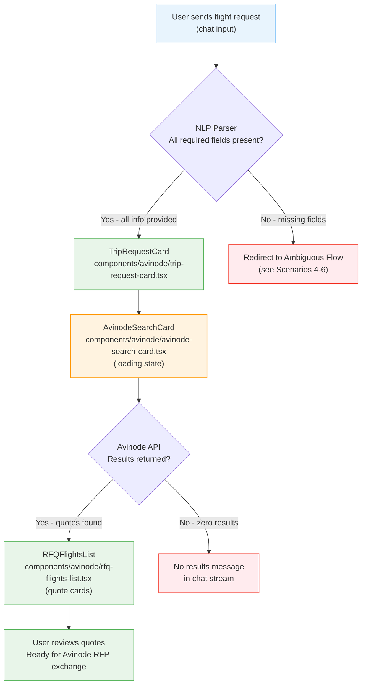
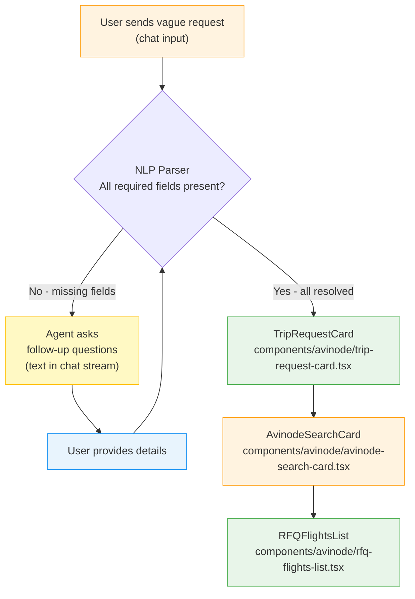
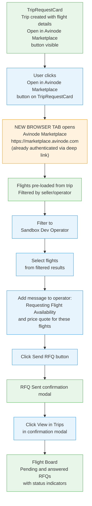
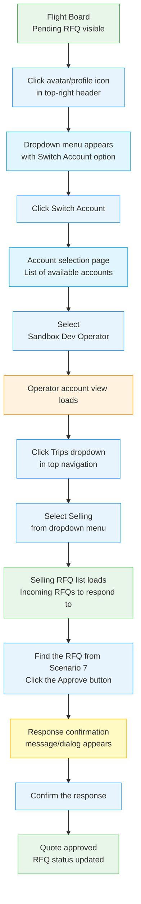
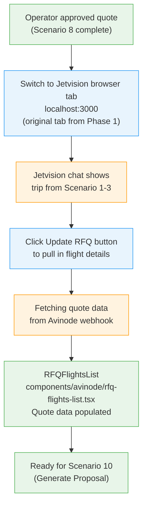
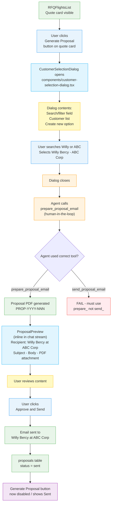
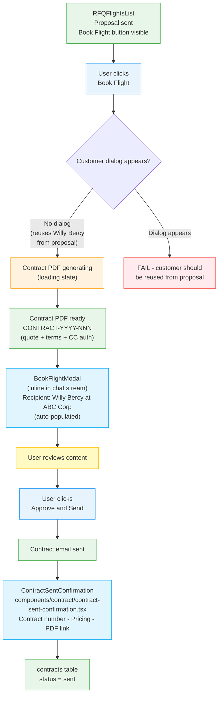
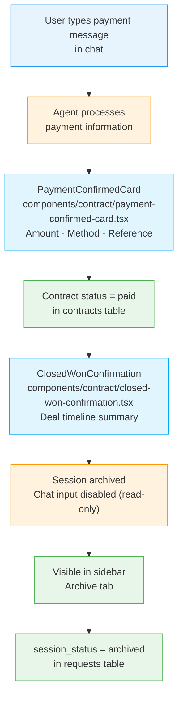

# Jetvision E2E Test Runbook

End-to-end browser automation test covering the complete charter flight lifecycle: authentication, flight request, Avinode RFP exchange, proposal, contract, payment, deal closure, and archival.

## Full Scenario Map (13 scenarios)

| # | Scenario | Phase | Trigger |
|---|----------|-------|---------|
| 1 | One-way flight — full info | Flight request | Chat input |
| 2 | Round-trip flight — full info | Flight request | Chat input |
| 3 | Multi-city trip — full info | Flight request | Chat input |
| 4 | Ambiguous: tomorrow to Canada | Flight request | Chat input |
| 5 | Ambiguous: Florida to California | Flight request | Chat input |
| 6 | Ambiguous: round trip vague date | Flight request | Chat input |
| 7 | Send RFQ via Avinode Marketplace | Avinode RFP exchange | Click "Open in Avinode Marketplace" on TripRequestCard |
| 8 | Operator approves quote | Avinode RFP exchange | Switch account → Selling → Approve |
| 9 | Update RFQ in Jetvision | Avinode RFP exchange | Click "Update RFQ" button in Jetvision |
| 10 | Proposal generation & send | Post-quote lifecycle | Click "Generate Proposal" on quote card |
| 11 | Contract generation & send (Book Flight) | Post-quote lifecycle | Click "Book Flight" on quote card |
| 12 | Payment confirmation | Post-quote lifecycle | Chat input |
| 13 | Deal closure & archive | Post-quote lifecycle | Automatic after payment |

---

## Recording Mode (Video Demos)

To record scenarios as video demos:

### Playwright (MP4/WebM) — Automated

```bash
# Record all demo scenarios (headless)
npm run test:e2e:demo

# Record with visible browser
npm run test:e2e:demo:headed

# Convert WebM to MP4
npm run demo:convert

# Convert to both MP4 and GIF
bash scripts/convert-recordings.sh --gif
```

Videos are saved to `test-results/` (WebM) and converted to `e2e-screenshots/recordings/` (MP4/GIF).

Demo spec files are in `__tests__/e2e/demo/` split by phase:

| File | Scenarios | Phase |
|------|-----------|-------|
| `phase1-flight-requests.demo.spec.ts` | 1-3 | Flight requests |
| `phase2-ambiguous-requests.demo.spec.ts` | 4-6 | Ambiguous flows |
| `phase3-avinode-rfq.demo.spec.ts` | 7-8 | Avinode RFQ + operator |
| `phase4-update-rfq.demo.spec.ts` | 9 | Update RFQ |
| `phase5-proposal-to-close.demo.spec.ts` | 10-13 | Proposal to closure |

### gif_creator (Interactive) — Per-Scenario

When running scenarios interactively via Claude-in-Chrome, wrap each scenario with:
1. `gif_creator({ action: "start_recording", tabId })`
2. [Execute scenario steps]
3. `gif_creator({ action: "stop_recording", tabId })`
4. `gif_creator({ action: "export", tabId, filename: "scenario-NN.gif", download: true })`

### Requirements

- **ffmpeg** — Required for WebM-to-MP4/GIF conversion. Install via `brew install ffmpeg`.
- **Playwright browsers** — Run `npx playwright install chromium` if needed.

---

## Pre-flight Check

1. Chrome browser open with Claude-in-Chrome extension active
2. Jetvision dev server running (`npm run dev:app`) at `http://localhost:3000`
3. Valid Avinode Sandbox credentials (key resets every Monday)
4. Gmail MCP server configured (for proposal/contract email in Scenarios 10-11)
5. Screenshot directories created:

```bash
mkdir -p /Volumes/SeagatePortableDrive/Projects/Software/v0-jetvision-assistant/e2e-screenshots/{auth,one-way,round-trip,multi-city,ambiguous,avinode-rfq,operator-quote,update-rfq,proposal,contract,payment,closure}
```

---

## Test Customer Profile

| Field | Value |
|-------|-------|
| Company | ABC Corp |
| Contact | Willy Bercy |
| Email | willy.bercy@abccorp.com |
| Customer ID | (create via CustomerSelectionDialog if not in seed data) |
| Role | Recipient for proposal and contract emails |

**Note:** If ABC Corp / Willy Bercy is not in the `client_profiles` table, use the "create new customer" option in the `CustomerSelectionDialog` during Scenario 10 to add them inline. Existing seed customers: Acme Corporation (Bob Johnson), TechStart Inc (Alice Williams), Global Ventures LLC (Charlie Davis).

---

## Avinode Sandbox Credentials

| Field | Value |
|-------|-------|
| Marketplace URL | https://marketplace.avinode.com |
| Email | kingler@me.com |
| Password | 2FRhgGZK3wSy8SY |

**Note:** You do NOT need to login to Avinode separately. The marketplace opens already authenticated when clicking the deep link from Jetvision. Credentials are here as fallback if the session expires.

**Note:** Sandbox API key resets every Monday morning. Run `/avinode-sandbox-reset` if needed.

---

## Complete Lifecycle Overview

```mermaid
flowchart LR
    subgraph "Phase 1: Auth"
        AUTH["Google OAuth\nClerk sign-in"]
    end

    subgraph "Phase 3: Flight Request"
        direction TB
        FR["Chat input"] --> PARSE{"NLP Parse"}
        PARSE -->|"Complete"| TRIP["TripRequestCard"]
        PARSE -->|"Ambiguous"| CLARIFY["Clarification loop"]
        CLARIFY --> PARSE
    end

    subgraph "Avinode RFP Exchange"
        TRIP -->|"Click Open in\nAvinode Marketplace"| MKT["New Browser Tab:\nAvinode Marketplace\nFlights pre-loaded\nFilter by Seller - Send RFQ"]
        MKT --> BOARD["Flight Board\n(pending RFQs)"]
        BOARD -->|"Switch to\nOperator account"| OPSELL["Operator: Selling\nApprove quote"]
        OPSELL -->|"Navigate back\nto Jetvision"| UPDATE["Click Update RFQ\nPull in quote data"]
    end

    subgraph "Proposal"
        UPDATE --> RFQ["RfqResultsUI\n(quotes visible)"]
        RFQ -->|"Click\nGenerate Proposal"| MODAL["CustomerSelectionDialog\n- Select Willy Bercy"]
        MODAL --> PREVIEW1["ProposalPreview"]
        PREVIEW1 -->|"Click\nApprove and Send"| SENT1["Proposal sent"]
    end

    subgraph "Contract"
        SENT1 -->|"Click\nBook Flight\n(no modal)"| PREVIEW2["BookFlightModal"]
        PREVIEW2 -->|"Click\nApprove and Send"| SENT2["ContractSentConfirmation"]
    end

    subgraph "Close"
        SENT2 --> PAYMENT["PaymentConfirmedCard"]
        PAYMENT --> CLOSE["ClosedWonConfirmation"]
        CLOSE --> ARCHIVE["Archived"]
    end

    AUTH --> FR

    style AUTH fill:#e8f4fd,stroke:#2196F3
    style TRIP fill:#e8f5e9,stroke:#4CAF50
    style CLARIFY fill:#fff9c4,stroke:#FFC107
    style MKT fill:#fff3e0,stroke:#FF9800
    style BOARD fill:#fff3e0,stroke:#FF9800
    style OPSELL fill:#fff3e0,stroke:#FF9800
    style UPDATE fill:#e8f4fd,stroke:#2196F3
    style RFQ fill:#e8f5e9,stroke:#4CAF50
    style MODAL fill:#e1f5fe,stroke:#03A9F4
    style PREVIEW1 fill:#e1f5fe,stroke:#03A9F4
    style SENT1 fill:#e8f5e9,stroke:#4CAF50
    style PREVIEW2 fill:#e1f5fe,stroke:#03A9F4
    style SENT2 fill:#e1f5fe,stroke:#03A9F4
    style PAYMENT fill:#e1f5fe,stroke:#03A9F4
    style CLOSE fill:#e8f5e9,stroke:#4CAF50
    style ARCHIVE fill:#f3e5f5,stroke:#9C27B0
```



---

## Phase 1: Authentication

1. **Get current tab context:**
   ```
   Tool: mcp__claude-in-chrome__tabs_context_mcp
   ```
   Note which tabs are open. Do NOT reuse tabs from previous sessions.

2. **Create a new tab for Jetvision:**
   ```
   Tool: mcp__claude-in-chrome__tabs_create_mcp
   URL: http://localhost:3000
   ```
   Save the returned `tabId` as `jetvisionTabId`.

3. **Wait for page load and read:**
   ```
   Tool: mcp__claude-in-chrome__read_page
   tabId: <jetvision-tab-id>
   ```
   - If chat interface visible → already authenticated, skip to Phase 3.
   - If Clerk sign-in page → authenticate with Google OAuth (kinglerbercy@gmail.com).
   - If loading → wait 3-5 seconds, read again.

4. **Screenshot:** `e2e-screenshots/auth/01-authenticated.png`

---

## Phase 2: Task List

Create these tasks to track progress:

| # | Subject | ActiveForm | Description |
|---|---------|------------|-------------|
| 1 | Test one-way flight with full info | Testing one-way flight request | Send one-way request, validate assistant response |
| 2 | Test round-trip flight with full info | Testing round-trip flight request | Send round-trip request, validate assistant response |
| 3 | Test multi-city trip with full info | Testing multi-city trip request | Send multi-city request, validate assistant response |
| 4 | Test ambiguous request: tomorrow to Canada | Testing ambiguous Canada request | Send vague request, verify clarifying questions |
| 5 | Test ambiguous request: Florida to California | Testing ambiguous Florida request | Send vague request, verify clarifying questions |
| 6 | Test ambiguous request: round trip vague dates | Testing ambiguous round trip | Send vague request, verify clarifying questions |
| 7 | Send RFQ via Avinode Marketplace | Testing Avinode RFP send | Click "Open in Avinode Marketplace" on TripRequestCard, new tab opens with pre-loaded flights, filter by seller, send RFQ, view in trips |
| 8 | Operator approves quote | Testing Operator role | Switch account, navigate Selling, approve RFQ |
| 9 | Update RFQ in Jetvision | Testing quote pull-in | Click Update RFQ, verify quote data in Jetvision |
| 10 | Proposal generation for ABC Corp | Testing proposal flow | Click Generate Proposal, select customer, approve and send email |
| 11 | Contract generation for ABC Corp (Book Flight) | Testing contract flow | Click Book Flight, approve and send contract email |
| 12 | Payment confirmation | Testing payment recording | Enter payment details, verify PaymentConfirmedCard |
| 13 | Deal closure & archive | Testing deal lifecycle end | Verify ClosedWonConfirmation, archive, read-only state |
| 14 | Generate E2E test report | Generating test report | Compile all results into summary + DB verification |

---

## Phase 3: Flight Request Scenarios

### Full-Info Flight Request Flow (Scenarios 1-3)



**Per-trip-type differences within this flow:**

| Step | One-Way (Scenario 1) | Round-Trip (Scenario 2) | Multi-City (Scenario 3) |
|------|----------------------|-------------------------|-------------------------|
| **TripRequestCard** | 1 leg: DEP → ARR | 2 legs: DEP → ARR, ARR → DEP | 3+ legs: LEG1 → LEG2 → LEG3 → ... |
| **AvinodeSearchCard** | Single search | Search per direction (or bundled) | Search per leg |
| **RFQFlightsList** | One-way pricing per quote | Round-trip or per-leg pricing | Per-leg quotes, possibly grouped |
| **Edge case** | — | May ask for return date if missing | May ask for per-leg dates within range |

---

### Scenario 1: One-Way Flight — Full Info

**Chat input:**
```
I need a one way flight from KTEB to KVNY for 4 passengers on March 25, 2026 at 4:00pm EST
```

**Expected behavior:**
- Agent creates trip immediately (no clarification needed)
- `TripRequestCard` renders with 1 leg: KTEB → KVNY
- Deep link button ("Open in Avinode Marketplace") visible
- `AvinodeSearchCard` shows loading → results
- `RFQFlightsList` displays available quote cards

**Expected UI Components (in order of appearance):**

| Step | Component | File Path | What to Verify |
|------|-----------|-----------|----------------|
| Request parsed | `TripRequestCard` | `components/avinode/trip-request-card.tsx` | Shows 1 leg: KTEB → KVNY, 4 pax, Mar 25 4pm. "Open in Avinode Marketplace" button visible. |
| Search initiated | `AvinodeSearchCard` | `components/avinode/avinode-search-card.tsx` | Loading spinner → result count. Deep link displayed. |
| Quotes returned | `RFQFlightsList` | `components/avinode/rfq-flights-list.tsx` | Quote cards with price, aircraft, operator via `RFQFlightCard` |

**Browser automation steps:**
1. Type the chat input and press Enter
2. Wait for agent response (up to 60 seconds)
3. **Take a screenshot** → `e2e-screenshots/one-way/01-trip-created.png`
4. Verify `TripRequestCard` shows correct route and passenger count
5. Verify deep link button is visible
6. **Take a screenshot** → `e2e-screenshots/one-way/02-search-results.png`
7. Record result: PASS or FAIL with notes

**Screenshots:** `e2e-screenshots/one-way/`

---

### Scenario 2: Round-Trip Flight — Full Info

**Chat input:**
```
I need a round trip flight from EGGW to KVNY for 4 passengers on March 2, 2026 at 9:00am EST
```

**Expected behavior:**
- Agent creates trip immediately. May prompt for return date/time if not inferred.
- `TripRequestCard` renders with 2 legs: EGGW → KVNY, KVNY → EGGW
- Tests international ICAO code (EGGW = London Luton)

**Expected UI Components (in order of appearance):**

| Step | Component | File Path | What to Verify |
|------|-----------|-----------|----------------|
| Request parsed | `TripRequestCard` | `components/avinode/trip-request-card.tsx` | Shows 2 legs: EGGW → KVNY and KVNY → EGGW. 4 pax. "Open in Avinode Marketplace" button visible. |
| Search initiated | `AvinodeSearchCard` | `components/avinode/avinode-search-card.tsx` | Loading spinner → result count |
| Quotes returned | `RFQFlightsList` | `components/avinode/rfq-flights-list.tsx` | Round-trip or per-leg pricing per quote |

**Browser automation steps:**
1. Type the chat input and press Enter
2. Wait for agent response (up to 60 seconds)
3. If agent asks for return date, provide: `Return on March 5, 2026 at 2:00pm EST`
4. **Take a screenshot** → `e2e-screenshots/round-trip/01-trip-created.png`
5. Verify both legs displayed correctly
6. **Take a screenshot** → `e2e-screenshots/round-trip/02-search-results.png`
7. Record result: PASS or FAIL with notes

**Screenshots:** `e2e-screenshots/round-trip/`

---

### Scenario 3: Multi-City Trip — Full Info

**Chat input:**
```
I need a multi-city trip: KTEB to London Luton (EGGW), then London Luton to Paris Le Bourget (LFPB), then Paris Le Bourget back to KTEB. March 10-15, 4 passengers
```

**Expected behavior:**
- Agent creates trip immediately with all 3 legs
- `TripRequestCard` renders with 3 legs: KTEB → EGGW, EGGW → LFPB, LFPB → KTEB
- International airports resolve correctly

**Expected UI Components (in order of appearance):**

| Step | Component | File Path | What to Verify |
|------|-----------|-----------|----------------|
| Request parsed | `TripRequestCard` | `components/avinode/trip-request-card.tsx` | Shows 3 legs with correct airports. 4 pax. "Open in Avinode Marketplace" button visible. |
| Search initiated | `AvinodeSearchCard` | `components/avinode/avinode-search-card.tsx` | Loading spinner → result count |
| Quotes returned | `RFQFlightsList` | `components/avinode/rfq-flights-list.tsx` | Per-leg quotes, possibly grouped by operator |

**Browser automation steps:**
1. Type the chat input and press Enter
2. Wait for agent response (up to 60 seconds)
3. **Take a screenshot** → `e2e-screenshots/multi-city/01-trip-created.png`
4. Verify all 3 legs displayed correctly
5. **Take a screenshot** → `e2e-screenshots/multi-city/02-search-results.png`
6. Record result: PASS or FAIL with notes

**Screenshots:** `e2e-screenshots/multi-city/`

---

### Ambiguous Request Flow (Scenarios 4-6)



**What triggers clarification per scenario:**

| Scenario | Missing Fields | Expected Clarification Questions |
|----------|---------------|----------------------------------|
| 4 — "New York to Canada" | Airport (both), time, trip type | Which NYC airport? Which Canadian airport? Time? One-way or round-trip? |
| 5 — "Florida to California" | Airport (both), pax count, time, trip type | Which FL airport? Which CA airport? How many passengers? Time? |
| 6 — "New York to Kansas in March" | Airport (both), exact dates, times | Which airports? Which dates in March? Departure/return times? |

**CRITICAL:** `TripRequestCard` must NOT render until ALL clarifying questions are resolved. If it appears before clarification is complete, that is a **FAIL**.

---

### Scenario 4: Ambiguous — Tomorrow to Canada

**Chat input:**
```
Book a flight for tomorrow for three people from New York to Canada
```

**Expected behavior:**
- Agent asks clarifying questions (which airports, time, trip type)
- Does NOT create trip prematurely

**Expected UI Components (in order of appearance):**

| Step | Component | File Path | What to Verify |
|------|-----------|-----------|----------------|
| Vague request received | Agent text response | Chat stream | Agent asks >=2 clarifying questions. `TripRequestCard` NOT rendered. |
| After clarification | `TripRequestCard` | `components/avinode/trip-request-card.tsx` | Only appears once all fields resolved |

**Browser automation steps:**
1. Type the chat input and press Enter
2. Wait for agent response
3. **Take a screenshot** → `e2e-screenshots/ambiguous/01-scenario4-clarification.png`
4. Verify agent asked about airports, time, trip type
5. Verify NO `TripRequestCard` rendered yet
6. Respond to clarification questions with specific answers
7. Wait for trip creation after all fields resolved
8. **Take a screenshot** → `e2e-screenshots/ambiguous/02-scenario4-resolved.png`
9. Record result: PASS or FAIL with notes

**Screenshots:** `e2e-screenshots/ambiguous/`

---

### Scenario 5: Ambiguous — Florida to California

**Chat input:**
```
I need a flight from Florida to California tomorrow
```

**Expected behavior:**
- Agent asks about specific airports, passenger count, time, trip type
- Does NOT create trip prematurely

**Expected UI Components (in order of appearance):**

| Step | Component | File Path | What to Verify |
|------|-----------|-----------|----------------|
| Vague request received | Agent text response | Chat stream | Agent asks >=2 clarifying questions. `TripRequestCard` NOT rendered. |
| After clarification | `TripRequestCard` | `components/avinode/trip-request-card.tsx` | Only appears once all fields resolved |

**Browser automation steps:**
1. Type the chat input and press Enter
2. Wait for agent response
3. **Take a screenshot** → `e2e-screenshots/ambiguous/03-scenario5-clarification.png`
4. Verify agent asked about airports, passengers, time
5. Verify NO `TripRequestCard` rendered yet
6. Respond to clarification questions
7. Wait for trip creation
8. **Take a screenshot** → `e2e-screenshots/ambiguous/04-scenario5-resolved.png`
9. Record result: PASS or FAIL with notes

---

### Scenario 6: Ambiguous — Round Trip Vague Date

**Chat input:**
```
I need a round trip flight from New York to Kansas for 4 passengers in March
```

**Expected behavior:**
- Agent asks about specific airports, exact dates, times
- Does NOT create trip prematurely

**Expected UI Components (in order of appearance):**

| Step | Component | File Path | What to Verify |
|------|-----------|-----------|----------------|
| Vague request received | Agent text response | Chat stream | Agent asks >=2 clarifying questions. `TripRequestCard` NOT rendered. |
| After clarification | `TripRequestCard` | `components/avinode/trip-request-card.tsx` | Only appears once all fields resolved |

**Browser automation steps:**
1. Type the chat input and press Enter
2. Wait for agent response
3. **Take a screenshot** → `e2e-screenshots/ambiguous/05-scenario6-clarification.png`
4. Verify agent asked about airports, dates, times
5. Verify NO `TripRequestCard` rendered yet
6. Respond to clarification questions
7. Wait for trip creation
8. **Take a screenshot** → `e2e-screenshots/ambiguous/06-scenario6-resolved.png`
9. Record result: PASS or FAIL with notes

---

### Scenario 7: Send RFQ via Avinode Marketplace

**Prerequisite:** Scenario 1 (or 2 or 3) completed with `TripRequestCard` visible and trip created

#### Send RFQ Flow



**Browser automation steps:**

1. **Locate the "Open in Avinode Marketplace" button** on the `TripRequestCard` — this button appears after the trip is created with flight details
2. **Take a screenshot** → `e2e-screenshots/avinode-rfq/01-trip-card-marketplace-button.png`
3. **Click the "Open in Avinode Marketplace" button**
4. **Wait for a NEW BROWSER TAB to open** with the Avinode Marketplace
   - URL should be `https://marketplace.avinode.com/...`
   - The agent should already be authenticated (no login page) via the deep link
   - The trip's flight details should be pre-loaded into the marketplace view
   - Available flights should already be displayed, filtered by seller/operator
5. **Verify** the correct browser tab is active (the new Avinode tab, not the Jetvision tab)
6. **Take a screenshot** of the Avinode Marketplace with pre-loaded flights → `e2e-screenshots/avinode-rfq/02-marketplace-flights-loaded.png`
7. **If the Avinode login page appears instead:** login with sandbox credentials (kingler@me.com / 2FRhgGZK3wSy8SY), then retry the deep link
8. **Verify flights are displayed** with seller/operator information visible
9. **Filter by seller** → select **"Sandbox Dev Operator"** from the seller/operator filter to narrow results to the sandbox test operator
10. **Take a screenshot** showing flights filtered to Sandbox Dev Operator → `e2e-screenshots/avinode-rfq/03-seller-filtered.png`
11. **Select flight(s)** from the filtered results to request a quote
12. **Take a screenshot** of the selected flight(s) → `e2e-screenshots/avinode-rfq/04-flights-selected.png`
13. **Locate the message field** for the operator and type exactly:
    ```
    Requesting Flight Availability and price quote for these flights
    ```
14. **Click the "Send RFQ" button**
15. **Wait** for the RFQ sent confirmation modal to appear
16. **Take a screenshot** → `e2e-screenshots/avinode-rfq/05-rfq-sent-modal.png`
17. **Click "View in Trips"** in the confirmation modal
18. **Wait** for the Flight Board to load (still in the Avinode Marketplace tab)
19. **Take a screenshot** of the Flight Board → `e2e-screenshots/avinode-rfq/06-flight-board.png`
20. **Verify the Flight Board shows:**
    - A list of RFQs with status indicators (pending and answered/approved)
    - The newly sent RFQ in the list with "Pending" status
    - Flight details matching the original trip request from Scenario 1/2/3
21. **Check browser console** for errors
22. **Record result:** PASS or FAIL with notes

**Expected UI Components (in order of appearance):**

| Step | Component / Page | Location | What to Verify |
|------|------------------|----------|----------------|
| Marketplace button | "Open in Avinode Marketplace" on `TripRequestCard` | Jetvision chat (original tab) | Button visible after trip creation |
| New tab opens | Avinode Marketplace | **New browser tab** (separate from Jetvision) | Already authenticated, flights pre-loaded from trip details, filtered by seller |
| Seller filter | Seller/operator filter | Avinode Marketplace tab | "Sandbox Dev Operator" selectable; flights narrow when filtered |
| Flight selection | Flight results list | Avinode Marketplace tab | Flights selectable for RFQ |
| Message field | RFQ message input | Avinode Marketplace tab | Accepts operator message text |
| Send confirmation | RFQ sent modal | Avinode Marketplace tab | "View in Trips" button present |
| Flight Board | Trips / Flight Board view | Avinode Marketplace tab | List of pending and answered RFQs with status indicators |

**CRITICAL assertions:**
- FAIL if "Open in Avinode Marketplace" button is not on the TripRequestCard
- FAIL if clicking the button does NOT open a new browser tab (must be a separate tab, not same tab navigation)
- FAIL if the new tab shows the Avinode login page instead of the marketplace (session should be pre-authenticated via deep link)
- FAIL if flight details from the trip are NOT pre-loaded in the marketplace
- FAIL if flights are not displayed or filterable by seller/operator
- FAIL if "Sandbox Dev Operator" is not available in the seller filter
- FAIL if RFQ does not appear in Flight Board after sending
- FAIL if Flight Board does not show both pending and answered/approved RFQ status indicators

**Screenshots:** `e2e-screenshots/avinode-rfq/`

---

### Scenario 8: Operator Approves Quote

**Prerequisite:** Scenario 7 completed (RFQ sent, visible in Flight Board)

#### Operator Quote Approval Flow



**Browser automation steps:**

1. **Verify you are in the Avinode Marketplace browser tab** (the new tab opened in Scenario 7 — NOT the Jetvision tab)
2. **Locate the avatar/profile icon** in the top-right corner of the Avinode header bar
3. **Click the avatar/profile icon** to open the dropdown menu
4. **Take a screenshot** of the dropdown menu → `e2e-screenshots/operator-quote/01-profile-dropdown.png`
5. **Click "Switch Account"** (or equivalent "Change Account" option) in the dropdown
6. **Wait** for the account selection page to load — this shows a list of available accounts
7. **Take a screenshot** of the account selection page → `e2e-screenshots/operator-quote/02-account-selection.png`
8. **Click on "Sandbox Dev Operator"** in the account list
9. **Wait** for the Operator account view to load (the UI should reflect the Operator perspective)
10. **Take a screenshot** → `e2e-screenshots/operator-quote/03-operator-view.png`
11. **Locate the "Trips" dropdown** in the top navigation bar
12. **Click the "Trips" dropdown**
13. **Click "Selling"** from the dropdown menu
14. **Wait** for the Selling RFQ list to load — this shows incoming RFQs to respond to
15. **Take a screenshot** of the Selling list → `e2e-screenshots/operator-quote/04-selling-list.png`
16. **Find the RFQ** from Scenario 7 in the list (match by flight details, date, or requestor)
17. **Click the Approve button** on the RFQ
18. **Wait** for the response confirmation message/dialog to appear
19. **Take a screenshot** → `e2e-screenshots/operator-quote/05-approve-confirmation.png`
20. **Confirm the response** (click "Confirm" or equivalent button)
21. **Wait** for the approval to process
22. **Take a screenshot** showing the updated RFQ status → `e2e-screenshots/operator-quote/06-quote-approved.png`
23. **Verify:**
    - RFQ status changed from "Pending" to "Quoted" / "Approved" or equivalent
    - Quote details are visible (price, aircraft, availability)
24. **Check browser console** for errors
25. **Record result:** PASS or FAIL with notes

**Expected UI Components (in order of appearance):**

| Step | Component / Page | Location | What to Verify |
|------|------------------|----------|----------------|
| Profile dropdown | Avatar menu | Avinode top-right header | "Switch Account" option visible |
| Account selector | Account selection page | Avinode | "Sandbox Dev Operator" in list |
| Operator view | Operator dashboard | Avinode | UI reflects Operator role (not ISO Agent) |
| Trips dropdown | Navigation menu | Avinode top nav | "Selling" option in dropdown |
| Selling list | RFQ inbox | Avinode Selling view | Incoming RFQ from Scenario 7 visible |
| Approve action | Approve button + confirm dialog | Avinode Selling view | Clickable approve, confirmation message |

**CRITICAL assertions:**
- FAIL if "Switch Account" option is not in the profile dropdown
- FAIL if "Sandbox Dev Operator" is not in the account list
- FAIL if "Selling" is not in the Trips dropdown
- FAIL if the RFQ from Scenario 7 is not in the Selling list
- FAIL if the Approve button does not work or no confirmation appears

**Screenshots:** `e2e-screenshots/operator-quote/`

---

### Scenario 9: Update RFQ in Jetvision

**Prerequisite:** Scenario 8 completed (Operator approved the quote in Avinode)

#### Update RFQ Flow



**Browser automation steps:**

1. **Switch back to the Jetvision browser tab** (the original tab at localhost:3000 — NOT the Avinode Marketplace tab). If the Jetvision tab was closed, navigate to `http://localhost:3000`
2. **Take a screenshot** → `e2e-screenshots/update-rfq/01-jetvision-before-update.png`
3. **Locate the "Update RFQ" button** — this should be visible in the chat or trip area, indicating there are new quote results to pull in
4. **Click the "Update RFQ" button**
5. **Wait** for the app to fetch the quote data from Avinode (via webhook or API poll) — watch for a loading/spinner state to complete
6. **Take a screenshot** → `e2e-screenshots/update-rfq/02-rfq-updating.png`
7. **Wait** for `RFQFlightsList` to render with the quote data from the Operator's approval
8. **Take a screenshot** → `e2e-screenshots/update-rfq/03-rfq-results-loaded.png`
9. **Verify the RFQFlightsList shows:**
   - Quote price from the Operator (from Scenario 8)
   - Aircraft details
   - Operator name ("Sandbox Dev Operator")
   - "Generate Proposal" button visible on the quote card
   - "Book Flight" button either hidden or disabled (proposal must be sent first)
10. **Check browser console** for errors
11. **Record result:** PASS or FAIL with notes

**Expected UI Components (in order of appearance):**

| Step | Component | File Path | What to Verify |
|------|-----------|-----------|----------------|
| Update trigger | "Update RFQ" button | Jetvision chat area | Button visible, indicating new quote data available |
| Loading state | Spinner/loading indicator | Jetvision chat area | Brief loading while fetching from Avinode |
| Quote results | `RFQFlightsList` | `components/avinode/rfq-flights-list.tsx` | Quote card with price, aircraft, operator. "Generate Proposal" button visible. |
| Quote detail | `RFQFlightCard` | `components/avinode/rfq-flight-card.tsx` | Individual quote with status badge, pricing, aircraft info |

**Post-update database verification:**
- Query `avinode_webhook_events` table: webhook event stored for the quote
- Query `quotes` table: quote record with correct price and operator

**CRITICAL assertions:**
- FAIL if "Update RFQ" button is not visible in Jetvision
- FAIL if clicking "Update RFQ" does not fetch the Operator's quote data
- FAIL if RFQFlightsList does not render with quote details after update
- FAIL if the quote price/aircraft/operator doesn't match what was approved in Scenario 8
- FAIL if webhook event is not stored in `avinode_webhook_events` table

**Screenshots:** `e2e-screenshots/update-rfq/`

---

### Scenario 10: Proposal Generation & Send — ABC Corp

**Prerequisite:** Scenario 9 completed with quotes visible in `RFQFlightsList`

#### Proposal Generation Flow



**Browser automation steps:**

1. **Locate the quote card** inside `RFQFlightsList` (`components/avinode/rfq-flights-list.tsx`) — identify the preferred quote (e.g., first result or lowest price)
2. **Take a screenshot** → `e2e-screenshots/proposal/01-quote-card-before.png`
3. **Click the "Generate Proposal" button** on the selected quote card
4. **Wait** for the **CustomerSelectionDialog** to appear
5. **Take a screenshot** of the dialog → `e2e-screenshots/proposal/02-customer-dialog.png`
6. **Verify the dialog contains:**
   - A search/filter input field
   - A scrollable list of existing customers
   - An option to create a new customer inline
7. **Type "Willy" or "ABC" into the search/filter field** to narrow the list
8. **Take a screenshot** showing filtered results → `e2e-screenshots/proposal/03-customer-search.png`
9. **Click on "Willy Bercy — ABC Corp"** in the customer list (or create the customer inline if not in seed data)
10. **Wait** for the dialog to close and the `ProposalPreview` to render inline in the chat stream — the recipient should now be pre-filled with Willy Bercy's details
11. **Take a screenshot** of the ProposalPreview → `e2e-screenshots/proposal/04-email-preview.png`
12. **Verify the ProposalPreview contents:**
    - Recipient = Willy Bercy at ABC Corp (willy.bercy@abccorp.com)
    - Subject line contains proposal number (PROP-YYYY-NNN)
    - Body text references the selected quote details (aircraft, price, route)
    - PDF attachment is present and labeled
13. **Click the "Approve & Send" button** on the ProposalPreview
14. **Wait** for the send confirmation to appear in the chat stream
15. **Take a screenshot** → `e2e-screenshots/proposal/05-sent-confirmation.png`
16. **Verify post-send state:**
    - `ProposalSentConfirmation` card visible in chat with flight details and client info
    - "Generate Proposal" button on the quote card is now disabled or shows "Proposal Sent"
17. **Check browser console** for errors
18. **Record result:** PASS or FAIL with notes

**Expected UI Components (in order of appearance):**

| Step | Component | File Path | What to Verify |
|------|-----------|-----------|----------------|
| Quote card with button | `RFQFlightsList` | `components/avinode/rfq-flights-list.tsx` | "Generate Proposal" button visible on quote card |
| Customer picker | `CustomerSelectionDialog` | `components/customer-selection-dialog.tsx` | Search field, customer list, create-new option |
| Search result | Filtered customer list | Inside dialog | "Willy Bercy — ABC Corp" visible after typing search term |
| Email composer | `ProposalPreview` | `components/message-components/proposal-preview.tsx` | Inline in chat: subject, body, PDF, recipient = Willy Bercy |
| Approval button | "Approve & Send" | Inside `ProposalPreview` | Clickable, not disabled |
| Send confirmation | `ProposalSentConfirmation` | `components/proposal/proposal-sent-confirmation.tsx` | Flight details, client name/email, confirmation |

**Post-send database verification:**
- Query `proposals` table: `status = 'sent'`, proposal number matches PROP-YYYY-NNN
- Query `messages` table: proposal message recorded in session

**CRITICAL assertions:**
- FAIL if customer selection dialog does NOT appear after clicking "Generate Proposal"
- FAIL if Willy Bercy / ABC Corp is not in the customer list (create inline if needed)
- FAIL if ProposalPreview renders BEFORE a customer is selected
- FAIL if agent uses `send_proposal_email` directly (must use `prepare_proposal_email`)
- FAIL if email sends without user clicking "Approve & Send"
- FAIL if ProposalPreview shows wrong recipient after dialog selection

**Screenshots:** `e2e-screenshots/proposal/`

---

### Scenario 11: Contract Generation & Send (Book Flight) — ABC Corp

**Prerequisite:** Scenario 10 completed (proposal sent to Willy Bercy @ ABC Corp)

> **Note:** The customer selection dialog does NOT appear for this flow. The customer (Willy Bercy / ABC Corp) is automatically reused from the proposal sent in Scenario 10. If the dialog appears here, that is a **FAIL** — it should only appear during proposal generation.

#### Contract / Book Flight Flow



**Browser automation steps:**

1. **Locate the "Book Flight" button** on the quote card in `RFQFlightsList` (should now be visible/enabled after proposal was sent)
2. **Take a screenshot** → `e2e-screenshots/contract/01-book-flight-before.png`
3. **Click the "Book Flight" button**
4. **Verify NO customer selection dialog appears** — the customer (Willy Bercy / ABC Corp) should be automatically reused from the proposal in Scenario 10
5. **Wait** for the contract PDF to generate and the `BookFlightModal` to render inline in the chat stream
6. **Take a screenshot** → `e2e-screenshots/contract/02-email-preview.png`
7. **Verify the BookFlightModal contents:**
   - Recipient = Willy Bercy at ABC Corp (auto-populated from proposal, no dialog)
   - Subject line contains contract number (CONTRACT-YYYY-NNN)
   - PDF attachment present containing: quote summary, terms & conditions, CC auth form
8. **Click the "Approve & Send" button** on the BookFlightModal
9. **Wait** for `ContractSentConfirmation` card to render in the chat stream
10. **Take a screenshot** → `e2e-screenshots/contract/03-sent-confirmation.png`
11. **Verify the ContractSentConfirmation card:**
    - Contract number (CONTRACT-YYYY-NNN) displayed
    - Pricing breakdown visible
    - PDF download link functional
12. **Check browser console** for errors
13. **Record result:** PASS or FAIL with notes

**Expected UI Components (in order of appearance):**

| Step | Component | File Path | What to Verify |
|------|-----------|-----------|----------------|
| Book button on quote | `RFQFlightsList` | `components/avinode/rfq-flights-list.tsx` | "Book Flight" button visible (post-proposal). No "Generate Proposal" button (already sent). |
| Loading / PDF gen | Spinner or loading state | — | Brief loading while contract PDF generates. NO customer dialog. |
| Email composer | `BookFlightModal` | `components/avinode/book-flight-modal.tsx` | Inline in chat: subject, body, contract PDF, recipient = Willy Bercy (auto-populated) |
| Approval button | "Approve & Send" | Inside `BookFlightModal` | Clickable, not disabled |
| Confirmation card | `ContractSentConfirmation` | `components/contract/contract-sent-confirmation.tsx` | Contract #, pricing breakdown, PDF link |

**Post-send database verification:**
- Query `contracts` table: `status = 'sent'`, contract number matches CONTRACT-YYYY-NNN
- Query `messages` table: contract message recorded in session

**CRITICAL assertions:**
- FAIL if customer selection dialog appears (customer should be reused from proposal)
- FAIL if recipient is different from Scenario 10's recipient (Willy Bercy)
- FAIL if contract email sends without "Approve & Send" click
- FAIL if "Book Flight" was available before proposal was sent (ordering dependency)
- FAIL if contract PDF missing terms & conditions or CC auth form
- FAIL if ContractSentConfirmation card does not render after send

**Screenshots:** `e2e-screenshots/contract/`

---

### Payment and Closure Flow (Scenarios 12-13)



### Scenario 12: Payment Confirmation

**Prerequisite:** Scenario 11 completed (contract sent)

**Chat input message (type this exactly):**
```
Payment received from ABC Corp - $45,000 wire transfer, reference WT-2026-TEST-001
```

**Browser automation steps:**

1. **Type the payment message** into the chat input and press Enter
2. **Wait** for the assistant to process and `PaymentConfirmedCard` to render
3. **Take a screenshot** → `e2e-screenshots/payment/01-payment-confirmed.png`
4. **Verify the PaymentConfirmedCard contents:**
   - Amount: $45,000
   - Method: Wire transfer
   - Reference: WT-2026-TEST-001
5. **Alternative:** If a `PaymentConfirmationModal` appears instead of automatic processing, fill in the amount ($45,000), select "Wire Transfer", enter reference (WT-2026-TEST-001), and click confirm.
6. **Check browser console** for errors
7. **Record result:** PASS or FAIL with notes

**Expected UI Components:**

| Step | Component | File Path | What to Verify |
|------|-----------|-----------|----------------|
| Payment recorded | `PaymentConfirmedCard` | `components/contract/payment-confirmed-card.tsx` | $45,000, wire, WT-2026-TEST-001 |
| Alternative modal | `PaymentConfirmationModal` | `components/contract/payment-confirmation-modal.tsx` | Form with amount, method, reference fields |

**Post-action database verification:**
- Query `contracts` table: `status = 'paid'`, `payment_amount = 45000`, `payment_reference = 'WT-2026-TEST-001'`

**Screenshots:** `e2e-screenshots/payment/`

---

### Scenario 13: Deal Closure & Archive

**Prerequisite:** Scenario 12 completed (payment confirmed)

**Expected behavior:**
- `ClosedWonConfirmation` card renders with deal timeline summary
- Session is archived — chat input becomes disabled (read-only)
- Session appears in the sidebar Archive tab

**Browser automation steps:**

1. **Wait** for `ClosedWonConfirmation` card to render after payment. If it doesn't appear automatically, type: `Close the deal`
2. **Take a screenshot** → `e2e-screenshots/closure/01-closed-won.png`
3. **Verify the ClosedWonConfirmation card:**
   - Contract number displayed
   - Customer name (Willy Bercy / ABC Corp)
   - Flight route
   - Deal value ($45,000)
   - Deal timeline visible (proposal sent → contract sent → payment received)
4. **Find and click the archive button** on the flight request card (may be in a dropdown menu)
5. **Confirm archival** if a confirmation dialog appears
6. **Verify the chat input is disabled** (read-only mode)
7. **Take a screenshot** → `e2e-screenshots/closure/02-read-only.png`
8. **Navigate to the Archive tab** in the sidebar
9. **Verify the session appears** in the archive list
10. **Take a screenshot** → `e2e-screenshots/closure/03-archive-tab.png`
11. **Check browser console** for errors
12. **Record result:** PASS or FAIL with notes

**Expected UI Components:**

| Step | Component | File Path | What to Verify |
|------|-----------|-----------|----------------|
| Deal closed | `ClosedWonConfirmation` | `components/contract/closed-won-confirmation.tsx` | Contract #, customer, route, deal value, timeline |
| Read-only | Chat input | Main chat area | Input field disabled, no send button |
| Sidebar card | `FlightRequestCard` | `components/chat/flight-request-card.tsx` | Archive action available |
| Archived | Archive tab | `components/chat-sidebar.tsx` | Session listed in archive |

**Post-action database verification:**
- Query `requests` table: `session_status = 'archived'`, `current_step = 'closed_won'`

**Screenshots:** `e2e-screenshots/closure/`

---

## Phase 4: E2E Test Report

## E2E Testing Report — Jetvision Assistant

**Date:** [current date]
**Auth:** Google OAuth (kinglerbercy@gmail.com) — [PASS/FAIL]

### Test Results

| # | Scenario | Status | Notes |
|---|----------|--------|-------|
| 1 | One-way full info | [PASS/FAIL] | [notes] |
| 2 | Round-trip full info | [PASS/FAIL] | [notes] |
| 3 | Multi-city full info | [PASS/FAIL] | [notes] |
| 4 | Ambiguous: tomorrow to Canada | [PASS/FAIL] | [notes] |
| 5 | Ambiguous: Florida to California | [PASS/FAIL] | [notes] |
| 6 | Ambiguous: round trip vague date | [PASS/FAIL] | [notes] |
| 7 | Send RFQ via Avinode Marketplace | [PASS/FAIL] | [notes] |
| 8 | Operator approves quote | [PASS/FAIL] | [notes] |
| 9 | Update RFQ in Jetvision | [PASS/FAIL] | [notes] |
| 10 | Proposal generation (ABC Corp) | [PASS/FAIL] | [notes] |
| 11 | Contract / Book Flight (ABC Corp) | [PASS/FAIL] | [notes] |
| 12 | Payment confirmation | [PASS/FAIL] | [notes] |
| 13 | Deal closure & archive | [PASS/FAIL] | [notes] |

### Database Verification (Supabase)

| Table | Check | Expected | Status |
|-------|-------|----------|--------|
| `avinode_webhook_events` | Webhook recorded | Quote webhook stored | [PASS/FAIL] |
| `quotes` | Quote exists | Price + operator match Scenario 8 | [PASS/FAIL] |
| `proposals` | Proposal exists | PROP-YYYY-NNN, status = "sent" | [PASS/FAIL] |
| `contracts` | Contract exists | CONTRACT-YYYY-NNN, status = "paid" | [PASS/FAIL] |
| `requests` | Session archived | session_status = "archived" | [PASS/FAIL] |
| `messages` | Chat history | All messages in session | [PASS/FAIL] |

### Issues Found
- [description] — [severity: high/medium/low]

### Console Errors
- [any JS errors observed]

### Screenshots
All saved to: `e2e-screenshots/`
- `e2e-screenshots/auth/` — Authentication flow
- `e2e-screenshots/one-way/` — One-way flight test
- `e2e-screenshots/round-trip/` — Round-trip flight test
- `e2e-screenshots/multi-city/` — Multi-city trip test
- `e2e-screenshots/ambiguous/` — Ambiguous request tests
- `e2e-screenshots/avinode-rfq/` — Avinode Marketplace RFQ send
- `e2e-screenshots/operator-quote/` — Operator role switch & quote approval
- `e2e-screenshots/update-rfq/` — Update RFQ in Jetvision
- `e2e-screenshots/proposal/` — Proposal generation & send
- `e2e-screenshots/contract/` — Contract generation & send
- `e2e-screenshots/payment/` — Payment confirmation
- `e2e-screenshots/closure/` — Deal closure & archive

---

## Ordering Dependencies

Scenarios must be run in order when testing the full lifecycle:

```
Scenario 1/2/3 (trip created)
    → Scenario 7 (RFQ sent via Avinode Marketplace)
        → Scenario 8 (Operator approves quote)
            → Scenario 9 (quotes pulled into Jetvision)
                → Scenario 10 (proposal sent to ABC Corp)
                    → Scenario 11 (contract sent — Book Flight)
                        → Scenario 12 (payment confirmed)
                            → Scenario 13 (deal closed & archived)
```

Scenarios 4-6 (ambiguous requests) are independent and can be run in any order.

## Browser Tab Management

| Scenario | Active Tab | Notes |
|----------|-----------|-------|
| 1-6 | Jetvision (localhost:3000) | Original tab |
| 7 | Avinode Marketplace (NEW tab) | Opens via deep link click |
| 8 | Avinode Marketplace | Same Avinode tab, switch account |
| 9 | Jetvision (localhost:3000) | Switch BACK to original tab |
| 10-13 | Jetvision (localhost:3000) | All remaining work in Jetvision |

## Key Component Reference

| Component | File Path | Used In |
|-----------|-----------|---------|
| `TripRequestCard` | `components/avinode/trip-request-card.tsx` | Scenarios 1-6 |
| `AvinodeSearchCard` | `components/avinode/avinode-search-card.tsx` | Scenarios 1-3 |
| `DeepLinkPrompt` | `components/avinode/deep-link-prompt.tsx` | Scenarios 1-3 |
| `AvinodeDeepLinks` | `components/avinode/avinode-deep-links.tsx` | Scenario 7 |
| `RFQFlightsList` | `components/avinode/rfq-flights-list.tsx` | Scenarios 9-11 |
| `RFQFlightCard` | `components/avinode/rfq-flight-card.tsx` | Scenarios 9-11 |
| `RfqQuoteDetailsCard` | `components/avinode/rfq-quote-details-card.tsx` | Scenario 9 |
| `SendProposalStep` | `components/avinode/send-proposal-step.tsx` | Scenario 10 |
| `CustomerSelectionDialog` | `components/customer-selection-dialog.tsx` | Scenario 10 |
| `ProposalPreview` | `components/message-components/proposal-preview.tsx` | Scenario 10 |
| `ProposalSentConfirmation` | `components/proposal/proposal-sent-confirmation.tsx` | Scenario 10 |
| `BookFlightModal` | `components/avinode/book-flight-modal.tsx` | Scenario 11 |
| `ContractSentConfirmation` | `components/contract/contract-sent-confirmation.tsx` | Scenario 11 |
| `PaymentConfirmedCard` | `components/contract/payment-confirmed-card.tsx` | Scenario 12 |
| `PaymentConfirmationModal` | `components/contract/payment-confirmation-modal.tsx` | Scenario 12 |
| `ClosedWonConfirmation` | `components/contract/closed-won-confirmation.tsx` | Scenario 13 |
| `FlightRequestCard` | `components/chat/flight-request-card.tsx` | Scenario 13 (archive) |
| `FlightSearchProgress` | `components/avinode/flight-search-progress.tsx` | Scenarios 1-3 |

## Troubleshooting

| Issue | Solution |
|-------|----------|
| Clerk login page not appearing | Jetvision may already be authenticated. Check for chat UI. |
| Avinode login page after deep link | Session expired. Login with sandbox credentials, retry deep link. |
| Agent not responding | Check dev server running (`npm run dev:app`). Check terminal for errors. |
| No deep link generated | Check Avinode MCP server is running and API key is valid. |
| Trip creation fails | API key may have reset (Monday). Run `/avinode-sandbox-reset`. |
| Webhook not received | Wait 15-30 seconds and retry. Check webhook URL in Avinode Sandbox settings. |
| Proposal email fails | Check Gmail MCP server is running and OAuth tokens are valid. |
| Contract PDF issues | Verify Supabase storage bucket "contracts" exists and is public. |
| Payment not recording | Verify contract exists and is in valid state. Include amount, method, reference explicitly. |
| Archive button not visible | Only appears for terminal states (completed, closed_won, cancelled). |
