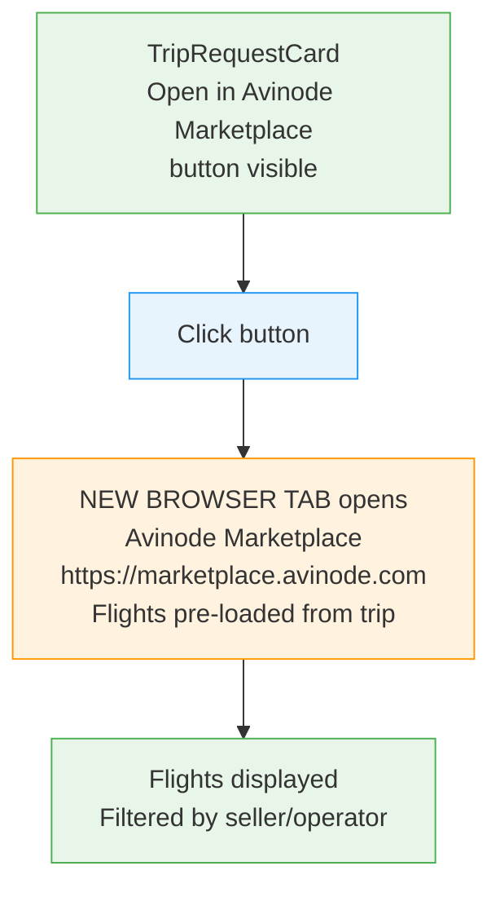
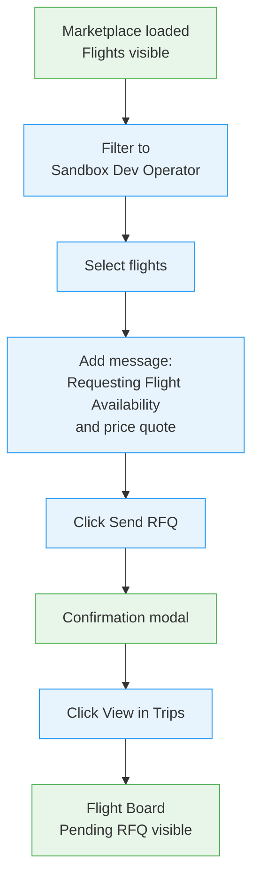
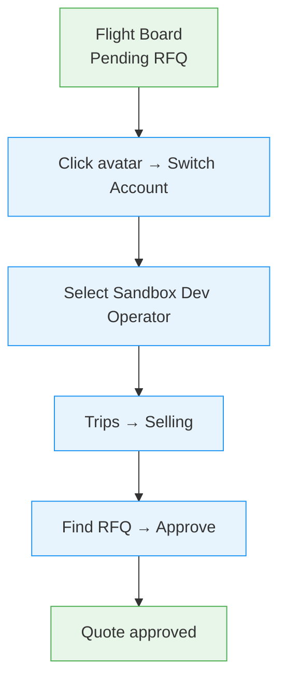
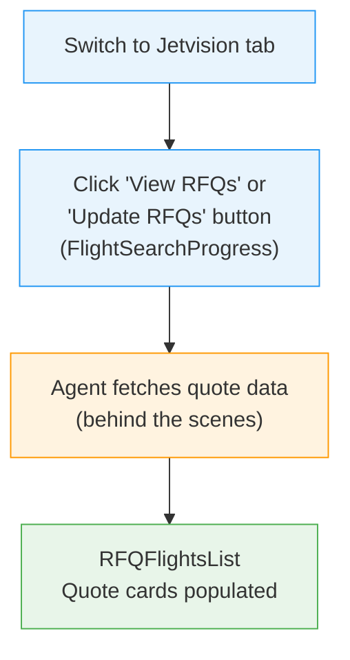
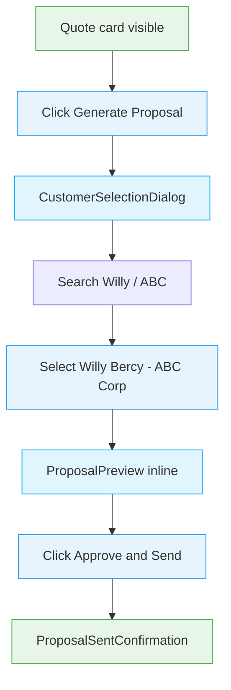
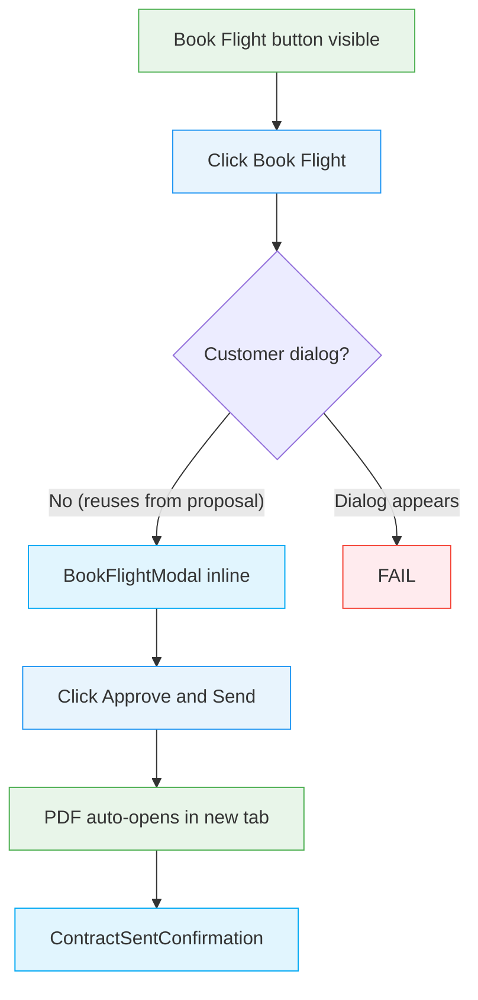
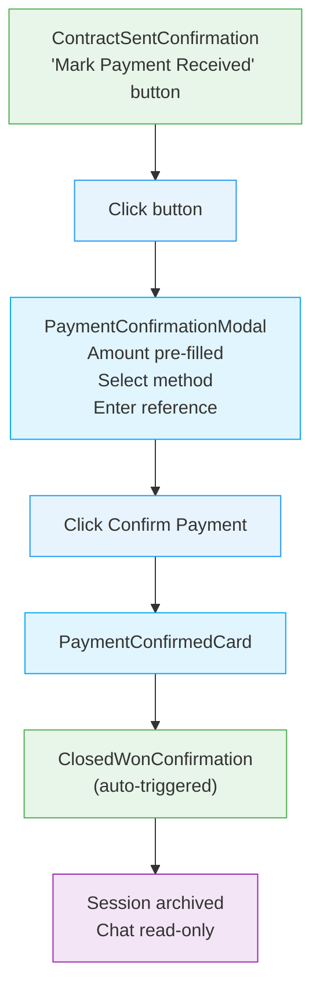
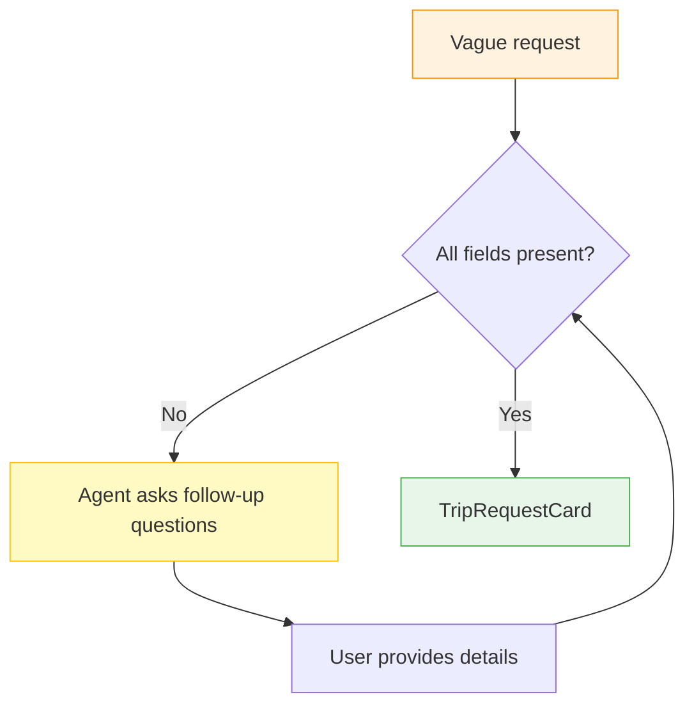

# Jetvision E2E Test Runbook

End-to-end browser automation test covering the complete charter flight lifecycle: flight request, Avinode RFP exchange, proposal, contract, payment, and deal closure.

## Parameters

### Trip-Type Flags (primary — pick one or more)

| Flag | Route | Payment | Description |
|------|-------|---------|-------------|
| `--one-way` | KTEB → KVNY | $45,000 | One-way full lifecycle (9 steps) |
| `--round-trip` | EGGW ↔ KVNY | $62,000 | Round-trip full lifecycle (9 steps) |
| `--multi-city` | KTEB → EGGW → LFPB → KTEB | $95,000 | Multi-city full lifecycle (9 steps) |
| `--ambiguous` | — | — | 3 ambiguous request clarification flows |
| `--all` | — | — | All 3 lifecycles + ambiguous (30 scenarios) |

**Default (no flags):** Runs all 3 lifecycles (27 scenarios, no ambiguous).

### Partial Lifecycle

| Flag | Values | Description |
|------|--------|-------------|
| `--start-at` | milestone name | Skip earlier steps, start from this milestone |

**9 milestones:** `request` → `marketplace` → `rfq` → `approve` → `switch-back` → `quotes` → `proposal` → `contract` → `payment`

### Usage

```bash
# === Full lifecycles ===
/e2e-test                                    # All 3 lifecycles (default)
/e2e-test --one-way                          # One-way: KTEB → KVNY
/e2e-test --round-trip                       # Round-trip: EGGW ↔ KVNY
/e2e-test --multi-city                       # Multi-city: KTEB → EGGW → LFPB → KTEB
/e2e-test --one-way --round-trip             # Two lifecycles
/e2e-test --all                              # All 3 lifecycles + ambiguous

# === Extras ===
/e2e-test --ambiguous                        # 3 ambiguous clarification flows only

# === Partial lifecycle ===
/e2e-test --round-trip --start-at proposal   # Round-trip from proposal onward
/e2e-test --one-way --start-at payment       # One-way payment + close only
/e2e-test --multi-city --start-at rfq        # Multi-city from RFQ send onward
```

---

## Lifecycle Overview

Each trip type follows the same 9-step lifecycle. The only differences are the chat input, route, and payment details.

### 9-Step Lifecycle (same for all trip types)

| Step | Milestone | What Happens | Where |
|------|-----------|-------------|-------|
| 1 | `request` | Submit flight request in chat, TripRequestCard appears | Jetvision |
| 2 | `marketplace` | Click "Open in Avinode Marketplace" on the card, new browser tab with prefilled search | Jetvision → Avinode |
| 3 | `rfq` | Filter to Sandbox Dev Operator, select flights, send RFQ | Avinode |
| 4 | `approve` | Switch to operator account, approve quote | Avinode |
| 5 | `switch-back` | Switch back to Jetvision LLC (buyer account), reset for next test | Avinode |
| 6 | `quotes` | Switch to Jetvision tab, click "View RFQs" / "Update RFQs" button, quotes populate | Jetvision |
| 7 | `proposal` | Generate & send proposal to ABC Corp | Jetvision |
| 8 | `contract` | Book flight, send contract | Jetvision |
| 9 | `payment` | Click "Confirm Payment" → PaymentConfirmationModal → fill details → confirm → deal auto-closes & archives | Jetvision |

```
request → marketplace → rfq → approve → switch-back → quotes → proposal → contract → payment
  [Jetvision]  [JV → Avinode]  [Avinode]  [Avinode]    [Avinode]    [Jetvision] [Jetvision] [Jetvision] [Jetvision]
```

### Trip-Type Parameters

| Parameter | One-Way | Round-Trip | Multi-City |
|-----------|---------|------------|------------|
| **Route** | KTEB → KVNY | EGGW → KVNY → EGGW | KTEB → EGGW → LFPB → KTEB |
| **Legs** | 1 | 2 | 3 |
| **Payment amount** | $45,000 | $62,000 | $95,000 |
| **Payment reference** | WT-2026-TEST-001 | WT-2026-TEST-002 | WT-2026-TEST-003 |
| **Screenshot folder** | `one-way-lifecycle/` | `round-trip-lifecycle/` | `multi-city-lifecycle/` |

**IMPORTANT:** Each lifecycle runs in its own chat session. Start a new chat session before beginning each trip type.

---

## Complete Lifecycle Diagram


```mermaid
flowchart LR
    subgraph "Auth"
        AUTH["Google OAuth\nClerk sign-in"]
    end

    subgraph "1. request"
        FR["Chat input"] --> PARSE{"NLP Parse"}
        PARSE -->|"Complete"| TRIP["TripRequestCard\n+ deep link"]
        PARSE -->|"Ambiguous"| CLARIFY["Clarification loop"]
        CLARIFY --> PARSE
    end

    subgraph "2. marketplace"
        TRIP -->|"Click Open in\nAvinode Marketplace"| MKT["New Browser Tab:\nAvinode Marketplace\nFlights pre-loaded"]
    end

    subgraph "3. rfq"
        MKT --> FILTER["Filter by Seller\nSelect flights\nSend RFQ"]
    end

    subgraph "4. approve"
        FILTER --> BOARD["Flight Board\n(pending RFQs)"]
        BOARD -->|"Switch to\nOperator account"| OPSELL["Operator: Selling\nApprove quote"]
    end

    subgraph "5. switch-back"
        OPSELL --> SWITCH["Switch back to\nJetvision LLC\n(buyer account)"]
    end

    subgraph "6. quotes"
        SWITCH -->|"Navigate back\nto Jetvision"| UPDATE["Click 'View RFQs'\nbutton on FlightSearchProgress"]
        UPDATE --> RFQ["RFQFlightsList\n(quotes visible)"]
    end

    subgraph "7. proposal"
        RFQ -->|"Click\nGenerate Proposal"| MODAL["CustomerSelectionDialog\nSelect Willy Bercy"]
        MODAL --> PREVIEW1["ProposalPreview"]
        PREVIEW1 -->|"Click\nApprove and Send"| SENT1["Proposal sent"]
    end

    subgraph "8. contract"
        SENT1 -->|"Click\nBook Flight"| PREVIEW2["BookFlightModal"]
        PREVIEW2 -->|"Click\nApprove and Send"| SENT2["ContractSentConfirmation"]
    end

    subgraph "9. payment (auto-close)"
        SENT2 -->|"Click\nMark Payment Received"| PAYMODAL["PaymentConfirmationModal\nFill amount, method, reference"]
        PAYMODAL -->|"Click\nConfirm Payment"| PAYMENT["PaymentConfirmedCard"]
        PAYMENT --> CLOSE["ClosedWonConfirmation"]
        CLOSE --> ARCHIVE["Archived"]
    end

    AUTH --> FR

    style AUTH fill:#e8f4fd,stroke:#2196F3
    style TRIP fill:#e8f5e9,stroke:#4CAF50
    style CLARIFY fill:#fff9c4,stroke:#FFC107
    style MKT fill:#fff3e0,stroke:#FF9800
    style FILTER fill:#fff3e0,stroke:#FF9800
    style BOARD fill:#fff3e0,stroke:#FF9800
    style OPSELL fill:#fff3e0,stroke:#FF9800
    style SWITCH fill:#fff3e0,stroke:#FF9800
    style UPDATE fill:#e8f4fd,stroke:#2196F3
    style RFQ fill:#e8f5e9,stroke:#4CAF50
    style MODAL fill:#e1f5fe,stroke:#03A9F4
    style PREVIEW1 fill:#e1f5fe,stroke:#03A9F4
    style SENT1 fill:#e8f5e9,stroke:#4CAF50
    style PREVIEW2 fill:#e1f5fe,stroke:#03A9F4
    style SENT2 fill:#e1f5fe,stroke:#03A9F4
    style PAYMODAL fill:#e1f5fe,stroke:#03A9F4
    style PAYMENT fill:#e1f5fe,stroke:#03A9F4
    style CLOSE fill:#e8f5e9,stroke:#4CAF50
    style ARCHIVE fill:#f3e5f5,stroke:#9C27B0
```

---

## Full Scenario Map (30 scenarios)

### One-Way Lifecycle (Scenarios 1-9)

| # | Milestone | Scenario | Trigger |
|---|-----------|----------|---------|
| 1 | `request` | Create one-way trip in Jetvision | Chat input → TripRequestCard + deep link |
| 2 | `marketplace` | Click deep link → Avinode Marketplace opens | Click "Open in Avinode Marketplace" on TripRequestCard |
| 3 | `rfq` | Filter operators → select flights → Send RFQ | Filter to Sandbox Dev Operator → Send RFQ |
| 4 | `approve` | Operator approves quote | Switch account → Selling → Approve |
| 5 | `switch-back` | Switch back to Jetvision LLC | Avatar → Switch company → Jetvision LLC |
| 6 | `quotes` | Pull quotes into Jetvision | Switch to Jetvision tab → Click "View RFQs" button on FlightSearchProgress |
| 7 | `proposal` | Generate & send proposal | Click "Generate Proposal" → CustomerSelectionDialog |
| 8 | `contract` | Book flight & send contract | Click "Book Flight" → BookFlightModal |
| 9 | `payment` | Confirm payment → auto-close | Click "Confirm Payment" → PaymentConfirmationModal → fill $45,000, Wire Transfer, WT-2026-TEST-001 → confirm → archive |

### Round-Trip Lifecycle (Scenarios 10-18)

| # | Milestone | Scenario | Trigger |
|---|-----------|----------|---------|
| 10 | `request` | Create round-trip in Jetvision | Chat input → TripRequestCard + deep link |
| 11 | `marketplace` | Click deep link → Avinode Marketplace opens | Click "Open in Avinode Marketplace" on TripRequestCard |
| 12 | `rfq` | Filter operators → select flights → Send RFQ | Filter to Sandbox Dev Operator → Send RFQ |
| 13 | `approve` | Operator approves quote | Switch account → Selling → Approve |
| 14 | `switch-back` | Switch back to Jetvision LLC | Avatar → Switch company → Jetvision LLC |
| 15 | `quotes` | Pull quotes into Jetvision | Switch to Jetvision tab → Click "Update RFQ" |
| 16 | `proposal` | Generate & send proposal | Click "Generate Proposal" → CustomerSelectionDialog |
| 17 | `contract` | Book flight & send contract | Click "Book Flight" → BookFlightModal |
| 18 | `payment` | Confirm payment → auto-close | Click "Confirm Payment" → PaymentConfirmationModal → fill $62,000, Wire Transfer, WT-2026-TEST-002 → confirm → archive |

### Multi-City Lifecycle (Scenarios 19-27)

| # | Milestone | Scenario | Trigger |
|---|-----------|----------|---------|
| 19 | `request` | Create multi-city trip in Jetvision | Chat input → TripRequestCard + deep link |
| 20 | `marketplace` | Click deep link → Avinode Marketplace opens | Click "Open in Avinode Marketplace" on TripRequestCard |
| 21 | `rfq` | Filter operators → select flights → Send RFQ | Filter to Sandbox Dev Operator → Send RFQ |
| 22 | `approve` | Operator approves quote | Switch account → Selling → Approve |
| 23 | `switch-back` | Switch back to Jetvision LLC | Avatar → Switch company → Jetvision LLC |
| 24 | `quotes` | Pull quotes into Jetvision | Switch to Jetvision tab → Click "Update RFQ" |
| 25 | `proposal` | Generate & send proposal via email | Click "Generate Proposal" → CustomerSelectionDialog |
| 26 | `contract` | Book flight & send contract via email | Click "Book Flight" → BookFlightModal |
| 27 | `payment` | Confirm payment → auto-close | Click "Confirm Payment" → PaymentConfirmationModal → fill $95,000, Wire Transfer, WT-2026-TEST-003 → confirm → archive |

### Ambiguous Requests (Scenarios 28-30 — extras)

| # | Scenario | Missing Fields | Trigger |
|---|----------|---------------|---------|
| 28 | Tomorrow to Canada | Airports, time, trip type | Chat: "Book a flight for tomorrow for three people from New York to Canada" |
| 29 | Florida to California | Airports, pax, time, trip type | Chat: "I need a flight from Florida to California tomorrow" |
| 30 | Round trip vague date | Airports, exact dates, times | Chat: "I need a round trip flight from New York to Kansas for 4 passengers in March" |

---

## Quick Start

### Chat Inputs

**One-way (request step):**
```
I need a one way flight from KTEB to KVNY for 4 passengers on March 25, 2026 at 4:00pm EST
```

**Round-trip (request step):**
```
I need a round trip flight from EGGW to KVNY for 4 passengers. Departing March 20, 2026 at 9:00am EST, returning March 23, 2026 at 2:00pm EST
```

**Multi-city (request step):**
```
I need a multi-city trip for 4 passengers: Leg 1: KTEB to EGGW on March 10, 2026 at 8:00am EST. Leg 2: EGGW to LFPB on March 12, 2026 at 10:00am GMT. Leg 3: LFPB to KTEB on March 15, 2026 at 2:00pm CET.
```

### Payment (Step 9 — UI Modal Only)

Payment is confirmed via **PaymentConfirmationModal** UI, NOT by typing into chat.

1. Click "Confirm Payment" button (appears after contract is sent)
2. In the PaymentConfirmationModal, fill:

| Field | One-Way | Round-Trip | Multi-City |
|-------|---------|------------|------------|
| **Amount** | $45,000 | $62,000 | $95,000 |
| **Method** | Wire Transfer | Wire Transfer | Wire Transfer |
| **Reference** | WT-2026-TEST-001 | WT-2026-TEST-002 | WT-2026-TEST-003 |

3. Click "Confirm" in the modal

---

## PROHIBITED Test Inputs

**CRITICAL:** The testing agent must NEVER type any of the following into the Jetvision chat. The ONLY valid chat input is the initial flight request (Step 1). Everything else — quotes, proposals, contracts, payments, deal closure — is driven by **button clicks and UI modal interactions**.

### 1. Hardcoded Quote / Trip / RFQ IDs
```
X WRONG: "aquote-398402443"
X WRONG: "Use quote aquote-XXXXXXXXX"
X WRONG: "The Avinode trip ID is Z7LTMU"
X WRONG: "Please update the RFQ status using trip ID Z7LTMU to pull in the operator quotes"
X WRONG: "I sent the RFQs in Avinode and received quotes. The Avinode trip ID is Z7LTMU"
```
**Instead:** Click "Update RFQ" button on the UI. The system reads the trip ID from the session context automatically.

### 2. Tool Invocation Instructions
```
X WRONG: "use prepare_proposal_email tool"
X WRONG: "Call create_contract with ..."
X WRONG: "Please use the create_proposal tool with these parameters: {"quote_id":"aquote-398402461"..."
X WRONG: "Prepare the proposal email for review before sending - use prepare_proposal_email tool"
```
**Instead:** Click the appropriate CTA button. Tools are triggered internally by UI interactions, never by chat commands.

### 3. Proposal / Email Generation via Chat
```
X WRONG: "Please generate a proposal for the client John Smith at Smith Aviation LLC..."
X WRONG: "Generate a new proposal for the Challenger 600/601 flight at $81,550 for Willy Bercy at ABC Corp"
X WRONG: "Send the proposal email to kingler@me.com"
```
**Instead:** Click "Generate Proposal" on the RFQFlightCard → use CustomerSelectionDialog → click "Approve & Send".

### 4. Customer / Contract Selection via Chat
```
X WRONG: "use active contract"
X WRONG: "Select Willy Bercy from the customer list"
X WRONG: "for Willy Bercy at ABC Corp (kingler@me.com)"
```
**Instead:** Use the CustomerSelectionDialog modal that appears when clicking "Generate Proposal". Customer is auto-reused for the contract step.

### 5. Payment Confirmation via Chat
```
X WRONG: "Payment received from ABC Corp - $45,000 wire transfer, reference WT-2026-TEST-001"
X WRONG: "$45K wire, ref WT-2026-TEST-001"
X WRONG: "Confirm payment of $62,000"
```
**Instead:** Click "Confirm Payment" button → fill PaymentConfirmationModal (amount, method, reference) → click "Confirm".

### 6. Deal Closure / Status Updates via Chat
```
X WRONG: "Close the deal"
X WRONG: "Mark as closed won"
X WRONG: "Archive this session"
```
**Instead:** Deal closure is automatic after payment confirmation. The ClosedWonConfirmation card renders automatically.

### General Rule

**The ONLY valid chat input during a lifecycle is Step 1 (flight request).** Everything else is button clicks, tab switches, and UI modal interactions — NEVER chat messages.

| Step | Interaction Method | What to Click |
|------|--------------------|---------------|
| 1 | **Chat input** | Type flight request in natural language |
| 2 | **Button click** | "Open in Avinode Marketplace" on TripRequestCard |
| 3 | **Avinode UI** | Filter, select, send RFQ in Avinode |
| 4 | **Avinode UI** | Switch account, approve quote |
| 5 | **Avinode UI** | Switch back to buyer account |
| 6 | **Button click** | "Update RFQ" on Jetvision |
| 7 | **Button click + modal** | "Generate Proposal" → CustomerSelectionDialog → "Approve & Send" |
| 8 | **Button click + modal** | "Book Flight" → BookFlightModal → "Approve & Send" |
| 9 | **Button click + modal** | "Confirm Payment" → PaymentConfirmationModal → "Confirm" |

---

## Pre-flight Check

1. Chrome browser open with Claude-in-Chrome extension active
2. Jetvision dev server running (`npm run dev:app`) at `http://localhost:3000`
3. Valid Avinode Sandbox credentials (key resets every Monday)
4. Gmail MCP server configured (for proposal/contract email)
5. Screenshot directories created:

```bash
mkdir -p e2e-screenshots/{auth,one-way-lifecycle,round-trip-lifecycle,multi-city-lifecycle,ambiguous}
```

---

## Test Customer Profile

| Field | Value |
|-------|-------|
| Company | ABC Corp |
| Contact | Willy Bercy |
| Email | kingler@me.com |
| Role | Recipient for proposal and contract emails |

**Note:** If not in `client_profiles`, use "create new customer" in the CustomerSelectionDialog during the proposal step.

---

## Avinode Sandbox Credentials

| Field | Value |
|-------|-------|
| Marketplace URL | https://marketplace.avinode.com |
| Email | kingler@me.com |
| Password | 2FRhgGZK3wSy8SY |

**Note:** The marketplace opens already authenticated via deep link. Credentials are fallback if session expires. Sandbox API key resets every Monday — run `/avinode-sandbox-reset` if needed.

---

## Phase 1: Authentication

1. **Get current tab context:**
   ```
   Tool: mcp__claude-in-chrome__tabs_context_mcp
   ```

2. **Create a new tab for Jetvision:**
   ```
   Tool: mcp__claude-in-chrome__tabs_create_mcp
   URL: http://localhost:3000
   ```

3. **Wait for page load and read:**
   ```
   Tool: mcp__claude-in-chrome__read_page
   tabId: <jetvision-tab-id>
   ```
   - Chat interface visible → already authenticated, proceed to lifecycle.
   - Clerk sign-in page → authenticate with Google OAuth (kinglerbercy@gmail.com).

4. **Screenshot:** `e2e-screenshots/auth/01-authenticated.png`

---

## Phase 2: Task List

Create tasks to track progress. Each lifecycle creates 9 tasks matching the milestones:

| Task Pattern | ActiveForm Pattern |
|-------------|-------------------|
| `[One-Way] <milestone> — one-way` | `Testing one-way <milestone>` |
| `[Round-Trip] <milestone> — round-trip` | `Testing round-trip <milestone>` |
| `[Multi-City] <milestone> — multi-city` | `Testing multi-city <milestone>` |

Plus one final task: `Generate E2E test report` / `Generating test report`.

---

## Lifecycle Step Details

### Step 1: request — Submit Flight Request

**Chat input:** See [Quick Start](#quick-start) for per-trip-type inputs.

**Expected behavior:**
- Agent creates trip immediately (no clarification needed)
- `TripRequestCard` renders with correct leg count
- Deep link button ("Open in Avinode Marketplace") visible
- `AvinodeSearchCard` shows loading → results
- `RFQFlightsList` displays available quote cards

**Expected UI Components:**

| Component | File Path | What to Verify |
|-----------|-----------|----------------|
| `TripRequestCard` | `components/avinode/trip-request-card.tsx` | Correct legs, pax count, "Open in Avinode Marketplace" button |
| `AvinodeSearchCard` | `components/avinode/avinode-search-card.tsx` | Loading spinner → result count |
| `RFQFlightsList` | `components/avinode/rfq-flights-list.tsx` | Quote cards with price, aircraft, operator |

**Per-trip-type verification:**

| Check | One-Way | Round-Trip | Multi-City |
|-------|---------|------------|------------|
| TripRequestCard legs | 1: KTEB → KVNY | 2: EGGW → KVNY, KVNY → EGGW | 3: KTEB → EGGW, EGGW → LFPB, LFPB → KTEB |
| Edge case | — | May ask for return date | May ask for per-leg dates |

**Browser automation steps:**
1. Type the chat input and press Enter
2. Wait for agent response (up to 60 seconds)
3. If agent asks for return date (round-trip), provide: `Return on March 23, 2026 at 2:00pm EST`
4. **Screenshot** → `e2e-screenshots/{SCREENSHOT_FOLDER}/01-trip-created.png`
5. Verify TripRequestCard shows correct route and passenger count
6. Verify deep link button is visible
7. **Screenshot** → `e2e-screenshots/{SCREENSHOT_FOLDER}/02-search-results.png`
8. Record result: PASS or FAIL

---

### Step 2: marketplace — Click Deep Link to Avinode

**Prerequisite:** Step 1 completed with TripRequestCard visible

> **CRITICAL — Avinode Account Check:** Before clicking "Open in Avinode Marketplace", verify Avinode is logged in as **Jetvision LLC** (buyer, ID 13792), NOT "Sandbox Dev Operator" (seller, ID 14013). To switch: K avatar (top-right) → "Switch company" → "Jetvision LLC".


```mermaid
flowchart TD
    A["TripRequestCard\nOpen in Avinode Marketplace\nbutton visible"] --> B["Click button"]
    B --> C["NEW BROWSER TAB opens\nAvinode Marketplace\nhttps://marketplace.avinode.com\nFlights pre-loaded from trip"]
    C --> D["Flights displayed\nFiltered by seller/operator"]

    style A fill:#e8f5e9,stroke:#4CAF50
    style B fill:#e8f4fd,stroke:#2196F3
    style C fill:#fff3e0,stroke:#FF9800
    style D fill:#e8f5e9,stroke:#4CAF50
```

**Browser automation steps:**
1. Locate "Open in Avinode Marketplace" button on TripRequestCard
2. **Screenshot** → `e2e-screenshots/{SCREENSHOT_FOLDER}/03-marketplace-button.png`
3. **VERIFY AVINODE ACCOUNT** — must be Jetvision LLC, not Sandbox Dev Operator
4. Click the button
5. Wait for NEW BROWSER TAB to open with Avinode Marketplace
6. Verify flights are pre-loaded from trip details
7. **Screenshot** → `e2e-screenshots/{SCREENSHOT_FOLDER}/04-marketplace-loaded.png`
8. If Avinode login page appears: login with sandbox credentials, retry deep link

**CRITICAL assertions:**
- FAIL if button is not on the TripRequestCard
- FAIL if clicking does NOT open a new browser tab
- FAIL if new tab shows login page instead of marketplace
- FAIL if flight details are NOT pre-loaded
- FAIL if logged in as Sandbox Dev Operator (must be Jetvision LLC)

---

### Step 3: rfq — Send RFQ to Operator

**Prerequisite:** Step 2 completed (Avinode Marketplace open with flights)


```mermaid
flowchart TD
    A["Marketplace loaded\nFlights visible"] --> B["Filter to\nSandbox Dev Operator"]
    B --> C["Select flights"]
    C --> D["Add message:\nRequesting Flight Availability\nand price quote"]
    D --> E["Click Send RFQ"]
    E --> F["Confirmation modal"]
    F --> G["Click View in Trips"]
    G --> H["Flight Board\nPending RFQ visible"]

    style A fill:#e8f5e9,stroke:#4CAF50
    style B fill:#e8f4fd,stroke:#2196F3
    style C fill:#e8f4fd,stroke:#2196F3
    style D fill:#e8f4fd,stroke:#2196F3
    style E fill:#e8f4fd,stroke:#2196F3
    style F fill:#e8f5e9,stroke:#4CAF50
    style G fill:#e8f4fd,stroke:#2196F3
    style H fill:#e8f5e9,stroke:#4CAF50
```

**Browser automation steps:**
1. Verify correct Avinode tab is active
2. Filter by seller → select **"Sandbox Dev Operator"**
3. **Screenshot** → `e2e-screenshots/{SCREENSHOT_FOLDER}/05-seller-filtered.png`
4. Select flight(s) from filtered results
5. **Screenshot** → `e2e-screenshots/{SCREENSHOT_FOLDER}/06-flights-selected.png`
6. Type in message field: `Requesting Flight Availability and price quote for these flights`
7. Click "Send RFQ"
8. Wait for confirmation modal
9. **Screenshot** → `e2e-screenshots/{SCREENSHOT_FOLDER}/07-rfq-sent-modal.png`
10. Click "View in Trips"
11. Wait for Flight Board to load
12. **Screenshot** → `e2e-screenshots/{SCREENSHOT_FOLDER}/08-flight-board.png`
13. Verify: pending RFQ visible, flight details match trip request

**CRITICAL assertions:**
- FAIL if "Sandbox Dev Operator" not in seller filter
- FAIL if RFQ does not appear in Flight Board after sending

---

### Step 4: approve — Operator Approves Quote

**Prerequisite:** Step 3 completed (RFQ sent, visible in Flight Board)


```mermaid
flowchart TD
    A["Flight Board\nPending RFQ"] --> B["Click avatar → Switch Account"]
    B --> C["Select Sandbox Dev Operator"]
    C --> D["Trips → Selling"]
    D --> E["Find RFQ → Approve"]
    E --> F["Quote approved"]

    style A fill:#e8f5e9,stroke:#4CAF50
    style B fill:#e8f4fd,stroke:#2196F3
    style C fill:#e8f4fd,stroke:#2196F3
    style D fill:#e8f4fd,stroke:#2196F3
    style E fill:#e8f4fd,stroke:#2196F3
    style F fill:#e8f5e9,stroke:#4CAF50
```

**Browser automation steps:**
1. Verify you are in the Avinode Marketplace tab
2. Click avatar/profile icon (top-right)
3. Click "Switch Account"
4. **Screenshot** → `e2e-screenshots/{SCREENSHOT_FOLDER}/09-account-selection.png`
5. Click "Sandbox Dev Operator"
6. Wait for operator view to load
7. **Screenshot** → `e2e-screenshots/{SCREENSHOT_FOLDER}/10-operator-view.png`
8. Click Trips dropdown → "Selling"
9. Wait for Selling RFQ list
10. **Screenshot** → `e2e-screenshots/{SCREENSHOT_FOLDER}/11-selling-list.png`
11. Find the RFQ (match by route), click Approve
12. Confirm the response
13. **Screenshot** → `e2e-screenshots/{SCREENSHOT_FOLDER}/12-quote-approved.png`
14. Verify RFQ status changed to "Quoted" / "Approved"

**CRITICAL assertions:**
- FAIL if "Switch Account" not in profile dropdown
- FAIL if "Sandbox Dev Operator" not in account list
- FAIL if RFQ not found in Selling list
- FAIL if Approve does not work

---

### Step 5: switch-back — Reset to Buyer Account

**Prerequisite:** Step 4 completed (quote approved as operator)

**Purpose:** Switch back to the Jetvision LLC buyer account so the next lifecycle track (if any) starts from the correct account.

**Browser automation steps:**
1. Click avatar/profile icon (top-right) in Avinode
2. Click "Switch Account" (or "Switch company")
3. Select **"Jetvision LLC"** from the account list
4. Wait for buyer account view to load
5. **Screenshot** → `e2e-screenshots/{SCREENSHOT_FOLDER}/13-switched-back-buyer.png`
6. Verify the header/account indicator shows "Jetvision LLC"

**CRITICAL assertions:**
- FAIL if unable to switch back to Jetvision LLC
- FAIL if still logged in as Sandbox Dev Operator after this step

---

### Step 6: quotes — Pull Quotes into Jetvision

**Prerequisite:** Step 5 completed (back to buyer account)

> **NO CHAT INPUT.** The "View RFQs" / "Update RFQs" button is on the `FlightSearchProgress` component (Step 3 section). It internally calls `onTripIdSubmit(tripId)` which sends a behind-the-scenes request to the agent. The user does NOT type anything into chat.


```mermaid
flowchart TD
    A["Switch to Jetvision tab"] --> B["Click 'View RFQs' or\n'Update RFQs' button\n(FlightSearchProgress)"]
    B --> C["Agent fetches quote data\n(behind the scenes)"]
    C --> D["RFQFlightsList\nQuote cards populated"]

    style A fill:#e8f4fd,stroke:#2196F3
    style B fill:#e8f4fd,stroke:#2196F3
    style C fill:#fff3e0,stroke:#FF9800
    style D fill:#e8f5e9,stroke:#4CAF50
```

**Button behavior:**
- **First click** (no RFQs fetched yet): Button label = **"View RFQs"**
- **Subsequent clicks** (RFQs already loaded): Button label = **"Update RFQs"**
- Located in the FlightSearchProgress component, Step 3 ("View RFQ Flights") section
- Shows "Last updated {time ago}" after first fetch

**Browser automation steps:**
1. Switch to Jetvision browser tab (localhost:3000)
2. **Screenshot** → `e2e-screenshots/{SCREENSHOT_FOLDER}/14-jetvision-before-update.png`
3. Scroll to the FlightSearchProgress component in the chat thread
4. Click "View RFQs" button (or "Update RFQs" if previously fetched)
5. Wait for quote data to load (button shows loading spinner)
6. **Screenshot** → `e2e-screenshots/{SCREENSHOT_FOLDER}/15-rfq-results-loaded.png`
7. Verify RFQFlightsList shows: quote price, aircraft, operator ("Sandbox Dev Operator"), "Generate Proposal" button
8. Verify **"Messages" button** (MessageSquare icon) is visible on each RFQ flight card
9. Click "Messages" on a quoted flight card — this calls `onViewChat(flightId, quoteId, messageId)` and loads the chat conversation between the ISO agent and the operator
10. Verify the operator's message preview text appears on the card (truncated to 140 chars if long)
11. **Screenshot** → `e2e-screenshots/{SCREENSHOT_FOLDER}/15b-messages-button.png`

**Messages button behavior:**
- Located in the action bar of every `RFQFlightCard` (both compact and expanded views)
- Shows a **blue notification dot** at top-right corner when `hasNewMessages=true` (new/unread operator messages)
- Label: "Messages" (compact) or "View Messages" (expanded)
- Clicking loads the operator–agent chat thread into the Jetvision chat interface

**Post-update DB verification:**
- `avinode_webhook_events`: webhook event stored
- `quotes`: quote record with correct price and operator

**CRITICAL assertions:**
- FAIL if "View RFQs" / "Update RFQs" button not visible in FlightSearchProgress
- FAIL if agent types "Get RFQs for trip ID..." into the chat (the button handles this internally)
- FAIL if RFQFlightsList does not render with quote details
- FAIL if quote data doesn't match approved quote

---

### Step 7: proposal — Generate & Send Proposal

**Prerequisite:** Step 6 completed (quotes visible)


```mermaid
flowchart TD
    A["Quote card visible"] --> B["Click Generate Proposal"]
    B --> C["CustomerSelectionDialog"]
    C --> D["Search Willy / ABC"]
    D --> E["Select Willy Bercy - ABC Corp"]
    E --> F["ProposalPreview inline"]
    F --> G["Click Approve and Send"]
    G --> H["ProposalSentConfirmation"]

    style A fill:#e8f5e9,stroke:#4CAF50
    style B fill:#e8f4fd,stroke:#2196F3
    style C fill:#e1f5fe,stroke:#03A9F4
    style E fill:#e8f4fd,stroke:#2196F3
    style F fill:#e1f5fe,stroke:#03A9F4
    style G fill:#e8f4fd,stroke:#2196F3
    style H fill:#e8f5e9,stroke:#4CAF50
```

**CustomerSelectionDialog — Two Modes:**

The dialog (`components/customer-selection-dialog.tsx`) has two modes:

| Mode | Title | Purpose | Footer Buttons |
|------|-------|---------|----------------|
| **SELECT** | "Select Customer for Proposal" | Search and pick existing customer | Cancel, Generate Proposal |
| **CREATE** | "Create New Customer" | Add new customer to client profiles | Cancel, Create & Select |

**SELECT mode features:**
- Typeahead search input filters by company name, contact name, or email
- Keyboard navigation: Arrow keys to highlight, Enter to select, Escape to close dropdown
- "Create New Customer" button at top of dropdown (orange Plus icon) → switches to CREATE mode
- Selected customer shows green checkmark + detail preview card below the search field
- `lockedCustomerId` prop prevents switching to a different customer (shows Lock icon)

**CREATE mode features (new customer form):**
- "Back to customer list" link at top → returns to SELECT mode
- **Required fields:** Company Name, Contact Name, Email
- **Optional field:** Phone
- Email validation (must match `user@domain.tld` pattern)
- On submit: POST to `/api/clients`, auto-selects new customer, returns to SELECT mode

**Profit Margin Selector (Jetvision Service Charge):**

After selecting a customer, the **profit margin selector** appears (when `showMarginSlider=true`, which is the default):

| Element | Description |
|---------|-------------|
| **Preset buttons** | `8%`, `10%`, `20%` — click to select |
| **Custom button** | Click to reveal a number input (0–100%) |
| **Default** | 10% (selected on open) |
| **Label** | "Jetvision Service Charge" |
| **Help text** | "This charge is added on top of the operator cost. The client proposal shows only the total." |

The margin percentage is passed to the parent as `onSelect(customer, marginPercentage)` and used in proposal pricing calculations.

**Browser automation steps:**
1. **Screenshot** → `e2e-screenshots/{SCREENSHOT_FOLDER}/16-quote-card-before.png`
2. Click "Generate Proposal" on the quote card
3. Wait for CustomerSelectionDialog to open in **SELECT mode**
4. **Screenshot** → `e2e-screenshots/{SCREENSHOT_FOLDER}/17-customer-dialog.png`
5. Type "Willy" or "ABC" in search field
6. Click "Willy Bercy — ABC Corp" from dropdown (or click "Create New Customer" if not in seed data — see CREATE mode above)
7. Verify customer detail preview card appears below the search (company, contact, email)
8. Verify **Jetvision Service Charge** selector appears with preset buttons: 8%, 10%, 20%, Custom
9. Select desired margin (default 10% is pre-selected) — or click "Custom" and enter a value
10. **Screenshot** → `e2e-screenshots/{SCREENSHOT_FOLDER}/17b-margin-selector.png`
11. Click **"Generate Proposal"** button in the dialog footer
12. Wait for ProposalPreview to render inline
13. **Screenshot** → `e2e-screenshots/{SCREENSHOT_FOLDER}/18-email-preview.png`
14. Verify: recipient = Willy Bercy, subject has PROP-YYYY-NNN, PDF attached
15. Click "Approve & Send"
16. Wait for **NEW BROWSER TAB to auto-open** with the proposal PDF (auto-triggered by `chat-interface-main.tsx`)
17. **Screenshot** of PDF tab → `e2e-screenshots/{SCREENSHOT_FOLDER}/20-proposal-pdf-auto.png`
18. Switch back to Jetvision tab
19. Wait for ProposalSentConfirmation card to render in chat
20. **Screenshot** → `e2e-screenshots/{SCREENSHOT_FOLDER}/19-sent-confirmation.png`
21. Verify: ProposalSentConfirmation card with "View Full Proposal PDF" button
22. Click "View Full Proposal PDF" → verify PDF opens (same or new tab)
23. Switch back to Jetvision tab

**Post-send DB verification:**
- `proposals`: `status = 'sent'`, proposal number matches PROP-YYYY-NNN

**CRITICAL assertions:**
- FAIL if CustomerSelectionDialog does NOT appear
- FAIL if **profit margin selector** does not appear after customer is selected (must show 8%, 10%, 20%, Custom buttons)
- FAIL if agent uses `send_proposal_email` directly (must use `prepare_proposal_email`)
- FAIL if email sends without "Approve & Send" click
- FAIL if **proposal PDF does not auto-open** in a new browser tab after "Approve & Send"
- FAIL if ProposalSentConfirmation missing "View Full Proposal PDF" button
- FAIL if "Create New Customer" flow does not auto-select the new customer and return to SELECT mode

---

### Step 8: contract — Book Flight & Send Contract

**Prerequisite:** Step 7 completed (proposal sent)

> **Note:** Customer selection dialog does NOT appear. Customer is reused from proposal. If dialog appears, that is a **FAIL**.


```mermaid
flowchart TD
    A["Book Flight button visible"] --> B["Click Book Flight"]
    B --> C{"Customer dialog?"}
    C -->|"No (reuses from proposal)"| D["BookFlightModal inline"]
    C -->|"Dialog appears"| FAIL["FAIL"]
    D --> E["Click Approve and Send"]
    E --> F["PDF auto-opens in new tab"]
    F --> G["ContractSentConfirmation"]

    style A fill:#e8f5e9,stroke:#4CAF50
    style B fill:#e8f4fd,stroke:#2196F3
    style D fill:#e1f5fe,stroke:#03A9F4
    style E fill:#e8f4fd,stroke:#2196F3
    style F fill:#e8f5e9,stroke:#4CAF50
    style G fill:#e1f5fe,stroke:#03A9F4
    style FAIL fill:#ffebee,stroke:#f44336
```

**BookFlightModal State Machine:**

The modal progresses through a 6-state machine. Each state has specific UI elements:

| State | UI | Footer Buttons |
|-------|-----|----------------|
| `ready` | Customer info + flight details + pricing breakdown | Cancel, **Preview** (FileText icon), **Send Contract** (Mail icon) |
| `generating` | Spinner "Generating Contract..." | Disabled spinner button |
| `preview` | PDF blob generated, viewable | Cancel, **Open PDF** (ExternalLink icon), **Send Contract** (Mail icon) |
| `email_review` | Editable email: To (read-only), Subject (editable), Body (editable textarea) | **Back** (ArrowLeft icon), **Approve & Send** (Send icon) |
| `sending` | Spinner "Sending Contract..." | Disabled spinner button |
| `success` | Green confirmation: "Contract Sent Successfully!" + contract number | **Done** |

**Pricing breakdown shown in `ready` state:**
- Flight Cost (base price from operator)
- FET — 7.5% Federal Excise Tax
- Segment Fee — $5.20 per passenger per segment
- **Total** (bold, highlighted)
- Note: "5% fee applies for credit card payments"

**Browser automation steps:**
1. Locate "Book Flight" button (visible after proposal sent)
2. **Screenshot** → `e2e-screenshots/{SCREENSHOT_FOLDER}/21-book-flight-before.png`
3. Click "Book Flight"
4. Verify NO customer selection dialog appears
5. Wait for BookFlightModal to open in **`ready` state**
6. Verify: Customer section shows Willy Bercy / kingler@me.com (auto-populated from proposal)
7. Verify: Pricing breakdown shows Flight Cost, FET (7.5%), Segment Fee, Total
8. **Screenshot** → `e2e-screenshots/{SCREENSHOT_FOLDER}/22-contract-ready.png`
9. Click **"Send Contract"** button (skips preview, goes to email review)
10. Wait for modal to transition to **`email_review` state**
11. Verify: To field shows "Willy Bercy <kingler@me.com>" (read-only)
12. Verify: Subject field shows "Jetvision Flight Contract: {DEP} → {ARR}" (editable)
13. Verify: Body textarea has full contract email template (editable)
14. **Screenshot** → `e2e-screenshots/{SCREENSHOT_FOLDER}/22b-contract-email-review.png`
15. Click **"Approve & Send"** button
16. Wait for `sending` state → then `success` state
17. Wait for NEW BROWSER TAB to auto-open with contract PDF
18. **Screenshot** of PDF tab → `e2e-screenshots/{SCREENSHOT_FOLDER}/23-contract-pdf.png`
19. Switch back to Jetvision tab
20. Wait for ContractSentConfirmation card
21. **Screenshot** → `e2e-screenshots/{SCREENSHOT_FOLDER}/24-contract-confirmation.png`
22. Verify: contract number, pricing, "View Contract PDF" button

**Optional Preview path (alternative to step 9):**
- Click **"Preview"** instead of "Send Contract" → transitions to `generating` → `preview`
- In `preview` state: click "Open PDF" to view, then "Send Contract" to proceed to `email_review`

**Post-send DB verification:**
- `contracts`: `status = 'sent'`, contract number matches CONTRACT-YYYY-NNN

**CRITICAL assertions:**
- FAIL if customer selection dialog appears (customer is reused from proposal)
- FAIL if contract sends without going through `email_review` state and clicking "Approve & Send"
- FAIL if "Book Flight" was available before proposal was sent
- FAIL if contract PDF missing terms & conditions or CC auth form
- FAIL if no new tab auto-opens with contract PDF
- FAIL if pricing breakdown doesn't show FET (7.5%), segment fee, and total
- FAIL if email review doesn't show editable subject and body fields

---

### Step 9: payment — Confirm Payment (Auto-Close)

**Prerequisite:** Step 8 completed (contract sent, ContractSentConfirmation card visible)

> **NO CHAT INPUT.** Payment is confirmed entirely through the UI: click "Mark Payment Received" button on the ContractSentConfirmation card → fill PaymentConfirmationModal → click "Confirm Payment".


```mermaid
flowchart TD
    A["ContractSentConfirmation\n'Mark Payment Received' button"] --> B["Click button"]
    B --> C["PaymentConfirmationModal\nAmount pre-filled\nSelect method\nEnter reference"]
    C --> D["Click Confirm Payment"]
    D --> E["PaymentConfirmedCard"]
    E --> F["ClosedWonConfirmation\n(auto-triggered)"]
    F --> G["Session archived\nChat read-only"]

    style A fill:#e8f5e9,stroke:#4CAF50
    style B fill:#e8f4fd,stroke:#2196F3
    style C fill:#e1f5fe,stroke:#03A9F4
    style D fill:#e8f4fd,stroke:#2196F3
    style E fill:#e1f5fe,stroke:#03A9F4
    style F fill:#e8f5e9,stroke:#4CAF50
    style G fill:#f3e5f5,stroke:#9C27B0
```

**Per-trip-type PaymentConfirmationModal values:**

| Field | One-Way | Round-Trip | Multi-City |
|-------|---------|------------|------------|
| **Amount** | $45,000 (pre-filled) | $62,000 (pre-filled) | $95,000 (pre-filled) |
| **Method** | Wire Transfer | Wire Transfer | Wire Transfer |
| **Reference** | WT-2026-TEST-001 | WT-2026-TEST-002 | WT-2026-TEST-003 |

**Browser automation steps:**
1. Locate "Mark Payment Received" button on the ContractSentConfirmation card
2. **Screenshot** → `e2e-screenshots/{SCREENSHOT_FOLDER}/25-mark-payment-button.png`
3. Click "Mark Payment Received"
4. Wait for PaymentConfirmationModal to open
5. Verify amount is pre-filled with correct total (see table above)
6. Select "Wire Transfer" from the Payment Method dropdown
7. Type the reference number in the Reference Number field (see table above)
8. **Screenshot** → `e2e-screenshots/{SCREENSHOT_FOLDER}/26-payment-modal-filled.png`
9. Click "Confirm Payment"
10. Wait for PaymentConfirmedCard to render in chat
11. **Screenshot** → `e2e-screenshots/{SCREENSHOT_FOLDER}/27-payment-confirmed.png`
12. Verify: correct amount (green text), wire transfer method, correct reference, timestamp
13. Wait for ClosedWonConfirmation card (auto-triggered after payment confirmation)
14. **Screenshot** → `e2e-screenshots/{SCREENSHOT_FOLDER}/28-closed-won.png`
15. Verify: contract number, customer (Willy Bercy / ABC Corp), route, deal value, timeline
16. Verify chat input is disabled (read-only)
17. Navigate to Archive tab in sidebar
18. Verify session appears in archive list
19. **Screenshot** → `e2e-screenshots/{SCREENSHOT_FOLDER}/29-archived.png`

**CRITICAL assertions:**
- FAIL if "Mark Payment Received" button not visible on ContractSentConfirmation card
- FAIL if PaymentConfirmationModal does not open when button is clicked
- FAIL if payment amount is not pre-filled from contract total
- FAIL if agent types a payment message into chat instead of using the modal
- FAIL if ClosedWonConfirmation does not auto-render after payment confirmation
- FAIL if chat input is not disabled after deal closure

**Post-action DB verification:**
- `contracts`: `status = 'paid'`, `payment_reference` matches
- `requests`: `session_status = 'archived'`, `current_step = 'closed_won'`
- Full FK chain: request → proposal → contract (all linked)

---

## Ambiguous Request Scenarios (28-30)

These test the agent's clarification flow when incomplete information is provided. `TripRequestCard` must NOT render until ALL clarifying questions are resolved.


```mermaid
flowchart TD
    A["Vague request"] --> B{"All fields present?"}
    B -->|"No"| C["Agent asks follow-up questions"]
    C --> D["User provides details"]
    D --> B
    B -->|"Yes"| E["TripRequestCard"]

    style A fill:#fff3e0,stroke:#FF9800
    style C fill:#fff9c4,stroke:#FFC107
    style E fill:#e8f5e9,stroke:#4CAF50
```

### Scenario 28: Tomorrow to Canada

**Chat input:** `Book a flight for tomorrow for three people from New York to Canada`
**Missing:** airports (both), time, trip type
**Steps:** Type input → verify agent asks clarifying questions → verify NO TripRequestCard yet → respond → verify trip created
**Screenshots:** `e2e-screenshots/ambiguous/01-scenario28-clarification.png`, `02-scenario28-resolved.png`

### Scenario 29: Florida to California

**Chat input:** `I need a flight from Florida to California tomorrow`
**Missing:** airports (both), pax count, time, trip type
**Screenshots:** `e2e-screenshots/ambiguous/03-scenario29-clarification.png`, `04-scenario29-resolved.png`

### Scenario 30: Round Trip Vague Date

**Chat input:** `I need a round trip flight from New York to Kansas for 4 passengers in March`
**Missing:** airports (both), exact dates, times
**Screenshots:** `e2e-screenshots/ambiguous/05-scenario30-clarification.png`, `06-scenario30-resolved.png`

---

## ID Traceability

### ID Chain

```
request (avinode_trip_id, avinode_rfp_id)
  -> quote (avinode_quote_id)
    -> proposal (request_id, quote_id)
      -> contract (request_id, proposal_id)
```

### Per-Step ID Verification

| Step | Milestone | ID Captured | Source | DB Verification |
|------|-----------|------------|--------|-----------------|
| 1 | `request` | tripId | `data-trip-id` on TripRequestCard / FlightSearchProgress | `requests.avinode_trip_id` set |
| 2 | `marketplace` | tripId (confirmed) | Deep link URL | Trip visible in Avinode |
| 3 | `rfq` | — | — | RFQ sent via Avinode |
| 4 | `approve` | — | — | `avinode_webhook_events` has TripRequestSellerResponse |
| 5 | `switch-back` | — | — | — |
| 6 | `quotes` | quoteId, flightId | `data-quote-id`, `data-flight-id` on RFQFlightCard | `quotes` table has record |
| 7 | `proposal` | proposalId | `data-proposal-id` on ProposalSentConfirmation | `proposals.request_id` set |
| 8 | `contract` | contractId, contractNumber | `data-contract-id`, `data-contract-number` | `contracts.proposal_id == proposal.id` |
| 9 | `payment` | — | — | `contracts.payment_reference` set, full FK chain verified |

### `data-*` Attributes Reference

| Component | Attribute | Source Prop |
|-----------|-----------|-------------|
| `FlightSearchProgress` | `data-trip-id` | `tripId` |
| `RFQFlightCard` | `data-quote-id` | `quoteId` |
| `RFQFlightCard` | `data-flight-id` | `flight.id` |
| `ProposalSentConfirmation` | `data-proposal-id` | `proposalId` |
| `ContractSentConfirmation` | `data-contract-id` | `contractId` |
| `ContractSentConfirmation` | `data-contract-number` | `contractNumber` |
| `BookFlightModal` | `data-quote-id` | `flight.quoteId` |

---

## Browser Tab Management

| Step | Milestone | Active Tab | Notes |
|------|-----------|-----------|-------|
| 1 | `request` | Jetvision (localhost:3000) | Type flight request |
| 2 | `marketplace` | Avinode Marketplace (NEW tab) | Deep link click opens new tab |
| 3 | `rfq` | Avinode Marketplace | Same tab, filter + send |
| 4 | `approve` | Avinode Marketplace | Same tab, switch to operator |
| 5 | `switch-back` | Avinode Marketplace | Same tab, switch back to buyer |
| 6 | `quotes` | Jetvision (localhost:3000) | Switch BACK to Jetvision tab |
| 7 | `proposal` | Jetvision + PDF tab | "View Full Proposal PDF" opens NEW tab |
| 8 | `contract` | Jetvision + PDF tab | Contract PDF auto-opens in NEW tab |
| 9 | `payment` | Jetvision (localhost:3000) | Payment + auto-close in Jetvision |

**Between lifecycles:** Close Avinode and PDF tabs. Start a new Jetvision chat session.

---

## E2E Test Report Template

```markdown
## E2E Testing Report — Jetvision Assistant

**Date:** [current date]
**Auth:** Google OAuth (kinglerbercy@gmail.com) — [PASS/FAIL]

### One-Way Lifecycle

| # | Milestone | Status | Notes |
|---|-----------|--------|-------|
| 1 | request | [PASS/FAIL] | |
| 2 | marketplace | [PASS/FAIL] | |
| 3 | rfq | [PASS/FAIL] | |
| 4 | approve | [PASS/FAIL] | |
| 5 | switch-back | [PASS/FAIL] | |
| 6 | quotes | [PASS/FAIL] | |
| 7 | proposal | [PASS/FAIL] | |
| 8 | contract | [PASS/FAIL] | |
| 9 | payment | [PASS/FAIL] | |

### Round-Trip Lifecycle

| # | Milestone | Status | Notes |
|---|-----------|--------|-------|
| 10 | request | [PASS/FAIL] | |
| 11 | marketplace | [PASS/FAIL] | |
| 12 | rfq | [PASS/FAIL] | |
| 13 | approve | [PASS/FAIL] | |
| 14 | switch-back | [PASS/FAIL] | |
| 15 | quotes | [PASS/FAIL] | |
| 16 | proposal | [PASS/FAIL] | |
| 17 | contract | [PASS/FAIL] | |
| 18 | payment | [PASS/FAIL] | |

### Multi-City Lifecycle

| # | Milestone | Status | Notes |
|---|-----------|--------|-------|
| 19 | request | [PASS/FAIL] | |
| 20 | marketplace | [PASS/FAIL] | |
| 21 | rfq | [PASS/FAIL] | |
| 22 | approve | [PASS/FAIL] | |
| 23 | switch-back | [PASS/FAIL] | |
| 24 | quotes | [PASS/FAIL] | |
| 25 | proposal | [PASS/FAIL] | |
| 26 | contract | [PASS/FAIL] | |
| 27 | payment | [PASS/FAIL] | |

### Ambiguous Requests

| # | Scenario | Status | Notes |
|---|----------|--------|-------|
| 28 | Tomorrow to Canada | [PASS/FAIL] | |
| 29 | Florida to California | [PASS/FAIL] | |
| 30 | Round trip vague date | [PASS/FAIL] | |

### Database Verification — Per Lifecycle

| Table | One-Way | Round-Trip | Multi-City |
|-------|---------|------------|------------|
| `avinode_webhook_events` | [PASS/FAIL] | [PASS/FAIL] | [PASS/FAIL] |
| `quotes` | [PASS/FAIL] | [PASS/FAIL] | [PASS/FAIL] |
| `proposals` | [PASS/FAIL] | [PASS/FAIL] | [PASS/FAIL] |
| `contracts` (paid + ref) | [PASS/FAIL] | [PASS/FAIL] | [PASS/FAIL] |
| `requests` (archived) | [PASS/FAIL] | [PASS/FAIL] | [PASS/FAIL] |

### Summary

| Metric | Value |
|--------|-------|
| Total scenarios | 30 |
| Passed | [count] |
| Failed | [count] |
| Lifecycles completed | [0/1/2/3] of 3 |
| Full FK chain verified | [One-Way: Y/N] [Round-Trip: Y/N] [Multi-City: Y/N] |

### Issues Found
- [description] — [severity: high/medium/low]

### Screenshots
- `e2e-screenshots/auth/` — Authentication
- `e2e-screenshots/one-way-lifecycle/` — One-Way (scenarios 1-9)
- `e2e-screenshots/round-trip-lifecycle/` — Round-Trip (scenarios 10-18)
- `e2e-screenshots/multi-city-lifecycle/` — Multi-City (scenarios 19-27)
- `e2e-screenshots/ambiguous/` — Ambiguous (scenarios 28-30)
```

---

## Key Component Reference

| Component | File Path | Used In |
|-----------|-----------|---------|
| `TripRequestCard` | `components/avinode/trip-request-card.tsx` | request |
| `AvinodeSearchCard` | `components/avinode/avinode-search-card.tsx` | request |
| `FlightSearchProgress` | `components/avinode/flight-search-progress.tsx` | request |
| `DeepLinkPrompt` | `components/avinode/deep-link-prompt.tsx` | request |
| `AvinodeDeepLinks` | `components/avinode/avinode-deep-links.tsx` | marketplace |
| `RFQFlightsList` | `components/avinode/rfq-flights-list.tsx` | quotes, proposal, contract |
| `RFQFlightCard` | `components/avinode/rfq-flight-card.tsx` | quotes, proposal, contract |
| `RfqQuoteDetailsCard` | `components/avinode/rfq-quote-details-card.tsx` | quotes |
| `SendProposalStep` | `components/avinode/send-proposal-step.tsx` | proposal |
| `CustomerSelectionDialog` | `components/customer-selection-dialog.tsx` | proposal |
| `ProposalPreview` | `components/message-components/proposal-preview.tsx` | proposal |
| `ProposalSentConfirmation` | `components/proposal/proposal-sent-confirmation.tsx` | proposal |
| `BookFlightModal` | `components/avinode/book-flight-modal.tsx` | contract |
| `ContractSentConfirmation` | `components/contract/contract-sent-confirmation.tsx` | contract |
| `PaymentConfirmedCard` | `components/contract/payment-confirmed-card.tsx` | payment |
| `PaymentConfirmationModal` | `components/contract/payment-confirmation-modal.tsx` | payment |
| `ClosedWonConfirmation` | `components/contract/closed-won-confirmation.tsx` | payment |
| `FlightRequestCard` | `components/chat/flight-request-card.tsx` | payment (archive) |
| `AircraftImageGallery` | `components/avinode/aircraft-image-gallery.tsx` | quotes (card image) |
| `SendProposalStep` | `components/avinode/send-proposal-step.tsx` | proposal (margin display) |

---

## Ordering Dependencies

Each lifecycle is self-contained. Within a lifecycle, steps must run in order. The three lifecycles are independent.

```
One-Way:    1 → 2 → 3 → 4 → 5 → 6 → 7 → 8 → 9
Round-Trip: 10 → 11 → 12 → 13 → 14 → 15 → 16 → 17 → 18
Multi-City: 19 → 20 → 21 → 22 → 23 → 24 → 25 → 26 → 27
Ambiguous:  28, 29, 30 (independent, any order)
```

---

## Troubleshooting

| Issue | Solution |
|-------|----------|
| Clerk login page not appearing | Already authenticated. Check for chat UI. |
| Avinode login page after deep link | Session expired. Login with sandbox credentials. |
| Avinode opens as wrong account | Switch to Jetvision LLC: K avatar → "Switch company" → "Jetvision LLC". |
| Agent not responding | Check `npm run dev:app` is running. |
| No deep link generated | Check Avinode MCP server + API key. |
| Trip creation fails | API key may have reset (Monday). Run `/avinode-sandbox-reset`. |
| Webhook not received | Wait 15-30 seconds. Check webhook URL in Sandbox settings. |
| Proposal email fails | Check Gmail MCP server + OAuth tokens. |
| Contract PDF issues | Verify Supabase "contracts" bucket exists and is public. |
| Payment not recording | Include amount, method, reference explicitly. |
| Archive button not visible | Only appears for terminal states. |
| Session conflicts between lifecycles | Start a NEW chat session per lifecycle. |
| Round-trip return date prompt | Provide: `Return on March 23, 2026 at 2:00pm EST` |
| Multi-city date clarification | Provide per-leg dates: Mar 10, Mar 12, Mar 15. |

---

## Related Commands

- `/demo-record` — Record video demos (same lifecycle, Playwright + conversion)
- `/demo-presentation` — Generate PPTX from recorded demos
- `/avinode-sandbox-test` — Interactive Avinode sandbox testing
- `/avinode-sandbox-reset` — Reset sandbox after API key rotation
