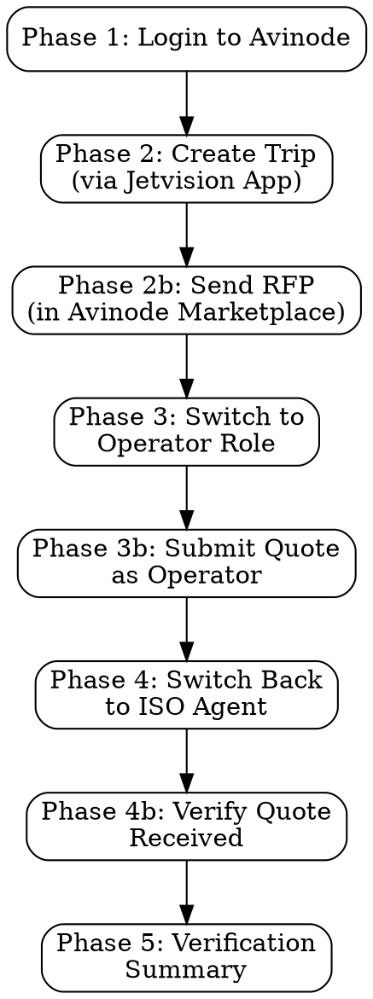

# Avinode Sandbox Integration Test

## Overview

Interactive browser automation skill that tests the complete Avinode RFP workflow by driving Chrome through the full bidirectional flow: ISO agent creates trip via Jetvision, sends RFP in Avinode Marketplace, switches to Operator role to respond with a quote, then verifies the quote arrives back via webhook.

Uses `mcp__claude-in-chrome__*` tools for all browser interactions.

## When to Use

- Testing the complete Avinode integration end-to-end after code changes
- Verifying deep link generation, webhook reception, and quote display
- Debugging Avinode API issues that require UI-level verification
- After running `/avinode-sandbox-reset` to verify clean state
- Before sprint demos to confirm the full RFP workflow works

## When NOT to Use

- For API-only connectivity tests (use `/avinode-test` instead)
- For database cleanup (use `/avinode-sandbox-reset` instead)
- For production environment testing (this skill targets sandbox only)

## Prerequisites

1. **Chrome browser** open with Claude-in-Chrome extension active
2. **Jetvision dev server** running (`npm run dev:app`)
3. **Avinode Sandbox credentials** valid (key resets every Monday)
4. **Avinode MCP server** environment configured (`mcp-servers/avinode-mcp-server/.env.local`)

## Command Usage

```bash
# Full workflow (all 5 phases)
/avinode-sandbox-test

# Specific phase only
/avinode-sandbox-test --phase 1    # Login only
/avinode-sandbox-test --phase 2    # ISO Agent: Create trip & send RFP
/avinode-sandbox-test --phase 3    # Switch to Operator & respond
/avinode-sandbox-test --phase 4    # Switch back & verify quote
/avinode-sandbox-test --phase 5    # Verification summary
```

## Sandbox Credentials

```txt
URL: https://marketplace.avinode.com
Email: kingler@me.com
Password: 2FRhgGZK3wSy8SY
```

**Important:** These are sandbox-only credentials. The API key resets every Monday morning.

## Sandbox Seller Fleet (Predefined Aircraft)

The Avinode Sandbox Dev environment has predefined flights for the "Sandbox Seller" operator. When selecting aircraft as the Operator, only these are available:

| Aircraft Type | Tail Number | Category |
|--------------|-------------|----------|
| Citation XLS | Various | Midsize |
| Challenger 350 | Various | Super-Mid |
| Gulfstream G280 | Various | Super-Mid |
| Global 6000 | Various | Large |

These are the only aircraft the Sandbox Seller can quote on. The ISO Agent UI should filter to show only operators with these available aircraft.

## Workflow



---

## Phase 1: Login to Avinode Sandbox

### Steps

1. **Get current tab context:**

   ```txt
   Tool: mcp__claude-in-chrome__tabs_context_mcp
   ```

   Note which tabs are open. Do NOT reuse tabs from previous sessions.

2. **Create a new tab for Avinode:**

   ```txt
   Tool: mcp__claude-in-chrome__tabs_create_mcp
   URL: https://marketplace.avinode.com
   ```

   Save the returned `tabId` — you will reuse it for the entire session.

3. **Wait for SSO redirect and read the login page:**

   ```txt
   Tool: mcp__claude-in-chrome__read_page
   tabId: <saved-tab-id>
   ```

   The page will redirect through `auth.avinode.com`. Wait for the login form to appear.

4. **Fill login credentials:**

   ```txt
   Tool: mcp__claude-in-chrome__form_input
   tabId: <saved-tab-id>
   formData:
     - selector: "input[name='email'], input[type='email'], #email"
       value: "kingler@me.com"
     - selector: "input[name='password'], input[type='password'], #password"
       value: "2FRhgGZK3wSy8SY"
   ```

5. **Click the login/sign-in button:**

   ```txt
   Tool: mcp__claude-in-chrome__computer
   tabId: <saved-tab-id>
   action: click
   selector: "button[type='submit'], button:has-text('Sign in'), button:has-text('Log in')"
   ```

6. **Verify login success:**

   ```txt
   Tool: mcp__claude-in-chrome__read_page
   tabId: <saved-tab-id>
   ```

   Confirm you see the marketplace dashboard. Look for:
   - Account name in header (should show ISO Agent / Buyer account)
   - Navigation menu with "Trips", "Messages", etc.
   - No error messages

7. **Screenshot for verification:**

   ```txt
   Tool: mcp__claude-in-chrome__upload_image
   tabId: <saved-tab-id>
   ```

### Troubleshooting - Login

| Issue | Solution |
|-------|----------|
| SSO redirect loop | Clear cookies for avinode.com, try again |
| Invalid credentials | API key may have reset (Monday). Check with team. |
| MFA prompt | Sandbox should not require MFA. If it does, contact Avinode support. |
| Page not loading | Check internet connectivity. Try `mcp__claude-in-chrome__navigate` to retry. |

---

## Trip Test Scenarios

Use one of these three scenarios when creating a trip in Phase 2. Each tests a different trip type supported by the Avinode API.

### Scenario A: One-Way Trip (Default)

```txt
I need a one way flight from KTEB to KVNY for 4 passengers on March 25, 2026 at 4:00pm EST
```

**Expected create_trip payload:** 1 leg (KTEB → KVNY)
**Verification:** Single leg displayed in Avinode with correct departure time.

### Scenario B: Round Trip

```txt
I need a round trip flight from KTEB to KVNY for 4 passengers on March 2, 2026 at 9:00am EST
```

**Expected create_trip payload:** 2 legs (KTEB → KVNY, KVNY → KTEB)
**Verification:** Both outbound and return legs displayed in Avinode. Return date/time may be auto-calculated or prompted.

### Scenario C: Multi-City Trip

```txt
I need a multi-city trip: KTEB to London Luton (EGGW), then London Luton to Paris Le Bourget (LFPB), then Paris Le Bourget back to KTEB. March 10-15, 4 passengers
```

**Expected create_trip payload:** 3 legs (KTEB → EGGW, EGGW → LFPB, LFPB → KTEB)
**Verification:** All 3 legs displayed in Avinode with correct airports. International airports resolve correctly.

### Choosing a Scenario

| Run | Scenario | Why |
|-----|----------|-----|
| Default / quick test | A (One-Way) | Simplest, fastest to verify |
| After NLP parser changes | B (Round Trip) | Tests return-leg generation |
| After multi-leg or airport search changes | C (Multi-City) | Tests multi-leg creation + international ICAO resolution |
| Full regression | All three sequentially | Complete coverage |

---

## Phase 2: ISO Agent — Create Trip & Send RFP

### Step 2a: Create Trip via Jetvision App

1. **Open Jetvision app in a new tab:**

   ```txt
   Tool: mcp__claude-in-chrome__tabs_create_mcp
   URL: http://localhost:3000
   ```

   Save this `tabId` as `jetvisionTabId`.

2. **Navigate to chat interface:**

   ```txt
   Tool: mcp__claude-in-chrome__read_page
   tabId: <jetvision-tab-id>
   ```

   If redirected to sign-in, authenticate with Clerk first.

3. **Submit a flight request in the chat** (use one of the scenarios above):

   ```txt
   Tool: mcp__claude-in-chrome__form_input
   tabId: <jetvision-tab-id>
   formData:
     - selector: "textarea, input[placeholder*='message' i], [data-testid='chat-input']"
       value: "<scenario prompt from Trip Test Scenarios section>"
   ```

   **Default (Scenario A):** `I need a one way flight from KTEB to KVNY for 4 passengers on March 25, 2026 at 4:00pm EST`

4. **Send the message:**

   ```txt
   Tool: mcp__claude-in-chrome__computer
   tabId: <jetvision-tab-id>
   action: click
   selector: "button[type='submit'], button[aria-label*='send' i]"
   ```

5. **Wait for agent response (up to 60 seconds):**

   ```txt
   Tool: mcp__claude-in-chrome__read_page
   tabId: <jetvision-tab-id>
   ```

   Look for:
   - Trip creation confirmation
   - Deep link button ("Open in Avinode" or "Open in Avinode Marketplace")
   - Trip ID (format: `atrip-XXXXXXXX`)
   - Request ID

   **Save these values:**
   - `tripId`: The Avinode trip ID
   - `deepLinkUrl`: The full Avinode marketplace URL
   - `requestId`: The Jetvision request ID

6. **Screenshot the deep link display:**

   ```txt
   Tool: mcp__claude-in-chrome__upload_image
   tabId: <jetvision-tab-id>
   ```

### Step 2b: Send RFP in Avinode Marketplace

7. **Navigate to the deep link in the Avinode tab:**

   ```txt
   Tool: mcp__claude-in-chrome__navigate
   tabId: <avinode-tab-id>
   url: <deep-link-url>
   ```

   Or if no deep link, navigate to: `https://marketplace.avinode.com/marketplace/mvc/search/load/<trip-id>`

8. **Read the trip details page:**

   ```txt
   Tool: mcp__claude-in-chrome__read_page
   tabId: <avinode-tab-id>
   ```

   Verify:
   - Route matches the chosen scenario:
     - Scenario A: KTEB → KVNY (1 leg)
     - Scenario B: KTEB → KVNY + KVNY → KTEB (2 legs)
     - Scenario C: KTEB → EGGW + EGGW → LFPB + LFPB → KTEB (3 legs)
   - Passenger count matches (4)
   - Date matches
   - Available operators are listed

9. **Select the Sandbox Seller operator:**

   ```txt
   Tool: mcp__claude-in-chrome__computer
   tabId: <avinode-tab-id>
   action: click
   selector: "[data-operator-name*='Sandbox'], tr:has-text('Sandbox Seller'), .operator-row:has-text('Sandbox')"
   ```

   If a checkbox: click the checkbox next to "Sandbox Seller"
   If a list: click on the "Sandbox Seller" row

10. **Send the RFP:**

    ```txt
    Tool: mcp__claude-in-chrome__computer
    tabId: <avinode-tab-id>
    action: click
    selector: "button:has-text('Send'), button:has-text('Send RFP'), button:has-text('Request Quote')"
    ```

11. **Verify RFP sent confirmation:**

    ```txt
    Tool: mcp__claude-in-chrome__read_page
    tabId: <avinode-tab-id>
    ```

    Look for success message or status change to "RFP Sent" / "Awaiting Quotes".

12. **Screenshot the confirmation:**

    ```txt
    Tool: mcp__claude-in-chrome__upload_image
    tabId: <avinode-tab-id>
    ```

---

## Phase 3: Switch to Operator & Respond to RFP

### Step 3a: Switch Account

1. **Click the account/profile dropdown in the header:**

   ```txt
   Tool: mcp__claude-in-chrome__computer
   tabId: <avinode-tab-id>
   action: click
   selector: "[data-testid='account-switcher'], .account-dropdown, .profile-menu, button:has-text('Switch'), [aria-label*='account' i], .user-menu"
   ```

   If the dropdown doesn't open, try:

   ```txt
   Tool: mcp__claude-in-chrome__find
   tabId: <avinode-tab-id>
   query: "Switch" or "Account" or profile icon
   ```

2. **Select the Sandbox Seller (Operator) account:**

   ```txt
   Tool: mcp__claude-in-chrome__computer
   tabId: <avinode-tab-id>
   action: click
   selector: "a:has-text('Sandbox Seller'), [data-account*='seller'], li:has-text('Seller'), option:has-text('Seller')"
   ```

3. **Wait for account switch and verify:**

   ```txt
   Tool: mcp__claude-in-chrome__read_page
   tabId: <avinode-tab-id>
   ```

   Confirm the header now shows "Sandbox Seller" or the Operator account name.

### Step 3b: Find and Respond to the RFP

4. **Navigate to incoming requests / notifications:**

   ```txt
   Tool: mcp__claude-in-chrome__computer
   tabId: <avinode-tab-id>
   action: click
   selector: "a:has-text('Requests'), a:has-text('Incoming'), [data-nav='requests'], a[href*='request'], .notification-badge"
   ```

   Or navigate directly:

   ```txt
   Tool: mcp__claude-in-chrome__navigate
   tabId: <avinode-tab-id>
   url: https://marketplace.avinode.com/marketplace/mvc/requests
   ```

5. **Find the RFP we sent** (search by departure airport — always KTEB for all scenarios):

   ```txt
   Tool: mcp__claude-in-chrome__find
   tabId: <avinode-tab-id>
   query: "KTEB" or "Teterboro"
   ```
   
   For disambiguation if multiple trips exist, also search by destination:
   - Scenario A: "KVNY" or "Van Nuys"
   - Scenario B: "KVNY" or "Van Nuys"
   - Scenario C: "EGGW" or "Luton"

6. **Open the RFP details:**

   ```txt
   Tool: mcp__claude-in-chrome__computer
   tabId: <avinode-tab-id>
   action: click
   selector: "tr:has-text('KTEB'), a:has-text('KTEB'), .request-row:has-text('KTEB')"
   ```

7. **Read the RFP details:**

   ```txt
   Tool: mcp__claude-in-chrome__read_page
   tabId: <avinode-tab-id>
   ```

   Verify route, passengers, date match what we sent.

8. **Select an aircraft to quote (from Sandbox fleet):**
   ```
   Tool: mcp__claude-in-chrome__computer
   tabId: <avinode-tab-id>
   action: click
   selector: "select[name*='aircraft'], [data-testid='aircraft-select'], tr:has-text('Citation'), .aircraft-option"
   ```

9. **Fill in the quote price:**

   ```txt
   Tool: mcp__claude-in-chrome__form_input
   tabId: <avinode-tab-id>
   formData:
     - selector: "input[name*='price'], input[name*='amount'], input[placeholder*='price' i], #quote-price"
       value: "45000"
   ```

   Fill any other required fields (availability, notes, etc.) as shown on the form.

10. **Submit the quote:**

    ```txt
    Tool: mcp__claude-in-chrome__computer
    tabId: <avinode-tab-id>
    action: click
    selector: "button:has-text('Submit'), button:has-text('Send Quote'), button:has-text('Reply'), button[type='submit']"
    ```

11. **Verify quote submission:**

    ```txt
    Tool: mcp__claude-in-chrome__read_page
    tabId: <avinode-tab-id>
    ```

    Look for "Quote Sent" or success confirmation.

12. **Screenshot the submitted quote:**

    ```txt
    Tool: mcp__claude-in-chrome__upload_image
    tabId: <avinode-tab-id>
    ```

---

## Phase 4: Switch Back to ISO Agent & Verify Quote

### Step 4a: Switch Back to ISO Agent

1. **Click the account dropdown again:**

   ```txt
   Tool: mcp__claude-in-chrome__computer
   tabId: <avinode-tab-id>
   action: click
   selector: "[data-testid='account-switcher'], .account-dropdown, .profile-menu, button:has-text('Switch')"
   ```

2. **Select the Buyer / ISO Agent account:**

   ```txt
   Tool: mcp__claude-in-chrome__computer
   tabId: <avinode-tab-id>
   action: click
   selector: "a:has-text('Buyer'), a:has-text('ISO'), [data-account*='buyer'], li:has-text('Buyer')"
   ```

3. **Verify account switched back:**

   ```txt
   Tool: mcp__claude-in-chrome__read_page
   tabId: <avinode-tab-id>
   ```

### Step 4b: Verify Quote in Avinode UI

4. **Navigate to the trip in Avinode:**

   ```txt
   Tool: mcp__claude-in-chrome__navigate
   tabId: <avinode-tab-id>
   url: <deep-link-url>
   ```

5. **Check for received quotes:**

   ```txt
   Tool: mcp__claude-in-chrome__read_page
   tabId: <avinode-tab-id>
   ```
   
   Look for:
   - Quote from "Sandbox Seller"
   - Price: $45,000 (or whatever was entered)
   - Aircraft type
   - Quote status

6. **Screenshot the received quote in Avinode:**

   ```txt
   Tool: mcp__claude-in-chrome__upload_image
   tabId: <avinode-tab-id>
   ```

### Step 4c: Verify Quote in Jetvision App

7. **Switch to the Jetvision tab:**

   ```txt
   Tool: mcp__claude-in-chrome__read_page
   tabId: <jetvision-tab-id>
   ```

   Check for:
   - Quote card displayed in chat
   - Pricing information shown
   - Operator name (Sandbox Seller)
   - Aircraft details

   If no quote appears yet, the webhook may not have fired. Wait 10-15 seconds and refresh:

   ```txt
   Tool: mcp__claude-in-chrome__navigate
   tabId: <jetvision-tab-id>
   url: http://localhost:3000
   ```

8. **Screenshot the Jetvision quote display:**

   ```txt
   Tool: mcp__claude-in-chrome__upload_image
   tabId: <jetvision-tab-id>
   ```

---

## Phase 5: Verification Summary

### Database Verification

Use the Supabase MCP tools to verify webhook event storage:

1. **Check `avinode_webhook_events` table:**
   Query for the latest `TripRequestSellerResponse` event matching our trip ID.

2. **Check `quotes` table:**
   Query for quotes linked to our request ID.

3. **Check `requests` table:**
   Verify the request has `avinode_trip_id` and `avinode_deep_link` populated.

### Summary Report

Generate a pass/fail report:

```
============================================================
  Avinode Sandbox Integration Test Report
============================================================

Scenario: {A: One-Way | B: Round Trip | C: Multi-City}
Route:    {KTEB→KVNY | KTEB→KVNY→KTEB | KTEB→EGGW→LFPB→KTEB}
Legs:     {1 | 2 | 3}

Phase 1 - Login:
  [ ] Login successful
  [ ] Account verified as ISO Agent

Phase 2 - Trip Creation & RFP:
  [ ] Trip created via Jetvision (Trip ID: __________)
  [ ] Deep link generated (URL: __________)
  [ ] Correct number of legs created ({1|2|3})
  [ ] All airports resolved correctly
  [ ] RFP sent to Sandbox Seller

Phase 3 - Operator Response:
  [ ] Account switched to Operator
  [ ] RFP found in incoming requests
  [ ] All legs visible in RFP details
  [ ] Quote submitted ($__________)

Phase 4 - Quote Verification:
  [ ] Account switched back to ISO Agent
  [ ] Quote visible in Avinode UI
  [ ] Quote visible in Jetvision app
  [ ] Webhook event stored in Supabase

Overall: PASS / FAIL
============================================================
```

## Common Mistakes

| Mistake | Fix |
|---------|-----|
| Reusing tab IDs from a previous session | Always call `tabs_context_mcp` first and create new tabs |
| Not waiting for SSO redirect | The login URL redirects through auth.avinode.com; wait for the form |
| Forgetting to switch back to ISO Agent | The role switch is persistent; always switch back after Operator actions |
| Submitting RFP without selecting an operator | Must select Sandbox Seller before sending |
| Expecting instant webhook delivery | Webhook events may take 5-30 seconds; retry reads if not found |
| Using production dates | Use dates 30+ days in the future for sandbox trips |

## Related Skills

- `/avinode-test` - API-level connectivity testing
- `/avinode-sandbox-reset` - Database cleanup after key reset

## Related Documentation

- [Avinode API Integration](docs/api/AVINODE_API_INTEGRATION.md)
- [Deep Link Workflow](docs/subagents/agents/flight-search/DEEP_LINK_WORKFLOW.md)
- [Webhook Events](docs/implementation/WORKFLOW-AVINODE-INTEGRATION.md)
- [E2E Test: avinode-deeplink-workflow.spec.ts](__tests__/e2e/avinode-deeplink-workflow.spec.ts)
