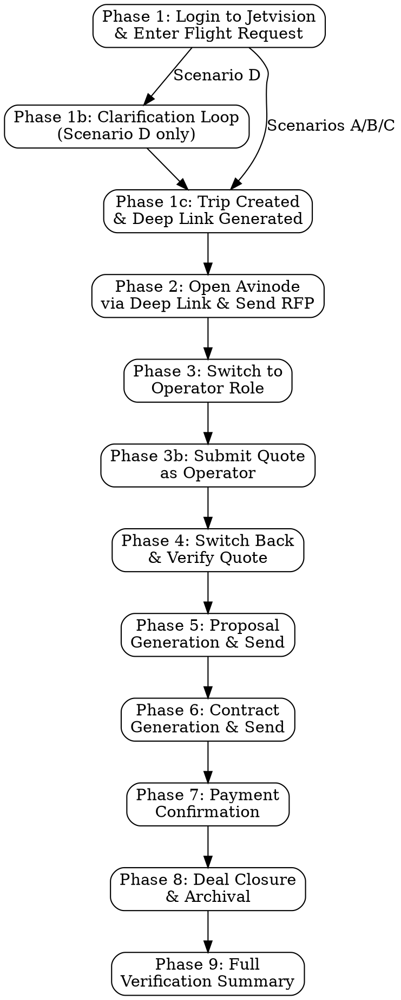

# Avinode Sandbox Integration Test

## Overview

Interactive browser automation skill that tests the **complete charter flight lifecycle** by driving Chrome through the full end-to-end flow: Jetvision login, flight request entry, trip creation, RFP exchange, quote verification, proposal generation and email, contract generation and send, payment confirmation, deal closure, and trip archival.

Uses `mcp__claude-in-chrome__*` tools for all browser interactions.

## When to Use

- Testing the complete charter flight lifecycle end-to-end after code changes
- Verifying deep link generation, webhook reception, and quote display
- Testing proposal generation, PDF rendering, and email delivery
- Testing contract generation, signing flow, and payment recording
- Debugging Avinode API issues that require UI-level verification
- After running `/avinode-sandbox-reset` to verify clean state
- Before sprint demos to confirm the full workflow works

## When NOT to Use

- For API-only connectivity tests (use `/avinode-test` instead)
- For database cleanup (use `/avinode-sandbox-reset` instead)
- For production environment testing (this skill targets sandbox only)

## Prerequisites

1. **Chrome browser** open with Claude-in-Chrome extension active
2. **Jetvision dev server** running (`npm run dev:app`)
3. **Avinode Sandbox credentials** valid (key resets every Monday)
4. **Avinode MCP server** environment configured (`mcp-servers/avinode-mcp-server/.env.local`)

## Command Usage

```bash
# Full workflow (all phases)
/avinode-sandbox-test

# Specific phase only
/avinode-sandbox-test --phase 1     # Login to Jetvision & enter flight request
/avinode-sandbox-test --phase 2     # Open Avinode via deep link & send RFP
/avinode-sandbox-test --phase 3     # Switch to Operator & submit quote
/avinode-sandbox-test --phase 4     # Switch back & verify quote received
/avinode-sandbox-test --phase 5     # Proposal generation & send (human-in-the-loop)
/avinode-sandbox-test --phase 6     # Contract generation & send
/avinode-sandbox-test --phase 7     # Payment confirmation
/avinode-sandbox-test --phase 8     # Deal closure & archival
/avinode-sandbox-test --phase 9     # Full verification summary (database + UI)

# Phase ranges
/avinode-sandbox-test --phase 1-4   # RFP flow only
/avinode-sandbox-test --phase 5-8   # Post-quote flow only (proposal → close)
```

## Recording Options

```bash
# Record all phases as video demos (via Playwright)
npm run test:e2e:demo

# Record with visible browser
npm run test:e2e:demo:headed

# Record all phases as GIF (via gif_creator, interactive)
/avinode-sandbox-test --record

# Record specific phase
/avinode-sandbox-test --phase 1 --record
```

When `--record` is active, each phase is wrapped with gif_creator start/stop/export calls. For Playwright-based recording, see `__tests__/e2e/demo/` spec files.

---

## Sandbox Credentials

```txt
Avinode Marketplace URL: https://marketplace.avinode.com
Email: kingler@me.com
Password: 2FRhgGZK3wSy8SY
```

**Important:** These are sandbox-only credentials. The API key resets every Monday morning.

**Note:** You do NOT need to login to Avinode separately. The Avinode Marketplace tab will already be authenticated when opened via the deep link from Jetvision.

## Sandbox Seller Fleet (Predefined Aircraft)

The Avinode Sandbox Dev environment has predefined flights for the "Sandbox Seller" operator. When selecting aircraft as the Operator, only these are available:

| Aircraft Type | Tail Number | Category |
|--------------|-------------|----------|
| Citation XLS | Various | Midsize |
| Challenger 350 | Various | Super-Mid |
| Gulfstream G280 | Various | Super-Mid |
| Global 6000 | Various | Large |

These are the only aircraft the Sandbox Seller can quote on. The ISO Agent UI should filter to show only operators with these available aircraft.

## Workflow



### Phase Overview

| Phase | Name | What Happens | Where |
|-------|------|-------------|-------|
| 1 | Jetvision Login & Flight Request | Open localhost:3000, login via Clerk, enter flight request, get trip + deep link | Jetvision tab |
| 2 | Open Avinode & Send RFP | Click deep link (Avinode opens already authenticated), select operator, send RFP | Avinode tab |
| 3 | Operator Quote | Switch to Operator role, find RFP, submit $45K quote | Avinode tab |
| 4 | Quote Verification | Switch back to ISO Agent, verify quote in Avinode + Jetvision | Both tabs |
| 5 | Proposal | Ask agent to generate proposal, review email draft, approve send | Jetvision tab |
| 6 | Contract | Ask agent to generate contract, review, send to client | Jetvision tab |
| 7 | Payment | Tell agent payment received, verify confirmation card | Jetvision tab |
| 8 | Close & Archive | Verify deal closed, archive session, check sidebar | Jetvision tab |
| 9 | Verification | Database checks across all tables, generate pass/fail report | Supabase MCP |

---

## Trip Test Scenarios

Use one of these scenarios when creating a trip in Phase 1. Scenarios A-C provide **full information** — all required fields are present in the initial message. Scenario D tests **ambiguous/vague requests** where the agent must ask clarifying questions before creating a trip.

### Scenario A: One-Way Trip — Full Info (Default)

```txt
I need a one way flight from KLGA to KVNY for 4 passengers on March 25, 2026 at 4:00pm EST
```

**Expected behavior:** Agent creates trip immediately (no clarification needed).
**Expected create_trip payload:** 1 leg (KLGA → KVNY)
**Verification:** Single leg displayed in Avinode with correct departure time.

### Scenario B: Round Trip — Full Info

```txt
I need a round trip flight from EGGW to KVNY for 4 passengers on March 2, 2026 at 9:00am EST
```

**Expected behavior:** Agent creates trip immediately. May prompt for return date/time if not inferred.
**Expected create_trip payload:** 2 legs (EGGW → KVNY, KVNY → EGGW)
**Verification:** Both outbound and return legs displayed in Avinode. Return date/time may be auto-calculated or prompted. Tests international ICAO code (EGGW = London Luton).

### Scenario C: Multi-City Trip — Full Info

```txt
I need a multi-city trip: KTEB to London Luton (EGGW), then London Luton to Paris Le Bourget (LFPB), then Paris Le Bourget back to KTEB. March 10-15, 4 passengers
```

**Expected behavior:** Agent creates trip immediately with all 3 legs.
**Expected create_trip payload:** 3 legs (KTEB → EGGW, EGGW → LFPB, LFPB → KTEB)
**Verification:** All 3 legs displayed in Avinode with correct airports. International airports resolve correctly.

### Scenario D: Ambiguous / Vague Requests

These requests are intentionally incomplete. The agent **must ask clarifying questions** before creating a trip. Use these to test the agent's clarification flow and NLP handling of imprecise inputs.

**D1 — Vague cities, no ICAO codes:**

```txt
Book a flight for tomorrow for three people from New York to Canada
```

**Missing/ambiguous:** No ICAO codes, "Canada" is a country not an airport, "tomorrow" is relative, no departure time.
**Expected agent behavior:**
- Ask which airport in New York (KTEB, KJFK, KLGA, KHPN)
- Ask which city/airport in Canada (CYYZ Toronto, CYUL Montreal, CYVR Vancouver, etc.)
- Confirm passenger count (3)
- Ask for departure time preference

**D2 — States instead of airports:**

```txt
I need a flight from Florida to California tomorrow
```

**Missing/ambiguous:** States not airports, no specific cities, "tomorrow" is relative, no passenger count, no departure time.
**Expected agent behavior:**
- Ask which airport in Florida (KOPF, KFLL, KMIA, KTPA, KJAX, etc.)
- Ask which airport in California (KVNY, KLAX, KSFO, KSAN, etc.)
- Ask for number of passengers
- Ask for departure time preference
- Clarify one-way vs round trip

**D3 — Vague date range, no departure time:**

```txt
I need a round trip flight from New York to Kansas for 4 passengers in March
```

**Missing/ambiguous:** "New York" and "Kansas" are regions not airports, "in March" has no specific date, no departure time.
**Expected agent behavior:**
- Ask which airport in New York (KTEB, KJFK, KLGA, KHPN)
- Ask which airport in Kansas (KMCI Kansas City, KICT Wichita, etc.)
- Ask for specific departure date within March
- Ask for departure time
- May ask for return date/time (round trip)

### Choosing a Scenario

| Run | Scenario | Why |
|-----|----------|-----|
| Default / quick test | A (One-Way) | Simplest, fastest to verify |
| After NLP parser changes | B (Round Trip) | Tests return-leg generation |
| After multi-leg or airport search changes | C (Multi-City) | Tests multi-leg creation + international ICAO resolution |
| After clarification flow changes | D (Ambiguous) | Tests agent clarification questions and NLP disambiguation |
| Full regression | All (A → B → C → D1 → D2 → D3) | Complete coverage |

---

## Phase 1: Login to Jetvision & Enter Flight Request

This phase opens the Jetvision app, authenticates via Clerk, and submits a flight request in the chat. The agent processes the request, creates a trip via the Avinode MCP, and returns a deep link.

### Step 1a: Open Jetvision App

1. **Get current tab context:**

   ```txt
   Tool: mcp__claude-in-chrome__tabs_context_mcp
   ```

   Note which tabs are open. Do NOT reuse tabs from previous sessions.

2. **Create a new tab for Jetvision:**

   ```txt
   Tool: mcp__claude-in-chrome__tabs_create_mcp
   URL: http://localhost:3000
   ```

   Save the returned `tabId` as `jetvisionTabId` — you will reuse it for the entire session.

3. **Wait for page load and read the page:**

   ```txt
   Tool: mcp__claude-in-chrome__read_page
   tabId: <jetvision-tab-id>
   ```

   Check what loaded:
   - **If you see the chat interface** → Jetvision is already authenticated. Skip to Step 1c.
   - **If you see a Clerk sign-in page** → Proceed to Step 1b.
   - **If you see a loading screen** → Wait 3-5 seconds and read again.

### Step 1b: Authenticate via Clerk (if needed)

4. **Fill in Clerk login credentials:**

   ```txt
   Tool: mcp__claude-in-chrome__form_input
   tabId: <jetvision-tab-id>
   formData:
     - selector: "input[name='identifier'], input[type='email'], input[id*='identifier']"
       value: "kingler@me.com"
   ```

5. **Click the Continue/Sign-in button:**

   ```txt
   Tool: mcp__claude-in-chrome__computer
   tabId: <jetvision-tab-id>
   action: click
   selector: "button[type='submit'], button:has-text('Continue'), button:has-text('Sign in')"
   ```

6. **If a password field appears, fill it:**

   ```txt
   Tool: mcp__claude-in-chrome__form_input
   tabId: <jetvision-tab-id>
   formData:
     - selector: "input[name='password'], input[type='password']"
       value: "2FRhgGZK3wSy8SY"
   ```

   Then click the submit button again.

7. **Verify login success:**

   ```txt
   Tool: mcp__claude-in-chrome__read_page
   tabId: <jetvision-tab-id>
   ```

   Confirm you see the Jetvision chat interface. Look for:
   - Chat input area (textarea or input)
   - Sidebar with session list
   - No error messages

8. **Screenshot for verification:**

   ```txt
   Tool: mcp__claude-in-chrome__upload_image
   tabId: <jetvision-tab-id>
   ```

### Step 1c: Enter Flight Request

9. **Submit a flight request in the chat** (use one of the scenarios from Trip Test Scenarios):

   ```txt
   Tool: mcp__claude-in-chrome__form_input
   tabId: <jetvision-tab-id>
   formData:
     - selector: "textarea, input[placeholder*='message' i], [data-testid='chat-input']"
       value: "<scenario prompt from Trip Test Scenarios section>"
   ```

   **Default (Scenario A):** `I need a one way flight from KLGA to KVNY for 4 passengers on March 25, 2026 at 4:00pm EST`

10. **Send the message:**

    ```txt
    Tool: mcp__claude-in-chrome__computer
    tabId: <jetvision-tab-id>
    action: click
    selector: "button[type='submit'], button[aria-label*='send' i]"
    ```

11. **Wait for agent response (up to 60 seconds):**

    ```txt
    Tool: mcp__claude-in-chrome__read_page
    tabId: <jetvision-tab-id>
    ```

    **For Scenarios A, B, C (Full Info)** — look for:
    - Trip creation confirmation
    - Deep link button ("Open in Avinode" or "Open in Avinode Marketplace")
    - Trip ID (format: `atrip-XXXXXXXX`)
    - Request ID

    **For Scenario D (Ambiguous/Vague)** — look for:
    - Clarifying questions from the agent (airport disambiguation, date/time, passenger count)
    - Do NOT expect a trip to be created yet

    If running Scenario D, proceed to **Step 1d (Clarification Loop)** below. Otherwise, skip to Step 1e.

### Step 1d: Clarification Loop (Scenario D Only)

When the agent asks clarifying questions, respond with specific answers to resolve ambiguities. Repeat until the agent has enough information to create a trip.

   a. **Read the agent's clarification question:**

   ```txt
   Tool: mcp__claude-in-chrome__read_page
   tabId: <jetvision-tab-id>
   ```

   Identify what the agent is asking for (airport, date, time, passengers, trip type).

   b. **Respond with a specific answer:**

   ```txt
   Tool: mcp__claude-in-chrome__form_input
   tabId: <jetvision-tab-id>
   formData:
     - selector: "textarea, input[placeholder*='message' i], [data-testid='chat-input']"
       value: "<specific answer to the clarification question>"
   ```

   Example responses for each Scenario D variant:
   - **D1:** "KTEB Teterboro" → "CYYZ Toronto Pearson" → "10:00am" → confirm
   - **D2:** "KOPF Opa-locka, FL" → "KVNY Van Nuys, CA" → "2 passengers" → "one way" → "2:00pm" → confirm
   - **D3:** "KTEB Teterboro" → "KMCI Kansas City" → "March 15, 2026" → "9:00am" → "March 18 return" → confirm

   c. **Send the response:**

   ```txt
   Tool: mcp__claude-in-chrome__computer
   tabId: <jetvision-tab-id>
   action: click
   selector: "button[type='submit'], button[aria-label*='send' i]"
   ```

   d. **Wait and read the agent's next message:**

   ```txt
   Tool: mcp__claude-in-chrome__read_page
   tabId: <jetvision-tab-id>
   ```

   **Repeat steps a-d** until the agent confirms all details and creates the trip. You should see:
   - A confirmation summary of the resolved flight details
   - Trip creation confirmation with deep link

   **Verification for Scenario D:**
   - [ ] Agent asked relevant clarifying questions (did not hallucinate airports)
   - [ ] Agent correctly interpreted answers
   - [ ] Agent did NOT create a trip before all required fields were resolved
   - [ ] Final trip payload matches the resolved details

### Step 1e: Save Trip Details & Screenshot

12. **Save the trip details** (applies to all scenarios after trip is created):

    **Save these values:**
    - `tripId`: The Avinode trip ID
    - `deepLinkUrl`: The full Avinode marketplace URL
    - `requestId`: The Jetvision request ID

13. **Screenshot the deep link display:**

    ```txt
    Tool: mcp__claude-in-chrome__upload_image
    tabId: <jetvision-tab-id>
    ```

### Troubleshooting - Phase 1

| Issue | Solution |
|-------|----------|
| Clerk login page not appearing | Jetvision may already be authenticated. Check for chat UI. |
| Clerk redirect loop | Clear cookies for localhost:3000, try again |
| Chat input not found | Check CSS selectors. Try `mcp__claude-in-chrome__find` with query "message" |
| Agent not responding | Check that the dev server is running (`npm run dev:app`). Check terminal for errors. |
| No deep link generated | Check Avinode MCP server is running and API key is valid |
| Trip creation fails | API key may have reset (Monday). Run `/avinode-sandbox-reset`. |

---

## Phase 2: Open Avinode via Deep Link & Send RFP

Clicking the deep link from Jetvision opens the Avinode Marketplace in a new tab. **The Avinode session is already authenticated** — no separate login is required.

### Step 2a: Open Avinode via Deep Link

1. **Click the deep link button in Jetvision:**

   ```txt
   Tool: mcp__claude-in-chrome__computer
   tabId: <jetvision-tab-id>
   action: click
   selector: "a:has-text('Open in Avinode'), button:has-text('Open in Avinode'), [data-testid='avinode-deep-link'], a[href*='marketplace.avinode.com']"
   ```

   This should open a new browser tab with the Avinode Marketplace trip page.

   **Alternative:** If the deep link opens in the same tab or doesn't open, navigate manually:

   ```txt
   Tool: mcp__claude-in-chrome__tabs_create_mcp
   URL: <deep-link-url>
   ```

   Save the returned `tabId` as `avinodeTabId`.

2. **Get the Avinode tab context (if opened via click):**

   ```txt
   Tool: mcp__claude-in-chrome__tabs_context_mcp
   ```

   Identify the newly opened Avinode tab and save its `tabId` as `avinodeTabId`.

3. **Read the Avinode trip details page:**

   ```txt
   Tool: mcp__claude-in-chrome__read_page
   tabId: <avinode-tab-id>
   ```

   Verify:
   - You are on the Avinode Marketplace (no login page — already authenticated)
   - Route matches the chosen scenario:
     - Scenario A: KLGA → KVNY (1 leg)
     - Scenario B: EGGW → KVNY + KVNY → EGGW (2 legs)
     - Scenario C: KTEB → EGGW + EGGW → LFPB + LFPB → KTEB (3 legs)
   - Passenger count matches (4)
   - Date matches
   - Available operators are listed

   **If you see a login page instead:** The Avinode session may have expired. See Troubleshooting below.

4. **Screenshot the trip page:**

   ```txt
   Tool: mcp__claude-in-chrome__upload_image
   tabId: <avinode-tab-id>
   ```

### Step 2b: Select Operator & Send RFP

5. **Select the Sandbox Seller operator:**

   ```txt
   Tool: mcp__claude-in-chrome__computer
   tabId: <avinode-tab-id>
   action: click
   selector: "[data-operator-name*='Sandbox'], tr:has-text('Sandbox Seller'), .operator-row:has-text('Sandbox')"
   ```

   If a checkbox: click the checkbox next to "Sandbox Seller"
   If a list: click on the "Sandbox Seller" row

6. **Send the RFP:**

   ```txt
   Tool: mcp__claude-in-chrome__computer
   tabId: <avinode-tab-id>
   action: click
   selector: "button:has-text('Send'), button:has-text('Send RFP'), button:has-text('Request Quote')"
   ```

7. **Verify RFP sent confirmation:**

   ```txt
   Tool: mcp__claude-in-chrome__read_page
   tabId: <avinode-tab-id>
   ```

   Look for success message or status change to "RFP Sent" / "Awaiting Quotes".

8. **Screenshot the confirmation:**

   ```txt
   Tool: mcp__claude-in-chrome__upload_image
   tabId: <avinode-tab-id>
   ```

### Troubleshooting - Phase 2

| Issue | Solution |
|-------|----------|
| Avinode login page appears | Session expired. Login manually using sandbox credentials (see Sandbox Credentials section), then navigate back to the deep link URL. |
| Deep link button not clickable | Try `mcp__claude-in-chrome__find` to locate the element. May need to scroll. |
| Deep link opens but shows error | Trip may not have been created properly. Check Jetvision chat for error messages. |
| No operators listed | Trip parameters may not match any available aircraft. Check route and dates. |
| Sandbox Seller not in list | Ensure the route and aircraft category match the Sandbox Seller fleet (see fleet table above). |

---

## Phase 3: Switch to Operator & Respond to RFP

### Step 3a: Switch Account

1. **Click the account/profile dropdown in the header:**

   ```txt
   Tool: mcp__claude-in-chrome__computer
   tabId: <avinode-tab-id>
   action: click
   selector: "[data-testid='account-switcher'], .account-dropdown, .profile-menu, button:has-text('Switch'), [aria-label*='account' i], .user-menu"
   ```

   If the dropdown doesn't open, try:

   ```txt
   Tool: mcp__claude-in-chrome__find
   tabId: <avinode-tab-id>
   query: "Switch" or "Account" or profile icon
   ```

2. **Select the Sandbox Seller (Operator) account:**

   ```txt
   Tool: mcp__claude-in-chrome__computer
   tabId: <avinode-tab-id>
   action: click
   selector: "a:has-text('Sandbox Seller'), [data-account*='seller'], li:has-text('Seller'), option:has-text('Seller')"
   ```

3. **Wait for account switch and verify:**

   ```txt
   Tool: mcp__claude-in-chrome__read_page
   tabId: <avinode-tab-id>
   ```

   Confirm the header now shows "Sandbox Seller" or the Operator account name.

### Step 3b: Find and Respond to the RFP

4. **Navigate to incoming requests / notifications:**

   ```txt
   Tool: mcp__claude-in-chrome__computer
   tabId: <avinode-tab-id>
   action: click
   selector: "a:has-text('Requests'), a:has-text('Incoming'), [data-nav='requests'], a[href*='request'], .notification-badge"
   ```

   Or navigate directly:

   ```txt
   Tool: mcp__claude-in-chrome__navigate
   tabId: <avinode-tab-id>
   url: https://marketplace.avinode.com/marketplace/mvc/requests
   ```

5. **Find the RFP we sent** (search by departure airport for the chosen scenario):

   ```txt
   Tool: mcp__claude-in-chrome__find
   tabId: <avinode-tab-id>
   query: "<departure airport ICAO or name>"
   ```

   Departure airports per scenario:
   - Scenario A: "KLGA" or "LaGuardia"
   - Scenario B: "EGGW" or "Luton"
   - Scenario C: "KTEB" or "Teterboro"
   - Scenario D: Depends on clarification answers

   For disambiguation if multiple trips exist, also search by destination:
   - Scenario A: "KVNY" or "Van Nuys"
   - Scenario B: "KVNY" or "Van Nuys"
   - Scenario C: "EGGW" or "Luton" (first leg destination)

6. **Open the RFP details:**

   ```txt
   Tool: mcp__claude-in-chrome__computer
   tabId: <avinode-tab-id>
   action: click
   selector: "tr:has-text('KTEB'), a:has-text('KTEB'), .request-row:has-text('KTEB')"
   ```

7. **Read the RFP details:**

   ```txt
   Tool: mcp__claude-in-chrome__read_page
   tabId: <avinode-tab-id>
   ```

   Verify route, passengers, date match what we sent.

8. **Select an aircraft to quote (from Sandbox fleet):**
   ```
   Tool: mcp__claude-in-chrome__computer
   tabId: <avinode-tab-id>
   action: click
   selector: "select[name*='aircraft'], [data-testid='aircraft-select'], tr:has-text('Citation'), .aircraft-option"
   ```

9. **Fill in the quote price:**

   ```txt
   Tool: mcp__claude-in-chrome__form_input
   tabId: <avinode-tab-id>
   formData:
     - selector: "input[name*='price'], input[name*='amount'], input[placeholder*='price' i], #quote-price"
       value: "45000"
   ```

   Fill any other required fields (availability, notes, etc.) as shown on the form.

10. **Submit the quote:**

    ```txt
    Tool: mcp__claude-in-chrome__computer
    tabId: <avinode-tab-id>
    action: click
    selector: "button:has-text('Submit'), button:has-text('Send Quote'), button:has-text('Reply'), button[type='submit']"
    ```

11. **Verify quote submission:**

    ```txt
    Tool: mcp__claude-in-chrome__read_page
    tabId: <avinode-tab-id>
    ```

    Look for "Quote Sent" or success confirmation.

12. **Screenshot the submitted quote:**

    ```txt
    Tool: mcp__claude-in-chrome__upload_image
    tabId: <avinode-tab-id>
    ```

---

## Phase 4: Switch Back to ISO Agent & Verify Quote

### Step 4a: Switch Back to ISO Agent

1. **Click the account dropdown again:**

   ```txt
   Tool: mcp__claude-in-chrome__computer
   tabId: <avinode-tab-id>
   action: click
   selector: "[data-testid='account-switcher'], .account-dropdown, .profile-menu, button:has-text('Switch')"
   ```

2. **Select the Buyer / ISO Agent account:**

   ```txt
   Tool: mcp__claude-in-chrome__computer
   tabId: <avinode-tab-id>
   action: click
   selector: "a:has-text('Buyer'), a:has-text('ISO'), [data-account*='buyer'], li:has-text('Buyer')"
   ```

3. **Verify account switched back:**

   ```txt
   Tool: mcp__claude-in-chrome__read_page
   tabId: <avinode-tab-id>
   ```

### Step 4b: Verify Quote in Avinode UI

4. **Navigate to the trip in Avinode:**

   ```txt
   Tool: mcp__claude-in-chrome__navigate
   tabId: <avinode-tab-id>
   url: <deep-link-url>
   ```

5. **Check for received quotes:**

   ```txt
   Tool: mcp__claude-in-chrome__read_page
   tabId: <avinode-tab-id>
   ```

   Look for:
   - Quote from "Sandbox Seller"
   - Price: $45,000 (or whatever was entered)
   - Aircraft type
   - Quote status

6. **Screenshot the received quote in Avinode:**

   ```txt
   Tool: mcp__claude-in-chrome__upload_image
   tabId: <avinode-tab-id>
   ```

### Step 4c: Verify Quote in Jetvision App

7. **Switch to the Jetvision tab:**

   ```txt
   Tool: mcp__claude-in-chrome__read_page
   tabId: <jetvision-tab-id>
   ```

   Check for:
   - Quote card displayed in chat
   - Pricing information shown
   - Operator name (Sandbox Seller)
   - Aircraft details

   If no quote appears yet, the webhook may not have fired. Wait 10-15 seconds and refresh:

   ```txt
   Tool: mcp__claude-in-chrome__navigate
   tabId: <jetvision-tab-id>
   url: http://localhost:3000
   ```

8. **Screenshot the Jetvision quote display:**

   ```txt
   Tool: mcp__claude-in-chrome__upload_image
   tabId: <jetvision-tab-id>
   ```

---

## Phase 5: Proposal Generation & Send

This phase tests the agent's ability to generate a proposal from the received quote and send it via email with human-in-the-loop approval.

### Step 5a: Ask Agent to Generate Proposal

1. **Tell the agent to create a proposal from the quote:**

   ```txt
   Tool: mcp__claude-in-chrome__form_input
   tabId: <jetvision-tab-id>
   formData:
     - selector: "textarea, input[placeholder*='message' i], [data-testid='chat-input']"
       value: "Generate a proposal from the Sandbox Seller quote for $45,000"
   ```

2. **Send the message:**

   ```txt
   Tool: mcp__claude-in-chrome__computer
   tabId: <jetvision-tab-id>
   action: click
   selector: "button[type='submit'], button[aria-label*='send' i]"
   ```

3. **Wait for agent response (up to 60 seconds):**

   ```txt
   Tool: mcp__claude-in-chrome__read_page
   tabId: <jetvision-tab-id>
   ```

   Look for:
   - Agent calling `create_proposal` tool
   - Proposal number generated (format: `PROP-YYYY-NNN`)
   - Proposal PDF created
   - Agent asking if you want to send it to the client

   **Save:** `proposalId`, `proposalNumber`

4. **Screenshot the proposal confirmation:**

   ```txt
   Tool: mcp__claude-in-chrome__upload_image
   tabId: <jetvision-tab-id>
   ```

### Step 5b: Send Proposal Email (Human-in-the-Loop)

5. **Tell the agent to prepare the proposal email:**

   ```txt
   Tool: mcp__claude-in-chrome__form_input
   tabId: <jetvision-tab-id>
   formData:
     - selector: "textarea, input[placeholder*='message' i], [data-testid='chat-input']"
       value: "Send the proposal to the client at test@example.com"
   ```

6. **Send the message:**

   ```txt
   Tool: mcp__claude-in-chrome__computer
   tabId: <jetvision-tab-id>
   action: click
   selector: "button[type='submit'], button[aria-label*='send' i]"
   ```

7. **Wait for the EmailPreviewCard to appear:**

   ```txt
   Tool: mcp__claude-in-chrome__read_page
   tabId: <jetvision-tab-id>
   ```

   The agent should call `prepare_proposal_email` (NOT `send_proposal_email`), which renders an **EmailPreviewCard** UI component with:
   - Email subject line
   - Email body preview
   - Recipient (test@example.com)
   - PDF attachment indicator
   - "Send Email" approval button

   **Verification:**
   - [ ] Agent used `prepare_proposal_email` (human-in-the-loop), NOT `send_proposal_email`
   - [ ] EmailPreviewCard is visible with correct details

8. **Approve the email by clicking Send:**

   ```txt
   Tool: mcp__claude-in-chrome__computer
   tabId: <jetvision-tab-id>
   action: click
   selector: "button:has-text('Send Email'), button:has-text('Send'), [data-testid='approve-email']"
   ```

9. **Verify email sent confirmation:**

   ```txt
   Tool: mcp__claude-in-chrome__read_page
   tabId: <jetvision-tab-id>
   ```

   Look for:
   - "Proposal sent" confirmation message
   - Email message ID (Gmail tracking)
   - Proposal status updated to "sent"

10. **Screenshot the sent confirmation:**

    ```txt
    Tool: mcp__claude-in-chrome__upload_image
    tabId: <jetvision-tab-id>
    ```

### Troubleshooting - Proposal

| Issue | Solution |
|-------|----------|
| Agent calls `send_proposal_email` directly | This is a **FAIL** — agent should use `prepare_proposal_email` for human-in-the-loop |
| No EmailPreviewCard appears | Check that the UI component renders tool results correctly |
| Email send fails | Check Gmail MCP server is running, OAuth tokens are valid |
| PDF not generated | Check `lib/pdf/proposal-generator.ts` for errors, verify quote data is complete |

---

## Phase 6: Contract Generation & Send

This phase tests contract generation from the accepted proposal, PDF creation, and email delivery to the client.

### Step 6a: Generate Contract

1. **Tell the agent to generate a contract:**

   ```txt
   Tool: mcp__claude-in-chrome__form_input
   tabId: <jetvision-tab-id>
   formData:
     - selector: "textarea, input[placeholder*='message' i], [data-testid='chat-input']"
       value: "Generate a contract for this deal and send it to the client"
   ```

2. **Send the message:**

   ```txt
   Tool: mcp__claude-in-chrome__computer
   tabId: <jetvision-tab-id>
   action: click
   selector: "button[type='submit'], button[aria-label*='send' i]"
   ```

3. **Wait for agent response (up to 60 seconds):**

   ```txt
   Tool: mcp__claude-in-chrome__read_page
   tabId: <jetvision-tab-id>
   ```

   Look for:
   - Agent calling `generate_contract` tool
   - Contract number generated (format: `CONTRACT-YYYY-NNN`)
   - Contract PDF created with pricing breakdown:
     - Flight cost
     - Federal excise tax (7.5% for US domestic)
     - Domestic segment fee ($5.20/pax/segment)
     - Credit card fee percentage
     - Total amount
   - **ContractSentConfirmation** UI card with:
     - Contract number
     - Customer name and email
     - Flight route
     - Total amount
     - "View Contract PDF" button
     - Status badge ("sent")

   **Save:** `contractId`, `contractNumber`

4. **Verify the contract PDF link works:**

   If a "View Contract PDF" button is visible:

   ```txt
   Tool: mcp__claude-in-chrome__computer
   tabId: <jetvision-tab-id>
   action: click
   selector: "a:has-text('View Contract'), button:has-text('View Contract'), [data-testid='view-contract-pdf']"
   ```

   Verify PDF opens with:
   - Quote summary page (client, aircraft, amenities, itinerary, pricing)
   - Terms & conditions (12 sections)
   - Credit card authorization form

5. **Screenshot the contract card:**

   ```txt
   Tool: mcp__claude-in-chrome__upload_image
   tabId: <jetvision-tab-id>
   ```

### Troubleshooting - Contract

| Issue | Solution |
|-------|----------|
| Contract generation fails | Check that proposal exists and has complete data |
| PDF link returns 404 | Verify Supabase storage bucket "contracts" exists and is public |
| Email not sent | Check Gmail MCP server, verify email-service.ts is configured |
| Pricing shows $0 | Verify quote data includes flight cost; check contract-generator.ts |

---

## Phase 7: Payment Confirmation

This phase tests manual payment recording. The system supports wire transfer, check, and credit card payments (no Stripe integration).

### Steps

1. **Tell the agent payment was received:**

   ```txt
   Tool: mcp__claude-in-chrome__form_input
   tabId: <jetvision-tab-id>
   formData:
     - selector: "textarea, input[placeholder*='message' i], [data-testid='chat-input']"
       value: "Payment of $45,000 has been received via wire transfer, reference number WT-2026-SANDBOX-001"
   ```

2. **Send the message:**

   ```txt
   Tool: mcp__claude-in-chrome__computer
   tabId: <jetvision-tab-id>
   action: click
   selector: "button[type='submit'], button[aria-label*='send' i]"
   ```

3. **Wait for agent response:**

   ```txt
   Tool: mcp__claude-in-chrome__read_page
   tabId: <jetvision-tab-id>
   ```

   Look for:
   - Agent calling `confirm_payment` tool with:
     - `contract_id`: The contract from Phase 6
     - `payment_amount`: 45000
     - `payment_method`: "wire"
     - `payment_reference`: "WT-2026-SANDBOX-001"
   - **PaymentConfirmedCard** UI component showing:
     - Payment confirmed checkmark
     - Contract number
     - Amount paid ($45,000)
     - Payment method (Wire Transfer)
     - Reference number
   - Contract status updated to "paid"

   **Alternative:** If a **PaymentConfirmationModal** appears instead of automatic processing:

   ```txt
   Tool: mcp__claude-in-chrome__form_input
   tabId: <jetvision-tab-id>
   formData:
     - selector: "input[name*='amount'], input[placeholder*='amount' i]"
       value: "45000"
     - selector: "input[name*='reference'], input[placeholder*='reference' i]"
       value: "WT-2026-SANDBOX-001"
   ```

   Select payment method "Wire Transfer" from the dropdown and click confirm.

4. **Screenshot the payment confirmation:**

   ```txt
   Tool: mcp__claude-in-chrome__upload_image
   tabId: <jetvision-tab-id>
   ```

### Troubleshooting - Payment

| Issue | Solution |
|-------|----------|
| Agent doesn't recognize payment info | Rephrase with explicit amounts: "Confirm payment: $45,000, wire, ref WT-2026-SANDBOX-001" |
| Payment API fails | Check `/api/contract/[id]/payment` route, verify contract exists and is in valid state |
| Contract status not updated | Check contract-service.ts `updateContractPayment()` function |

---

## Phase 8: Deal Closure & Archival

This phase verifies that the deal is marked as closed and the session can be archived.

### Step 8a: Verify Deal Closure

1. **Read the chat to check for deal closure:**

   ```txt
   Tool: mcp__claude-in-chrome__read_page
   tabId: <jetvision-tab-id>
   ```

   After payment confirmation, look for:
   - **ClosedWonConfirmation** card with:
     - Deal closed checkmark
     - Contract number
     - Customer name
     - Flight route
     - Deal value (green, large)
     - Timeline: proposal sent → contract sent → payment received
   - Workflow progress bar at step 10 ("Closed Won")

   If deal closure card is not visible, explicitly ask:

   ```txt
   Tool: mcp__claude-in-chrome__form_input
   tabId: <jetvision-tab-id>
   formData:
     - selector: "textarea, input[placeholder*='message' i], [data-testid='chat-input']"
       value: "Close the deal"
   ```

   Send and wait for the ClosedWonConfirmation card.

2. **Screenshot the closed deal:**

   ```txt
   Tool: mcp__claude-in-chrome__upload_image
   tabId: <jetvision-tab-id>
   ```

### Step 8b: Archive the Session

3. **Find the archive button on the flight request card:**

   ```txt
   Tool: mcp__claude-in-chrome__find
   tabId: <jetvision-tab-id>
   query: "Archive"
   ```

4. **Click the archive action** (may be in a dropdown menu):

   ```txt
   Tool: mcp__claude-in-chrome__computer
   tabId: <jetvision-tab-id>
   action: click
   selector: "button:has-text('Archive'), [data-testid='archive-button'], [aria-label*='archive' i]"
   ```

5. **Confirm archival if a dialog appears:**

   ```txt
   Tool: mcp__claude-in-chrome__computer
   tabId: <jetvision-tab-id>
   action: click
   selector: "button:has-text('Confirm'), button:has-text('Yes'), [data-testid='confirm-archive']"
   ```

6. **Verify the session is archived:**

   ```txt
   Tool: mcp__claude-in-chrome__read_page
   tabId: <jetvision-tab-id>
   ```

   Check:
   - Chat input is disabled with "This session is archived and read-only" message
   - Session no longer appears in the "Active" sidebar tab

7. **Verify session appears in Archive tab:**

   ```txt
   Tool: mcp__claude-in-chrome__find
   tabId: <jetvision-tab-id>
   query: "Archive"
   ```

   Click the "Archive" tab in the sidebar:

   ```txt
   Tool: mcp__claude-in-chrome__computer
   tabId: <jetvision-tab-id>
   action: click
   selector: "[data-testid='archive-tab'], button:has-text('Archive'), [role='tab']:has-text('Archive')"
   ```

   Verify the archived session appears in the list.

8. **Screenshot the archived state:**

   ```txt
   Tool: mcp__claude-in-chrome__upload_image
   tabId: <jetvision-tab-id>
   ```

### Troubleshooting - Archival

| Issue | Solution |
|-------|----------|
| Archive button not visible | Check that session is in a completed/closed state; archive is only available for terminal states |
| Session still appears in Active tab | Refresh the page and check again; the API may need a moment to update |
| Archived sessions not loading | Check `/api/chat-sessions?status=archived` endpoint |

---

## Phase 9: Full Verification Summary

### Database Verification

Use the Supabase MCP tools to verify the complete lifecycle data:

1. **Check `avinode_webhook_events` table:**
   Query for the latest `TripRequestSellerResponse` event matching our trip ID.

2. **Check `quotes` table:**
   Query for quotes linked to our request ID. Verify status reflects acceptance.

3. **Check `requests` table:**
   Verify:
   - `avinode_trip_id` and `avinode_deep_link` populated
   - `status` is 'completed' or terminal state
   - `session_status` is 'archived'
   - `current_step` is 'closed_won'

4. **Check `proposals` table:**
   Query for proposals linked to our request ID. Verify:
   - `status` is 'sent'
   - `proposal_number` matches (PROP-YYYY-NNN)
   - `sent_to_email` matches test client
   - `file_url` is populated (PDF uploaded)

5. **Check `contracts` table:**
   Query for contracts linked to our request ID. Verify:
   - `status` is 'paid' or 'completed'
   - `contract_number` matches (CONTRACT-YYYY-NNN)
   - `payment_amount` is 45000
   - `payment_method` is 'wire'
   - `payment_reference` is 'WT-2026-SANDBOX-001'
   - `payment_received_at` is populated
   - `file_url` is populated (PDF uploaded)

6. **Check `messages` table:**
   Query for messages in the conversation. Verify message content types include:
   - Flight request (user message)
   - Trip creation confirmation
   - Quote received
   - Proposal shared (`contentType: 'proposal_shared'`)
   - Contract sent (`contentType: 'contract_shared'`)
   - Payment confirmed (`contentType: 'payment_confirmed'`)
   - Deal closed (`contentType: 'deal_closed'`)

### Summary Report

Generate a pass/fail report:

```txt
============================================================
  Avinode Sandbox Full Lifecycle Test Report
============================================================

Scenario: {A: One-Way | B: Round Trip | C: Multi-City | D1/D2/D3: Ambiguous}
Route:    {resolved route after clarification if Scenario D}
Legs:     {1 | 2 | 3}

Phase 1 - Jetvision Login & Flight Request:
  [ ] Jetvision app loaded at localhost:3000
  [ ] Authentication successful (Clerk)
  [ ] Flight request entered in chat
  [ ] (Scenario D only) Agent asked relevant clarifying questions
  [ ] (Scenario D only) Agent did NOT create trip before all fields resolved
  [ ] (Scenario D only) Agent correctly interpreted user answers
  [ ] Trip created via Jetvision (Trip ID: __________)
  [ ] Deep link generated (URL: __________)
  [ ] Correct number of legs created ({1|2|3})
  [ ] All airports resolved correctly

Phase 2 - Open Avinode & Send RFP:
  [ ] Deep link opened Avinode tab (already authenticated)
  [ ] Trip details correct in Avinode UI
  [ ] Sandbox Seller operator selected
  [ ] RFP sent successfully

Phase 3 - Operator Response:
  [ ] Account switched to Operator
  [ ] RFP found in incoming requests
  [ ] All legs visible in RFP details
  [ ] Quote submitted ($__________)

Phase 4 - Quote Verification:
  [ ] Account switched back to ISO Agent
  [ ] Quote visible in Avinode UI
  [ ] Quote visible in Jetvision app
  [ ] Webhook event stored in Supabase

Phase 5 - Proposal Generation & Send:
  [ ] Proposal created (Number: __________)
  [ ] Proposal PDF generated
  [ ] Agent used prepare_proposal_email (human-in-the-loop)
  [ ] EmailPreviewCard displayed with correct details
  [ ] Email approved and sent
  [ ] Email confirmation with message ID
  [ ] Proposal status updated to "sent" in DB

Phase 6 - Contract Generation & Send:
  [ ] Contract created (Number: __________)
  [ ] Contract PDF generated with pricing breakdown
  [ ] ContractSentConfirmation card displayed
  [ ] Contract PDF accessible via link
  [ ] Contract email sent to client
  [ ] Contract status "sent" in DB

Phase 7 - Payment Confirmation:
  [ ] Payment recorded ($45,000 wire WT-2026-SANDBOX-001)
  [ ] PaymentConfirmedCard displayed
  [ ] Contract status updated to "paid" in DB
  [ ] payment_received_at timestamp set

Phase 8 - Deal Closure & Archival:
  [ ] ClosedWonConfirmation card displayed with timeline
  [ ] Workflow progress bar at step 10 (Closed Won)
  [ ] Session archived successfully
  [ ] Chat input disabled (read-only)
  [ ] Session appears in Archive tab
  [ ] session_status = "archived" in DB

Phase 9 - Database Verification:
  [ ] avinode_webhook_events has TripRequestSellerResponse
  [ ] quotes table has quote linked to request
  [ ] requests table has trip_id, deep_link, archived status
  [ ] proposals table has sent proposal with PDF
  [ ] contracts table has paid contract with payment data
  [ ] messages table has full conversation history

Overall: PASS / FAIL
============================================================
```

## Common Mistakes

| Mistake | Fix |
|---------|-----|
| Reusing tab IDs from a previous session | Always call `tabs_context_mcp` first and create new tabs |
| Trying to login to Avinode separately | Avinode is already authenticated — just open the deep link from Jetvision |
| Not waiting for Jetvision agent response | The agent may take up to 60 seconds to process a flight request |
| Forgetting to switch back to ISO Agent | The role switch is persistent; always switch back after Operator actions |
| Submitting RFP without selecting an operator | Must select Sandbox Seller before sending |
| Expecting instant webhook delivery | Webhook events may take 5-30 seconds; retry reads if not found |
| Using production dates | Use dates 30+ days in the future for sandbox trips |
| Scenario D: Skipping clarification loop | For ambiguous requests, do NOT expect immediate trip creation — wait for agent questions |
| Scenario D: Providing ICAO codes in answers | Answer naturally (e.g., "Teterboro") to test NLP resolution, not "KTEB" |
| Scenario D: Not verifying agent asked questions | Check that the agent identified missing fields before creating the trip |
| Proposal: Not checking for human-in-the-loop | Agent MUST use `prepare_proposal_email`, not `send_proposal_email` directly |
| Contract: Skipping PDF verification | Always click "View Contract PDF" to verify PDF renders correctly |
| Payment: Using wrong format | Include amount, method, and reference in the chat message explicitly |
| Archival: Trying to archive before deal is closed | Archive button only appears for terminal states (completed, closed_won, cancelled) |
| Running Phase 5+ without completing Phase 4 | Phases 5-8 depend on a received quote; ensure Phase 4 passes first |

## Related Skills

- `/avinode-test` - API-level connectivity testing
- `/avinode-sandbox-reset` - Database cleanup after key reset

## Related Documentation

- [Avinode API Integration](docs/api/AVINODE_API_INTEGRATION.md)
- [Deep Link Workflow](docs/subagents/agents/flight-search/DEEP_LINK_WORKFLOW.md)
- [Webhook Events](docs/implementation/WORKFLOW-AVINODE-INTEGRATION.md)
- [State Machine Diagram](docs/architecture/STATE_MACHINE_DIAGRAM.md)
- [E2E Test: avinode-deeplink-workflow.spec.ts](__tests__/e2e/avinode-deeplink-workflow.spec.ts)

## Key Files Reference

| Area | File |
|------|------|
| Agent tools (26) | `agents/jetvision-agent/tools.ts` |
| Agent system prompt | `lib/prompts/jetvision-system-prompt.ts` |
| Chat API route | `app/api/chat/route.ts` |
| Proposal API | `app/api/proposal/generate/route.ts`, `app/api/proposal/send/route.ts` |
| Contract API | `app/api/contract/generate/route.ts`, `app/api/contract/send/route.ts` |
| Payment API | `app/api/contract/[id]/payment/route.ts` |
| Signing API | `app/api/contract/[id]/sign/route.ts` |
| Proposal PDF | `lib/pdf/proposal-generator.ts`, `lib/pdf/proposal-template.tsx` |
| Contract PDF | `lib/pdf/contract-generator.ts`, `lib/pdf/contract-template.tsx` |
| Email service | `lib/services/email-service.ts` |
| Proposal service | `lib/services/proposal-service.ts` |
| Contract service | `lib/services/contract-service.ts` |
| Archive API | `app/api/requests/route.ts` (PATCH with action: 'archive') |
| Archive UI | `components/chat-sidebar.tsx`, `components/chat/flight-request-card.tsx` |
| Contract UI | `components/contract/contract-sent-confirmation.tsx` |
| Payment UI | `components/contract/payment-confirmed-card.tsx`, `payment-confirmation-modal.tsx` |
| Closed Won UI | `components/contract/closed-won-confirmation.tsx` |
| Gmail MCP | `mcp-servers/gmail-mcp-server/src/index.ts` |
