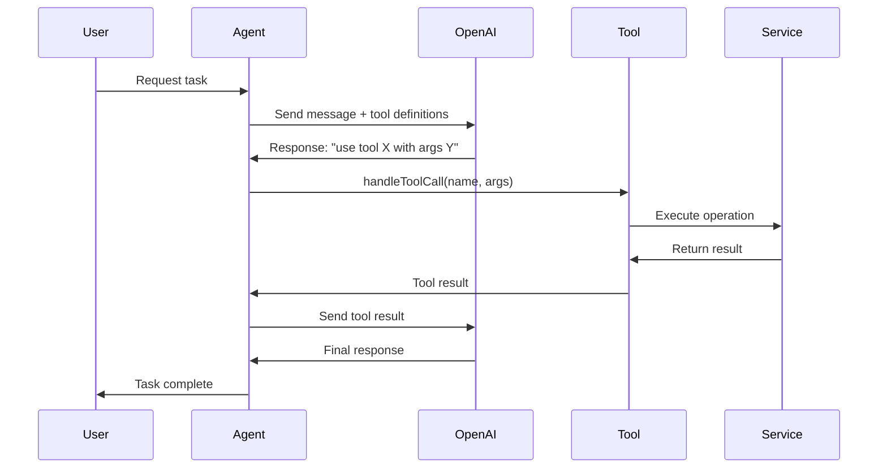

# Agent Tools Reference Guide

**Version**: 1.0.0
**Last Updated**: October 20, 2025
**Author**: Jetvision AI Development Team

---

## 📋 Table of Contents

1. [What are Agent Tools?](#what-are-agent-tools)
2. [Tool Types](#tool-types)
3. [How Agent Tools Work](#how-agent-tools-work)
4. [Tool Definition Format](#tool-definition-format)
5. [Implementing Agent Tools](#implementing-agent-tools)
6. [Available Agent Tools](#available-agent-tools)
7. [Best Practices](#best-practices)
8. [Testing Agent Tools](#testing-agent-tools)
9. [Troubleshooting](#troubleshooting)

---

## What are Agent Tools?

**Agent Tools** are functions that AI agents can autonomously invoke via OpenAI's function calling mechanism. They extend an agent's capabilities beyond text generation, allowing agents to:

- Interact with external services (APIs, databases)
- Perform complex computations
- Generate files (PDFs, reports)
- Send communications (emails)
- Query and modify data

### Key Concepts

```
┌─────────────────────────────────────────────────────┐
│                   AI Agent                          │
│                                                     │
│  1. Agent receives task from user                  │
│  2. Agent analyzes what tools are needed           │
│  3. Agent calls appropriate tool(s)                │
│  4. Tool executes and returns result               │
│  5. Agent uses result to continue task             │
└─────────────────────────────────────────────────────┘
                        │
                        ▼
┌─────────────────────────────────────────────────────┐
│                 Agent Tools                         │
│                                                     │
│  • generate_proposal_pdf()                         │
│  • search_flights()                                │
│  • send_email()                                    │
│  • analyze_proposal()                              │
│  • query_client_history()                          │
└─────────────────────────────────────────────────────┘
```

### Why Agent Tools?

Without tools, AI agents can only generate text. With tools, agents become **autonomous systems** capable of:

✅ **Taking Action** - Not just suggesting, but executing tasks
✅ **Accessing Real Data** - Query databases, APIs, external services
✅ **Maintaining Context** - Use results from one tool in subsequent operations
✅ **Complex Workflows** - Chain multiple tools together
✅ **Deterministic Operations** - Ensure consistent, reliable execution

---

## Tool Types

Jetvision uses two types of agent tools:

### 1. MCP Tools (Model Context Protocol)

**Definition**: Tools exposed by external MCP servers (microservices) that agents can call remotely.

**Characteristics**:
- Run as separate processes
- Communicate via stdio (standard input/output)
- Standardized protocol
- Reusable across multiple agents

**Examples**:
- Avinode API (flight search)
- Gmail API (email operations)
- Google Sheets API (spreadsheet operations)

**Architecture**:

```
┌────────────────────┐         ┌────────────────────┐
│   Agent Process    │         │   MCP Server       │
│                    │ stdio   │   (Node.js)        │
│  - AI Agent        │◄───────►│                    │
│  - MCP Client      │         │  - Tool Handlers   │
│  - OpenAI SDK      │         │  - External API    │
└────────────────────┘         └────────────────────┘
```

### 2. Direct Agent Tools

**Definition**: Functions implemented directly within the agent class, not requiring external services.

**Characteristics**:
- Run in the same process as the agent
- Direct function calls (no IPC)
- Faster execution
- Simpler implementation

**Examples**:
- PDF generation
- Data validation
- Internal calculations
- Database queries

**Architecture**:

```
┌────────────────────────────────┐
│      Agent Process             │
│                                │
│  ┌──────────────────────────┐ │
│  │   AI Agent Class         │ │
│  │                          │ │
│  │  • Agent Logic           │ │
│  │  • Tool Definitions      │ │
│  │  • Tool Handlers         │ │
│  └──────────────────────────┘ │
│                                │
│  ┌──────────────────────────┐ │
│  │  Direct Services         │ │
│  │                          │ │
│  │  • PDF Generator         │ │
│  │  • Database Client       │ │
│  │  • Validation Utils      │ │
│  └──────────────────────────┘ │
└────────────────────────────────┘
```

---

## How Agent Tools Work

### OpenAI Function Calling Flow



### Step-by-Step Execution

1. **Agent Initialization**
   ```typescript
   const agent = new CommunicationManagerAgent()
   await agent.initialize()
   ```

2. **Tool Registration**
   ```typescript
   protected getAgentTools() {
     return [
       {
         type: 'function',
         function: {
           name: 'generate_proposal_pdf',
           description: 'Generate PDF for proposal',
           parameters: { /* ... */ }
         }
       }
     ]
   }
   ```

3. **Agent Receives Task**
   ```typescript
   const result = await agent.execute({
     task: 'Send proposal to client',
     requestId: 'req-123',
     proposalIds: ['prop-456']
   })
   ```

4. **OpenAI Decides to Use Tool**
   ```json
   {
     "role": "assistant",
     "tool_calls": [{
       "id": "call_abc123",
       "type": "function",
       "function": {
         "name": "generate_proposal_pdf",
         "arguments": "{\"proposalId\": \"prop-456\"}"
       }
     }]
   }
   ```

5. **Agent Executes Tool**
   ```typescript
   const toolResult = await this.handleToolCall(
     'generate_proposal_pdf',
     { proposalId: 'prop-456' }
   )
   ```

6. **Tool Returns Result**
   ```json
   {
     "success": true,
     "proposalId": "prop-456",
     "size": 245678,
     "message": "PDF generated successfully"
   }
   ```

7. **Agent Continues with Result**
   - Agent receives tool result
   - Sends result back to OpenAI
   - OpenAI generates final response
   - Agent completes task

---

## Tool Definition Format

All agent tools follow OpenAI's function calling specification:

### Basic Structure

```typescript
{
  type: 'function',
  function: {
    name: string,              // Tool identifier (snake_case)
    description: string,       // What the tool does
    parameters: {              // JSON Schema for arguments
      type: 'object',
      properties: {
        // Parameter definitions
      },
      required: string[]       // Required parameter names
    }
  }
}
```

### Complete Example

```typescript
{
  type: 'function' as const,
  function: {
    name: 'generate_proposal_pdf',
    description: 'Generate a PDF document for a flight proposal with options for watermarks and internal/client pricing views',
    parameters: {
      type: 'object',
      properties: {
        proposalId: {
          type: 'string',
          description: 'The unique identifier of the proposal to generate PDF for',
        },
        watermark: {
          type: 'boolean',
          description: 'Whether to add a DRAFT watermark to the PDF',
          default: false,
        },
        internalView: {
          type: 'boolean',
          description: 'Whether to show internal pricing breakdown (base price + margin) for ISO agents',
          default: false,
        },
        saveToStorage: {
          type: 'boolean',
          description: 'Whether to save the generated PDF to Supabase Storage for archival',
          default: true,
        },
      },
      required: ['proposalId'],
    },
  },
}
```

### Parameter Types

| Type | JSON Schema | Example |
|------|-------------|---------|
| String | `{ type: 'string' }` | `"Hello"` |
| Number | `{ type: 'number' }` | `42` |
| Boolean | `{ type: 'boolean' }` | `true` |
| Array | `{ type: 'array', items: { type: 'string' } }` | `["a", "b"]` |
| Object | `{ type: 'object', properties: {...} }` | `{ key: "value" }` |
| Enum | `{ type: 'string', enum: ['a', 'b'] }` | `"a"` |

---

## Implementing Agent Tools

### Method 1: Direct Agent Tool

**Use when**: Tool is simple, agent-specific, no external service needed

#### Step 1: Define Tool in Agent Class

```typescript
// lib/agents/communication-manager-agent.ts
export class CommunicationManagerAgent extends BaseAgent {
  protected getAgentTools() {
    return [
      {
        type: 'function' as const,
        function: {
          name: 'generate_proposal_pdf',
          description: 'Generate a PDF document for a proposal',
          parameters: {
            type: 'object',
            properties: {
              proposalId: { type: 'string' },
              watermark: { type: 'boolean', default: false },
            },
            required: ['proposalId'],
          },
        },
      },
    ]
  }
}
```

#### Step 2: Implement Tool Handler

```typescript
protected async handleToolCall(toolName: string, args: any) {
  switch (toolName) {
    case 'generate_proposal_pdf':
      return this.generatePDF(args)
    default:
      throw new Error(`Unknown tool: ${toolName}`)
  }
}

private async generatePDF(args: {
  proposalId: string
  watermark?: boolean
}) {
  const pdfBuffer = await generateProposalPDF(args.proposalId, {
    watermark: args.watermark || false,
  })

  return {
    success: true,
    proposalId: args.proposalId,
    size: pdfBuffer.length,
  }
}
```

#### Step 3: Use Tool in Agent Execution

The OpenAI Assistant will automatically call the tool when needed:

```typescript
const agent = new CommunicationManagerAgent()
const result = await agent.execute({
  task: 'Generate PDF for proposal prop-123',
  proposalId: 'prop-123',
})
```

### Method 2: MCP Tool

**Use when**: Tool needs to interact with external API, reusable across agents

#### Step 1: Create MCP Server

```typescript
// mcp-servers/avinode/src/index.ts
import { Server } from '@modelcontextprotocol/sdk/server/index.js'
import { ListToolsRequestSchema, CallToolRequestSchema } from '@modelcontextprotocol/sdk/types.js'

const server = new Server(
  { name: 'avinode-mcp-server', version: '1.0.0' },
  { capabilities: { tools: {} } }
)

// Register tools
server.setRequestHandler(ListToolsRequestSchema, async () => {
  return {
    tools: [
      {
        name: 'search_flights',
        description: 'Search for available flights via Avinode API',
        inputSchema: {
          type: 'object',
          properties: {
            departure: { type: 'string' },
            arrival: { type: 'string' },
            date: { type: 'string' },
            passengers: { type: 'number' },
          },
          required: ['departure', 'arrival', 'date', 'passengers'],
        },
      },
    ],
  }
})

// Handle tool calls
server.setRequestHandler(CallToolRequestSchema, async (request) => {
  if (request.params.name === 'search_flights') {
    const results = await avinodeAPI.searchFlights(request.params.arguments)
    return { content: [{ type: 'text', text: JSON.stringify(results) }] }
  }
})
```

#### Step 2: Connect Agent to MCP Server

```typescript
export class FlightSearchAgent extends BaseAgent {
  async initialize() {
    await super.initialize()

    // Connect to Avinode MCP server
    await mcpClient.connect(
      'avinode',
      'node',
      ['mcp-servers/avinode/dist/index.js']
    )
  }

  async searchFlights(criteria: FlightSearchCriteria) {
    // Call MCP tool
    const results = await this.callMCPTool('avinode', 'search_flights', {
      departure: criteria.departure,
      arrival: criteria.arrival,
      date: criteria.date,
      passengers: criteria.passengers,
    })

    return results
  }
}
```

---

## Available Agent Tools

### PDF Generation Tools

#### `generate_proposal_pdf`

**Agent**: Communication Manager
**Type**: Direct Agent Tool
**Purpose**: Generate professional PDF documents for flight proposals

**Parameters**:
```typescript
{
  proposalId: string        // Required: Proposal ID
  watermark?: boolean       // Optional: Add DRAFT watermark
  internalView?: boolean    // Optional: Show internal pricing
  saveToStorage?: boolean   // Optional: Save to Supabase Storage
}
```

**Returns**:
```typescript
{
  success: boolean
  proposalId: string
  size: number
  message: string
}
```

**Example**:
```typescript
const result = await agent.handleToolCall('generate_proposal_pdf', {
  proposalId: 'prop-123',
  watermark: false,
  internalView: false,
})
```

**Documentation**: `docs/subagents/technology-stack/pdf-generation/README.md`

---

#### `send_email_with_pdf`

**Agent**: Communication Manager
**Type**: Direct Agent Tool
**Purpose**: Send proposal emails with PDF attachments

**Parameters**:
```typescript
{
  requestId: string         // Required: Request ID
  proposalIds: string[]     // Required: Proposals to attach
  watermark?: boolean       // Optional: Add watermark to PDFs
}
```

**Returns**:
```typescript
{
  gmail_message_id: string
  pdf_attachments: number
}
```

---

### Avinode MCP Tools

#### `search_flights`

**Agent**: Flight Search Agent
**Type**: MCP Tool
**Purpose**: Search available flights via Avinode API

**Parameters**:
```typescript
{
  departure: string         // ICAO airport code
  arrival: string           // ICAO airport code
  date: string             // ISO 8601 date
  passengers: number        // Passenger count
  aircraftType?: string    // Optional: Filter by type
}
```

**Documentation**: `docs/subagents/technology-stack/avinode/README.md`

---

#### `create_rfp`

**Agent**: Flight Search Agent
**Type**: MCP Tool
**Purpose**: Create Request for Proposal on Avinode

**Parameters**:
```typescript
{
  departure: string
  arrival: string
  date: string
  passengers: number
  requirements: object
}
```

---

### Gmail MCP Tools

#### `send_email`

**Agent**: Communication Manager
**Type**: MCP Tool
**Purpose**: Send emails via Gmail API

**Parameters**:
```typescript
{
  to: string
  from: string
  subject: string
  body_html: string
  attachments?: Array<{
    filename: string
    content: string      // Base64
    contentType: string
  }>
}
```

---

#### `search_emails`

**Agent**: Client Data Manager
**Type**: MCP Tool
**Purpose**: Search email history for client communications

---

### Google Sheets MCP Tools

#### `read_sheet`

**Agent**: Client Data Manager
**Type**: MCP Tool
**Purpose**: Read data from Google Sheets

---

#### `write_sheet`

**Agent**: Proposal Analysis Agent
**Type**: MCP Tool
**Purpose**: Write proposal data to Google Sheets for tracking

---

## Best Practices

### 1. Tool Design

✅ **DO**:
- Keep tools focused on single responsibility
- Provide clear, descriptive names (use `snake_case`)
- Write comprehensive descriptions
- Include all parameters with descriptions
- Set sensible defaults for optional parameters
- Return structured, consistent results

❌ **DON'T**:
- Create overly complex tools with too many parameters
- Use vague names like `do_thing` or `process`
- Skip parameter descriptions
- Return inconsistent data structures
- Mix multiple unrelated operations in one tool

### 2. Error Handling

```typescript
private async generatePDF(args: any) {
  try {
    // Validate arguments
    if (!args.proposalId) {
      throw new Error('proposalId is required')
    }

    // Execute tool
    const result = await generateProposalPDF(args.proposalId, args)

    // Return success
    return {
      success: true,
      data: result,
    }
  } catch (error) {
    // Log error
    console.error('PDF generation failed:', error)

    // Return error (don't throw - let agent handle)
    return {
      success: false,
      error: error.message,
    }
  }
}
```

### 3. Parameter Validation

```typescript
private async generatePDF(args: {
  proposalId: string
  watermark?: boolean
  internalView?: boolean
}) {
  // Type validation (TypeScript helps here)
  if (typeof args.proposalId !== 'string') {
    throw new Error('proposalId must be a string')
  }

  // Business logic validation
  if (args.proposalId.length < 5) {
    throw new Error('Invalid proposalId format')
  }

  // Proceed with execution
  // ...
}
```

### 4. Tool Documentation

Every tool should have:
- Clear purpose statement
- Parameter documentation
- Return value documentation
- Usage examples
- Error scenarios

### 5. Testing Tools

```typescript
// __tests__/agents/tools/pdf-generation.test.ts
describe('PDF Generation Tool', () => {
  it('should generate PDF successfully', async () => {
    const agent = new CommunicationManagerAgent()
    const result = await agent.handleToolCall('generate_proposal_pdf', {
      proposalId: 'test-123',
    })

    expect(result.success).toBe(true)
    expect(result.size).toBeGreaterThan(0)
  })

  it('should handle missing proposalId', async () => {
    const agent = new CommunicationManagerAgent()
    const result = await agent.handleToolCall('generate_proposal_pdf', {})

    expect(result.success).toBe(false)
    expect(result.error).toContain('proposalId')
  })
})
```

---

## Testing Agent Tools

### Unit Testing

Test tools in isolation:

```typescript
describe('generate_proposal_pdf tool', () => {
  let agent: CommunicationManagerAgent

  beforeEach(() => {
    agent = new CommunicationManagerAgent()
  })

  it('generates PDF with default options', async () => {
    const result = await agent.handleToolCall('generate_proposal_pdf', {
      proposalId: 'prop-123',
    })

    expect(result).toMatchObject({
      success: true,
      proposalId: 'prop-123',
      size: expect.any(Number),
    })
  })

  it('applies watermark when requested', async () => {
    const result = await agent.handleToolCall('generate_proposal_pdf', {
      proposalId: 'prop-123',
      watermark: true,
    })

    // Verify watermark was applied (check PDF content or metadata)
    expect(result.success).toBe(true)
  })

  it('handles invalid proposal ID', async () => {
    const result = await agent.handleToolCall('generate_proposal_pdf', {
      proposalId: 'invalid',
    })

    expect(result.success).toBe(false)
    expect(result.error).toBeDefined()
  })
})
```

### Integration Testing

Test tools with OpenAI:

```typescript
describe('Agent with PDF tool integration', () => {
  it('agent automatically uses PDF tool when asked', async () => {
    const agent = new CommunicationManagerAgent()

    const result = await agent.execute({
      task: 'Generate a PDF for proposal prop-123 with a watermark',
      proposalId: 'prop-123',
    })

    // Verify agent used the tool correctly
    expect(result.toolsUsed).toContain('generate_proposal_pdf')
    expect(result.success).toBe(true)
  })
})
```

---

## Troubleshooting

### Tool Not Being Called

**Problem**: Agent doesn't use your tool

**Solutions**:
1. Check tool definition is returned in `getAgentTools()`
2. Verify tool description is clear and relevant to task
3. Ensure tool name follows `snake_case` convention
4. Check OpenAI Assistant has tools enabled
5. Review assistant instructions to encourage tool use

### Tool Arguments Invalid

**Problem**: OpenAI calls tool with wrong arguments

**Solutions**:
1. Review parameter descriptions - make them very specific
2. Add examples in description
3. Use enums to restrict values
4. Set appropriate `required` fields
5. Provide sensible defaults

### Tool Execution Fails

**Problem**: Tool handler throws error

**Solutions**:
1. Add try-catch in handler
2. Validate arguments before processing
3. Return error object instead of throwing
4. Log errors for debugging
5. Implement retries for external API calls

### MCP Server Connection Issues

**Problem**: Can't connect to MCP server

**Solutions**:
1. Verify MCP server is built: `npm run build`
2. Check server path in `mcpClient.connect()`
3. Ensure server exports correctly
4. Review server logs for startup errors
5. Test server independently before agent integration

---

## Summary

**Agent Tools** are the foundation of autonomous AI agents in Jetvision. They transform agents from text generators into action-taking systems capable of:

- Generating PDFs
- Searching flights
- Sending emails
- Querying databases
- Analyzing data
- Orchestrating complex workflows

By following this guide, you can:
1. Understand what agent tools are and why they matter
2. Implement new agent tools correctly
3. Test and debug tools effectively
4. Maintain tool quality and documentation

**Key Takeaways**:
- Tools extend agent capabilities beyond text
- Two types: MCP tools (external) and Direct tools (in-process)
- Follow OpenAI function calling specification
- Test thoroughly and document comprehensively
- Design for single responsibility and clarity

---

## Related Documentation

- [IMPLEMENTATION_PLAN.md](../IMPLEMENTATION_PLAN.md) - Complete implementation guide
- [PDF Generation Tool](./subagents/technology-stack/pdf-generation/README.md)
- [Avinode MCP Server](./subagents/technology-stack/avinode/README.md)
- [BullMQ Queue System](./subagents/technology-stack/bullmq/README.md)

---

**Questions or Issues?**

Contact the development team or open an issue in the project repository.
