# Jetvision AI Assistant - System Architecture

## Comprehensive System Architecture Diagram

```mermaid
flowchart TB
    %% User Layer
    User[("👤 ISO Agent (User)")]

    %% Frontend Layer
    subgraph Frontend["🖥️ Frontend Application"]
        Browser["Next.js 14 App<br/>(React 18 + TypeScript)"]
        UI["shadcn/ui Components<br/>Tailwind CSS"]
    end

    %% Authentication Layer
    subgraph Auth["🔐 Authentication"]
        Clerk["Clerk Auth Service<br/>(JWT Tokens)"]
        ClerkWebhook["Clerk Webhook<br/>(User Sync)"]
    end

    %% API Layer
    subgraph API["⚡ Next.js API Routes"]
        APIRoutes["Protected API Endpoints<br/>(Clerk Middleware)"]
        Webhooks["Webhook Handlers<br/>(Avinode, Gmail)"]
    end

    %% Core Services
    subgraph CoreServices["🧠 Core Services"]
        direction TB

        subgraph Agents["AI Agent System"]
            Orchestrator["RFP Orchestrator<br/>(Request Analysis & Routing)"]
            ClientData["Client Data Manager<br/>(Profile & Preferences)"]
            FlightSearch["Flight Search Agent<br/>(Aircraft Search & RFP)"]
            ProposalAnalysis["Proposal Analysis<br/>(Multi-factor Scoring)"]
            CommManager["Communication Manager<br/>(Email Generation)"]
            ErrorMonitor["Error Monitor<br/>(Logging & Recovery)"]
        end

        OpenAI["OpenAI GPT-5<br/>(Assistants API)"]
    end

    %% MCP Servers Layer
    subgraph MCP["🔌 MCP Servers (External Integration)"]
        direction LR
        AvinodeMCP["Avinode MCP Server<br/>• search_flights<br/>• create_rfp<br/>• get_quotes"]
        GmailMCP["Gmail MCP Server<br/>• send_email<br/>• get_threads"]
        SheetsMCP["Google Sheets MCP<br/>• sync_clients<br/>• get_client"]
    end

    %% External APIs
    subgraph External["🌐 External APIs"]
        direction LR
        AvinodeAPI["Avinode API<br/>(Flight Operators)"]
        GmailAPI["Gmail API<br/>(Email Service)"]
        SheetsAPI["Google Sheets API<br/>(Client Database)"]
    end

    %% Data Storage
    subgraph Storage["💾 Data Storage"]
        direction TB
        Supabase["Supabase PostgreSQL<br/>(Primary Database)"]
        SupabaseRLS["Row Level Security<br/>(Clerk User ID Isolation)"]
        SupabaseRT["Supabase Realtime<br/>(Live Updates)"]
        Redis["Redis<br/>(Job Queue & Cache)"]
    end

    %% Background Processing
    subgraph Background["⚙️ Background Processing"]
        BullMQ["BullMQ<br/>(Job Queue Manager)"]
        Jobs["Background Jobs<br/>• Agent Tasks<br/>• Email Delivery<br/>• Data Sync"]
    end

    %% Monitoring
    subgraph Monitoring["📊 Monitoring & Logging"]
        Sentry["Sentry<br/>(Error Tracking)"]
        Logs["Application Logs<br/>(System Events)"]
    end

    %% User Interactions
    User -->|"1. Sign In/Sign Up"| Clerk
    User -->|"2. Browse & Interact"| Browser

    %% Frontend to Auth
    Browser -->|"JWT Token"| Clerk
    Clerk -->|"Auth Status"| Browser
    Clerk -->|"User Created/Updated"| ClerkWebhook

    %% Frontend to API
    Browser -->|"3. Create Request<br/>(Authenticated)"| APIRoutes
    Browser <-->|"8. Real-time Updates<br/>(WebSocket)"| SupabaseRT

    %% Auth to Database
    ClerkWebhook -->|"Sync User Data"| Supabase
    APIRoutes -->|"Set Clerk Context"| SupabaseRLS

    %% API to Services
    APIRoutes -->|"Store Request"| Supabase
    APIRoutes -->|"4. Trigger Workflow"| Orchestrator
    APIRoutes -->|"Queue Job"| BullMQ

    %% Agent Orchestration Flow
    Orchestrator -->|"Analyze Priority"| OpenAI
    Orchestrator -->|"Route to Agents"| ClientData

    ClientData -->|"Fetch Profile"| SheetsMCP
    ClientData -->|"Store Profile"| Supabase
    ClientData -->|"5. Next: Search"| FlightSearch

    FlightSearch -->|"Search Flights"| AvinodeMCP
    FlightSearch -->|"Create RFP"| AvinodeMCP
    FlightSearch -->|"Store Search"| Supabase

    %% External API Webhooks
    Webhooks -->|"6. Quote Received"| Supabase
    Webhooks -->|"Trigger Analysis"| ProposalAnalysis

    ProposalAnalysis -->|"Score Options"| OpenAI
    ProposalAnalysis -->|"Store Proposals"| Supabase
    ProposalAnalysis -->|"7. Send to Client"| CommManager

    CommManager -->|"Generate Email"| OpenAI
    CommManager -->|"Send Email"| GmailMCP
    CommManager -->|"Log Communication"| Supabase

    %% MCP to External APIs
    AvinodeMCP <-->|"Flight Data"| AvinodeAPI
    GmailMCP <-->|"Email Operations"| GmailAPI
    SheetsMCP <-->|"Client Data"| SheetsAPI

    %% Error Handling
    Orchestrator -.->|"Log Errors"| ErrorMonitor
    ClientData -.->|"Log Errors"| ErrorMonitor
    FlightSearch -.->|"Log Errors"| ErrorMonitor
    ProposalAnalysis -.->|"Log Errors"| ErrorMonitor
    CommManager -.->|"Log Errors"| ErrorMonitor

    ErrorMonitor -->|"Store Errors"| Supabase
    ErrorMonitor -->|"Critical Alerts"| Sentry

    %% Background Processing
    BullMQ <-->|"Job Queue"| Redis
    BullMQ -->|"Execute Agent Tasks"| Agents

    %% Database Real-time
    Supabase -->|"Change Events"| SupabaseRT
    SupabaseRLS -.->|"Enforce RLS"| Supabase

    %% Monitoring
    APIRoutes -.->|"Log Events"| Logs
    Agents -.->|"Log Events"| Logs

    %% Styling
    classDef userClass fill:#4A90E2,stroke:#2E5C8A,stroke-width:3px,color:#fff
    classDef frontendClass fill:#50C878,stroke:#2D7A4A,stroke-width:2px,color:#fff
    classDef authClass fill:#FF6B6B,stroke:#C44545,stroke-width:2px,color:#fff
    classDef apiClass fill:#FFD93D,stroke:#C4A72E,stroke-width:2px,color:#000
    classDef agentClass fill:#9B59B6,stroke:#6C3A80,stroke-width:2px,color:#fff
    classDef mcpClass fill:#3498DB,stroke:#2472A4,stroke-width:2px,color:#fff
    classDef externalClass fill:#95A5A6,stroke:#6B7677,stroke-width:2px,color:#fff
    classDef storageClass fill:#E74C3C,stroke:#A83428,stroke-width:2px,color:#fff
    classDef monitorClass fill:#F39C12,stroke:#B87B0E,stroke-width:2px,color:#fff

    class User userClass
    class Browser,UI frontendClass
    class Clerk,ClerkWebhook authClass
    class APIRoutes,Webhooks apiClass
    class Orchestrator,ClientData,FlightSearch,ProposalAnalysis,CommManager,ErrorMonitor,OpenAI agentClass
    class AvinodeMCP,GmailMCP,SheetsMCP mcpClass
    class AvinodeAPI,GmailAPI,SheetsAPI externalClass
    class Supabase,SupabaseRLS,SupabaseRT,Redis storageClass
    class Sentry,Logs monitorClass
```

## Data Flow Sequence: RFP Request to Proposal

## Authentication Flow Detail

```mermaid
flowchart LR
    User[("👤 User")]

    subgraph AuthFlow["Authentication Flow"]
        direction TB
        SignIn["Sign In Page"]
        ClerkAuth["Clerk Authentication"]
        JWT["JWT Token Generation"]
        Webhook["Clerk Webhook"]
    end

    subgraph AppAccess["Application Access"]
        direction TB
        Middleware["Clerk Middleware<br/>(Route Protection)"]
        APICall["API Request"]
        ContextSet["Set Clerk Context<br/>(app.clerk_user_id)"]
    end

    subgraph Database["Database Layer"]
        direction TB
        UsersTable["users Table<br/>(Synced from Clerk)"]
        RLS["Row Level Security<br/>(Filter by Clerk User ID)"]
        UserData["User's Data<br/>(Requests, Clients, etc.)"]
    end

    User -->|"1. Sign In"| SignIn
    SignIn -->|"2. Authenticate"| ClerkAuth
    ClerkAuth -->|"3. Generate"| JWT
    ClerkAuth -->|"4. User Event"| Webhook
    Webhook -->|"5. Sync User"| UsersTable

    User -->|"6. Access App"| Middleware
    Middleware -->|"7. Validate JWT"| ClerkAuth
    ClerkAuth -->|"8. Valid Token"| APICall
    APICall -->|"9. Set Context"| ContextSet
    ContextSet -->|"10. Query with RLS"| RLS
    RLS -->|"11. Filter Data"| UserData
    UserData -->|"12. Return Only<br/>User's Data"| User

    style User fill:#4A90E2,stroke:#2E5C8A,stroke-width:3px,color:#fff
    style ClerkAuth fill:#FF6B6B,stroke:#C44545,stroke-width:2px,color:#fff
    style RLS fill:#E74C3C,stroke:#A83428,stroke-width:2px,color:#fff
    style UserData fill:#95A5A6,stroke:#6B7677,stroke-width:2px,color:#000
```

## Technology Stack Overview

## Key Features & Data Flow

### 1. Multi-Tenant Security
- **Clerk Authentication** provides JWT-based user authentication
- **Row Level Security (RLS)** in Supabase filters all data by `clerk_user_id`
- Each ISO agent can only access their own clients, requests, and proposals

### 2. AI-Driven RFP Workflow
1. **RFP Orchestrator** analyzes incoming requests (priority, complexity)
2. **Client Data Manager** fetches customer profiles and preferences
3. **Flight Search Agent** searches aircraft and distributes RFPs to operators
4. **Proposal Analysis Agent** scores and ranks received quotes
5. **Communication Manager** generates and sends proposal emails
6. **Error Monitor** handles failures and escalations

### 3. External Service Integration via MCP
- **MCP Servers** act as standardized bridges to external APIs
- Agents call MCP tools via OpenAI function calling
- Clean separation between business logic and external integrations

### 4. Real-time Updates
- **Supabase Realtime** provides WebSocket-based live updates
- Users see quote arrivals and workflow progress in real-time
- No polling required - push-based architecture

### 5. Background Processing
- **BullMQ + Redis** handle asynchronous agent tasks
- Long-running AI operations don't block API responses
- Retry logic for transient failures

## Deployment Architecture

```mermaid
flowchart TB
    subgraph Production["🌐 Production Environment"]
        direction TB

        subgraph Edge["Vercel Edge Network"]
            CDN["CDN<br/>(Static Assets)"]
            EdgeFunc["Edge Functions<br/>(Middleware)"]
        end

        subgraph Compute["Serverless Compute"]
            Lambda["Vercel Serverless<br/>(API Routes)"]
        end

        subgraph Database["Database Services"]
            SupabaseProd["Supabase<br/>(PostgreSQL)"]
            RedisProd["Redis Cloud<br/>(Upstash)"]
        end

        subgraph External["External Services"]
            ClerkProd["Clerk"]
            OpenAIProd["OpenAI API"]
            MCPServers["MCP Servers<br/>(Containerized)"]
        end

        subgraph Monitoring["Monitoring"]
            SentryProd["Sentry"]
            VercelAnalytics["Vercel Analytics"]
        end
    end

    Users[("👥 Users")]

    Users -->|HTTPS| CDN
    Users -->|HTTPS| EdgeFunc
    EdgeFunc --> Lambda
    Lambda --> ClerkProd
    Lambda --> SupabaseProd
    Lambda --> RedisProd
    Lambda --> OpenAIProd
    Lambda --> MCPServers
    Lambda -.->|Errors| SentryProd
    Lambda -.->|Metrics| VercelAnalytics

    style Users fill:#4A90E2,stroke:#2E5C8A,stroke-width:3px,color:#fff
    style Lambda fill:#000000,stroke:#fff,stroke-width:2px,color:#fff
    style SupabaseProd fill:#3ECF8E,stroke:#2DA56E,stroke-width:2px,color:#fff
```

---

## Architecture Principles

1. **Security First**: Authentication at every layer, RLS enforcing data isolation
2. **Scalability**: Serverless architecture, background job processing
3. **Reliability**: Error monitoring, automatic retry, graceful degradation
4. **Maintainability**: Clean separation of concerns via MCP, typed APIs
5. **Real-time**: Live updates without polling, instant user feedback
6. **AI-Native**: LLM agents for intelligent automation, not just rule-based logic

---

**Document Version**: 1.0
**Last Updated**: October 20, 2025
**Maintained By**: Jetvision Development Team
