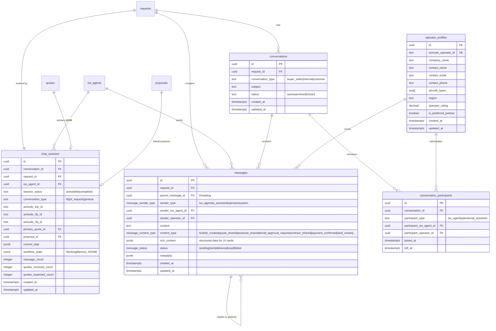

# Database Relational Schema Diagram

Complete entity-relationship diagram for the Jetvision system including all core tables, onboarding system, the 3-party chat system, Avinode integration, and the contract/payment lifecycle.

## Core Business Tables

## ISO Agent Onboarding System

## Chat & Messaging System

## Avinode Integration & Webhooks

