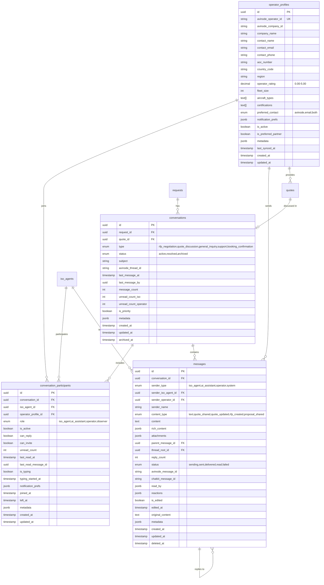
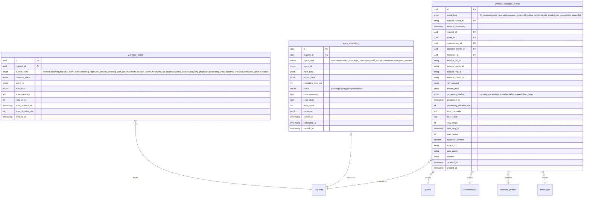
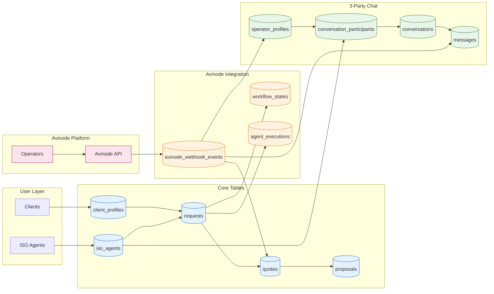

# Jetvision Database Schema Diagram

> **Supabase PostgreSQL** - Multi-Tenant Architecture with 3-Party Chat System

## Mermaid Entity Relationship Diagrams

### Core Tables ERD

```mermaid
erDiagram
    iso_agents {
        uuid id PK
        string clerk_user_id UK
        string email UK
        string full_name
        enum role "iso_agent,admin,operator"
        enum margin_type "percentage,fixed"
        decimal margin_value
        boolean is_active
        jsonb metadata
        jsonb notification_prefs
        timestamp last_seen_at
        enum online_status "online,away,busy,offline"
        timestamp created_at
        timestamp updated_at
    }

    client_profiles {
        uuid id PK
        uuid iso_agent_id FK
        string company_name
        string contact_name
        string email
        string phone
        jsonb preferences
        text notes
        boolean is_active
        timestamp created_at
        timestamp updated_at
    }

    requests {
        uuid id PK
        uuid iso_agent_id FK
        uuid client_profile_id FK
        string departure_airport
        string arrival_airport
        date departure_date
        date return_date
        int passengers
        string aircraft_type
        decimal budget
        text special_requirements
        enum status "11 states"
        jsonb metadata
        timestamp created_at
        timestamp updated_at
    }

    quotes {
        uuid id PK
        uuid request_id FK
        uuid operator_profile_id FK
        string operator_id
        string operator_name
        decimal base_price
        decimal fuel_surcharge
        decimal taxes
        decimal fees
        decimal total_price
        string aircraft_type
        string aircraft_tail_number
        jsonb aircraft_details
        boolean availability_confirmed
        timestamp valid_until
        int score
        int ranking
        text analysis_notes
        enum status
        jsonb metadata
        timestamp created_at
        timestamp updated_at
    }

    proposals {
        uuid id PK
        uuid request_id FK
        uuid iso_agent_id FK
        uuid quote_id FK
        uuid client_profile_id FK
        string file_name
        string file_url
        string file_path
        int file_size_bytes
        string mime_type
        string proposal_number UK
        string title
        text description
        decimal total_amount
        decimal margin_applied
        decimal final_amount
        enum status
        timestamp generated_at
        timestamp sent_at
        timestamp viewed_at
        timestamp accepted_at
        timestamp rejected_at
        timestamp expired_at
        string sent_to_email
        string sent_to_name
        string email_subject
        text email_body
        string email_message_id
        int view_count
        int download_count
        timestamp last_viewed_at
        timestamp last_downloaded_at
        jsonb metadata
        timestamp created_at
        timestamp updated_at
    }

    iso_agents ||--o{ client_profiles : "owns"
    iso_agents ||--o{ requests : "creates"
    iso_agents ||--o{ proposals : "generates"
    client_profiles ||--o{ requests : "makes"
    requests ||--o{ quotes : "receives"
    requests ||--o{ proposals : "produces"
    quotes ||--o{ proposals : "leads to"
```



### 3-Party Chat System ERD



### Avinode Integration ERD



### Complete System Data Flow



---

## Detailed ASCII Schema Reference

The following ASCII diagrams provide additional detail for each table's columns and relationships.

```text
┌─────────────────────────────────────────────────────────────────────────────┐
│                          JETVISION DATABASE SCHEMA                          │
│                     (Supabase PostgreSQL - Multi-Tenant)                    │
│                       Phase 2: 3-Party Chat System                          │
└─────────────────────────────────────────────────────────────────────────────┘

═══════════════════════════════════════════════════════════════════════════════
                           CORE USER & CLIENT TABLES
═══════════════════════════════════════════════════════════════════════════════

┌────────────────────────┐
│     iso_agents         │  ◄─── Synced from Clerk Authentication
├────────────────────────┤
│ • id (PK)              │
│ • clerk_user_id (UQ)   │  📧 Sales Reps & Admin Staff
│ • email (UQ)           │
│ • full_name            │  🔑 Roles: iso_agent, admin, operator
│ • role                 │
│ • margin_type          │  💰 Margin Settings: percentage/fixed
│ • margin_value         │
│ • is_active            │
│ • metadata (JSONB)     │
│ • notification_prefs   │  🔔 NEW: Chat notification settings
│ • last_seen_at         │  👁️ NEW: Presence tracking
│ • online_status        │  🟢 NEW: online/away/busy/offline
│ • created_at           │
│ • updated_at           │
└────────────────────────┘
         │ 1
         │
         │ owns
         │
         ▼ many
┌────────────────────────┐
│  client_profiles       │
├────────────────────────┤
│ • id (PK)              │
│ • iso_agent_id (FK)    │  🏢 Customer Companies
│ • company_name         │
│ • contact_name         │  👤 Contact Information
│ • email                │
│ • phone                │  ✈️ Flight Preferences (JSONB):
│ • preferences (JSONB)  │     - preferred_aircraft
│ • notes                │     - dietary_restrictions
│ • is_active            │     - preferred_amenities
│ • created_at           │     - budget_range
│ • updated_at           │
└────────────────────────┘
         │ 1
         │
         │ makes
         │
         ▼ many
┌────────────────────────┐
│      requests          │
├────────────────────────┤
│ • id (PK)              │
│ • iso_agent_id (FK)    │  🛫 Flight RFQ/Booking Requests
│ • client_profile_id    │
│ • departure_airport    │  📍 KTEB → KLAX
│ • arrival_airport      │  📅 Departure: 2025-11-20
│ • departure_date       │  📅 Return: 2025-11-23
│ • return_date          │
│ • passengers           │  👥 8 passengers
│ • aircraft_type        │  ✈️ Gulfstream G650
│ • budget               │  💵 $120,000
│ • special_requirements │
│ • status               │  📊 Status: 11 states
│ • metadata (JSONB)     │     (draft → completed)
│ • created_at           │
│ • updated_at           │
└────────────────────────┘
         │ 1                      │ 1
         │                        │
         │ receives               │ tracks
         │                        │
         ▼ many                   ▼ many
┌────────────────────────┐   ┌────────────────────────┐
│       quotes           │   │  workflow_states       │
├────────────────────────┤   ├────────────────────────┤
│ • id (PK)              │   │ • id (PK)              │
│ • request_id (FK)      │   │ • request_id (FK)      │
│ • operator_id          │   │ • current_state        │
│ • operator_name        │   │ • previous_state       │
│ • base_price           │   │ • agent_id             │
│ • fuel_surcharge       │   │ • metadata (JSONB)     │
│ • taxes                │   │ • error_message        │
│ • fees                 │   │ • retry_count          │
│ • total_price          │   │ • state_entered_at     │
│ • aircraft_type        │   │ • state_duration_ms    │
│ • aircraft_tail_number │   │ • created_at           │
│ • aircraft_details     │   └────────────────────────┘
│ • availability_confirmed│        🔄 State Machine
│ • valid_until          │        11 workflow states
│ • score (0-100)        │
│ • ranking              │   ┌────────────────────────┐
│ • analysis_notes       │   │  agent_executions      │
│ • status               │   ├────────────────────────┤
│ • metadata (JSONB)     │   │ • id (PK)              │
│ • created_at           │   │ • request_id (FK)      │
│ • updated_at           │   │ • agent_type           │
└────────────────────────┘   │ • agent_id             │
    💰 Operator Quotes        │ • input_data (JSONB)   │
    📊 AI Scoring & Ranking   │ • output_data (JSONB)  │
                              │ • execution_time_ms    │
         │ 1                  │ • status               │
         │                    │ • error_message        │
         │ generates          │ • error_stack          │
         │                    │ • retry_count          │
         ▼ many               │ • metadata (JSONB)     │
┌────────────────────────┐   │ • started_at           │
│      proposals         │   │ • completed_at         │
├────────────────────────┤   │ • created_at           │
│ • id (PK)              │   └────────────────────────┘
│ • request_id (FK)      │        🤖 Agent Logs
│ • iso_agent_id (FK)    │        6 agent types:
│ • quote_id (FK)        │        - orchestrator
│ • client_profile_id    │        - client_data
│ • file_name            │        - flight_search
│ • file_url             │        - proposal_analysis
│ • file_path            │        - communication
│ • file_size_bytes      │        - error_monitor
│ • mime_type            │
│ • proposal_number (UQ) │
│ • title                │
│ • description          │
│ • total_amount         │  💵 Original: $112,000
│ • margin_applied       │  💰 Margin: +$16,800
│ • final_amount         │  💵 Final: $128,800
│ • status               │
│ • generated_at         │  📧 Email Tracking:
│ • sent_at              │     - sent_to_email
│ • viewed_at            │     - email_subject
│ • accepted_at          │     - email_body
│ • rejected_at          │     - email_message_id
│ • expired_at           │
│ • sent_to_email        │  📊 Analytics:
│ • sent_to_name         │     - view_count
│ • email_subject        │     - download_count
│ • email_body           │     - last_viewed_at
│ • email_message_id     │     - last_downloaded_at
│ • view_count           │
│ • download_count       │  📄 Auto-numbered:
│ • last_viewed_at       │     PROP-2025-001
│ • last_downloaded_at   │     PROP-2025-002
│ • metadata (JSONB)     │     ...
│ • created_at           │
│ • updated_at           │
└────────────────────────┘
    📄 PDF Proposals
    🔗 Linked to Storage


═══════════════════════════════════════════════════════════════════════════════
                         3-PARTY CHAT SYSTEM TABLES
                   (ISO Agent ↔ AI Assistant ↔ Operator)
═══════════════════════════════════════════════════════════════════════════════

┌────────────────────────┐
│   operator_profiles    │  ◄─── Synced from Avinode
├────────────────────────┤
│ • id (PK)              │
│ • avinode_operator_id  │  🏢 Flight Operators
│ • avinode_company_id   │
│ • company_name         │  ✈️ Fleet & Certifications
│ • contact_name         │
│ • contact_email        │  📞 Contact Details
│ • contact_phone        │
│ • aoc_number           │  📜 Air Operator Certificate
│ • country_code         │
│ • region               │  🌍 Geographic Region
│ • operator_rating      │  ⭐ Rating (0.00-5.00)
│ • fleet_size           │
│ • aircraft_types[]     │  ✈️ Aircraft Types Array
│ • certifications[]     │  📋 IS-BAO, Argus, Wyvern
│ • preferred_contact    │  📱 avinode/email/both
│ • notification_prefs   │
│ • is_active            │
│ • is_preferred_partner │  ⭐ Preferred Status
│ • metadata (JSONB)     │
│ • last_synced_at       │
│ • created_at           │
│ • updated_at           │
└────────────────────────┘
         │ 1
         │
         │ participates in
         │
         ▼ many
┌────────────────────────┐
│    conversations       │  ◄─── Multi-party Threads
├────────────────────────┤
│ • id (PK)              │
│ • request_id (FK)      │  🔗 Links to Request
│ • quote_id (FK)        │  🔗 Links to Quote (optional)
│ • type                 │  📋 rfp_negotiation, quote_discussion
│ • status               │     general_inquiry, support,
│                        │     booking_confirmation
│ • subject              │
│ • avinode_thread_id    │  🔗 Avinode Thread Reference
│ • last_message_at      │
│ • last_message_by      │  👤 UUID of last sender
│ • message_count        │  📊 Total messages
│ • unread_count_iso     │  🔔 Unread for ISO side
│ • unread_count_operator│  🔔 Unread for Operator
│ • is_priority          │  ⚡ Priority flag
│ • metadata (JSONB)     │
│ • created_at           │
│ • updated_at           │
│ • archived_at          │  📦 Soft archive
└────────────────────────┘
         │ 1
         │
         │ has many
         │
         ├────────────────────────────────┐
         ▼ many                           ▼ many
┌────────────────────────┐   ┌────────────────────────┐
│conversation_participants│  │       messages         │
├────────────────────────┤   ├────────────────────────┤
│ • id (PK)              │   │ • id (PK)              │
│ • conversation_id (FK) │   │ • conversation_id (FK) │
│ • iso_agent_id (FK)    │   │                        │
│ • operator_profile_id  │   │ • sender_type          │  👤 iso_agent, ai_assistant
│ • role                 │   │                        │     operator, system
│                        │   │ • sender_iso_agent_id  │
│   📋 Roles:            │   │ • sender_operator_id   │
│   - iso_agent          │   │ • sender_name          │  (cached)
│   - ai_assistant       │   │                        │
│   - operator           │   │ • content_type         │  📋 text, quote_shared
│   - observer           │   │                        │     quote_updated, rfp_created
│                        │   │                        │     proposal_shared, etc.
│ • is_active            │   │ • content              │  📝 Text/Markdown
│ • can_reply            │   │ • rich_content (JSONB) │  📊 Structured Data
│ • can_invite           │   │ • attachments (JSONB)  │  📎 Files Array
│ • unread_count         │   │                        │
│ • last_read_at         │   │ • parent_message_id    │  💬 Threading
│ • last_read_message_id │   │ • thread_root_id       │
│ • is_typing            │   │ • reply_count          │
│ • typing_started_at    │   │                        │
│ • notification_prefs   │   │ • status               │  📤 sending, sent, delivered
│ • joined_at            │   │                        │     read, failed
│ • left_at              │   │                        │
│ • metadata (JSONB)     │   │ • avinode_message_id   │  🔗 Avinode Reference
│ • created_at           │   │ • chatkit_message_id   │  🔗 ChatKit Reference
│ • updated_at           │   │ • read_by (JSONB)      │  👁️ Read Receipts
└────────────────────────┘   │ • reactions (JSONB)    │  😀 Emoji Reactions
                             │                        │
   🔒 Enforced Constraints:   │ • is_edited            │  ✏️ Edit Tracking
   - One role per user       │ • edited_at            │
   - Unique participation    │ • original_content     │
                             │                        │
                             │ • metadata (JSONB)     │
                             │ • created_at           │
                             │ • updated_at           │
                             │ • deleted_at           │  🗑️ Soft Delete
                             └────────────────────────┘

═══════════════════════════════════════════════════════════════════════════════
                         AVINODE INTEGRATION TABLES
═══════════════════════════════════════════════════════════════════════════════

┌────────────────────────┐
│avinode_webhook_events  │  ◄─── Webhook Processing Queue
├────────────────────────┤
│ • id (PK)              │
│ • event_type           │  📋 rfq_received, quote_received
│                        │     message_received, booking_confirmed
│ • avinode_event_id (UQ)│     trip_created, trip_updated, etc.
│ • avinode_timestamp    │
│                        │
│ • request_id (FK)      │  🔗 Related Entities
│ • quote_id (FK)        │     (populated during processing)
│ • conversation_id (FK) │
│ • operator_profile_id  │
│ • message_id (FK)      │
│                        │
│ • avinode_rfp_id       │  🔗 Avinode References
│ • avinode_quote_id     │
│ • avinode_trip_id      │
│ • avinode_thread_id    │
│                        │
│ • raw_payload (JSONB)  │  📦 Original Webhook Data
│ • parsed_data (JSONB)  │  📦 Normalized Data
│                        │
│ • processing_status    │  📊 pending, processing, completed
│                        │     failed, skipped, dead_letter
│ • processed_at         │
│ • processing_duration  │  ⏱️ Duration in ms
│                        │
│ • error_message        │  ❌ Error Details
│ • error_stack          │
│ • retry_count          │  🔄 0-5 retries
│ • next_retry_at        │  ⏰ Exponential backoff
│ • max_retries          │
│                        │
│ • signature_verified   │  🔐 Webhook Signature Check
│ • source_ip            │
│ • user_agent           │
│ • headers (JSONB)      │
│ • received_at          │
│ • created_at           │
└────────────────────────┘

   📊 Processing Queue Features:
   - Exponential backoff: 1min, 2min, 4min, 8min, 16min
   - Dead letter queue for failed events
   - Signature verification for security
   - Full audit trail


┌─────────────────────────────────────────────────────────────────────────────┐
│                           RELATIONSHIPS SUMMARY                             │
├─────────────────────────────────────────────────────────────────────────────┤
│                                                                             │
│  CORE RELATIONSHIPS:                                                        │
│  ───────────────────                                                        │
│  iso_agents (1) ──→ (many) client_profiles                                 │
│  iso_agents (1) ──→ (many) requests                                        │
│  iso_agents (1) ──→ (many) proposals                                       │
│  iso_agents (1) ──→ (many) conversation_participants                       │
│  iso_agents (1) ──→ (many) messages (as sender)                            │
│                                                                             │
│  client_profiles (1) ──→ (many) requests                                   │
│  client_profiles (1) ──→ (many) proposals                                  │
│                                                                             │
│  requests (1) ──→ (many) quotes                                            │
│  requests (1) ──→ (many) workflow_states                                   │
│  requests (1) ──→ (many) agent_executions                                  │
│  requests (1) ──→ (many) proposals                                         │
│  requests (1) ──→ (many) conversations                                     │
│  requests (1) ──→ (1) primary_conversation                                 │
│                                                                             │
│  quotes (1) ──→ (many) proposals                                           │
│  quotes (1) ──→ (1) operator_profile                                       │
│  quotes (1) ──→ (1) conversation                                           │
│                                                                             │
│  3-PARTY CHAT RELATIONSHIPS:                                               │
│  ────────────────────────────                                               │
│  operator_profiles (1) ──→ (many) quotes                                   │
│  operator_profiles (1) ──→ (many) conversation_participants                │
│  operator_profiles (1) ──→ (many) messages (as sender)                     │
│  operator_profiles (1) ──→ (many) avinode_webhook_events                   │
│                                                                             │
│  conversations (1) ──→ (many) messages                                     │
│  conversations (1) ──→ (many) conversation_participants                    │
│  conversations (1) ──→ (many) avinode_webhook_events                       │
│                                                                             │
│  messages (1) ──→ (many) messages (replies via parent_message_id)          │
│  messages (1) ──→ (many) messages (threads via thread_root_id)             │
│                                                                             │
└─────────────────────────────────────────────────────────────────────────────┘


┌─────────────────────────────────────────────────────────────────────────────┐
│                          ROW LEVEL SECURITY (RLS)                           │
├─────────────────────────────────────────────────────────────────────────────┤
│                                                                             │
│  🔐 ALL TABLES HAVE RLS ENABLED                                            │
│                                                                             │
│  👤 Regular Users (iso_agents):                                            │
│     ✅ Can view/edit their own data only                                   │
│     ✅ Multi-tenant isolation enforced                                     │
│     ✅ Can view conversations they participate in                          │
│     ✅ Can send messages in conversations with can_reply permission        │
│     ✅ Can edit/delete their own messages                                  │
│     ❌ Cannot view other users' data                                       │
│     ❌ Cannot view webhook events (admin only)                             │
│                                                                             │
│  👑 Admins:                                                                │
│     ✅ Can view/edit all data                                              │
│     ✅ Full access across all tenants                                      │
│     ✅ Can view webhook events for debugging                               │
│     ✅ Can manage operator profiles                                        │
│                                                                             │
│  🤖 Service Role:                                                          │
│     ✅ Bypasses RLS (for agent operations)                                 │
│     ✅ Can insert/update system data                                       │
│     ✅ Can process webhooks and create operator profiles                   │
│     ✅ Full access to messages (for AI assistant)                          │
│                                                                             │
│  Helper Functions:                                                          │
│     • get_current_iso_agent_id() → UUID                                    │
│         Extracts ISO agent ID from Clerk JWT                               │
│     • is_conversation_participant(conv_id) → BOOLEAN                       │
│         Checks if current user is active in conversation                   │
│     • is_admin() → BOOLEAN                                                 │
│         Checks if current user has admin role                              │
│     • owns_resource(UUID) → BOOLEAN                                        │
│                                                                             │
│  Chat-Specific Policies:                                                    │
│     • conversations_select_participant: Users see their conversations      │
│     • messages_select_participant: Users see messages in their convs       │
│     • messages_insert_with_permission: Users with can_reply can send       │
│     • participants_insert_with_permission: Users with can_invite can add   │
│     • webhook_events_select_admin: Only admins can view webhook events     │
│                                                                             │
└─────────────────────────────────────────────────────────────────────────────┘


┌─────────────────────────────────────────────────────────────────────────────┐
│                          WORKFLOW STATE MACHINE                             │
├─────────────────────────────────────────────────────────────────────────────┤
│                                                                             │
│  Request Lifecycle (15 states including Avinode integration):               │
│                                                                             │
│      draft                    ← User creates request                       │
│        ↓                                                                    │
│      pending                  ← Submitted for processing                   │
│        ↓                                                                    │
│      analyzing                ← Orchestrator analyzes RFP                  │
│        ↓                                                                    │
│      fetching_client_data     ← Client Data Agent fetches profile         │
│        ↓                                                                    │
│      searching_flights        ← Flight Search Agent creates trip          │
│        ↓                                                                    │
│  ┌───────────────────────────────────────────────────────────────────┐     │
│  │  NEW: AVINODE INTEGRATION STATES                                  │     │
│  ├───────────────────────────────────────────────────────────────────┤     │
│  │                                                                   │     │
│  │  trip_created              ← Trip created, deep link available   │     │
│  │    ↓                                                              │     │
│  │  awaiting_user_action      ← Waiting for user to open Avinode    │     │
│  │    ↓                                                              │     │
│  │  avinode_session_active    ← User is in Avinode marketplace      │     │
│  │    ↓                                                              │     │
│  │  monitoring_for_quotes     ← Listening for webhook events        │     │
│  │                                                                   │     │
│  └───────────────────────────────────────────────────────────────────┘     │
│        ↓                                                                    │
│      awaiting_quotes          ← Waiting for operator responses            │
│        ↓                                                                    │
│      analyzing_proposals      ← Proposal Analysis Agent scores quotes     │
│        ↓                                                                    │
│      generating_email         ← Communication Agent generates proposal    │
│        ↓                                                                    │
│      sending_proposal         ← Email sent to client                      │
│        ↓                                                                    │
│      completed ✓              ← Successfully completed                     │
│      failed ✗                 ← Error occurred                             │
│      cancelled ⊗              ← User cancelled                             │
│                                                                             │
│  Avinode Deep Link Flow:                                                    │
│  ───────────────────────                                                    │
│  1. FlightSearchAgent calls create_trip → returns {tripId, deepLink}       │
│  2. UI shows "Open Avinode" button with deep link                          │
│  3. User opens Avinode in popup/tab, searches for flights, sends RFQs      │
│  4. Avinode sends webhook events → avinode_webhook_events table            │
│  5. Webhook processor creates quotes and messages in JetVision             │
│  6. User receives quote notifications via Supabase Realtime                │
│                                                                             │
└─────────────────────────────────────────────────────────────────────────────┘


┌─────────────────────────────────────────────────────────────────────────────┐
│                            PROPOSAL WORKFLOW                                │
├─────────────────────────────────────────────────────────────────────────────┤
│                                                                             │
│  Proposal Lifecycle (7 states):                                             │
│                                                                             │
│      draft                    ← Initial state                              │
│        ↓                                                                    │
│      generated                ← PDF created, stored in Supabase Storage   │
│        ↓                                                                    │
│      sent                     ← Email sent to client                       │
│        ↓                                                                    │
│      viewed                   ← Client opened email/PDF                    │
│        ↓                                                                    │
│      accepted ✓               ← Client accepted proposal                   │
│      rejected ✗               ← Client rejected proposal                   │
│      expired ⌛               ← Proposal validity expired                  │
│                                                                             │
│  Analytics Tracked:                                                         │
│    • view_count              → How many times viewed                       │
│    • download_count          → How many times downloaded                   │
│    • last_viewed_at          → Last view timestamp                         │
│    • last_downloaded_at      → Last download timestamp                     │
│                                                                             │
└─────────────────────────────────────────────────────────────────────────────┘


┌─────────────────────────────────────────────────────────────────────────────┐
│                              ENUMS DEFINED                                  │
├─────────────────────────────────────────────────────────────────────────────┤
│                                                                             │
│  CORE ENUMS:                                                                │
│  ───────────                                                                │
│  request_status (16 values):                                                │
│    draft, pending, analyzing, fetching_client_data, searching_flights,     │
│    trip_created, awaiting_user_action, avinode_session_active,             │
│    monitoring_for_quotes, awaiting_quotes, analyzing_proposals,            │
│    generating_email, sending_proposal, completed, failed, cancelled        │
│                                                                             │
│  quote_status (6 values):                                                   │
│    pending, received, analyzed, accepted, rejected, expired                │
│                                                                             │
│  user_role (3 values):                                                      │
│    iso_agent, admin, operator                                              │
│                                                                             │
│  margin_type (2 values):                                                    │
│    percentage, fixed                                                        │
│                                                                             │
│  execution_status (5 values):                                               │
│    pending, running, completed, failed, timeout                            │
│                                                                             │
│  agent_type (6 values):                                                     │
│    orchestrator, client_data, flight_search, proposal_analysis,            │
│    communication, error_monitor                                            │
│                                                                             │
│  proposal_status (7 values):                                                │
│    draft, generated, sent, viewed, accepted, rejected, expired             │
│                                                                             │
│  3-PARTY CHAT ENUMS:                                                        │
│  ────────────────────                                                       │
│  conversation_type (5 values):                                              │
│    rfp_negotiation, quote_discussion, general_inquiry,                     │
│    support, booking_confirmation                                           │
│                                                                             │
│  conversation_status (4 values):                                            │
│    active, awaiting_response, resolved, archived                           │
│                                                                             │
│  participant_role (4 values):                                               │
│    iso_agent, ai_assistant, operator, observer                             │
│                                                                             │
│  message_sender_type (4 values):                                            │
│    iso_agent, ai_assistant, operator, system                               │
│                                                                             │
│  message_content_type (14 values):                                          │
│    text, quote_shared, quote_updated, quote_accepted, quote_rejected,      │
│    quote_expired, rfp_created, rfp_updated, proposal_shared,               │
│    document_attached, booking_confirmed, payment_requested,                │
│    system_notification, workflow_update, typing_indicator                  │
│                                                                             │
│  message_status (5 values):                                                 │
│    sending, sent, delivered, read, failed                                  │
│                                                                             │
│  AVINODE WEBHOOK ENUMS:                                                     │
│  ───────────────────────                                                    │
│  avinode_event_type (13 values):                                            │
│    rfq_received, rfq_updated, rfq_cancelled,                               │
│    quote_received, quote_updated, quote_accepted, quote_rejected,          │
│    quote_expired, message_received, booking_confirmed,                     │
│    booking_cancelled, booking_updated, trip_created,                       │
│    trip_updated, trip_cancelled                                            │
│                                                                             │
│  webhook_processing_status (6 values):                                      │
│    pending, processing, completed, failed, skipped, dead_letter            │
│                                                                             │
└─────────────────────────────────────────────────────────────────────────────┘


┌─────────────────────────────────────────────────────────────────────────────┐
│                          DATABASE STATISTICS                                │
├─────────────────────────────────────────────────────────────────────────────┤
│                                                                             │
│  PHASE 1 (Core):                                                            │
│  Total Tables:            7 (iso_agents, client_profiles, requests,        │
│                              quotes, workflow_states, agent_executions,    │
│                              proposals)                                     │
│                                                                             │
│  PHASE 2 (3-Party Chat):                                                    │
│  New Tables:              5 (operator_profiles, conversations,             │
│                              conversation_participants, messages,          │
│                              avinode_webhook_events)                        │
│                                                                             │
│  TOTAL TABLES:            12                                                │
│  ─────────────────────────────────────────────────────────────────────────  │
│  Total Enums:             17 (7 core + 10 chat/webhook)                    │
│  Total Indexes:           70+ (42 core + 28 chat/webhook)                  │
│  Total RLS Policies:      55+ (30 core + 25 chat/webhook)                  │
│  Total Triggers:          12 (8 core + 4 chat)                             │
│  Total Functions:         12 (5 core + 7 chat/webhook)                     │
│                                                                             │
│  New Functions:                                                             │
│    • get_current_iso_agent_id()     - Extract user ID from JWT             │
│    • is_conversation_participant()  - Check conversation access            │
│    • is_admin()                     - Check admin role                      │
│    • update_conversation_on_message() - Auto-update conversation stats    │
│    • update_parent_reply_count()    - Track message threading              │
│    • calculate_webhook_retry_time() - Exponential backoff                  │
│    • claim_webhook_event()          - Processing queue claim               │
│    • complete_webhook_event()       - Mark webhook complete                │
│    • fail_webhook_event()           - Handle webhook failure               │
│    • get_or_create_request_conversation() - Auto-create conversations     │
│                                                                             │
│  Security:                ✅ FULLY CONFIGURED                              │
│  Multi-Tenant:            ✅ ENABLED                                        │
│  Authentication:          ✅ CLERK INTEGRATED                              │
│  Real-time:               ✅ SUPABASE REALTIME READY                       │
│  Webhook Processing:      ✅ QUEUE WITH RETRY                              │
│  Phase 2 Completion:      100% (Database Foundation)                        │
│                                                                             │
└─────────────────────────────────────────────────────────────────────────────┘
```

## Table Details

### Phase 1: Core Tables

| Table | Purpose | Rows | RLS | Status |
|-------|---------|------|-----|--------|
| `iso_agents` | Sales reps & admin staff | 4 | ✅ | ✅ Deployed |
| `client_profiles` | Customer information | 3 | ✅ | ✅ Deployed |
| `requests` | Flight RFQ/trip data | 3 | ✅ | ✅ Deployed |
| `quotes` | Operator proposals | 4 | ✅ | ✅ Deployed |
| `workflow_states` | Workflow tracking | 7 | ✅ | ✅ Deployed |
| `agent_executions` | Agent execution logs | 5 | ✅ | ✅ Deployed |
| `proposals` | PDF proposals storage | 0 | ✅ | ✅ Deployed |

### Phase 2: 3-Party Chat System Tables

| Table | Purpose | Rows | RLS | Status |
|-------|---------|------|-----|--------|
| `operator_profiles` | Flight operators from Avinode | 0 | ✅ | ✅ **Deployed** |
| `conversations` | Multi-party chat threads | 0 | ✅ | ✅ **Deployed** |
| `conversation_participants` | Users in conversations | 0 | ✅ | ✅ **Deployed** |
| `messages` | Chat messages with rich content | 0 | ✅ | ✅ **Deployed** |
| `avinode_webhook_events` | Webhook processing queue | 0 | ✅ | ✅ **Deployed** |

### Modified Tables (Phase 2)

| Table | New Columns | Purpose |
|-------|-------------|---------|
| `iso_agents` | `notification_preferences`, `last_seen_at`, `online_status` | Chat presence & notifications |
| `requests` | `avinode_rfp_id`, `avinode_trip_id`, `avinode_deep_link`, `primary_conversation_id`, `operators_contacted`, `quotes_expected`, `quotes_received` | Avinode integration |
| `quotes` | `operator_profile_id`, `avinode_quote_id`, `conversation_id`, `operator_message`, `received_at`, `responded_at`, `expired_at`, `price_locked_until` | Operator relationships & lifecycle |

## Storage Integration

```text
Supabase Storage
├── proposal-documents (bucket)
│   ├── proposals/
│   │   ├── {request_id}/
│   │   │   ├── PROP-2025-001.pdf
│   │   │   ├── PROP-2025-002.pdf
│   │   │   └── ...
│   │   └── ...
│   └── ...
├── message-attachments (bucket) [NEW]
│   ├── conversations/
│   │   ├── {conversation_id}/
│   │   │   ├── {message_id}/
│   │   │   │   ├── document.pdf
│   │   │   │   ├── image.png
│   │   │   │   └── ...
│   │   │   └── ...
│   │   └── ...
│   └── ...
```

## Quick Start Guide

### 1. Check Database Connection

```bash
npx tsx scripts/check-db-schema.ts
```

### 2. Create Supabase Storage Buckets

```bash
# Via Supabase Dashboard:
# Bucket 1: proposal-documents
1. Go to Storage → Create bucket
2. Name: "proposal-documents"
3. Privacy: Private (authenticated users only)
4. Configure RLS policies

# Bucket 2: message-attachments (NEW)
1. Go to Storage → Create bucket
2. Name: "message-attachments"
3. Privacy: Private (authenticated users only)
4. Configure RLS policies for conversation participants
```

### 3. Send a Chat Message

```typescript
import { supabase } from '@/lib/supabase';

// Send a text message
const { data: message, error } = await supabase
  .from('messages')
  .insert({
    conversation_id: conversationId,
    sender_type: 'iso_agent',
    sender_iso_agent_id: agentId,
    sender_name: 'John Smith',
    content_type: 'text',
    content: 'Hello, I have a question about the quote.',
    status: 'sending',
  })
  .select()
  .single();

// Send a rich message (quote shared)
const { data: richMessage, error } = await supabase
  .from('messages')
  .insert({
    conversation_id: conversationId,
    sender_type: 'ai_assistant',
    content_type: 'quote_shared',
    rich_content: {
      quote_id: quoteId,
      operator_name: 'Elite Jets',
      aircraft_type: 'Gulfstream G650',
      total_price: 125000,
      valid_until: '2025-12-15T23:59:59Z',
    },
    status: 'sent',
  })
  .select()
  .single();
```

### 4. Subscribe to Real-time Messages

```typescript
import { supabase } from '@/lib/supabase';

// Subscribe to new messages in a conversation
const channel = supabase
  .channel(`conversation:${conversationId}`)
  .on(
    'postgres_changes',
    {
      event: 'INSERT',
      schema: 'public',
      table: 'messages',
      filter: `conversation_id=eq.${conversationId}`,
    },
    (payload) => {
      console.log('New message:', payload.new);
    }
  )
  .subscribe();

// Cleanup
channel.unsubscribe();
```

### 5. Process Avinode Webhook

```typescript
// POST /api/webhooks/avinode
const event = await supabase
  .from('avinode_webhook_events')
  .insert({
    event_type: 'quote_received',
    avinode_event_id: payload.eventId,
    avinode_timestamp: payload.timestamp,
    avinode_quote_id: payload.quoteId,
    raw_payload: payload,
    processing_status: 'pending',
    signature_verified: true,
  })
  .select()
  .single();

// Process the event (in background worker)
await supabase.rpc('claim_webhook_event', { event_id: event.id });
// ... process and create quote, message, etc.
await supabase.rpc('complete_webhook_event', {
  event_id: event.id,
  p_quote_id: newQuoteId,
  p_conversation_id: conversationId,
});
```

---

## Migration Files

| Migration | Description | Status |
|-----------|-------------|--------|
| `010_operator_profiles.sql` | Operator profiles table | ✅ Deployed |
| `011_conversations.sql` | Conversations table | ✅ Deployed |
| `012_conversation_participants.sql` | Participants junction table | ✅ Deployed |
| `013_messages.sql` | Messages table with rich content | ✅ Deployed |
| `014_avinode_webhook_events.sql` | Webhook processing queue | ✅ Deployed |
| `015_modify_existing_tables.sql` | Add Avinode refs to existing tables | ✅ Deployed |
| `016_rls_policies.sql` | RLS policies for all new tables | ✅ Deployed |

---

**Database Health**: ✅ **EXCELLENT**
**Phase 1 Complete**: ✅ **YES** (Core tables)
**Phase 2 Complete**: ✅ **YES** (3-Party Chat Database Foundation)
**Ready for Production**: ✅ **YES**
