# MCP Server Architecture

**Project**: Jetvision AI Assistant
**Version**: 2.0
**Last Updated**: December 8, 2025
**Original Planning Date**: October 21, 2025

---

## Executive Summary

This document defines the comprehensive architecture for all Model Context Protocol (MCP) servers in the Jetvision system. The MCP infrastructure provides the bridge between AI agents and external services (Avinode, Gmail, Google Sheets), enabling tool-based AI interactions.

### Architecture Evolution (Phase 2)

**Key Change**: The Avinode B2B API returns deep links to their Web UI, not direct flight data. This fundamentally changes the integration pattern:

- **Before**: `FlightSearchAgent` → `search_flights` → Returns `FlightOption[]` directly
- **After**: `FlightSearchAgent` → `create_trip` → Returns `{ tripId, deepLink }` → User browses Avinode → Webhooks deliver quotes

This requires a **webhook-driven architecture** for receiving Avinode events asynchronously.

### MCP Servers

1. **MCP Base Infrastructure** (TASK-007 / DES-84) ✅ Complete
2. **Avinode MCP Server** (TASK-008 / DES-85) ✅ Complete (Updated for webhooks)
3. **Gmail MCP Server** (TASK-009 / DES-86) ✅ Complete
4. **Google Sheets MCP Server** (TASK-010 / DES-87) ✅ Complete

---

## Table of Contents

1. [MCP Overview](#mcp-overview)
2. [Base Infrastructure Architecture](#base-infrastructure-architecture)
3. [Avinode MCP Server](#avinode-mcp-server)
4. [Avinode Webhook Integration](#avinode-webhook-integration) ← **NEW (Phase 2)**
5. [Gmail MCP Server](#gmail-mcp-server)
6. [Google Sheets MCP Server](#google-sheets-mcp-server)
7. [Transport Layer Design](#transport-layer-design)
8. [Tool Registration Framework](#tool-registration-framework)
9. [Error Handling Strategy](#error-handling-strategy)
10. [Authentication & Security](#authentication--security)
11. [Testing Approach](#testing-approach)
12. [Implementation Sequence](#implementation-sequence)
13. [Performance Requirements](#performance-requirements)

---

## MCP Overview

### What is MCP?

Model Context Protocol (MCP) is a standardized protocol for AI agents to interact with external tools and services. It provides:

- **Standardized tool definitions** with JSON schema validation
- **Transport agnostic** communication (stdio, HTTP+SSE, WebSocket)
- **Type-safe** parameter passing
- **Error handling** conventions
- **Tool discovery** mechanisms

### Why MCP for Jetvision?

1. **Decouples agents from services**: Agents don't need API-specific code
2. **Enables tool reuse**: Same MCP server can serve multiple agents
3. **Simplifies testing**: Mock MCP servers for development
4. **Standardizes interface**: Consistent tool calling across all agents
5. **Scales independently**: MCP servers can be deployed separately

### MCP in Jetvision Architecture

```
┌─────────────────────────────────────────────────────────────┐
│                    AI AGENTS LAYER                           │
│  ┌──────────────┐  ┌──────────────┐  ┌──────────────┐      │
│  │ Orchestrator │  │ Flight Search│  │    Client    │      │
│  │    Agent     │  │    Agent     │  │  Data Agent  │      │
│  └──────┬───────┘  └──────┬───────┘  └──────┬───────┘      │
│         │                 │                  │              │
│         └─────────────────┴──────────────────┘              │
│                           │                                 │
│                           ▼                                 │
│                  ┌─────────────────┐                        │
│                  │  MCP Client     │                        │
│                  │  Manager        │                        │
│                  └────────┬────────┘                        │
└───────────────────────────┼──────────────────────────────────┘
                            │ stdio/HTTP+SSE
┌───────────────────────────┼──────────────────────────────────┐
│                  MCP SERVERS LAYER                           │
│         ┌────────────────┬─┴──────────┬──────────────┐       │
│         ▼                ▼            ▼              ▼       │
│  ┌──────────────┐ ┌──────────┐ ┌──────────┐ ┌──────────┐   │
│  │  Avinode MCP │ │ Gmail MCP│ │ Sheets   │ │ Future   │   │
│  │    Server    │ │  Server  │ │ MCP Srvr │ │  Servers │   │
│  └──────┬───────┘ └────┬─────┘ └────┬─────┘ └──────────┘   │
│         │              │             │                       │
└─────────┼──────────────┼─────────────┼───────────────────────┘
          │              │             │
          ▼              ▼             ▼
┌─────────────────────────────────────────────────────────────┐
│                 EXTERNAL SERVICES LAYER                      │
│   ┌────────────┐   ┌────────────┐   ┌────────────┐         │
│   │  Avinode   │   │   Gmail    │   │  Google    │         │
│   │    API     │   │    API     │   │ Sheets API │         │
│   └────────────┘   └────────────┘   └────────────┘         │
└─────────────────────────────────────────────────────────────┘
```

---

## Base Infrastructure Architecture

### TASK-007 / DES-84: MCP Base Server Infrastructure

**Complexity Score**: 70/100 (High - but manageable)

**Rationale**:
- Foundation for all MCP servers (affects all downstream tasks)
- Requires deep understanding of MCP specification
- Must handle two transport protocols (stdio + HTTP+SSE)
- Tool registry needs to be flexible and extensible
- Error handling must be comprehensive

**Recommendation**: Proceed as single task with careful monitoring

### Core Components

#### 1. BaseMCPServer Class

```typescript
// lib/mcp/base-server.ts
export abstract class BaseMCPServer {
  // Configuration
  protected config: MCPServerConfig
  protected state: ServerState

  // Core systems
  protected toolRegistry: ToolRegistry
  protected transport: Transport
  protected logger: Logger
  protected validator: SchemaValidator

  // Lifecycle management
  async initialize(): Promise<void>
  async start(): Promise<void>
  async stop(): Promise<void>

  // Tool management
  registerTool(tool: MCPToolDefinition): void
  async executeTool(name: string, params: any, options?: ToolExecutionOptions): Promise<any>
  getTools(): string[]

  // Hooks (override in subclasses)
  protected onStartup?(): Promise<void>
  protected onShutdown?(): Promise<void>
  protected onToolExecution?(name: string, params: any): Promise<void>
  protected onToolError?(name: string, error: Error): Promise<void>
}
```

**Key Features**:
- **Abstract base class**: Forces structure on implementations
- **Lifecycle hooks**: Subclasses can customize behavior
- **Tool validation**: Automatic JSON schema validation
- **Error handling**: Standardized error format
- **Logging**: Structured logs with correlation IDs
- **Metrics**: Track tool usage, latency, errors

#### 2. Transport Layer

```typescript
export interface Transport {
  // Connection management
  start(): Promise<void>
  stop(): Promise<void>
  isConnected(): boolean

  // Message passing
  send(message: MCPMessage): Promise<void>
  receive(): Promise<MCPMessage>

  // Stream support (for SSE)
  stream?(eventName: string, data: any): Promise<void>
}

// Implementations
export class StdioTransport implements Transport {
  // stdin/stdout communication
  // Used for local AI agent integration
}

export class HttpSseTransport implements Transport {
  // HTTP POST for requests
  // Server-Sent Events for streaming
  // Used for remote access and debugging
}
```

**Transport Selection Logic**:
```typescript
if (process.env.MCP_TRANSPORT === 'http') {
  transport = new HttpSseTransport(config.port)
} else {
  transport = new StdioTransport() // Default
}
```

#### 3. Tool Registry

```typescript
export class ToolRegistry {
  private tools = new Map<string, MCPToolDefinition>()

  register(name: string, tool: MCPToolDefinition): void
  get(name: string): MCPToolDefinition | undefined
  has(name: string): boolean
  list(): string[]
  getSchema(name: string): JSONSchema
  validate(name: string, params: any): ValidationResult
}
```

**Tool Definition Format**:
```typescript
interface MCPToolDefinition {
  name: string
  description: string
  inputSchema: {
    type: 'object'
    properties: Record<string, JSONSchemaProperty>
    required?: string[]
  }
  execute: (params: any) => Promise<any>

  // Optional
  timeout?: number // ms
  retryable?: boolean
  category?: string
  tags?: string[]
}
```

#### 4. Error Handling

**Custom Error Classes**:
```typescript
export class MCPError extends Error {
  constructor(
    public code: string,
    message: string,
    public data?: any
  )
}

export class ToolNotFoundError extends MCPError
export class ValidationError extends MCPError
export class TimeoutError extends MCPError
export class TransportError extends MCPError
export class AuthenticationError extends MCPError
```

**Error Response Format**:
```json
{
  "jsonrpc": "2.0",
  "id": "request-123",
  "error": {
    "code": "VALIDATION_ERROR",
    "message": "Invalid parameter: departure_airport must be ICAO code",
    "data": {
      "field": "departure_airport",
      "value": "ABC",
      "expected": "^[A-Z]{4}$"
    }
  }
}
```

#### 5. Retry Logic

```typescript
async executeWithRetry(tool: MCPToolDefinition, params: any, maxRetries: number = 3): Promise<any> {
  let lastError: Error

  for (let attempt = 1; attempt <= maxRetries; attempt++) {
    try {
      return await tool.execute(params)
    } catch (error) {
      lastError = error

      if (!this.isRetryable(error) || attempt === maxRetries) {
        throw error
      }

      // Exponential backoff: 1s, 2s, 4s, 8s (max 10s)
      const delay = Math.min(1000 * Math.pow(2, attempt - 1), 10000)
      await this.sleep(delay)
    }
  }

  throw lastError!
}

private isRetryable(error: Error): boolean {
  return (
    error instanceof TimeoutError ||
    error.message.includes('ECONNRESET') ||
    error.message.includes('503') ||
    error.message.includes('504')
  )
}
```

### Implementation Checklist

- [ ] **File Structure**:
  ```
  lib/mcp/
  ├── base-server.ts
  ├── types.ts
  ├── tool-registry.ts
  ├── logger.ts
  ├── errors/
  │   └── index.ts
  └── transports/
      ├── stdio.ts
      └── http-sse.ts
  ```

- [ ] **Core Classes**: BaseMCPServer, ToolRegistry, Logger
- [ ] **Transports**: StdioTransport, HttpSseTransport
- [ ] **Error Types**: All 5 custom error classes
- [ ] **Validation**: JSON schema validator (Ajv)
- [ ] **Tests**: >75% coverage
- [ ] **Documentation**: README with examples
- [ ] **Example**: Simple MCP server implementation

---

## Avinode MCP Server

### TASK-008 / DES-85: Avinode MCP Server Implementation

**Complexity Score**: 65/100 (Medium-High)

**Rationale**:
- Builds on Base Infrastructure (DES-84 must complete first)
- Requires understanding of Avinode API (external documentation)
- Mock mode reduces complexity for development
- 4 tools is manageable scope
- Well-defined input/output contracts

**Recommendation**: Proceed as single task

### Tools Provided

#### 1. search_flights

**Purpose**: Search for available aircraft matching flight criteria

**Input Schema**:
```json
{
  "type": "object",
  "properties": {
    "departure_airport": {
      "type": "string",
      "pattern": "^[A-Z]{4}$",
      "description": "ICAO airport code (e.g., KTEB)"
    },
    "arrival_airport": {
      "type": "string",
      "pattern": "^[A-Z]{4}$",
      "description": "ICAO airport code (e.g., KVNY)"
    },
    "passengers": {
      "type": "integer",
      "minimum": 1,
      "maximum": 19,
      "description": "Number of passengers"
    },
    "departure_date": {
      "type": "string",
      "format": "date",
      "description": "ISO 8601 date (YYYY-MM-DD)"
    },
    "aircraft_category": {
      "type": "string",
      "enum": ["light", "midsize", "heavy", "ultra-long-range"],
      "description": "Optional category filter"
    }
  },
  "required": ["departure_airport", "arrival_airport", "passengers", "departure_date"]
}
```

**Output Example**:
```json
{
  "aircraft": [
    {
      "id": "AC-001",
      "type": "Citation X",
      "category": "midsize",
      "capacity": 8,
      "range_nm": 3242,
      "speed_kts": 604,
      "operator": {
        "id": "OP-001",
        "name": "Executive Jet Management",
        "rating": 4.8,
        "safety_rating": "ARGUS Gold"
      },
      "availability": "available",
      "estimated_price_usd": 45000
    }
  ],
  "total": 5,
  "query_time_ms": 1234
}
```

#### 2. create_rfp

**Purpose**: Create RFP and distribute to operators

**Input Schema**:
```json
{
  "type": "object",
  "properties": {
    "flight_details": {
      "type": "object",
      "properties": {
        "departure_airport": { "type": "string" },
        "arrival_airport": { "type": "string" },
        "passengers": { "type": "integer" },
        "departure_date": { "type": "string", "format": "date-time" }
      },
      "required": ["departure_airport", "arrival_airport", "passengers", "departure_date"]
    },
    "operator_ids": {
      "type": "array",
      "items": { "type": "string" },
      "minItems": 1,
      "description": "Operators to send RFP to"
    },
    "deadline": {
      "type": "string",
      "format": "date-time",
      "description": "Optional quote deadline"
    },
    "special_requirements": {
      "type": "string",
      "description": "Optional special requests"
    }
  },
  "required": ["flight_details", "operator_ids"]
}
```

**Output Example**:
```json
{
  "rfp_id": "RFP-2025-10-21-ABC123",
  "status": "created",
  "operators_notified": 5,
  "created_at": "2025-10-21T14:30:00Z",
  "deadline": "2025-10-22T18:00:00Z"
}
```

#### 3. get_quote_status

**Purpose**: Check status of RFP responses

**Input Schema**:
```json
{
  "type": "object",
  "properties": {
    "rfp_id": {
      "type": "string",
      "description": "RFP identifier"
    }
  },
  "required": ["rfp_id"]
}
```

**Output Example**:
```json
{
  "rfp_id": "RFP-2025-10-21-ABC123",
  "total_operators": 5,
  "responded": 3,
  "pending": 2,
  "created_at": "2025-10-21T14:30:00Z",
  "deadline": "2025-10-22T18:00:00Z",
  "first_response_time_minutes": 12,
  "average_response_time_minutes": 45
}
```

#### 4. get_quotes

**Purpose**: Retrieve all operator quotes for an RFP

**Input Schema**:
```json
{
  "type": "object",
  "properties": {
    "rfp_id": {
      "type": "string",
      "description": "RFP identifier"
    }
  },
  "required": ["rfp_id"]
}
```

**Output Example**:
```json
{
  "rfp_id": "RFP-2025-10-21-ABC123",
  "quotes": [
    {
      "quote_id": "QT-001",
      "operator_id": "OP-001",
      "operator_name": "Executive Jet Management",
      "aircraft_type": "Citation X",
      "aircraft_id": "AC-001",
      "base_price_usd": 45000,
      "taxes_fees_usd": 3200,
      "total_price_usd": 48200,
      "response_time_minutes": 12,
      "valid_until": "2025-10-25T14:30:00Z",
      "notes": "Pet-friendly aircraft available"
    }
  ],
  "total": 3
}
```

### Mock Mode Implementation

**Detection**:
```typescript
const apiKey = process.env.AVINODE_API_KEY || ''
const isMockMode = apiKey.startsWith('mock_') || apiKey === ''
```

**Mock Data Generation**:
```typescript
class MockAvinodeClient {
  private mockAircraft = [
    { id: 'AC-001', type: 'Citation X', category: 'midsize', capacity: 8 },
    { id: 'AC-002', type: 'Gulfstream G550', category: 'heavy', capacity: 14 },
    { id: 'AC-003', type: 'Challenger 350', category: 'midsize', capacity: 9 },
    { id: 'AC-004', type: 'Phenom 300', category: 'light', capacity: 7 },
    { id: 'AC-005', type: 'Global 7500', category: 'ultra-long-range', capacity: 17 }
  ]

  async searchFlights(params: any) {
    // Simulate realistic API delay
    await this.delay(500, 2000)

    // Filter by category and capacity
    let filtered = this.mockAircraft
    if (params.aircraft_category) {
      filtered = filtered.filter(a => a.category === params.aircraft_category)
    }
    filtered = filtered.filter(a => a.capacity >= params.passengers)

    // Return 3-5 random results
    return {
      aircraft: this.randomSample(filtered, 3, 5),
      total: filtered.length,
      query_time_ms: Math.floor(Math.random() * 500) + 500
    }
  }

  private delay(min: number, max: number): Promise<void> {
    const ms = Math.floor(Math.random() * (max - min + 1)) + min
    return new Promise(resolve => setTimeout(resolve, ms))
  }
}
```

### Real API Integration

**Authentication**:
```typescript
class AvinodeClient {
  private client: AxiosInstance

  constructor(config: { apiKey: string, baseUrl: string }) {
    this.client = axios.create({
      baseURL: config.baseUrl,
      headers: {
        'Authorization': `Bearer ${config.apiKey}`,
        'Content-Type': 'application/json'
      },
      timeout: 30000
    })

    // Request interceptor for logging
    this.client.interceptors.request.use(req => {
      logger.info('Avinode API Request', {
        method: req.method,
        url: req.url,
        // Never log API key
      })
      return req
    })

    // Response interceptor for error handling
    this.client.interceptors.response.use(
      res => res,
      error => {
        logger.error('Avinode API Error', {
          status: error.response?.status,
          message: error.message
        })
        throw new TransportError('AVINODE_API_ERROR', error.message)
      }
    )
  }
}
```

---

## Avinode Webhook Integration

> **Phase 2 Addition** - This section documents the webhook-driven architecture for receiving Avinode events asynchronously.

### Architecture Overview

The Avinode B2B API is designed for marketplace browsing, not direct data access. When users search for flights, they are redirected to Avinode's Web UI via a deep link. Quotes and messages then arrive via webhooks.


### Avinode Authentication Flow

The Avinode API uses dual authentication with both Bearer token and Cookie headers:


### Avinode Broker Workflow (Complete)

This diagram shows the full Broker workflow from initial request through quote acceptance:

```mermaid
flowchart TB
    subgraph Client["Client Layer"]
        U[("👤 ISO User")]
        Chat[Chat Interface]
    end

    subgraph JetVision["JetVision Backend"]
        OA[Orchestrator Agent]
        FSA[FlightSearch Agent]
        MCP[Avinode MCP Server]
        WH[/Webhook Endpoint\]
        DB[(Supabase DB)]
    end

    subgraph Avinode["Avinode Platform"]
        API[Avinode API<br/>sandbox.avinode.com]
        WebUI[Avinode Web UI<br/>Marketplace]
        Sellers[("✈️ Operators")]
    end

    %% Request Flow
    U -->|"1. Flight request"| Chat
    Chat -->|"2. Extract criteria"| OA
    OA -->|"3. Delegate search"| FSA
    FSA -->|"4. create_trip()"| MCP
    MCP -->|"5. POST /trips"| API
    API -->|"6. {tripId, deepLink}"| MCP
    MCP -->|"7. Return deep link"| FSA
    FSA -->|"8. Show deep link"| Chat
    Chat -->|"9. Open popup"| U

    %% Avinode Interaction
    U -.->|"10. Browse marketplace"| WebUI
    WebUI <-->|"11. RFQ/Quotes"| Sellers

    %% Webhook Flow
    Sellers -->|"12. Send quote"| WebUI
    WebUI -->|"13. Webhook"| WH
    WH -->|"14. Store event"| DB
    DB -->|"15. Realtime"| Chat
    Chat -->|"16. Show quote"| U

    %% Styling
    classDef client fill:#e1f5fe,stroke:#01579b
    classDef jetvision fill:#fff3e0,stroke:#e65100
    classDef avinode fill:#e8f5e9,stroke:#2e7d32
    classDef database fill:#fce4ec,stroke:#880e4f

    class U,Chat client
    class OA,FSA,MCP,WH jetvision
    class API,WebUI,Sellers avinode
    class DB database
```



### Database Schema

The webhook events are stored in the `avinode_webhook_events` table for processing and auditing:

```sql
-- Migration: 014_avinode_webhook_events.sql
CREATE TABLE avinode_webhook_events (
  id UUID PRIMARY KEY DEFAULT gen_random_uuid(),

  -- Event identification
  event_type avinode_event_type NOT NULL,
  avinode_event_id TEXT UNIQUE NOT NULL,
  avinode_timestamp TIMESTAMPTZ,

  -- Related entities (populated during processing)
  request_id UUID REFERENCES requests(id),
  quote_id UUID REFERENCES quotes(id),
  conversation_id UUID REFERENCES conversations(id),
  operator_profile_id UUID REFERENCES operator_profiles(id),
  message_id UUID REFERENCES messages(id),

  -- Avinode references
  avinode_rfp_id TEXT,
  avinode_quote_id TEXT,
  avinode_trip_id TEXT,
  avinode_thread_id TEXT,

  -- Payload
  raw_payload JSONB NOT NULL,
  parsed_data JSONB,

  -- Processing status
  processing_status webhook_processing_status NOT NULL DEFAULT 'pending',
  processed_at TIMESTAMPTZ,
  processing_duration_ms INTEGER,

  -- Error handling with retry
  error_message TEXT,
  retry_count INTEGER DEFAULT 0,
  next_retry_at TIMESTAMPTZ,
  max_retries INTEGER DEFAULT 5
);
```

### Event Types

```sql
CREATE TYPE avinode_event_type AS ENUM (
  -- RFQ events
  'rfq_received',       -- New RFQ received from buyer
  'rfq_updated',        -- RFQ details updated
  'rfq_cancelled',      -- RFQ cancelled by buyer

  -- Quote events
  'quote_received',     -- Quote received from operator
  'quote_updated',      -- Quote details updated
  'quote_accepted',     -- Quote was accepted
  'quote_rejected',     -- Quote was rejected
  'quote_expired',      -- Quote has expired

  -- Message events
  'message_received',   -- Chat message from other party

  -- Booking events
  'booking_confirmed',  -- Booking was confirmed
  'booking_cancelled',  -- Booking was cancelled
  'booking_updated',    -- Booking details changed

  -- Trip events
  'trip_created',       -- New trip created
  'trip_updated',       -- Trip details updated
  'trip_cancelled'      -- Trip was cancelled
);
```

### Webhook Processing Pipeline

```typescript
// app/api/webhooks/avinode/route.ts
export async function POST(request: Request) {
  const payload = await request.json();
  const signature = request.headers.get('X-Avinode-Signature');

  // 1. Verify webhook signature
  const isValid = verifyAvinodeSignature(payload, signature);
  if (!isValid) {
    return Response.json({ error: 'Invalid signature' }, { status: 401 });
  }

  // 2. Store event for processing
  const { data: event } = await supabase
    .from('avinode_webhook_events')
    .insert({
      event_type: payload.event_type,
      avinode_event_id: payload.event_id,
      avinode_timestamp: payload.timestamp,
      raw_payload: payload,
      avinode_rfp_id: payload.rfp_id,
      avinode_quote_id: payload.quote_id,
      avinode_trip_id: payload.trip_id,
      signature_verified: true,
      source_ip: request.headers.get('x-forwarded-for'),
    })
    .select()
    .single();

  // 3. Process immediately or queue for async processing
  await processWebhookEvent(event);

  return Response.json({ received: true });
}
```

### Processing Functions (PostgreSQL)

```sql
-- Claim an event for processing (prevents duplicate processing)
CREATE FUNCTION claim_webhook_event(event_id UUID) RETURNS BOOLEAN AS $$
  UPDATE avinode_webhook_events
  SET processing_status = 'processing', processed_at = NOW()
  WHERE id = event_id
    AND processing_status IN ('pending', 'failed')
    AND (next_retry_at IS NULL OR next_retry_at <= NOW())
  RETURNING TRUE;
$$ LANGUAGE sql;

-- Mark event as completed with related entity IDs
CREATE FUNCTION complete_webhook_event(
  event_id UUID,
  p_request_id UUID,
  p_quote_id UUID,
  p_conversation_id UUID
) RETURNS VOID AS $$
  UPDATE avinode_webhook_events
  SET
    processing_status = 'completed',
    processing_duration_ms = EXTRACT(MILLISECONDS FROM (NOW() - processed_at)),
    request_id = p_request_id,
    quote_id = p_quote_id,
    conversation_id = p_conversation_id
  WHERE id = event_id;
$$ LANGUAGE sql;

-- Fail with exponential backoff retry
CREATE FUNCTION fail_webhook_event(
  event_id UUID,
  p_error_message TEXT
) RETURNS VOID AS $$
DECLARE
  current_retry INTEGER;
  max_retry INTEGER;
BEGIN
  SELECT retry_count, max_retries INTO current_retry, max_retry
  FROM avinode_webhook_events WHERE id = event_id;

  IF current_retry >= max_retry THEN
    UPDATE avinode_webhook_events
    SET processing_status = 'dead_letter', error_message = p_error_message
    WHERE id = event_id;
  ELSE
    UPDATE avinode_webhook_events
    SET
      processing_status = 'failed',
      error_message = p_error_message,
      retry_count = retry_count + 1,
      next_retry_at = NOW() + (POWER(2, retry_count + 1) || ' minutes')::INTERVAL
    WHERE id = event_id;
  END IF;
END;
$$ LANGUAGE plpgsql;
```

### Event-to-Entity Mapping

When a webhook event is processed, it creates/updates entities in the database:

| Event Type | Creates/Updates | Notifications |
|------------|-----------------|---------------|
| `quote_received` | `quotes`, `operator_profiles` | Real-time to ISO User |
| `quote_updated` | `quotes` | Real-time to ISO User |
| `quote_accepted` | `quotes.status = 'accepted'` | Email + Real-time |
| `message_received` | `messages`, `conversations` | Real-time to all participants |
| `booking_confirmed` | `requests.status = 'booked'` | Email + Real-time |
| `rfq_received` | `requests` (when acting as operator) | Real-time + Email |

### MCP Tool Updates

The Avinode MCP Server tools have been updated for the webhook-driven flow:

#### `create_trip` (Replaces `search_flights`)

```typescript
// mcp-servers/avinode-mcp-server/src/index.ts
{
  name: 'create_trip',
  description: 'Create a trip in Avinode and get a deep link for marketplace browsing',
  inputSchema: {
    type: 'object',
    properties: {
      departure_airport: { type: 'string', pattern: '^[A-Z]{4}$' },
      arrival_airport: { type: 'string', pattern: '^[A-Z]{4}$' },
      passengers: { type: 'integer', minimum: 1, maximum: 19 },
      departure_date: { type: 'string', format: 'date-time' },
      return_date: { type: 'string', format: 'date-time' },
    },
    required: ['departure_airport', 'arrival_airport', 'passengers', 'departure_date'],
  },
  execute: async (params) => {
    const result = await avinodeClient.createTrip(params);
    return {
      trip_id: result.tripId,
      deep_link: result.deepLink,
      status: 'created',
      next_action: 'OPEN_AVINODE',
      message: 'Trip created. Open Avinode to search operators and send RFQs.',
    };
  },
}
```

#### `send_message` (NEW)

```typescript
{
  name: 'send_message',
  description: 'Send a message to an operator in an existing Avinode thread',
  inputSchema: {
    type: 'object',
    properties: {
      thread_id: { type: 'string', description: 'Avinode thread ID' },
      message: { type: 'string', description: 'Message content' },
    },
    required: ['thread_id', 'message'],
  },
  execute: async (params) => {
    return await avinodeClient.sendMessage(params.thread_id, params.message);
  },
}
```

### Integration with 3-Party Chat

Webhook events trigger messages in the 3-party chat system:

```typescript
// lib/webhooks/avinode-processor.ts
async function processQuoteReceived(event: AvinodeWebhookEvent) {
  const payload = event.raw_payload as AvinodeQuotePayload;

  // 1. Upsert operator profile
  const operator = await upsertOperatorProfile(payload.operator);

  // 2. Create or update quote
  const quote = await createQuote({
    request_id: event.request_id,
    operator_profile_id: operator.id,
    avinode_quote_id: payload.quote_id,
    aircraft_type: payload.aircraft.type,
    price_usd: payload.price.total,
    valid_until: payload.valid_until,
  });

  // 3. Find or create conversation
  const conversation = await findOrCreateConversation({
    request_id: event.request_id,
    quote_id: quote.id,
    operator_profile_id: operator.id,
  });

  // 4. Insert system message
  await insertMessage({
    conversation_id: conversation.id,
    sender_type: 'system',
    content_type: 'quote_shared',
    rich_content: {
      type: 'quote_shared',
      quote_id: quote.id,
      operator_name: operator.company_name,
      aircraft_type: quote.aircraft_type,
      price_usd: quote.price_usd,
    },
  });

  // 5. Mark webhook event as completed
  await completeWebhookEvent(event.id, {
    request_id: event.request_id,
    quote_id: quote.id,
    conversation_id: conversation.id,
  });
}
```

### Monitoring & Observability

```sql
-- View pending events for processing
CREATE VIEW pending_webhook_events AS
SELECT * FROM avinode_webhook_events
WHERE processing_status = 'pending'
   OR (processing_status = 'failed' AND next_retry_at <= NOW())
ORDER BY received_at ASC;

-- Dead letter queue for manual review
SELECT * FROM avinode_webhook_events
WHERE processing_status = 'dead_letter'
ORDER BY created_at DESC;
```

### Security Considerations

1. **Webhook Signature Verification**: All incoming webhooks must have valid HMAC signatures
2. **Idempotency**: `avinode_event_id` is unique to prevent duplicate processing
3. **Rate Limiting**: Webhook endpoint has rate limiting to prevent abuse
4. **IP Allowlisting**: Only accept webhooks from Avinode's known IP ranges
5. **Payload Validation**: JSON schema validation before processing

---

## Gmail MCP Server

### TASK-009 / DES-86: Gmail MCP Server Implementation

**Complexity Score**: 60/100 (Medium)

**Rationale**:
- Simpler than Avinode (only 3 tools)
- OAuth flow is well-documented
- Gmail API is stable and mature
- Template system is straightforward
- No complex business logic

**Recommendation**: Proceed as single task

### Tools Provided

#### 1. send_email

**Purpose**: Send email with optional attachments

**Input Schema**:
```json
{
  "type": "object",
  "properties": {
    "to": {
      "type": "string",
      "format": "email",
      "description": "Recipient email address"
    },
    "subject": {
      "type": "string",
      "maxLength": 998,
      "description": "Email subject line"
    },
    "body": {
      "type": "string",
      "description": "Email body (HTML or plain text)"
    },
    "body_type": {
      "type": "string",
      "enum": ["html", "text"],
      "default": "html"
    },
    "cc": {
      "type": "array",
      "items": { "type": "string", "format": "email" },
      "description": "Optional CC recipients"
    },
    "bcc": {
      "type": "array",
      "items": { "type": "string", "format": "email" },
      "description": "Optional BCC recipients"
    },
    "attachments": {
      "type": "array",
      "items": {
        "type": "object",
        "properties": {
          "filename": { "type": "string" },
          "content": { "type": "string", "description": "Base64 encoded" },
          "content_type": { "type": "string", "default": "application/octet-stream" }
        }
      }
    },
    "reply_to": {
      "type": "string",
      "format": "email"
    }
  },
  "required": ["to", "subject", "body"]
}
```

**Output Example**:
```json
{
  "message_id": "<abc123@mail.gmail.com>",
  "thread_id": "thread_xyz",
  "sent_at": "2025-10-21T14:30:00Z",
  "status": "sent",
  "recipients": {
    "to": ["client@example.com"],
    "cc": [],
    "bcc": []
  }
}
```

#### 2. send_template_email

**Purpose**: Send email using predefined template

**Input Schema**:
```json
{
  "type": "object",
  "properties": {
    "to": { "type": "string", "format": "email" },
    "template_name": {
      "type": "string",
      "enum": ["flight_proposal", "booking_confirmation", "payment_receipt", "follow_up"],
      "description": "Template identifier"
    },
    "template_data": {
      "type": "object",
      "description": "Variables for template substitution"
    },
    "attachments": {
      "type": "array",
      "items": { "type": "object" }
    }
  },
  "required": ["to", "template_name", "template_data"]
}
```

**Template Example**:
```html
<!-- templates/flight_proposal.html -->
<!DOCTYPE html>
<html>
<head>
  <style>
    body { font-family: Arial, sans-serif; }
    .header { background: #1a1a1a; color: white; padding: 20px; }
    .proposal { margin: 20px; }
    .aircraft { border: 1px solid #ccc; padding: 15px; margin: 10px 0; }
  </style>
</head>
<body>
  <div class="header">
    <h1>Your Flight Proposal</h1>
  </div>
  <div class="proposal">
    <p>Dear {{client_name}},</p>
    <p>We've found {{proposal_count}} excellent options for your flight from {{departure_airport}} to {{arrival_airport}} on {{departure_date}}.</p>

    {{#each aircraft}}
    <div class="aircraft">
      <h3>{{type}} - ${{price_usd}}</h3>
      <p>Operator: {{operator_name}}</p>
      <p>Capacity: {{capacity}} passengers</p>
      <p>{{features}}</p>
    </div>
    {{/each}}

    <p>To proceed with booking, please reply to this email or call us at {{contact_phone}}.</p>
  </div>
</body>
</html>
```

#### 3. get_thread_history

**Purpose**: Retrieve email thread for context

**Input Schema**:
```json
{
  "type": "object",
  "properties": {
    "thread_id": {
      "type": "string",
      "description": "Gmail thread ID"
    },
    "max_messages": {
      "type": "integer",
      "minimum": 1,
      "maximum": 50,
      "default": 10
    }
  },
  "required": ["thread_id"]
}
```

**Output Example**:
```json
{
  "thread_id": "thread_xyz",
  "messages": [
    {
      "id": "msg_001",
      "from": "client@example.com",
      "to": ["agent@jetvision.com"],
      "subject": "Flight request",
      "date": "2025-10-21T10:00:00Z",
      "snippet": "I need a flight from Teterboro to Van Nuys...",
      "body_text": "Full message text here..."
    }
  ],
  "message_count": 3
}
```

### OAuth Authentication

**Setup Process**:
```typescript
// 1. Generate OAuth credentials from Google Cloud Console
// 2. Store credentials securely
// 3. Implement OAuth flow

class GmailOAuthManager {
  async getAccessToken(): Promise<string> {
    const credentials = {
      client_id: process.env.GOOGLE_CLIENT_ID,
      client_secret: process.env.GOOGLE_CLIENT_SECRET,
      refresh_token: process.env.GOOGLE_REFRESH_TOKEN
    }

    const response = await axios.post('https://oauth2.googleapis.com/token', {
      client_id: credentials.client_id,
      client_secret: credentials.client_secret,
      refresh_token: credentials.refresh_token,
      grant_type: 'refresh_token'
    })

    return response.data.access_token
  }

  async refreshTokenIfNeeded(): Promise<void> {
    // Check token expiry
    // Refresh if needed
  }
}
```

---

## Google Sheets MCP Server

### TASK-010 / DES-87: Google Sheets MCP Server Implementation

**Complexity Score**: 55/100 (Medium)

**Rationale**:
- Simplest of the 4 MCP servers
- Only 4 CRUD tools
- Google Sheets API is straightforward
- No complex business logic
- Clear data structure

**Recommendation**: Proceed as single task

### Tools Provided

#### 1. get_client

**Purpose**: Retrieve client profile by email or ID

**Input Schema**:
```json
{
  "type": "object",
  "properties": {
    "identifier": {
      "type": "string",
      "description": "Email or client ID"
    },
    "search_field": {
      "type": "string",
      "enum": ["email", "client_id"],
      "default": "email"
    }
  },
  "required": ["identifier"]
}
```

**Output Example**:
```json
{
  "client_id": "CL-001",
  "name": "John Doe",
  "email": "john.doe@example.com",
  "phone": "+1-555-123-4567",
  "company": "Tech Corp",
  "preferences": {
    "aircraft_category": "midsize",
    "catering": "kosher",
    "special_needs": "wheelchair accessible"
  },
  "history": {
    "total_flights": 12,
    "last_flight_date": "2025-09-15",
    "preferred_operators": ["OP-001", "OP-003"]
  },
  "vip_status": "gold"
}
```

#### 2. update_client

**Purpose**: Update client preferences or information

**Input Schema**:
```json
{
  "type": "object",
  "properties": {
    "client_id": { "type": "string" },
    "updates": {
      "type": "object",
      "description": "Fields to update"
    }
  },
  "required": ["client_id", "updates"]
}
```

#### 3. add_flight_history

**Purpose**: Record completed flight for client

**Input Schema**:
```json
{
  "type": "object",
  "properties": {
    "client_id": { "type": "string" },
    "flight_details": {
      "type": "object",
      "properties": {
        "date": { "type": "string", "format": "date" },
        "route": { "type": "string" },
        "aircraft": { "type": "string" },
        "operator": { "type": "string" },
        "price": { "type": "number" }
      }
    }
  },
  "required": ["client_id", "flight_details"]
}
```

#### 4. search_clients

**Purpose**: Search clients by criteria

**Input Schema**:
```json
{
  "type": "object",
  "properties": {
    "query": { "type": "string" },
    "filters": {
      "type": "object",
      "properties": {
        "vip_status": { "type": "string" },
        "min_flights": { "type": "integer" }
      }
    },
    "limit": { "type": "integer", "default": 10, "maximum": 100 }
  }
}
```

### Google Sheets Structure

**Client Database Sheet Layout**:
| Column | Data Type | Description |
|--------|-----------|-------------|
| client_id | String | Unique identifier (CL-001) |
| name | String | Full name |
| email | String | Email address |
| phone | String | Phone number |
| company | String | Company name |
| aircraft_preference | String | light/midsize/heavy |
| catering_preference | String | Dietary restrictions |
| special_needs | String | Accessibility requirements |
| vip_status | String | standard/silver/gold/platinum |
| total_flights | Integer | Total flights booked |
| last_flight_date | Date | Most recent flight |
| preferred_operators | String | Comma-separated operator IDs |
| created_at | DateTime | Account creation date |
| updated_at | DateTime | Last update timestamp |

**API Integration**:
```typescript
class GoogleSheetsClient {
  private sheets: sheets_v4.Sheets
  private spreadsheetId: string

  constructor(credentials: any) {
    const auth = new google.auth.GoogleAuth({
      credentials,
      scopes: ['https://www.googleapis.com/auth/spreadsheets']
    })

    this.sheets = google.sheets({ version: 'v4', auth })
    this.spreadsheetId = process.env.GOOGLE_SHEETS_CLIENT_DATABASE_ID!
  }

  async getClient(identifier: string, searchField: string = 'email'): Promise<any> {
    // Find row where searchField matches identifier
    const range = 'Clients!A2:M1000' // Adjust range as needed

    const response = await this.sheets.spreadsheets.values.get({
      spreadsheetId: this.spreadsheetId,
      range
    })

    const rows = response.data.values || []
    const headers = ['client_id', 'name', 'email', ...] // Column names

    const searchIndex = headers.indexOf(searchField)
    const matchingRow = rows.find(row => row[searchIndex] === identifier)

    if (!matchingRow) {
      throw new Error(`Client not found: ${identifier}`)
    }

    // Convert row array to object
    return this.rowToObject(matchingRow, headers)
  }
}
```

---

## Transport Layer Design

### stdio Transport (Default)

**Use Cases**:
- Local AI agent communication
- Direct process-to-process IPC
- Low latency requirements
- Production deployment

**Implementation**:
```typescript
export class StdioTransport implements Transport {
  private rl: readline.Interface

  async start(): Promise<void> {
    this.rl = readline.createInterface({
      input: process.stdin,
      output: process.stdout,
      terminal: false
    })
  }

  async send(message: MCPMessage): Promise<void> {
    const json = JSON.stringify(message)
    process.stdout.write(json + '\n')
  }

  async receive(): Promise<MCPMessage> {
    return new Promise((resolve, reject) => {
      this.rl.once('line', (line) => {
        try {
          resolve(JSON.parse(line))
        } catch (error) {
          reject(new Error('Invalid JSON'))
        }
      })
    })
  }
}
```

**Message Format** (JSON-RPC 2.0):
```json
{
  "jsonrpc": "2.0",
  "id": "request-123",
  "method": "tools/execute",
  "params": {
    "name": "search_flights",
    "arguments": {
      "departure_airport": "KTEB",
      "arrival_airport": "KVNY",
      "passengers": 6,
      "departure_date": "2025-11-15"
    }
  }
}
```

### HTTP+SSE Transport (For Development/Debugging)

**Use Cases**:
- Remote debugging
- Web-based MCP clients
- REST API access
- Browser integration

**Implementation**:
```typescript
export class HttpSseTransport implements Transport {
  private app: express.Application
  private server: http.Server
  private sseClients = new Set<express.Response>()

  constructor(private port: number = 3001) {
    this.app = express()
    this.app.use(express.json())

    // Tool execution endpoint
    this.app.post('/tools/execute', async (req, res) => {
      try {
        const { name, arguments: args } = req.body
        const result = await this.executeTool(name, args)

        res.json({
          jsonrpc: '2.0',
          id: req.body.id,
          result
        })
      } catch (error: any) {
        res.status(400).json({
          jsonrpc: '2.0',
          id: req.body.id,
          error: {
            code: error.code,
            message: error.message
          }
        })
      }
    })

    // SSE endpoint for events
    this.app.get('/events', (req, res) => {
      res.setHeader('Content-Type', 'text/event-stream')
      res.setHeader('Cache-Control', 'no-cache')
      res.setHeader('Connection', 'keep-alive')

      this.sseClients.add(res)

      req.on('close', () => {
        this.sseClients.delete(res)
      })
    })

    // Health check
    this.app.get('/health', (req, res) => {
      res.json({ status: 'healthy', clients: this.sseClients.size })
    })
  }

  async start(): Promise<void> {
    return new Promise(resolve => {
      this.server = this.app.listen(this.port, () => {
        console.log(`HTTP+SSE transport on port ${this.port}`)
        resolve()
      })
    })
  }

  async stream(event: string, data: any): Promise<void> {
    const message = `event: ${event}\ndata: ${JSON.stringify(data)}\n\n`
    this.sseClients.forEach(client => {
      client.write(message)
    })
  }
}
```

---

## Tool Registration Framework

### Tool Definition Best Practices

1. **Clear naming**: Use verb_noun format (e.g., `search_flights`, `get_client`)
2. **Descriptive schemas**: Include descriptions for all parameters
3. **Type safety**: Use strict JSON schema types
4. **Validation**: Validate all inputs before execution
5. **Error handling**: Return descriptive errors
6. **Documentation**: Document expected behavior

### Example Tool Registration

```typescript
// In AvinodeMCPServer constructor
this.registerTool({
  name: 'search_flights',
  description: 'Search for available aircraft matching flight criteria. Returns list of aircraft with operator details, pricing estimates, and availability status.',
  inputSchema: {
    type: 'object',
    properties: {
      departure_airport: {
        type: 'string',
        pattern: '^[A-Z]{4}$',
        description: 'ICAO airport code (4 uppercase letters, e.g., KTEB for Teterboro)'
      },
      arrival_airport: {
        type: 'string',
        pattern: '^[A-Z]{4}$',
        description: 'ICAO airport code (4 uppercase letters, e.g., KVNY for Van Nuys)'
      },
      passengers: {
        type: 'integer',
        minimum: 1,
        maximum: 19,
        description: 'Number of passengers (1-19)'
      },
      departure_date: {
        type: 'string',
        format: 'date',
        description: 'Departure date in ISO 8601 format (YYYY-MM-DD)'
      },
      aircraft_category: {
        type: 'string',
        enum: ['light', 'midsize', 'heavy', 'ultra-long-range'],
        description: 'Optional filter by aircraft category'
      }
    },
    required: ['departure_airport', 'arrival_airport', 'passengers', 'departure_date']
  },
  execute: async (params) => {
    return await this.avinodeClient.searchFlights(params)
  }
})
```

---

## Error Handling Strategy

### Error Categories

1. **Validation Errors** (4xx client errors)
   - Missing required parameters
   - Invalid parameter types
   - Pattern mismatches
   - Range violations

2. **Not Found Errors** (404)
   - Tool doesn't exist
   - Resource not found (RFP, client, etc.)

3. **Timeout Errors** (408)
   - Tool execution exceeds timeout
   - External API timeout

4. **Transport Errors** (5xx server errors)
   - Network failures
   - Connection refused
   - API unavailable

5. **Business Logic Errors**
   - Insufficient capacity
   - RFP already closed
   - Quote expired

### Error Response Structure

```typescript
interface MCPErrorResponse {
  jsonrpc: '2.0'
  id: string | number
  error: {
    code: string // ERROR_CODE
    message: string // Human-readable message
    data?: {
      // Additional context
      field?: string
      value?: any
      expected?: string
      stack?: string // Only in development
    }
  }
}
```

### Error Codes

| Code | HTTP Status | Description |
|------|-------------|-------------|
| TOOL_NOT_FOUND | 404 | Tool doesn't exist |
| VALIDATION_ERROR | 400 | Invalid parameters |
| TIMEOUT_ERROR | 408 | Execution timeout |
| TRANSPORT_ERROR | 503 | Network/API error |
| AUTHENTICATION_ERROR | 401 | Invalid credentials |
| RATE_LIMIT_ERROR | 429 | Too many requests |
| INTERNAL_ERROR | 500 | Unexpected error |

### Logging Strategy

```typescript
// Successful execution
logger.info('Tool executed', {
  correlationId: 'req-123',
  tool: 'search_flights',
  durationMs: 1234,
  params: { /* sanitized params */ },
  result: { /* sanitized result */ }
})

// Error logging
logger.error('Tool execution failed', {
  correlationId: 'req-123',
  tool: 'search_flights',
  error: {
    code: 'VALIDATION_ERROR',
    message: 'Invalid ICAO code',
    field: 'departure_airport',
    value: 'ABC'
  },
  params: { /* sanitized params */ }
})
```

---

## Authentication & Security

### API Key Management

**Environment Variables**:
```bash
# Avinode
AVINODE_API_KEY=real_key_xyz
AVINODE_API_URL=https://api.avinode.com/v1

# Gmail OAuth
GOOGLE_CLIENT_ID=xxx.apps.googleusercontent.com
GOOGLE_CLIENT_SECRET=xxx
GOOGLE_REFRESH_TOKEN=xxx

# Google Sheets
GOOGLE_SHEETS_CLIENT_DATABASE_ID=spreadsheet_id_here
GOOGLE_SERVICE_ACCOUNT_KEY_PATH=/path/to/service-account.json

# MCP Transport
MCP_TRANSPORT=stdio # or 'http'
MCP_HTTP_PORT=3001
```

### Security Best Practices

1. **Never log API keys**: Sanitize logs to remove sensitive data
2. **Use environment variables**: Never hardcode credentials
3. **Rotate keys regularly**: Implement key rotation policy
4. **Validate all inputs**: Prevent injection attacks
5. **Rate limiting**: Prevent API abuse
6. **HTTPS only**: For HTTP transport
7. **Authentication required**: For HTTP transport endpoints

### Input Sanitization

```typescript
function sanitizeForLogging(params: any): any {
  const sanitized = { ...params }

  // Remove sensitive fields
  const sensitiveFields = ['api_key', 'token', 'password', 'secret']
  for (const field of sensitiveFields) {
    if (field in sanitized) {
      sanitized[field] = '***REDACTED***'
    }
  }

  return sanitized
}
```

---

## Testing Approach

### Unit Tests (Per MCP Server)

**Coverage Target**: 80%+

**Test Categories**:
1. **Tool Registration**
   - Tools registered correctly
   - Duplicate names rejected
   - Invalid schemas rejected

2. **Tool Execution**
   - Valid parameters work
   - Invalid parameters fail with proper errors
   - Timeouts handled
   - Retries work

3. **Validation**
   - Schema validation catches errors
   - ICAO codes validated
   - Date formats validated
   - Ranges enforced

4. **Error Handling**
   - Errors formatted correctly
   - Stack traces not leaked in production
   - Errors logged properly

5. **Mock Mode**
   - Detected correctly
   - Returns realistic data
   - Delays simulated

**Example Test**:
```typescript
describe('AvinodeMCPServer', () => {
  let server: AvinodeMCPServer

  beforeEach(() => {
    process.env.AVINODE_API_KEY = 'mock_test_key'
    server = new AvinodeMCPServer()
  })

  it('should search flights with valid parameters', async () => {
    await server.start()

    const result = await server.executeTool('search_flights', {
      departure_airport: 'KTEB',
      arrival_airport: 'KVNY',
      passengers: 6,
      departure_date: '2025-11-15'
    })

    expect(result).toHaveProperty('aircraft')
    expect(result.aircraft).toBeInstanceOf(Array)
    expect(result.aircraft.length).toBeGreaterThan(0)
  })

  it('should reject invalid ICAO codes', async () => {
    await server.start()

    await expect(
      server.executeTool('search_flights', {
        departure_airport: 'ABC', // Too short
        arrival_airport: 'KVNY',
        passengers: 6,
        departure_date: '2025-11-15'
      })
    ).rejects.toThrow('Validation failed')
  })
})
```

### Integration Tests

**Test Scenarios**:
1. **End-to-end tool execution**
   - Call tool via transport
   - Verify result format
   - Check performance

2. **Multi-tool workflows**
   - search_flights → create_rfp → get_quotes
   - Verify state consistency

3. **Transport protocols**
   - stdio message passing
   - HTTP POST requests
   - SSE event streaming

4. **Error recovery**
   - Retry transient failures
   - Handle permanent failures
   - Timeout behavior

**Example Integration Test**:
```typescript
describe('Avinode Workflow Integration', () => {
  it('should complete full RFP workflow', async () => {
    // 1. Search flights
    const searchResult = await avinodeServer.executeTool('search_flights', {
      departure_airport: 'KTEB',
      arrival_airport: 'KVNY',
      passengers: 6,
      departure_date: '2025-11-15'
    })

    expect(searchResult.aircraft.length).toBeGreaterThan(0)

    // 2. Create RFP
    const operatorIds = searchResult.aircraft.slice(0, 3).map(a => a.operator.id)
    const rfpResult = await avinodeServer.executeTool('create_rfp', {
      flight_details: {
        departure_airport: 'KTEB',
        arrival_airport: 'KVNY',
        passengers: 6,
        departure_date: '2025-11-15T10:00:00Z'
      },
      operator_ids: operatorIds
    })

    expect(rfpResult).toHaveProperty('rfp_id')

    // 3. Check status
    const statusResult = await avinodeServer.executeTool('get_quote_status', {
      rfp_id: rfpResult.rfp_id
    })

    expect(statusResult.total_operators).toBe(operatorIds.length)

    // 4. Get quotes (may be empty initially)
    const quotesResult = await avinodeServer.executeTool('get_quotes', {
      rfp_id: rfpResult.rfp_id
    })

    expect(quotesResult).toHaveProperty('quotes')
    expect(Array.isArray(quotesResult.quotes)).toBe(true)
  }, 30000) // 30 second timeout
})
```

---

## Implementation Sequence

### Week 2 Day-by-Day Schedule

**Day 1-2: MCP Base Infrastructure (DES-84)**
- Create directory structure
- Implement BaseMCPServer class
- Build stdio transport
- Build HTTP+SSE transport
- Implement tool registry
- Add error handling
- Write unit tests (80%+ coverage)
- Create example server
- Document usage

**Day 3: Avinode MCP Server (DES-85)**
- Implement AvinodeMCPServer class
- Create mock client
- Create real API client (placeholder)
- Register 4 tools
- Write unit tests
- Test mock mode
- Document tools

**Day 4: Gmail MCP Server (DES-86)**
- Implement GmailMCPServer class
- Set up OAuth flow
- Register 3 tools
- Create email templates
- Write unit tests
- Test sending
- Document tools

**Day 5: Google Sheets MCP Server (DES-87)**
- Implement GoogleSheetsMCPServer class
- Set up service account auth
- Register 4 tools
- Test CRUD operations
- Write unit tests
- Document tools

**Day 6-7: Integration Testing (DES-95)**
- Write integration tests for all servers
- Test multi-tool workflows
- Performance testing
- Documentation polish
- Bug fixes

### Parallelization Opportunities

- **Day 3-5**: All 3 specialized servers can be developed in parallel by different agents
- **Tests**: Unit tests written alongside implementation (TDD)
- **Documentation**: Can be written in parallel with code

---

## Performance Requirements

### Latency Targets

| Tool | Target | Acceptable | Notes |
|------|--------|------------|-------|
| search_flights | <3s | <5s | External API dependent |
| create_rfp | <2s | <4s | Network dependent |
| get_quote_status | <1s | <2s | Simple query |
| get_quotes | <1s | <3s | Depends on quote count |
| send_email | <2s | <5s | Gmail API dependent |
| send_template_email | <3s | <6s | Includes rendering |
| get_client | <500ms | <1s | Sheets API read |
| update_client | <1s | <2s | Sheets API write |

### Throughput Targets

- **Concurrent tool executions**: 50+ per server
- **Requests per minute**: 100+ per tool
- **Message queue depth**: 1000+ pending jobs
- **Error rate**: <1% under normal conditions

### Resource Limits

- **Memory per server**: <256MB
- **CPU per server**: <50% of 1 core
- **Network bandwidth**: <10Mbps sustained

### Monitoring Metrics

```typescript
interface MCPServerMetrics {
  // Tool execution
  total_executions: number
  successful_executions: number
  failed_executions: number
  average_execution_time_ms: number
  p95_execution_time_ms: number
  p99_execution_time_ms: number

  // Errors
  validation_errors: number
  timeout_errors: number
  transport_errors: number

  // Resources
  memory_usage_mb: number
  cpu_usage_percent: number
  active_connections: number

  // By tool
  per_tool_metrics: Record<string, {
    executions: number
    avg_time_ms: number
    error_rate: number
  }>
}
```

---

## Success Criteria

### Week 2 Complete When:

- [ ] All 4 MCP servers implemented and tested
- [ ] BaseMCPServer provides clean abstraction
- [ ] stdio and HTTP+SSE transports working
- [ ] All 15 tools registered and functional:
  - 4 Avinode tools
  - 3 Gmail tools
  - 4 Google Sheets tools
  - Example tools in base server
- [ ] Mock modes working for all servers
- [ ] Unit tests >80% coverage
- [ ] Integration tests passing
- [ ] Documentation complete with examples
- [ ] All PRs merged to main
- [ ] Ready for Week 3 agent implementations

### Quality Gates

1. **Code Review**: At least 1 approval per PR
2. **Tests**: All tests passing, coverage thresholds met
3. **Linting**: No ESLint errors
4. **Type Safety**: No TypeScript errors
5. **Documentation**: README per server with examples
6. **Performance**: All latency targets met in tests

---

## Appendix: Task Complexity Analysis

### Complexity Scoring Rubric

**0-30: Low** - Straightforward implementation, well-defined, low risk
**31-60: Medium** - Some complexity, manageable scope, moderate risk
**61-80: High** - Significant complexity, large scope, higher risk (monitor closely)
**81-100: Critical** - Very complex, recommend breaking down into subtasks

### Task Complexity Breakdown

| Task | Linear ID | Complexity | Rationale | Recommendation |
|------|-----------|------------|-----------|----------------|
| MCP Base Infrastructure | DES-84 | 70/100 | Foundation, 2 transports, extensible design | Proceed with monitoring |
| Avinode MCP Server | DES-85 | 65/100 | External API, 4 tools, mock mode | Proceed as-is |
| Gmail MCP Server | DES-86 | 60/100 | OAuth, 3 tools, templating | Proceed as-is |
| Google Sheets MCP Server | DES-87 | 55/100 | Simple CRUD, 4 tools | Proceed as-is |

**No tasks require breakdown** - all within acceptable complexity range.

---

## Document History

| Version | Date | Changes |
|---------|------|---------|
| 1.0 | October 21, 2025 | Initial architecture plan |
| 2.0 | December 8, 2025 | Added Avinode Webhook Integration section, updated for Phase 2 architecture |

**Status**: Active
**Maintainer**: Project Coordinator Agent

---
