# Jetvision Multi-Agent System Architecture

**Version**: 3.0
**Last Updated**: December 8, 2025
**Status**: Phase 2 - 3-Party Chat System

---

## 📋 Table of Contents

1. [Overview](#overview)
2. [Architecture Components](#architecture-components)
3. [Agent Core](#agent-core)
4. [Agent Coordination](#agent-coordination)
5. [Multi-Agent Workflows](#multi-agent-workflows)
6. [3-Party Chat System](#3-party-chat-system)
7. [Avinode Integration](#avinode-integration)
8. [Implementation Status](#implementation-status)
9. [Next Steps](#next-steps)

---

## Overview

The Jetvision Multi-Agent System is a production-ready AI architecture built on:

- **OpenAI Agent SDK (JavaScript/TypeScript)** - For AI agent capabilities
- **Model Context Protocol (MCP)** - For external service integration
- **Internal A2A Patterns** - For agent-to-agent communication
- **BullMQ + Redis** - For asynchronous task processing

### Key Characteristics

✅ **Modular Architecture** - Each agent is independent and specialized
✅ **Type-Safe** - Full TypeScript with strict typing
✅ **Observable** - Built-in tracing, logging, and metrics
✅ **Scalable** - Supports horizontal scaling and async processing
✅ **Resilient** - Error handling, retries, and failover mechanisms

---

## Architecture Components

### 1. Agent Core (`/agents/core`)

Foundation for all agents in the system.

#### Base Agent Class

```typescript
export abstract class BaseAgent implements IAgent {
  // Agent identification
  public readonly id: string
  public readonly type: AgentType
  public readonly name: string

  // Core functionality
  async execute(context: AgentContext): Promise<AgentResult>
  registerTool(tool: AgentTool): void
  async handoff(toAgent: string, task: AgentTask): Promise<void>

  // Lifecycle
  async initialize(): Promise<void>
  async shutdown(): Promise<void>
}
```

**Key Features**:
- OpenAI Chat Completions integration
- Tool registration and execution
- Metrics tracking (executions, tokens, performance)
- Status management (idle, running, waiting, completed, error)

#### Agent Factory

```typescript
export class AgentFactory implements IAgentFactory {
  // Register agent types
  registerAgentType(type: AgentType, constructor: AgentConstructor): void

  // Create agents
  createAgent(config: AgentConfig): IAgent
  async createAndInitialize(config: AgentConfig): Promise<IAgent>

  // Retrieve agents
  getAgent(id: string): IAgent | undefined
  getAllAgents(): IAgent[]
}
```

**Responsibilities**:
- Create agent instances based on configuration
- Register agent types with the system
- Manage agent lifecycle
- Integrate with Agent Registry

#### Agent Registry

```typescript
export class AgentRegistry implements IAgentRegistry {
  // Registration
  register(agent: IAgent): void
  unregister(agentId: string): void

  // Retrieval
  getAgent(agentId: string): IAgent | undefined
  getAgentsByType(type: AgentType): IAgent[]
  getAllAgents(): IAgent[]

  // Status
  getStatus(): RegistryStatus
}
```

**Responsibilities**:
- Maintain central registry of all active agents
- Enable agent discovery
- Provide system-wide agent visibility

#### Agent Context Manager

```typescript
export class AgentContextManager {
  // Context management
  createContext(sessionId: string, data?: Partial<AgentContext>): AgentContext
  getContext(sessionId: string): AgentContext | undefined
  updateContext(sessionId: string, updates: Partial<AgentContext>): void

  // Message history
  addMessage(sessionId: string, message: AgentMessage): void
  getHistory(sessionId: string): AgentMessage[]
  clearHistory(sessionId: string): void
}
```

**Responsibilities**:
- Manage execution context across agent invocations
- Maintain conversation history
- Share context between agents

---

### 2. Agent Coordination (`/agents/coordination`)

Handles agent-to-agent communication and workflow orchestration.

#### Message Bus

```typescript
export class AgentMessageBus extends EventEmitter {
  // Publish messages
  async publish(message: AgentBusMessage): Promise<void>

  // Subscribe to messages
  subscribe(type: MessageType, handler: MessageHandler): () => void
  subscribeToAgent(agentId: string, handler: MessageHandler): () => void

  // Message history
  getHistory(filter?: MessageFilter): AgentBusMessage[]
  getStats(): BusStats
}
```

**Message Types**:
- `TASK_CREATED` - New task created
- `TASK_STARTED` - Agent started working on task
- `TASK_COMPLETED` - Task finished successfully
- `TASK_FAILED` - Task execution failed
- `AGENT_HANDOFF` - Task delegated to another agent
- `CONTEXT_UPDATE` - Shared context updated
- `ERROR` - Error occurred

**Features**:
- Event-driven architecture
- Message filtering and routing
- History tracking (last 1000 messages)
- Statistics and observability

#### Handoff Manager

```typescript
export class HandoffManager {
  // Handoff management
  async handoff(handoff: AgentHandoff): Promise<void>
  async acceptHandoff(taskId: string, agentId: string): Promise<AgentTask>
  async rejectHandoff(taskId: string, agentId: string, reason: string): Promise<void>

  // Query
  getPendingHandoffs(agentId: string): AgentHandoff[]
  getHistory(filter?: HandoffFilter): AgentHandoff[]
  getStats(): HandoffStats
}
```

**Handoff Flow**:
1. Source agent requests handoff with reason
2. Handoff manager validates target agent exists
3. Task marked as pending and published to message bus
4. Target agent can accept or reject handoff
5. Handoff history maintained for audit trail

#### Task Queue

```typescript
export class AgentTaskQueue {
  // Task management
  async addTask(task: AgentTask, context?: AgentContext, options?: TaskOptions): Promise<string>
  async startWorker(processor: JobProcessor): Promise<void>
  async stopWorker(): Promise<void>

  // Task status
  async getTaskStatus(jobId: string): Promise<TaskStatus>
  async cancelTask(jobId: string): Promise<boolean>

  // Queue management
  async getMetrics(): Promise<QueueMetrics>
  async cleanJobs(grace?: number): Promise<CleanupResult>
}
```

**Features**:
- Built on BullMQ (Redis-based queue)
- Priority-based task scheduling
- Automatic retries with exponential backoff
- Job status tracking
- Metrics and monitoring
- Graceful cleanup

**Priority Levels**:
- `urgent` - Priority 1 (immediate execution)
- `high` - Priority 2
- `normal` - Priority 5 (default)
- `low` - Priority 10

#### Workflow State Machine

```typescript
export class WorkflowStateMachine {
  // State management
  getState(): WorkflowState
  canTransition(to: WorkflowState): boolean
  transition(to: WorkflowState, triggeredBy?: string, metadata?: Record<string, unknown>): void

  // Query
  getHistory(): StateTransition[]
  isTerminal(): boolean
  isInProgress(): boolean
  getDuration(): number
  getStateTimings(): Record<WorkflowState, number>
}
```

**Workflow States**:

```text
CREATED
  ↓
ANALYZING
  ↓
FETCHING_CLIENT_DATA
  ↓
SEARCHING_FLIGHTS
  ↓
┌─────────────────────────────────┐
│  NEW: AVINODE INTEGRATION       │
├─────────────────────────────────┤
│  TRIP_CREATED                   │  ← Deep link available
│    ↓                            │
│  AWAITING_USER_ACTION           │  ← User opens Avinode
│    ↓                            │
│  AVINODE_SESSION_ACTIVE         │  ← User in marketplace
│    ↓                            │
│  MONITORING_FOR_QUOTES          │  ← Webhook listening
└─────────────────────────────────┘
  ↓
AWAITING_QUOTES
  ↓
ANALYZING_PROPOSALS
  ↓
GENERATING_EMAIL
  ↓
SENDING_PROPOSAL
  ↓
COMPLETED
```

**Terminal States**: `COMPLETED`, `FAILED`, `CANCELLED`

**New Avinode States** (Phase 2):

- `TRIP_CREATED` - Avinode trip created, deep link URL available
- `AWAITING_USER_ACTION` - Waiting for user to open Avinode
- `AVINODE_SESSION_ACTIVE` - User is browsing Avinode marketplace
- `MONITORING_FOR_QUOTES` - Listening for webhook events from Avinode

**Features**:
- Enforced state transitions (validates allowed transitions)
- Complete transition history
- Duration tracking per state
- Serialization support (save/restore workflows)
- Workflow manager for handling multiple workflows

---

## Multi-Agent Workflows

### RFP Processing Workflow (Updated for Avinode Deep Link Flow)

```mermaid
flowchart TD
    subgraph UserLayer["User Layer"]
        U[("👤 User")]
        RFP[Submit RFP]
    end

    subgraph OrchestratorPhase["Phase 1: Request Analysis"]
        OA[🤖 Orchestrator Agent]
        OA_Tasks["• Analyze request<br/>• Determine priority<br/>• Create workflow state<br/>• Create conversation<br/>• Publish TASK_CREATED"]
    end

    subgraph ClientDataPhase["Phase 2: Client Data"]
        CDA[🤖 Client Data Agent]
        CDA_Tasks["• Accept handoff<br/>• Fetch client profile<br/>• Identify preferences<br/>• Update context"]
        Sheets[(Google Sheets<br/>MCP)]
    end

    subgraph FlightSearchPhase["Phase 3: Create Trip"]
        FSA[🤖 FlightSearch Agent]
        FSA_Tasks["• Accept handoff<br/>• Call create_trip()<br/>• Return {tripId, deepLink}<br/>• State: TRIP_CREATED"]
        MCP[Avinode MCP<br/>Server]
        API[Avinode API]
    end

    subgraph AvinodePhase["Phase 4: Avinode User Session"]
        Browser[🌐 Browser Popup]
        WebUI[Avinode Marketplace]
        States["State Transitions:<br/>AWAITING_USER_ACTION<br/>→ AVINODE_SESSION_ACTIVE<br/>→ MONITORING_FOR_QUOTES"]
    end

    subgraph WebhookPhase["Phase 5: Async Webhooks"]
        WH[/Webhook Endpoint\]
        Events["Events:<br/>• quote_received<br/>• message_received<br/>• rfq_updated"]
        WH_Tasks["• Validate signature<br/>• Store in DB<br/>• Create operator profiles<br/>• Add messages"]
    end

    subgraph AnalysisPhase["Phase 6: Proposal Analysis"]
        PAA[🤖 Proposal Analysis Agent]
        PAA_Tasks["• Analyze all quotes<br/>• Score proposals<br/>• Rank top 3<br/>• Send analysis message"]
    end

    subgraph CommunicationPhase["Phase 7: Send Proposal"]
        CMA[🤖 Communication Agent]
        CMA_Tasks["• Generate email<br/>• Create PDF<br/>• Send chat message<br/>• Send email<br/>• State: COMPLETED"]
        Gmail[(Gmail MCP)]
    end

    %% Flow connections
    U --> RFP
    RFP --> OA
    OA --> OA_Tasks
    OA_Tasks -->|"handoff"| CDA

    CDA --> CDA_Tasks
    CDA_Tasks <--> Sheets
    CDA_Tasks -->|"handoff"| FSA

    FSA --> FSA_Tasks
    FSA_Tasks --> MCP
    MCP --> API
    API -->|"{tripId, deepLink}"| FSA_Tasks
    FSA_Tasks -->|"deep link"| Browser

    Browser --> WebUI
    WebUI --> States

    WebUI -.->|"webhooks"| WH
    WH --> Events
    Events --> WH_Tasks

    WH_Tasks -->|"quotes ready"| PAA
    PAA --> PAA_Tasks
    PAA_Tasks -->|"handoff"| CMA

    CMA --> CMA_Tasks
    CMA_Tasks --> Gmail
    CMA_Tasks -->|"proposal"| U

    %% Styling
    classDef agent fill:#e3f2fd,stroke:#1565c0,stroke-width:2px
    classDef mcp fill:#fff3e0,stroke:#ef6c00,stroke-width:2px
    classDef avinode fill:#e8f5e9,stroke:#2e7d32,stroke-width:2px
    classDef webhook fill:#fce4ec,stroke:#c2185b,stroke-width:2px
    classDef user fill:#f3e5f5,stroke:#7b1fa2,stroke-width:2px

    class OA,CDA,FSA,PAA,CMA agent
    class MCP,Sheets,Gmail mcp
    class API,WebUI avinode
    class WH,Events webhook
    class U,Browser user
```



### Agent Handoff Sequence Diagram


### Workflow State Machine


### Key Architecture Change: Avinode Returns Deep Links

**Previous (Incorrect) Flow**:

```text
FlightSearchAgent.searchFlights() → expects FlightOption[] → FAILS
```

**Current (Correct) Flow**:

```text
FlightSearchAgent.createTrip() → returns {tripId, deepLink, status: 'created'}
                                → User must open Avinode to search
                                → Quotes arrive via webhooks
```

**Why?** Avinode's B2B API is designed for marketplace access, not direct data retrieval. The API returns a URL that opens the Avinode Web UI where users can:

1. Search available flights
2. View operator quotes
3. Send RFQs to multiple operators
4. Negotiate pricing

All quote and message data comes back to JetVision via **webhooks**, not API calls.

### Agent Communication Example

```typescript
// Orchestrator hands off to Client Data Manager
const handoff: AgentHandoff = {
  fromAgent: 'orchestrator-agent-id',
  toAgent: 'client-data-agent-id',
  task: {
    id: 'task-123',
    type: 'fetch_client_data',
    payload: { requestId: 'req-456' },
    priority: 'high',
    status: 'pending',
    createdAt: new Date(),
  },
  context: {
    sessionId: 'session-789',
    requestId: 'req-456',
    userId: 'user-abc',
  },
  reason: 'Need client profile before flight search',
}

await handoffManager.handoff(handoff)

// Message bus automatically publishes:
// MessageType.AGENT_HANDOFF event
```

---

## 3-Party Chat System

The 3-Party Chat System enables real-time communication between:

1. **ISO Agents** - Sales representatives using JetVision
2. **AI Assistant** - JetVision AI (powered by OpenAI)
3. **Operators** - Flight operators responding via Avinode

### Architecture

```text
┌─────────────────────────────────────────────────────────────────┐
│                     CONVERSATION                                 │
│  request_id: UUID  |  type: rfp_negotiation  |  status: active │
└────────────────────┬────────────────────────────────────────────┘
                     │
         ┌───────────┼───────────┐
         │           │           │
         ▼           ▼           ▼
   ┌──────────┐ ┌──────────┐ ┌──────────┐
   │ ISO Agent│ │    AI    │ │ Operator │
   │Participant│ │Participant│ │Participant│
   └────┬─────┘ └────┬─────┘ └────┬─────┘
        │            │            │
        │  MESSAGES  │  MESSAGES  │  MESSAGES
        │    ▼       │    ▼       │    ▼
        │ ┌─────┐    │ ┌─────┐    │ ┌─────┐
        │ │text │    │ │quote│    │ │text │
        │ │     │    │ │shared│   │ │     │
        │ └─────┘    │ └─────┘    │ └─────┘
        │            │            │
        └────────────┴────────────┘
                     │
                     ▼
              ┌──────────────┐
              │  SUPABASE    │
              │  REALTIME    │
              │  (live sync) │
              └──────────────┘
```

### Message Types

| Type | Description | Example |
|------|-------------|---------|
| `text` | Plain text or markdown | "Can you reduce the price?" |
| `quote_shared` | Quote details in rich format | Quote card with pricing |
| `quote_updated` | Quote modification | Updated pricing |
| `quote_accepted` | Quote accepted notification | Confirmation |
| `rfp_created` | New RFP notification | Flight details |
| `proposal_shared` | PDF proposal attachment | Download link |
| `workflow_update` | Agent status change | "Searching for flights..." |
| `system_notification` | System alerts | "Quote expires in 2 hours" |

### Real-time Updates

```typescript
// Subscribe to conversation messages
const channel = supabase
  .channel(`conversation:${conversationId}`)
  .on('postgres_changes', {
    event: 'INSERT',
    schema: 'public',
    table: 'messages',
    filter: `conversation_id=eq.${conversationId}`,
  }, handleNewMessage)
  .subscribe();

// Typing indicators
const typingChannel = supabase
  .channel(`typing:${conversationId}`)
  .on('presence', { event: 'sync' }, handleTypingSync)
  .subscribe();
```

---

## Avinode Integration

### Webhook Event Processing

Avinode sends webhook events to JetVision for:

- Quote received/updated/accepted/rejected
- Message received
- RFQ updates
- Booking confirmations

### Webhook Processing Pipeline

```text
┌─────────────────────────────────────────────────────────────────┐
│                    AVINODE WEBHOOK                               │
│  POST /api/webhooks/avinode                                      │
└────────────────────┬────────────────────────────────────────────┘
                     │
                     ▼
┌─────────────────────────────────────────────────────────────────┐
│  1. RECEIVE & VALIDATE                                           │
│     - Verify signature                                           │
│     - Check for duplicate event_id                               │
│     - Store in avinode_webhook_events (status: pending)          │
└────────────────────┬────────────────────────────────────────────┘
                     │
                     ▼
┌─────────────────────────────────────────────────────────────────┐
│  2. CLAIM EVENT                                                  │
│     - call claim_webhook_event(event_id)                         │
│     - status: pending → processing                               │
└────────────────────┬────────────────────────────────────────────┘
                     │
                     ▼
┌─────────────────────────────────────────────────────────────────┐
│  3. PROCESS BY EVENT TYPE                                        │
│     quote_received:                                              │
│       - Create/update operator_profile                           │
│       - Create quote with operator_profile_id                    │
│       - Create message (content_type: quote_shared)              │
│       - Update request.quotes_received                           │
│     message_received:                                            │
│       - Create message from operator                             │
│       - Notify via Supabase Realtime                             │
└────────────────────┬────────────────────────────────────────────┘
                     │
                     ├──── SUCCESS ────┐
                     │                 ▼
                     │     ┌─────────────────────────┐
                     │     │ complete_webhook_event()│
                     │     │ status: completed        │
                     │     └─────────────────────────┘
                     │
                     └──── FAILURE ────┐
                                       ▼
                           ┌─────────────────────────┐
                           │ fail_webhook_event()    │
                           │ retry_count++           │
                           │ next_retry_at = backoff │
                           └─────────────────────────┘
                                       │
                                       ▼
                           ┌─────────────────────────┐
                           │ retry_count >= 5?       │
                           │ YES → dead_letter       │
                           │ NO  → retry later       │
                           └─────────────────────────┘
```

### Avinode MCP Server Tools

| Tool | Purpose | Returns |
|------|---------|---------|
| `create_trip` | Create trip for searching | `{tripId, deepLink}` |
| `get_rfq` | Get RFQ details | RFQ object |
| `get_quote` | Get specific quote | Quote object |
| `send_message` | Send chat message to thread | Message ID |

### FlightSearchAgent Changes

```typescript
// OLD (incorrect - expected direct flight data)
async searchFlights(params: FlightSearchParams): Promise<FlightOption[]> {
  // This approach was wrong - Avinode doesn't return flight data directly
}

// NEW (correct - returns deep link for user to open)
async createTrip(params: FlightSearchParams): Promise<TripCreationResult> {
  const result = await this.executeToolWithRetry('create_trip', {
    departure_airport: params.departure,
    arrival_airport: params.arrival,
    passengers: params.passengers,
    departure_date: params.departureDate,
  });

  return {
    tripId: result.trip_id,
    deepLink: result.deep_link,
    status: 'created',
    nextAction: 'OPEN_AVINODE',
    message: 'Trip created. Open Avinode to search and send RFQs.',
  };
}
```

---

## Implementation Status

### ✅ Phase 1: Core Infrastructure (Complete)

- [x] Package.json updated with all dependencies
- [x] Vitest configuration for testing
- [x] Base Agent class with OpenAI integration
- [x] Agent Factory pattern
- [x] Agent Registry for centralized management
- [x] Agent Context Manager
- [x] Message Bus for internal A2A communication
- [x] Handoff Manager for task delegation
- [x] Task Queue with BullMQ
- [x] Workflow State Machine
- [x] TypeScript type definitions
- [x] Core database schema (7 tables)

### ✅ Phase 2: 3-Party Chat Database Foundation (Complete)

- [x] `operator_profiles` table - Flight operators from Avinode
- [x] `conversations` table - Multi-party chat threads
- [x] `conversation_participants` table - Users in conversations
- [x] `messages` table - Chat messages with rich content
- [x] `avinode_webhook_events` table - Webhook processing queue
- [x] Modified `requests` table with Avinode references
- [x] Modified `quotes` table with operator relationships
- [x] Modified `iso_agents` table with presence/notifications
- [x] RLS policies for all new tables
- [x] Helper functions (is_admin, is_conversation_participant, etc.)
- [x] Webhook processing functions with retry logic
- [x] TypeScript types for chat system (`lib/types/chat.ts`)

### 🚧 Phase 2: 3-Party Chat Implementation (In Progress)

- [ ] API routes for conversations and messages
- [ ] Webhook endpoint (`/api/webhooks/avinode`)
- [ ] Real-time hooks (`use-conversation`, `use-messages`)
- [ ] CommunicationAgent chat messaging
- [ ] FlightSearchAgent `createTrip()` implementation
- [ ] Avinode MCP server tool updates

### 📋 Phase 3: Frontend & Integration (Pending)

- [ ] `AvinodeSearchCard` component
- [ ] Chat interface with 3-party messaging
- [ ] Message renderer components
- [ ] Popup/tab handling for Avinode
- [ ] End-to-end workflow tests
- [ ] MCP integration tests

---

## Next Steps

### Immediate: Complete Phase 2 Chat Implementation

1. **API Routes** (Week 1)
   - `POST /api/webhooks/avinode` - Webhook handler
   - `GET/POST /api/conversations` - Conversation CRUD
   - `GET/POST /api/conversations/[id]/messages` - Message CRUD
   - `POST /api/messages/[id]/read` - Mark as read

2. **Real-time Hooks** (Week 1)
   - `useConversation(id)` - Subscribe to messages
   - `useConversationList()` - Track unread counts
   - `useTypingIndicator(conversationId)` - Presence

3. **Agent Updates** (Week 2)
   - FlightSearchAgent: `createTrip()` instead of `searchFlights()`
   - CommunicationAgent: `sendChatMessage()` method
   - OrchestratorAgent: `handleAvinodeMessage()` for routing

### Phase 3: Frontend Components

1. **Avinode Integration UI**
   - `AvinodeSearchCard` - Shows trip status + "Open Avinode" button
   - `AvinodeStatusIndicator` - Connection status
   - Popup/tab handling with fallback

2. **Chat Components**
   - Multi-party message list
   - Rich message renderers (quote cards, proposals)
   - Typing indicators
   - Read receipts

### Phase 4: Integration & Testing

1. End-to-end workflow tests (RFP → Quote → Proposal)
2. Webhook processing tests
3. Real-time subscription tests
4. Load testing for message volume

### Phase 5: Production Readiness

1. Monitoring dashboards (webhook processing, message latency)
2. Alerting for failed webhooks
3. Deployment automation
4. Documentation completion

---

## Usage Examples

### Creating an Agent

```typescript
import { AgentFactory, AgentType } from '@agents/core'
import { OrchestratorAgent } from '@agents/implementations/orchestrator'

// Register agent type
const factory = AgentFactory.getInstance()
factory.registerAgentType(AgentType.ORCHESTRATOR, OrchestratorAgent)

// Create and initialize agent
const agent = await factory.createAndInitialize({
  type: AgentType.ORCHESTRATOR,
  name: 'RFP Orchestrator',
  model: 'gpt-4-turbo-preview',
  temperature: 0.7,
})

// Execute agent
const result = await agent.execute({
  sessionId: 'session-123',
  requestId: 'request-456',
})
```

### Using the Message Bus

```typescript
import { messageBus, MessageType } from '@agents/coordination'

// Subscribe to task completions
const unsubscribe = messageBus.subscribe(
  MessageType.TASK_COMPLETED,
  async (message) => {
    console.log(`Task ${message.payload.taskId} completed by ${message.sourceAgent}`)
  }
)

// Publish a message
await messageBus.publish({
  type: MessageType.TASK_STARTED,
  sourceAgent: 'agent-123',
  payload: { taskId: 'task-456' },
})

// Cleanup
unsubscribe()
```

### Managing Workflows

```typescript
import { workflowManager, WorkflowState } from '@agents/coordination'

// Create workflow
const workflow = workflowManager.createWorkflow('request-123')

// Transition states
workflow.transition(WorkflowState.ANALYZING, 'orchestrator-agent')
workflow.transition(WorkflowState.FETCHING_CLIENT_DATA, 'client-data-agent')
workflow.transition(WorkflowState.SEARCHING_FLIGHTS, 'flight-search-agent')

// Check status
console.log(workflow.getState()) // SEARCHING_FLIGHTS
console.log(workflow.isInProgress()) // true
console.log(workflow.getDuration()) // Duration in ms

// Get timings
const timings = workflow.getStateTimings()
console.log(`Time in ANALYZING: ${timings[WorkflowState.ANALYZING]}ms`)
```

---

## Architecture Benefits

### Scalability
- Agents can be scaled horizontally
- Task queue supports distributed processing
- Redis-based coordination scales across instances

### Maintainability
- Clear separation of concerns
- Each agent is independently testable
- Type-safe interfaces throughout

### Observability
- Built-in metrics tracking
- Complete message history
- Workflow state audit trail
- Error tracking and logging

### Flexibility
- Easy to add new agents
- Tools can be shared across agents
- MCP servers are independent services
- Supports both sync and async operations

---

**Maintained by**: Jetvision Development Team
**Contact**: See [GETTING_STARTED.md](../GETTING_STARTED.md) for support
**Related Docs**:
- [MCP Integration Guide](./MCP_INTEGRATION.md)
- [A2A Patterns](./A2A_PATTERNS.md)
- [Agent Tools Reference](../AGENT_TOOLS.md)
