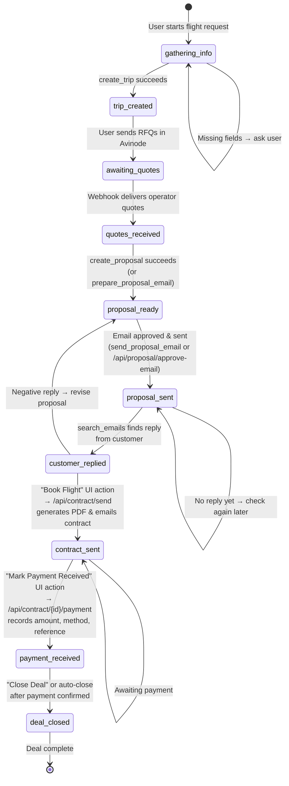
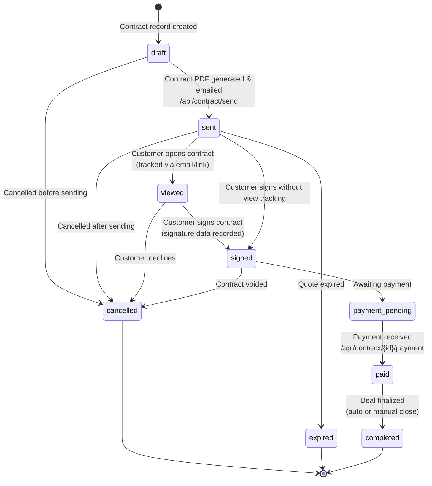
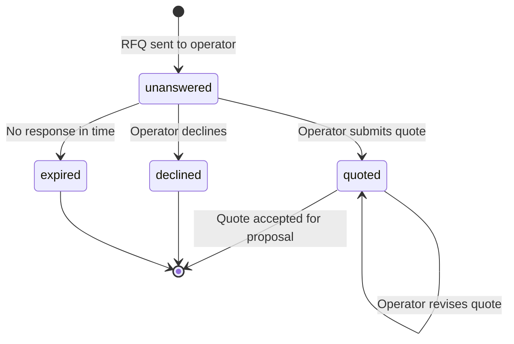
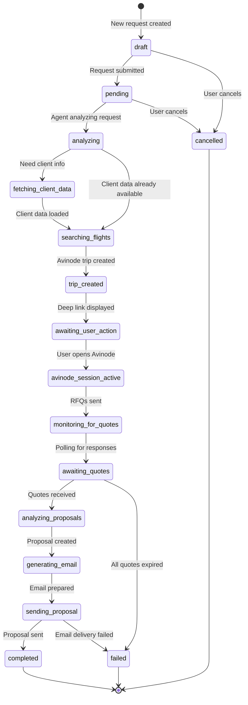
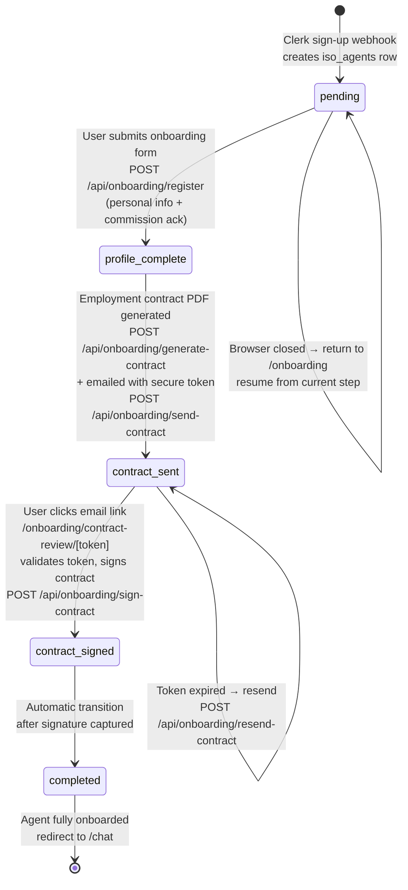
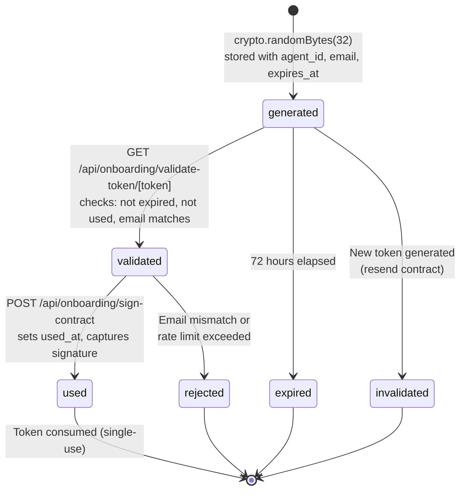

# Workflow State Machine Diagram

Complete state machine covering the Jetvision deal lifecycle (request through deal closure) and the ISO agent onboarding lifecycle.

## WorkingMemory Workflow Stages (Agent-Level)

These are the stages tracked in `requests.workflow_state` JSONB and injected into the agent's system prompt.

## UI Workflow Steps (Frontend Progress Bar)

Maps to `WorkflowStep` constants in `lib/chat/constants/workflow.ts`. The progress bar shows these 10 steps.

```mermaid
stateDiagram-v2
    direction LR

    state "Step 1\nUnderstanding\nRequest" as S1
    state "Step 2\nCreating\nTrip" as S2
    state "Step 3\nRequesting\nQuotes" as S3
    state "Step 4\nAnalyzing\nOptions" as S4
    state "Step 5\nProposal\nReady" as S5
    state "Step 6\nProposal\nSent" as S6
    state "Step 7\nContract\nGenerated" as S7
    state "Step 8\nContract\nSent" as S8
    state "Step 9\nPayment\nPending" as S9
    state "Step 10\nClosed\nWon" as S10

    [*] --> S1
    S1 --> S2
    S2 --> S3
    S3 --> S4
    S4 --> S5
    S5 --> S6
    S6 --> S7
    S7 --> S8
    S8 --> S9
    S9 --> S10
    S10 --> [*]
```

## Contract Status Lifecycle

Tracked in the `contracts` table `status` column (PostgreSQL `contract_status` enum).

## RFQ Status Lifecycle

Tracked per-operator quote in Avinode.

## Request Status Lifecycle

Tracked in `requests.status` column (PostgreSQL enum with 16 values).

## ISO Agent Onboarding Status Lifecycle

Tracked in `iso_agents.onboarding_status` column (PostgreSQL `onboarding_status` enum). Existing agents are grandfathered as `completed`.

## Onboarding Token Lifecycle

Tracks the single-use, time-limited contract review tokens in `contract_tokens` table.

## Combined State Transition Table

| From Stage | To Stage | Trigger | Actor |
|---|---|---|---|
| `gathering_info` | `trip_created` | `create_trip` tool succeeds | Agent (MCP) |
| `trip_created` | `awaiting_quotes` | User sends RFQs in Avinode | User (manual) |
| `awaiting_quotes` | `quotes_received` | `get_rfq` returns flights | Agent (MCP) |
| `quotes_received` | `proposal_ready` | `prepare_proposal_email` succeeds | Agent (MCP) |
| `proposal_ready` | `proposal_sent` | `send_proposal_email` or email approved | Agent/User |
| `proposal_sent` | `customer_replied` | `search_emails` finds reply | Agent (Gmail MCP) |
| `customer_replied` | `contract_sent` | "Book Flight" button → `/api/contract/send` | User (UI) |
| `contract_sent` | `payment_received` | "Mark Payment Received" → `/api/contract/{id}/payment` | User (UI) |
| `payment_received` | `deal_closed` | "Close Deal" or auto-close after payment | User/System |

### Onboarding State Transitions

| From Status | To Status | Trigger | Actor |
|---|---|---|---|
| (new) | `pending` | Clerk webhook `user.created` → INSERT iso_agents | System (Clerk) |
| `pending` | `profile_complete` | Submit onboarding form → POST /api/onboarding/register | User (UI) |
| `profile_complete` | `contract_sent` | Generate PDF + email with token → POST /api/onboarding/send-contract | System |
| `contract_sent` | `contract_signed` | Review + sign contract → POST /api/onboarding/sign-contract | User (email link) |
| `contract_signed` | `completed` | Automatic after signature captured | System |
