# System Ecosystem Diagram

High-level view of the Jetvision multi-agent system: all services, data stores, external integrations, and communication paths.

## Full System Ecosystem

## Data Flow Summary

```mermaid
flowchart LR
    subgraph Input["Input Channels"]
        Chat[Chat Message]
        Webhook[Avinode Webhook]
        ClerkWH[Clerk Webhook]
        UIAction[UI Button Click]
        OnboardForm[Onboarding Form]
    end

    subgraph Processing["Processing"]
        ChatAPI[Chat API + Agent]
        WebhookHandler[Webhook Handler]
        ContractAPI[Contract/Payment API]
        OnboardingAPI[Onboarding API]
    end

    subgraph Storage["Persistent Storage"]
        DB[(Supabase DB)]
        Files[(Supabase Storage)]
    end

    subgraph Output["Output Channels"]
        SSE[SSE Stream → Browser]
        Email[Gmail → Customer]
        AvinodeMsg[Avinode → Operator]
    end

    Chat --> ChatAPI
    Webhook --> WebhookHandler
    ClerkWH --> WebhookHandler
    UIAction --> ContractAPI
    OnboardForm --> OnboardingAPI

    ChatAPI --> DB
    ChatAPI --> SSE
    ChatAPI --> Email
    ChatAPI --> AvinodeMsg

    WebhookHandler --> DB
    WebhookHandler --> SSE

    ContractAPI --> DB
    ContractAPI --> Files
    ContractAPI --> Email

    OnboardingAPI --> DB
    OnboardingAPI --> Files
    OnboardingAPI --> Email
```

## Authentication & Authorization Flow

## ISO Agent Onboarding Flow

