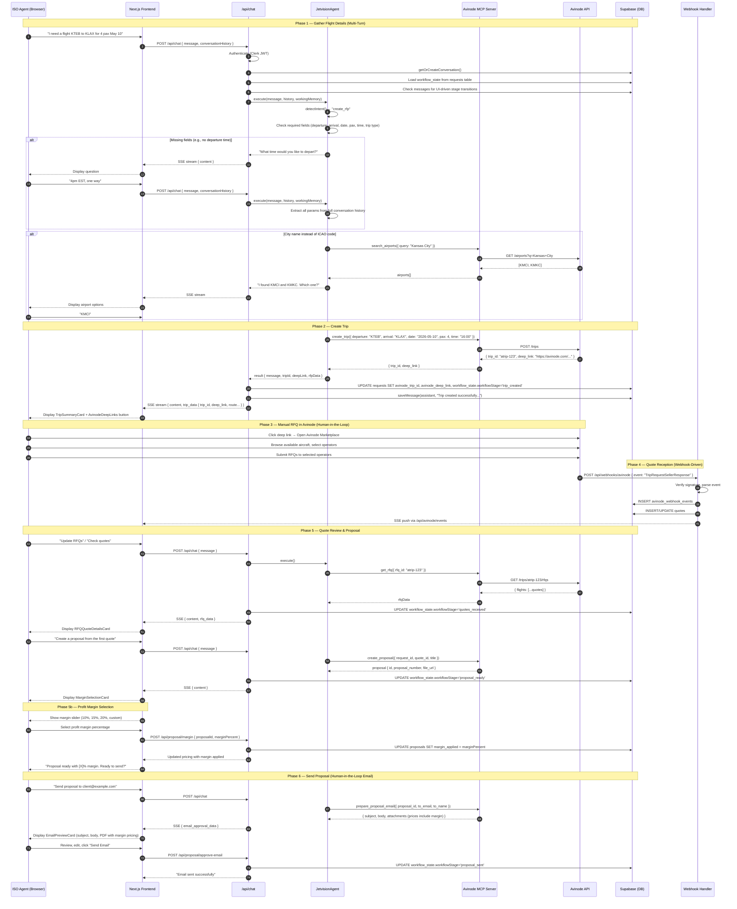
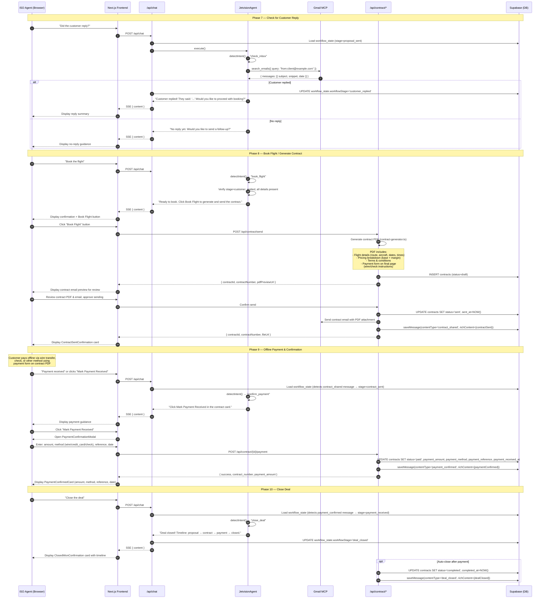

# Trip Creation Sequence Diagram

Full sequence from user message through trip creation, RFQ lifecycle, proposal, contract, payment, and deal closure.

> **Prerequisite**: ISO agent must have completed onboarding (`onboarding_status = 'completed'`). See [System Ecosystem Diagram](./SYSTEM_ECOSYSTEM_DIAGRAM.md#iso-agent-onboarding-flow) for the onboarding sequence.

## Trip Creation & RFQ Flow

## Post-Proposal: Contract → Payment → Deal Closure

