# Unified Chat Interface Architecture

**Date**: 2025-11-12
**Status**: Design Phase
**Priority**: High - Fundamental UX change

---

## Executive Summary

**Current Problem**: The application has a hybrid UI with separate pages for dashboard, new requests, and quotes, creating a fragmented user experience.

**Solution**: Unify all interactions into a single chat-based interface where users interact with the AI agent conversationally, similar to ChatGPT or Claude.

**Key Change**: Everything happens in the chat thread - no separate forms, dashboards, or navigation.

---

## Avinode Integration Workflow

The unified chat interface integrates with Avinode's Broker API to enable real-time flight search and operator communication.

### 3-Party Chat Flow

```mermaid
sequenceDiagram
    autonumber
    participant Client as 👤 ISO User<br/>(Chat UI)
    participant AI as 🤖 AI Assistant
    participant Avinode as ✈️ Avinode<br/>Marketplace
    participant Operator as 🏢 Operator

    rect rgb(230, 245, 255)
        Note over Client,AI: Phase 1: RFP Creation via Chat
        Client->>AI: "I need a flight to Miami"
        AI->>Client: Progressive questions<br/>(departure, date, pax)
        Client->>AI: Completes requirements
        AI->>AI: Extract structured data
    end

    rect rgb(255, 245, 230)
        Note over AI,Avinode: Phase 2: Create Trip in Avinode
        AI->>Avinode: create_trip(criteria)
        Avinode-->>AI: {tripId, deepLink}
        AI->>Client: "Open Avinode to browse flights"<br/>[Open Avinode Button]
    end

    rect rgb(230, 255, 230)
        Note over Client,Operator: Phase 3: User Session in Avinode
        Client->>Avinode: Opens deep link (popup)
        Avinode->>Avinode: User browses flights
        Client->>Avinode: Submits RFQs
        Avinode->>Operator: RFQ notification
    end

    rect rgb(255, 230, 245)
        Note over Operator,Client: Phase 4: Quotes & Chat via Webhooks
        Operator->>Avinode: Send quote
        Avinode-->>AI: Webhook: quote_received
        AI->>Client: "New quote arrived!"<br/>[Quote Card]

        Operator->>Avinode: Send message
        Avinode-->>AI: Webhook: message_received
        AI->>Client: Display in chat thread
    end

    rect rgb(245, 245, 230)
        Note over Client,AI: Phase 5: Selection & Proposal
        Client->>AI: "I like the NetJets quote"
        AI->>AI: Generate proposal
        AI->>Client: [Proposal Preview]<br/>[Send to Client Button]
    end
```



### Chat Interface Component Architecture


### Real-time Webhook Bridge


### Avinode Session States in Chat


---

## Current Architecture Issues

### Pages to Remove
1. `/dashboard` - Dashboard landing page
2. `/dashboard/new-request` - RFP form page
3. `/dashboard/quotes` - Quotes display page
4. Any other separate UI pages

### Problems with Current Approach
- **Fragmented Experience**: Users navigate between different pages
- **Context Switching**: Breaks conversational flow
- **Redundancy**: Both chat interface AND separate forms
- **Complexity**: Maintains two parallel UIs (chat + pages)

---

## Unified Chat Interface Design

### Single Entry Point

**URL Structure**:
```
/ → Landing/Marketing page (if needed)
/chat → Main application (single page)
```

**No More**:
- `/dashboard`
- `/dashboard/new-request`
- `/dashboard/quotes`
- `/dashboard/requests`
- `/dashboard/clients`

### Conversational Workflow

**User Journey Example**:

```
User: "I need a flight from New York to Miami next Tuesday"

Agent: "I'll help you with that! Let me gather some details:

       📍 Route: New York (JFK) → Miami (MIA)
       📅 Date: December 19, 2025
       👥 Passengers: How many passengers?

       [1-2] [3-5] [6-10] [More]"

User: [Clicks "6-10"]

Agent: "Great! 8 passengers.

       Any preferences for aircraft type?

       [Light Jet] [Midsize] [Heavy] [No Preference]"

User: [Clicks "Midsize"]

Agent: "Perfect! Let me search for available aircraft...

       🔍 Searching operators...
       📋 Creating RFP in Avinode...

       [Workflow Progress Bar]"

Agent: "Found 3 quotes for you! Here are your options:

       [Quote Card 1: NetJets - Citation X - $45,000]
       [Quote Card 2: VistaJet - Challenger 350 - $48,000]
       [Quote Card 3: Flexjet - Gulfstream G280 - $52,000]

       I recommend NetJets Citation X based on your preferences.
       Would you like me to send you a detailed proposal?"

User: "Yes, send the proposal"

Agent: "✅ Proposal sent to your email!

       📧 jetvision-proposal-20251219.pdf

       [Download PDF] [View in Thread]"
```

---

## Implementation Plan

### Phase 1: Chat Interface Enhancement

#### 1.1 Rich Message Components

Add message types to display various content inline:

**New Message Component Types**:
```typescript
type MessageComponent =
  | { type: 'text'; content: string }
  | { type: 'quote_card'; quote: Quote }
  | { type: 'quote_comparison'; quotes: Quote[] }
  | { type: 'workflow_status'; stage: WorkflowStage }
  | { type: 'proposal_preview'; proposal: Proposal }
  | { type: 'action_buttons'; actions: Action[] }
  | { type: 'form_field'; field: FormField }
  | { type: 'file_attachment'; file: File }
  | { type: 'progress_indicator'; progress: number }
```

**Example Quote Card in Chat**:
```tsx
<MessageContent>
  <AgentMessage>
    I found this great option for you:

    <QuoteCard
      operator="NetJets"
      aircraft="Citation X"
      price={45000}
      departure="10:00 AM"
      arrival="3:30 PM"
      onSelect={() => selectQuote(quoteId)}
    />

    Would you like to see more options?
  </AgentMessage>
</MessageContent>
```

#### 1.2 Interactive Action Buttons

Instead of forms, use inline quick-reply buttons:

```tsx
<ActionButtons>
  <Button onClick={() => handleAction('1-2')}>1-2 passengers</Button>
  <Button onClick={() => handleAction('3-5')}>3-5 passengers</Button>
  <Button onClick={() => handleAction('6-10')}>6-10 passengers</Button>
  <Button onClick={() => handleAction('more')}>More</Button>
</ActionButtons>
```

#### 1.3 Progressive Disclosure

Gather information conversationally, one step at a time:

```typescript
const rfpGatheringFlow = [
  { field: 'route', question: "Where are you flying?" },
  { field: 'date', question: "When do you need to depart?" },
  { field: 'passengers', question: "How many passengers?" },
  { field: 'aircraft_type', question: "Any aircraft preference?" },
  { field: 'budget', question: "What's your budget range?" },
]
```

### Phase 2: Remove Separate Pages

#### 2.1 Files to Delete/Archive
```bash
app/dashboard/page.tsx                 → Archive
app/dashboard/new-request/page.tsx     → Archive
app/dashboard/quotes/page.tsx          → Archive
app/dashboard/requests/page.tsx        → Archive (if exists)
app/dashboard/clients/page.tsx         → Archive (if exists)
```

#### 2.2 Keep Only
```bash
app/page.tsx           → Landing page (optional)
app/chat/page.tsx      → Main chat interface (single page app)
app/api/**             → Backend APIs (keep)
```

#### 2.3 Routing Update
```typescript
// next.config.js or middleware
export const config = {
  matcher: ['/((?!api|_next|_static|_vercel|favicon.ico).*)'],
}

// Redirect all paths to /chat
if (pathname.startsWith('/dashboard')) {
  return NextResponse.redirect(new URL('/chat', request.url))
}
```

### Phase 3: Backend Integration

#### 3.1 Chat API Enhancement

**Endpoint**: `POST /api/chat/message`

**Request**:
```typescript
{
  threadId: string,
  message: string,
  context?: {
    rfpData?: Partial<RFPData>,
    selectedQuote?: string,
    action?: 'submit_rfp' | 'select_quote' | 'request_proposal'
  }
}
```

**Response**:
```typescript
{
  messages: ChatMessage[],
  components: MessageComponent[],
  workflow?: WorkflowStatus,
  suggestedActions?: Action[]
}
```

#### 3.2 Agent Orchestration

The **OrchestratorAgent** should:
1. Parse user intent from natural language
2. Extract structured data progressively
3. Return conversational responses with inline components
4. Track conversation state (what's been asked, what's missing)

**Example Agent Response**:
```typescript
{
  intent: 'create_rfp',
  extractedData: {
    departure: 'KJFK',
    arrival: 'KMIA',
    passengers: 8,
  },
  missingFields: ['date', 'aircraft_type'],
  nextQuestion: "When would you like to depart?",
  suggestedResponses: [
    { label: 'Tomorrow', value: '2025-12-20' },
    { label: 'This Weekend', value: '2025-12-21' },
    { label: 'Next Week', value: '2025-12-26' },
    { label: 'Custom Date', value: 'custom' }
  ]
}
```

### Phase 4: ChatKit Integration

#### 4.1 Use ChatKit as Primary Interface

Since ChatKit is already integrated in [chat-interface.tsx](../../components/chat-interface.tsx), enhance it:

**Current ChatKit Usage** (Line 16-45):
```typescript
<ChatKitWidget
  sessionId={activeChat.chatkitThreadId ?? `flight-${activeChat.id}`}
  metadata={chatKitMetadata}
  onWorkflowAction={handleChatKitAction}
  className="h-[420px]"
/>
```

**Enhanced ChatKit Integration**:
```typescript
<ChatKitWidget
  sessionId={threadId}
  metadata={{
    rfpData: currentRfpData,
    workflowStage: workflowStage,
    quotes: availableQuotes,
  }}
  onMessage={handleUserMessage}
  onWorkflowAction={handleChatKitAction}
  customComponents={{
    QuoteCard: CustomQuoteCard,
    ProposalPreview: CustomProposalPreview,
    WorkflowStatus: CustomWorkflowStatus,
  }}
  fullScreen
/>
```

#### 4.2 Custom ChatKit Components

Register custom React components to render in ChatKit:

```typescript
const customComponents = {
  quote_card: (props) => <QuoteCard {...props} />,
  quote_comparison: (props) => <QuoteComparison {...props} />,
  proposal_preview: (props) => <ProposalPreview {...props} />,
  workflow_visualization: (props) => <WorkflowVisualization {...props} />,
}
```

Agent returns:
```json
{
  "type": "component",
  "component": "quote_card",
  "props": {
    "operator": "NetJets",
    "aircraft": "Citation X",
    "price": 45000
  }
}
```

ChatKit renders it as React component inline.

---

## User Experience Flows

### Flow 1: New RFP Submission (Conversational)

**Old Way** (Multi-page):
```
1. Navigate to /dashboard
2. Click "New Request" button
3. Fill out form (8+ fields)
4. Submit form
5. Navigate to /dashboard/requests/123
6. Wait for quotes...
```

**New Way** (Chat-based):
```
User: "I need a flight to Miami next week"

Agent: "I'll help you book that!
        From which airport?
        [New York JFK] [LaGuardia] [Newark] [Other]"

User: [Selects JFK]

Agent: "JFK to Miami, got it!
        When next week?
        [Monday] [Wednesday] [Friday] [Choose Date]"

User: "Wednesday"

Agent: "Perfect! How many passengers?
        [1-2] [3-5] [6-10] [More]"

User: "8 passengers"

Agent: "Great! 8 passengers. Searching for aircraft...

        🔍 Contacting operators via Avinode...
        📋 Creating RFP...

        I'll notify you when quotes arrive!"
```

Total steps: **4 messages** vs 6 page navigations

### Flow 2: Quote Review (Inline)

**Old Way**:
```
1. Receive email notification
2. Click link → /dashboard/quotes
3. View table of quotes
4. Click quote → /dashboard/quotes/456
5. Review details
6. Click "Select" button
```

**New Way**:
```
Agent: "📬 3 new quotes arrived!

        [Quote Card: NetJets - $45K ⭐ Recommended]
        [Quote Card: VistaJet - $48K]
        [Quote Card: Flexjet - $52K]

        NetJets has the best value with a Citation X.
        Tap any quote to see full details."

User: [Taps NetJets card]

Agent: [Expands quote details inline]
        "📊 NetJets Citation X

        💰 Price: $45,000
        ⏰ Departure: 10:00 AM
        🛬 Arrival: 3:30 PM
        ✈️  Aircraft: Citation X (Midsize Jet)
        👤 Capacity: 8-10 passengers

        [Select This Quote] [Compare All] [Request Changes]"

User: "Select this quote"

Agent: "✅ Quote selected! Creating proposal..."
```

### Flow 3: Proposal Generation (Embedded)

**Old Way**:
```
1. Navigate to /dashboard/requests/123
2. See "Proposal Ready" badge
3. Click "View Proposal"
4. Opens PDF in new tab or download
```

**New Way**:
```
Agent: "✅ Your proposal is ready!

        📄 JetVision Proposal - JFK to Miami
        Flight Date: Dec 19, 2025
        Selected: NetJets Citation X
        Total: $45,000

        [Preview in Chat] [Download PDF] [Email Me]"

User: "Preview in chat"

Agent: [Renders proposal inline with scrollable view]

        "═══════════════════════════
         JETVISION PROPOSAL
        ═══════════════════════════

        Flight Details:
        • Route: JFK → MIA
        • Date: December 19, 2025
        • Passengers: 8

        Selected Aircraft:
        • Operator: NetJets
        • Aircraft: Citation X
        • Price: $45,000

        [Full proposal embedded...]

        [Download PDF] [Accept] [Request Changes]"
```

---

## Technical Architecture

### Component Structure

```
app/
├── page.tsx                    → Landing (optional)
└── chat/
    └── page.tsx                → Main app (ChatInterface)

components/
├── chat-interface.tsx          → Enhanced main interface
├── message-renderer.tsx        → Renders different message types
├── message-components/
│   ├── quote-card.tsx
│   ├── quote-comparison.tsx
│   ├── proposal-preview.tsx
│   ├── workflow-status.tsx
│   ├── action-buttons.tsx
│   └── form-field.tsx
└── chatkit-widget.tsx          → ChatKit integration

agents/
├── implementations/
│   └── orchestrator-agent.ts   → Enhanced for conversational flow
└── tools/
    └── conversation-manager.ts → Tracks conversation state
```

### State Management

**Conversation State**:
```typescript
interface ConversationState {
  threadId: string
  messages: Message[]
  currentRfp: Partial<RFPData>
  missingFields: string[]
  currentStage: 'gathering' | 'searching' | 'reviewing' | 'booking'
  quotes: Quote[]
  selectedQuote?: string
  workflow?: WorkflowStatus
}
```

**No More**:
- Form state across multiple pages
- Navigation state
- Dashboard state
- Separate quote state

**Single Source of Truth**: Chat thread state

---

## Migration Strategy

### Phase 1: Build Chat-Only Interface (1 week)

**Tasks**:
1. ✅ Enhance [chat-interface.tsx](../../components/chat-interface.tsx) with rich components
2. Create message-components library (QuoteCard, ProposalPreview, etc.)
3. Implement conversational RFP gathering flow
4. Add inline action buttons and form fields
5. Test with existing ChatKit integration

**Deliverables**:
- Fully functional chat interface with all features
- No dependency on separate pages

### Phase 2: Update Backend APIs (3 days)

**Tasks**:
1. Enhance `/api/chat/message` endpoint
2. Update OrchestratorAgent for conversational responses
3. Add conversation state management
4. Implement progressive data extraction
5. Return structured responses with components

**Deliverables**:
- Chat API returns rich message components
- Agent understands natural language RFP creation

### Phase 3: Archive Old Pages (1 day)

**Tasks**:
1. Move dashboard pages to `app/_archived/`
2. Update routing to redirect to `/chat`
3. Remove navigation components
4. Update landing page links
5. Test all user flows

**Deliverables**:
- Clean single-page application
- All flows work through chat

### Phase 4: Polish & Testing (2 days)

**Tasks**:
1. UI/UX refinements
2. Mobile responsiveness
3. Accessibility testing
4. Performance optimization
5. User acceptance testing

**Deliverables**:
- Production-ready chat interface
- Full E2E test coverage

**Total Timeline**: ~2 weeks

---

## Benefits of Unified Chat Interface

### User Experience
✅ **Conversational** - Natural language interaction
✅ **Contextual** - All information in one thread
✅ **Seamless** - No page navigation
✅ **Modern** - Familiar chat UX (like ChatGPT)
✅ **Mobile-Friendly** - Chat works great on mobile

### Development
✅ **Simpler** - One interface instead of multiple pages
✅ **Maintainable** - Single source of truth
✅ **Scalable** - Easy to add new features to chat
✅ **Less Code** - Remove entire dashboard implementation

### Business
✅ **Higher Engagement** - Users stay in conversation
✅ **Better Conversion** - Fewer drop-off points
✅ **AI-First** - Showcases AI agent capabilities
✅ **Competitive** - Modern AI-native experience

---

## Risks & Mitigation

### Risk 1: Users Expect Traditional Forms
**Mitigation**: Offer "Quick Form" option in chat that shows all fields at once

### Risk 2: Complex Data Entry in Chat
**Mitigation**: Use inline form fields and date pickers within messages

### Risk 3: Loss of Dashboard Overview
**Mitigation**: Add "/history" command to show past requests in chat

### Risk 4: ChatKit Limitations
**Mitigation**: Fallback to custom React components if ChatKit can't render something

### Risk 5: Accessibility Concerns
**Mitigation**: Ensure keyboard navigation and screen reader support in chat

---

## Success Metrics

### Before (Current Multi-Page)
- Average clicks to submit RFP: ~8-10
- Time to create request: ~3-5 minutes
- Page load times: 3 pages × 2s = 6s
- Drop-off rate: ~30% between pages

### After (Unified Chat)
- Average messages to submit RFP: ~4-6
- Time to create request: ~2-3 minutes
- Page load times: 1 page × 2s = 2s
- Drop-off rate: Target <10%

---

## Examples from Other Products

### ChatGPT
- All interaction in chat thread
- File uploads inline
- Code execution results inline
- Web search results inline

### Claude (Anthropic)
- Entire conversation in thread
- Artifacts rendered inline
- Citations and references inline

### Intercom / Drift
- Customer support in chat
- Forms rendered inline
- Appointment booking in chat
- Payment collection in chat

### What We're Building
JetVision = ChatGPT for private jet booking

---

## Next Steps

1. **Review & Approve** this architecture document
2. **Create Design Mockups** for new chat UI flows
3. **Start Phase 1** - Build enhanced chat interface
4. **User Testing** with prototype
5. **Iterate** based on feedback
6. **Deploy** unified interface

---

## Questions to Resolve

1. Should we keep a minimal landing page at `/` or go straight to `/chat`?
2. Do we need any "Settings" page or can that also be chat-based ("/settings" command)?
3. How do we handle very long conversations? Auto-archive?
4. What about data export/reports - also chat-based or separate admin view?
5. Should we offer "/dashboard" command for power users who want tabular view?

---

**Created**: 2025-11-12
**Status**: Design Phase - Awaiting Approval
**Next Review**: Before Phase 1 implementation

🤖 Generated with [Claude Code](https://claude.com/claude-code)
