# User Flow Diagram

End-to-end user journey for an ISO agent using the Jetvision system, from onboarding through deal closure. Includes ISO agent registration, employment commission contract signing, profit margin selection, flight contract PDF generation with payment form, and offline payment confirmation.

## ISO Agent Onboarding Flow

```mermaid
flowchart TD
    SignUp([New user visits Jetvision])

    subgraph P0["Phase 0: ISO Agent Onboarding"]
        O1[User completes Clerk sign-up<br/>email/OAuth]
        O2[Clerk webhook fires<br/>POST /api/webhooks/clerk<br/>Creates iso_agents row<br/>role=iso_agent, status=pending]
        O3[Redirect to /onboarding]
        O4{Onboarding<br/>status?}
        O5[Step 1: Personal Info Form<br/>Name, DOB, phone, address]
        O6[Step 2: Commission Terms<br/>Display terms + acknowledgment checkbox]
        O7[Step 3: Review & Submit]
        O8[POST /api/onboarding/register<br/>Updates iso_agents row<br/>status → profile_complete]
        O9[Generate employment commission<br/>contract PDF<br/>POST /api/onboarding/generate-contract<br/>Stored in Supabase Storage<br/>onboarding/agent_id/]
        O10[Email contract with secure token<br/>POST /api/onboarding/send-contract<br/>72h expiry, single-use, email-bound<br/>status → contract_sent]
        O11[User receives email<br/>clicks review link]
        O12[/onboarding/contract-review/token<br/>Validate token: not expired,<br/>not used, email matches user]
        O13{Token<br/>valid?}
        O14[Display contract PDF<br/>+ signature fields]
        O15[User types full name<br/>+ checks acknowledgment<br/>+ signs digitally]
        O16[POST /api/onboarding/sign-contract<br/>Captures: signature, name, IP, timestamp<br/>status → contract_signed → completed]
        O17[Redirect to /chat<br/>Agent fully onboarded]
        O18[Error: token expired/used<br/>Offer resend option]
        O19[POST /api/onboarding/resend-contract<br/>Generate new token, invalidate old]
    end

    SignUp --> O1
    O1 --> O2
    O2 --> O3
    O3 --> O4
    O4 -- pending --> O5
    O4 -- completed --> O17
    O4 -- contract_sent --> O11
    O4 -- profile_complete --> O9
    O5 --> O6
    O6 --> O7
    O7 --> O8
    O8 --> O9
    O9 --> O10
    O10 --> O11
    O11 --> O12
    O12 --> O13
    O13 -- Yes --> O14
    O13 -- No --> O18
    O18 --> O19
    O19 --> O10
    O14 --> O15
    O15 --> O16
    O16 --> O17

    classDef phase0 fill:#fce4ec,stroke:#ad1457
    class O1,O2,O3,O4,O5,O6,O7,O8,O9,O10,O11,O12,O13,O14,O15,O16,O17,O18,O19 phase0
```

## Complete Deal Lifecycle Flow

```mermaid
flowchart TD
    Start([ISO Agent opens Jetvision<br/>onboarding_status = completed])

    %% ===== Phase 1: Flight Request =====
    subgraph P1["Phase 1: Flight Request"]
        A1[Agent types flight request in chat]
        A2{All required fields<br/>provided?}
        A3[Agent asks for missing info:<br/>departure, arrival, date,<br/>passengers, time, trip type]
        A4{City name or<br/>ICAO code?}
        A5[Agent calls search_airports]
        A6{Multiple airports<br/>found?}
        A7[Agent asks user to pick airport]
        A8[Agent has all valid ICAO codes]
    end

    %% ===== Phase 2: Trip Creation =====
    subgraph P2["Phase 2: Trip Creation"]
        B1[Agent calls create_trip via Avinode MCP]
        B2[UI displays TripSummaryCard<br/>+ Avinode Deep Link button]
        B3["Stage: trip_created"]
    end

    %% ===== Phase 3: Avinode Marketplace =====
    subgraph P3["Phase 3: Avinode Marketplace (Manual)"]
        C1[User clicks Open in Avinode]
        C2[User browses available aircraft]
        C3[User selects operators]
        C4[User sends RFQs to operators]
        C5[Wait for operator responses]
    end

    %% ===== Phase 4: Quote Reception =====
    subgraph P4["Phase 4: Quote Reception"]
        D1[Avinode sends webhook events<br/>TripRequestSellerResponse]
        D2[Quotes stored in DB + SSE push]
        D4[User clicks Update RFQs in chat]
        D5[Agent fetches latest quotes via get_rfq]
        D6[UI displays RFQQuoteDetailsCard<br/>with price, aircraft, operator rating]
        D7["Stage: quotes_received"]
    end

    %% ===== Phase 5: Proposal =====
    subgraph P5["Phase 5: Proposal Generation & Sending"]
        E1[User says: Create a proposal from quote X]
        E2[Agent calls create_proposal]
        E2b[UI shows MarginSelectionCard<br/>ISO agent selects profit margin %<br/>e.g. 10%, 15%, 20%]
        E3["Stage: proposal_ready"]
        E4[User says: Send to client]
        E5[Agent calls prepare_proposal_email]
        E6[UI shows EmailPreviewCard<br/>Subject, body, PDF attachment<br/>Prices include margin]
        E7{User approves<br/>email?}
        E8[User edits email content]
        E9[User clicks Send Email]
        E10[Email sent via Gmail MCP<br/>with proposal PDF attached]
        E11["Stage: proposal_sent"]
    end

    %% ===== Phase 6: Customer Reply =====
    subgraph P6["Phase 6: Customer Reply Check"]
        F1[User asks: Did the customer reply?]
        F1b[Or: Agent periodically checks inbox<br/>via Gmail MCP search_emails]
        F2[Agent searches Gmail inbox<br/>from:customer@email.com]
        F3{Reply found?}
        F4[Agent displays reply snippet<br/>+ UI notification]
        F5["Stage: customer_replied"]
        F6[Agent suggests follow-up email]
        F7{Positive response?<br/>yes/interested/book/proceed}
        F8[Agent suggests booking:<br/>Book Flight button enabled]
        F9[Agent suggests revised proposal<br/>or different margin]
    end

    %% ===== Phase 7: Contract =====
    subgraph P7["Phase 7: Contract Generation & Sending"]
        G1[User clicks Book Flight button<br/>enabled only after customer_replied]
        G2[System generates contract PDF:<br/>- Flight details: route, aircraft, dates, times<br/>- Pricing breakdown: base + margin<br/>- Terms and conditions<br/>- Payment form on final page<br/>  with wire/check instructions]
        G3[UI shows contract email preview<br/>for ISO agent review]
        G4{ISO agent<br/>approves?}
        G4b[ISO agent edits contract email]
        G5[Contract emailed to customer<br/>via Gmail MCP with PDF attached]
        G6[UI shows ContractSentConfirmation card<br/>Contract number, recipient, amount]
        G7["Stage: contract_sent"]
    end

    %% ===== Phase 8: Payment =====
    subgraph P8["Phase 8: Offline Payment & Confirmation"]
        H0[Customer makes payment offline<br/>Wire transfer, check, or other method]
        H1[ISO agent says: Payment received<br/>or clicks Mark Payment Received]
        H2[Agent guides to PaymentConfirmationModal]
        H3[User enters in modal:<br/>- Payment amount<br/>- Payment method: wire/credit_card/check<br/>- Reference number<br/>- Payment date]
        H4[POST /api/contract/id/payment<br/>Records payment in contracts table]
        H5[UI shows PaymentConfirmedCard<br/>Amount, method, reference, date]
        H6["Stage: payment_received"]
    end

    %% ===== Phase 9: Deal Closure =====
    subgraph P9["Phase 9: Deal Closure"]
        I1[User says: Close the deal<br/>or: auto-close after payment]
        I2[System updates:<br/>- contracts.status → completed<br/>- requests.workflow_state → deal_closed<br/>- Audit trail logged]
        I3[UI shows ClosedWonConfirmation card<br/>Full timeline: proposal → contract<br/>→ payment → closed]
        I4["Stage: deal_closed"]
    end

    Finish([Deal Complete])

    %% ===== Connections =====
    Start --> A1
    A1 --> A2
    A2 -- No --> A3
    A3 --> A1
    A2 -- Yes --> A4
    A4 -- City name --> A5
    A5 --> A6
    A6 -- Yes --> A7
    A7 --> A1
    A6 -- No --> A8
    A4 -- ICAO code --> A8

    A8 --> B1
    B1 --> B2
    B2 --> B3

    B3 --> C1
    C1 --> C2
    C2 --> C3
    C3 --> C4
    C4 --> C5

    C5 --> D1
    D1 --> D2
    D2 --> D4
    D4 --> D5
    D5 --> D6
    D6 --> D7

    D7 --> E1
    E1 --> E2
    E2 --> E2b
    E2b --> E3
    E3 --> E4
    E4 --> E5
    E5 --> E6
    E6 --> E7
    E7 -- No --> E8
    E8 --> E6
    E7 -- Yes --> E9
    E9 --> E10
    E10 --> E11

    E11 --> F1
    F1b -.-> F2
    F1 --> F2
    F2 --> F3
    F3 -- Yes --> F4
    F4 --> F5
    F5 --> F7
    F7 -- Yes --> F8
    F7 -- No --> F9
    F9 --> E1
    F3 -- No --> F6
    F6 -.-> F1

    F8 --> G1
    G1 --> G2
    G2 --> G3
    G3 --> G4
    G4 -- No --> G4b
    G4b --> G3
    G4 -- Yes --> G5
    G5 --> G6
    G6 --> G7

    G7 --> H0
    H0 --> H1
    H1 --> H2
    H2 --> H3
    H3 --> H4
    H4 --> H5
    H5 --> H6

    H6 --> I1
    I1 --> I2
    I2 --> I3
    I3 --> I4
    I4 --> Finish

    %% ===== Styling =====
    classDef phase1 fill:#e3f2fd,stroke:#1565c0
    classDef phase2 fill:#e8f5e9,stroke:#2e7d32
    classDef phase3 fill:#fff3e0,stroke:#e65100
    classDef phase4 fill:#fce4ec,stroke:#c62828
    classDef phase5 fill:#f3e5f5,stroke:#6a1b9a
    classDef phase6 fill:#e0f7fa,stroke:#00838f
    classDef phase7 fill:#fff9c4,stroke:#f9a825
    classDef phase8 fill:#e8eaf6,stroke:#283593
    classDef phase9 fill:#c8e6c9,stroke:#1b5e20

    class A1,A2,A3,A4,A5,A6,A7,A8 phase1
    class B1,B2,B3 phase2
    class C1,C2,C3,C4,C5 phase3
    class D1,D2,D4,D5,D6,D7 phase4
    class E1,E2,E2b,E3,E4,E5,E6,E7,E8,E9,E10,E11 phase5
    class F1,F1b,F2,F3,F4,F5,F6,F7,F8,F9 phase6
    class G1,G2,G3,G4,G4b,G5,G6,G7 phase7
    class H0,H1,H2,H3,H4,H5,H6 phase8
    class I1,I2,I3,I4 phase9
```



## Phase Summary

| Phase | Name | Key Actions | Actor |
|-------|------|-------------|-------|
| 0 | ISO Agent Onboarding | Clerk sign-up, personal info form, commission contract PDF, email with token, digital signature | User + System |
| 1 | Flight Request | Gather departure, arrival, date, pax, time, trip type | Agent + User |
| 2 | Trip Creation | Call create_trip, display deep link | Agent (MCP) |
| 3 | Avinode Marketplace | Browse aircraft, select operators, send RFQs | User (manual in Avinode) |
| 4 | Quote Reception | Webhooks deliver quotes, agent fetches via get_rfq | System + Agent |
| 5 | Proposal | Create proposal, select profit margin, review email, send | Agent + User |
| 6 | Customer Reply | Search inbox for reply, detect positive/negative signals | Agent (Gmail MCP) |
| 7 | Contract | Generate PDF with pricing + payment form, review, send | System + User |
| 8 | Payment | Customer pays offline, ISO agent confirms in UI | User (UI) |
| 9 | Deal Closure | Mark complete, display timeline, update all records | System |
