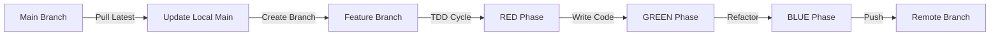
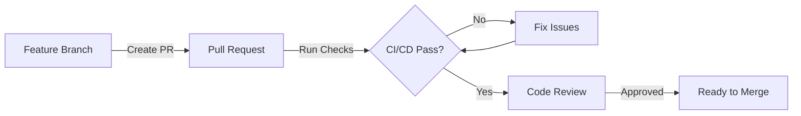
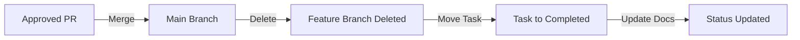

# Git Workflow Protocol - Multi-Agent Development

**Project**: Jetvision AI Assistant
**Version**: 1.0
**Last Updated**: October 21, 2025
**Status**: ✅ ACTIVE & ENFORCED

---

## Table of Contents

1. [Overview](#overview)
2. [Git Workflow Requirements](#git-workflow-requirements)
3. [Feature Branch Lifecycle](#feature-branch-lifecycle)
4. [Pull Request Process](#pull-request-process)
5. [Quality Gates](#quality-gates)
6. [Branch Management](#branch-management)
7. [Multi-Agent Coordination](#multi-agent-coordination)

---

## Overview

This document defines the **mandatory** Git workflow for all development work on the Jetvision AI Assistant project. This workflow ensures:

- ✅ Main branch remains stable and deployable
- ✅ All changes are reviewed before merging
- ✅ Quality standards are enforced
- ✅ Proper coordination between multiple agents/developers
- ✅ Clear audit trail of all changes

### Core Principles

1. **Main branch is sacred** - Always stable, always deployable
2. **Feature branches are isolated** - One task per branch
3. **PRs are mandatory** - No direct commits to main
4. **Sequential completion** - Finish one task completely before starting next
5. **Quality first** - Tests and reviews are non-negotiable

---

## Git Workflow Requirements

### 1. Branch Creation

**Before creating any branch:**

```bash
# 1. Ensure you're on main
git checkout main

# 2. Pull latest changes
git pull origin main

# 3. Verify clean state
git status  # Should show "nothing to commit, working tree clean"

# 4. Create feature branch
git checkout -b <branch-type>/<TASK-ID>-<description>
```

**Branch Naming Convention:**

```
<type>/<TASK-ID>-<description>

Types:
- feat/     : New feature (feat/TASK-001-clerk-authentication)
- fix/      : Bug fix (fix/TASK-000-typescript-errors)
- refactor/ : Code refactoring (refactor/TASK-015-agent-tools)
- test/     : Test additions (test/TASK-026-unit-tests)
- docs/     : Documentation (docs/TASK-036-api-documentation)
- chore/    : Maintenance (chore/TASK-033-cicd-setup)

Examples:
✅ feat/TASK-001-clerk-authentication
✅ fix/TASK-000-typescript-vitest-blockers
✅ refactor/TASK-012-agent-tools-helper-functions
❌ feature-auth (too vague)
❌ fix-bug (no task ID)
❌ TASK-001 (no description)
```

### 2. Development Workflow

**Complete TDD Cycle:**

```bash
# RED Phase - Write failing tests
git add __tests__/
git commit -m "test(scope): add failing tests for feature X

Red phase - tests currently failing

- Test case 1: ...
- Test case 2: ...

Related to: TASK-XXX"

# GREEN Phase - Make tests pass
git add <implementation-files>
git commit -m "feat(scope): implement feature X

Green phase - tests now passing

- Implemented ...
- Added ...

Implements: TASK-XXX"

# BLUE Phase - Refactor
git add <refactored-files>
git commit -m "refactor(scope): improve code quality

Blue phase - refactoring complete

- Optimized ...
- Cleaned up ...

Related to: TASK-XXX"
```

**Commit Message Format:**

```
<type>(<scope>): <description>

<phase> - <context>

<detailed-changes>

<task-reference>

Types: feat, fix, docs, style, refactor, test, chore
Phases: Red phase, Green phase, Blue phase
Task Reference: Related to: TASK-XXX | Implements: TASK-XXX | Fixes: TASK-XXX
```

### 3. Push to Remote

```bash
# Push feature branch
git push -u origin <branch-name>

# Verify push succeeded
git branch -vv
```

---

## Feature Branch Lifecycle

### Phase 1: Creation & Development



**Duration**: Variable (1-8 hours typical)
**Owner**: Assigned agent/developer
**Output**: Feature branch with commits pushed to origin

### Phase 2: Pull Request



**Duration**: 15 minutes - 2 hours
**Owner**: PR creator + reviewer
**Output**: Approved PR ready for merge

### Phase 3: Merge & Cleanup



**Duration**: 5-10 minutes
**Owner**: Merger (project maintainer)
**Output**: Feature in main, branch cleaned up

---

## Pull Request Process

### 1. PR Creation Checklist

**Before creating PR, verify:**

- [ ] All tests pass locally (`npm test`)
- [ ] Type check passes (`npm run type-check`)
- [ ] Build succeeds (`npm run build`)
- [ ] Code follows style guide (`npm run lint`)
- [ ] All commits follow convention
- [ ] Task file updated with progress
- [ ] No merge conflicts with main

**Create PR:**

```bash
# Option 1: GitHub CLI (preferred)
gh pr create \
  --title "<Type>: <Description> (TASK-XXX)" \
  --body "$(cat PR_TEMPLATE.md)" \
  --base main \
  --head <branch-name>

# Option 2: Web Interface
# Visit: https://github.com/<org>/<repo>/pull/new/<branch-name>
```

### 2. PR Template Structure

```markdown
## Summary
Brief description of changes (2-3 sentences)

## Problem Statement
What problem does this solve? Why is it needed?

## Changes Made
- ✅ Change 1
- ✅ Change 2
- ✅ Change 3

## Testing
### Before Fix
[Show failing state]

### After Fix
[Show passing state]

## Verification Results
| Check | Status |
|-------|--------|
| TypeScript | ✅ PASS |
| Tests | ✅ PASS |
| Build | ✅ PASS |
| Lint | ✅ PASS |

## Files Changed
- file1.ts - Description
- file2.tsx - Description

## Related Tasks
Closes: TASK-XXX
Depends on: TASK-YYY (if applicable)
Blocks: TASK-ZZZ (if applicable)

## Breaking Changes
None | [Description if any]

## Review Checklist
- [ ] Code quality meets standards
- [ ] Tests comprehensive
- [ ] Documentation updated
- [ ] No security issues
```

### 3. PR Review Requirements

**Every PR must have:**

1. **Automated Checks** (when CI/CD enabled):
   - ✅ TypeScript compilation
   - ✅ Unit tests pass
   - ✅ Integration tests pass
   - ✅ Lint checks pass
   - ✅ Build succeeds
   - ✅ Coverage meets threshold (75%+)

2. **Manual Review**:
   - ✅ At least 1 approval from code owner
   - ✅ All conversations resolved
   - ✅ No merge conflicts
   - ✅ Follows coding standards

3. **Documentation**:
   - ✅ Commit messages clear
   - ✅ PR description complete
   - ✅ Code comments where needed
   - ✅ Task file updated

### 4. PR Merge Process

**Merge Strategy**: Squash and Merge (default)

```bash
# After PR approval:

# 1. Verify PR is ready
gh pr view <PR-number>

# 2. Squash and merge
gh pr merge <PR-number> --squash --delete-branch

# 3. Pull updated main
git checkout main
git pull origin main

# 4. Verify merge
git log --oneline -5

# 5. Move task to completed
mv tasks/active/TASK-XXX-*.md tasks/completed/

# 6. Update task completion summary
# Edit tasks/completed/TASK-XXX-*.md
```

---

## Quality Gates

### Gate 1: Pre-Commit (Local)

```bash
# Must pass before committing
npm run type-check  # 0 errors required
npm test           # All tests pass required
```

### Gate 2: Pre-Push (Local)

```bash
# Must pass before pushing
npm run build      # Build must succeed
npm run lint       # 0 lint errors required
npm run type-check # Reconfirm types
```

### Gate 3: PR Creation (Remote)

```bash
# Must pass before creating PR
# - No merge conflicts
# - Branch up to date with main
# - All commits follow convention
```

### Gate 4: PR Approval (Remote)

```bash
# Must pass before merging
# - CI/CD checks pass (when enabled)
# - Code review approved
# - Documentation complete
# - Task file updated
```

---

## Branch Management

### Protected Branches

**`main` branch is protected:**

- ❌ No direct commits
- ❌ No force pushes
- ✅ Requires PR for all changes
- ✅ Requires passing CI/CD (when enabled)
- ✅ Requires code review approval
- ✅ Enforces linear history (squash merge)

### Branch Lifecycle

```
Created → Developed → Pushed → PR Created → Reviewed → Approved → Merged → Deleted
    ↓          ↓          ↓          ↓           ↓          ↓         ↓         ↓
  1 min      1-8 hrs   instant    instant    15min-2hr  instant   instant   instant
```

**Total Lifecycle**: 2-10 hours (typical)

### Branch Cleanup

**Automatic Cleanup** (when PR merged via `--delete-branch`):
- Remote branch deleted
- Local branch remains (must delete manually)

**Manual Cleanup:**

```bash
# List merged branches
git branch --merged main

# Delete local branch
git branch -d <branch-name>

# Delete remote branch (if not auto-deleted)
git push origin --delete <branch-name>

# Prune deleted remote branches
git fetch --prune
```

---

## Multi-Agent Coordination

### Agent Roles

**1. Primary Agent (You/Me)**
- Coordinates overall workflow
- Assigns tasks to subagents
- Reviews completed work
- Manages main branch
- Creates final PRs

**2. Subagents (Specialized Agents)**
- Execute assigned tasks
- Work on feature branches
- Run tests and quality checks
- Report completion status

### Task Assignment Strategy

**Independent Tasks** → Parallel Execution

```
Example: TASK-007 (MCP Base Server) and TASK-001 (Clerk Auth) can run in parallel

Agent A: feat/TASK-007-mcp-base-server
Agent B: feat/TASK-001-clerk-authentication

Both work simultaneously, create separate PRs
```

**Dependent Tasks** → Sequential Execution

```
Example: TASK-002 (Database) must complete before TASK-005 (Supabase Client)

Agent A: feat/TASK-002-supabase-database-schema
  ↓ [Merge to main]
Agent B: feat/TASK-005-supabase-client-implementation

Agent B waits for Agent A's PR to merge
```

### Coordination Protocol

**Step 1: Dependency Analysis**

```markdown
Before starting any task:
1. Check TASK_INDEX.md for dependencies
2. Verify prerequisite tasks are completed
3. If dependencies exist, wait for completion
4. If independent, proceed immediately
```

**Step 2: Task Assignment**

```markdown
Primary Agent assigns tasks:
- Independent tasks → Different agents (parallel)
- Dependent tasks → Queue for sequential execution
- Update task status in TASK_INDEX.md
```

**Step 3: Synchronization Points**

```markdown
After each task completion:
1. Agent creates PR
2. PR reviewed and merged
3. Main branch updated
4. Dependent tasks unblocked
5. Next agent can proceed
```

### Communication Protocol

**Status Updates:**

```markdown
Agent → Primary Agent:
- Task started: "Starting TASK-XXX on branch feat/TASK-XXX-name"
- Tests passing: "All tests pass for TASK-XXX"
- PR created: "PR #N created for TASK-XXX"
- Blocked: "TASK-XXX blocked by TASK-YYY"
- Complete: "TASK-XXX merged to main, branch deleted"
```

**Handoff Procedure:**

```markdown
Completing Agent:
1. Merge PR to main
2. Delete feature branch
3. Update task status to completed
4. Notify dependent tasks unblocked

Starting Agent:
1. Confirm dependency completed
2. Pull latest main
3. Create feature branch
4. Begin TDD cycle
```

---

## Current Workflow Status

### ✅ TASK-000: COMPLETE (Example of Proper Workflow)

**Branch**: `fix/TASK-000-typescript-vitest-blockers`
**Status**: PR ready for manual merge
**Compliance**: 100% - Followed all protocols

**Workflow Steps Completed:**
1. ✅ Created feature branch from latest main
2. ✅ Followed TDD cycle (RED → GREEN → BLUE)
3. ✅ Made 12 commits with proper messages
4. ✅ Ran all quality checks (type-check, build, test)
5. ✅ Pushed branch to origin
6. ✅ Created comprehensive PR description
7. ⏳ Awaiting: Manual PR merge (next step)

**Next Steps:**
1. Merge PR via GitHub web interface
2. Delete remote and local branches
3. Move task to `tasks/completed/`
4. Pull updated main
5. Begin TASK-001 following same protocol

---

## Workflow Enforcement

### Mandatory Requirements

**Every task MUST:**

1. ✅ Have a feature branch
2. ✅ Follow TDD workflow (RED-GREEN-BLUE)
3. ✅ Pass all quality gates
4. ✅ Have a PR with proper description
5. ✅ Get code review (when enabled)
6. ✅ Merge to main via PR only
7. ✅ Clean up branch after merge
8. ✅ Update task status

**Violations:**

- ❌ Direct commits to main → Rejected
- ❌ Skipping tests → PR blocked
- ❌ Poor commit messages → PR requires changes
- ❌ No PR description → PR requires changes
- ❌ Failing quality checks → Cannot merge

### Quality Metrics

**Track for each task:**

```markdown
- Branch created from: main (latest)
- Commits: N commits following convention
- Tests: All passing
- Type check: 0 errors
- Build: Success
- PR review: Approved
- Time to merge: X hours
- Branch cleanup: Complete
```

---

## Best Practices

### DO ✅

1. **Always pull latest main** before creating branches
2. **One task per branch** - Keep scope focused
3. **Commit frequently** - Atomic, logical commits
4. **Test before pushing** - Catch issues early
5. **Write descriptive PR descriptions** - Help reviewers
6. **Clean up branches** - Keep repository tidy
7. **Update documentation** - Keep docs in sync
8. **Communicate status** - Keep team informed

### DON'T ❌

1. **Don't commit to main directly** - Always use PRs
2. **Don't skip tests** - Quality is non-negotiable
3. **Don't create giant PRs** - Keep changes focused
4. **Don't leave branches unmerged** - Complete work
5. **Don't force push** - Preserve history
6. **Don't merge with conflicts** - Resolve first
7. **Don't skip documentation** - Future you will thank you
8. **Don't work on dependent tasks** - Wait for prerequisites

---

## Workflow Diagram

```
┌─────────────────────────────────────────────────────────────┐
│                    MAIN BRANCH (Protected)                   │
│                     Always Stable                            │
└────────────┬────────────────────────────────┬────────────────┘
             │                                │
             │ git pull                       │ PR merge (squash)
             ↓                                ↑
    ┌────────────────┐                ┌──────────────┐
    │  Local Main    │                │   PR Review  │
    │   (Updated)    │                │   Approved   │
    └────────┬───────┘                └──────┬───────┘
             │                               │
             │ git checkout -b               │
             ↓                               │
    ┌────────────────┐                ┌──────────────┐
    │ Feature Branch │                │  PR Created  │
    │  TDD Cycle     │────────────────▶│  Tests Pass  │
    │  RED-GREEN-BLUE│  git push       │  Review Req  │
    └────────────────┘                └──────────────┘
```

---

## Version History

**v1.0** (October 21, 2025)
- Initial workflow protocol
- Defined git workflow requirements
- Established multi-agent coordination
- Documented quality gates
- Created enforcement policies

---

## References

- [TASK_INDEX.md](../tasks/TASK_INDEX.md) - Task dependencies
- [AGENTS.md](./AGENTS.md) - Coding standards
- [README.md](../tasks/README.md) - Task management system
- [MULTI_AGENT_QUICKSTART.md](../MULTI_AGENT_QUICKSTART.md) - Quick start guide

---

**Document Owner**: Development Team
**Review Frequency**: Monthly or as needed
**Last Review**: October 21, 2025
**Next Review**: November 21, 2025
**Status**: ✅ ACTIVE & ENFORCED
