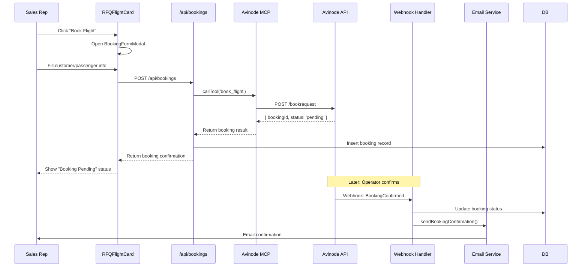
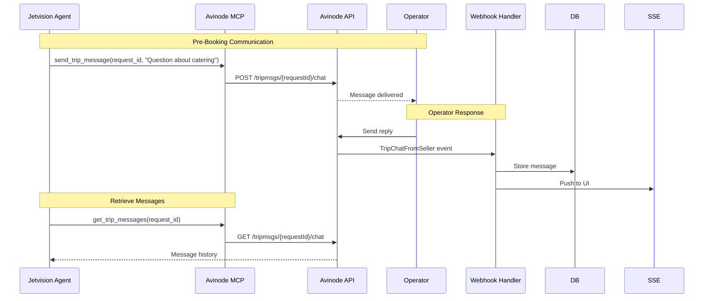

# ONEK-141: Flight Booking Backend Flow

**Linear Issue:** ONEK-141
**Priority:** High
**Status:** Todo
**Type:** Feature Implementation

---

## Overview

Implement the complete flight booking backend flow from quote acceptance to booking confirmation. This includes new Avinode MCP tools for:
1. Generating PDF proposals from quotes
2. Accepting/booking quotes
3. Declining quotes
4. Tracking booking status

---

## Avinode API Reference

### Endpoints Required

| Endpoint | Method | Purpose |
|----------|--------|---------|
| `/api/streams/quotes/{id}` | GET | Download quote as PDF |
| `/tripmsgs/{requestId}/submitQuote` | POST | Accept/submit quote (for operators) |
| `/tripmsgs/{requestId}/decline` | POST | Decline an RFQ |
| `/bookrequest` | POST | Create booking request |
| `/bookings/{id}` | GET | Get booking status |

### Authentication Headers

All requests require:
```
X-Avinode-ApiToken: <API_TOKEN>
Authorization: Bearer <JWT_TOKEN>
X-Avinode-SentTimestamp: <ISO-8601 UTC>
X-Avinode-ApiVersion: v1.0
X-Avinode-Product: Jetvision/1.0.0
Content-Type: application/json
```

---

## New MCP Tools Specification

### 1. `generate_quote_pdf`

Downloads a quote as PDF from Avinode API.

```typescript
{
  name: 'generate_quote_pdf',
  description: 'Generate PDF proposal document for a specific quote from Avinode',
  inputSchema: {
    type: 'object',
    properties: {
      quote_id: {
        type: 'string',
        description: 'The Avinode quote ID (e.g., "aquo-123456")'
      },
      include_terms: {
        type: 'boolean',
        description: 'Include terms and conditions in PDF',
        default: true
      },
      branding: {
        type: 'object',
        properties: {
          company_name: { type: 'string' },
          logo_url: { type: 'string' },
          contact_info: { type: 'string' }
        },
        description: 'Optional branding for PDF header'
      }
    },
    required: ['quote_id']
  }
}
```

#### Implementation

```typescript
async function generateQuotePdf(params: GenerateQuotePdfParams) {
  const quoteId = extractNumericId(params.quote_id);

  // Avinode returns binary PDF
  const response = await avinodeClient.get(`/streams/quotes/${quoteId}`, {
    responseType: 'arraybuffer',
    headers: {
      'Accept': 'application/pdf'
    }
  });

  // Return base64 encoded PDF
  return {
    quote_id: params.quote_id,
    pdf_base64: Buffer.from(response).toString('base64'),
    filename: `Quote_${quoteId}.pdf`,
    mime_type: 'application/pdf',
    generated_at: new Date().toISOString()
  };
}
```

### 2. `book_flight`

Creates a booking request for an accepted quote.

```typescript
{
  name: 'book_flight',
  description: 'Create booking request to confirm a flight quote. This initiates the booking process with the operator.',
  inputSchema: {
    type: 'object',
    properties: {
      quote_id: {
        type: 'string',
        description: 'The Avinode quote ID to book'
      },
      trip_id: {
        type: 'string',
        description: 'The trip ID containing the quote'
      },
      customer: {
        type: 'object',
        properties: {
          name: { type: 'string' },
          email: { type: 'string' },
          phone: { type: 'string' },
          company: { type: 'string' }
        },
        required: ['name', 'email']
      },
      passengers: {
        type: 'array',
        items: {
          type: 'object',
          properties: {
            first_name: { type: 'string' },
            last_name: { type: 'string' },
            date_of_birth: { type: 'string' },
            passport_number: { type: 'string' },
            nationality: { type: 'string' }
          },
          required: ['first_name', 'last_name']
        },
        description: 'Passenger manifest'
      },
      payment_method: {
        type: 'string',
        enum: ['wire_transfer', 'credit_card', 'invoice'],
        description: 'Payment method for booking'
      },
      special_requests: {
        type: 'string',
        description: 'Special requests or notes for operator'
      },
      client_reference: {
        type: 'string',
        description: 'Internal booking reference'
      }
    },
    required: ['quote_id', 'trip_id', 'customer']
  }
}
```

#### Implementation

```typescript
async function bookFlight(params: BookFlightParams) {
  const quoteId = extractNumericId(params.quote_id);
  const tripId = extractNumericId(params.trip_id);

  // Build booking request per Avinode API
  const requestBody = {
    quoteId: quoteId,
    tripId: tripId,
    buyer: {
      name: params.customer.name,
      email: params.customer.email,
      phone: params.customer.phone,
      company: params.customer.company
    },
    passengers: params.passengers?.map(p => ({
      firstName: p.first_name,
      lastName: p.last_name,
      dateOfBirth: p.date_of_birth,
      passportNumber: p.passport_number,
      nationality: p.nationality
    })),
    paymentMethod: params.payment_method || 'wire_transfer',
    notes: params.special_requests,
    externalReference: params.client_reference
  };

  const response = await avinodeClient.post('/bookrequest', requestBody);

  return {
    booking_id: response.bookingId || response.id,
    quote_id: params.quote_id,
    trip_id: params.trip_id,
    status: response.status || 'pending',
    confirmation_number: response.confirmationNumber,
    operator_response_deadline: response.responseDeadline,
    created_at: new Date().toISOString(),
    next_steps: 'Awaiting operator confirmation. You will receive a webhook when confirmed.'
  };
}
```

### 3. `decline_quote`

Declines an RFQ/quote from an operator.

```typescript
{
  name: 'decline_quote',
  description: 'Decline an RFQ or quote. Use when the customer chooses not to proceed with a quote.',
  inputSchema: {
    type: 'object',
    properties: {
      request_id: {
        type: 'string',
        description: 'The Avinode RFQ/request ID to decline'
      },
      reason: {
        type: 'string',
        enum: ['price_too_high', 'timing_not_suitable', 'different_aircraft_needed', 'customer_cancelled', 'other'],
        description: 'Reason for declining'
      },
      message: {
        type: 'string',
        description: 'Optional message to operator'
      }
    },
    required: ['request_id', 'reason']
  }
}
```

#### Implementation

```typescript
async function declineQuote(params: DeclineQuoteParams) {
  const requestId = extractNumericId(params.request_id);

  const response = await avinodeClient.post(`/tripmsgs/${requestId}/decline`, {
    reason: params.reason,
    message: params.message
  });

  return {
    request_id: params.request_id,
    status: 'declined',
    declined_at: new Date().toISOString(),
    reason: params.reason
  };
}
```

### 4. `get_booking_status`

Retrieves the current status of a booking.

```typescript
{
  name: 'get_booking_status',
  description: 'Get the current status of a flight booking',
  inputSchema: {
    type: 'object',
    properties: {
      booking_id: {
        type: 'string',
        description: 'The booking ID to check'
      }
    },
    required: ['booking_id']
  }
}
```

---

## Database Schema Updates

### New `bookings` Table

```sql
-- Migration: 026_create_bookings_table.sql

CREATE TABLE IF NOT EXISTS bookings (
  id UUID PRIMARY KEY DEFAULT gen_random_uuid(),
  request_id UUID REFERENCES requests(id) ON DELETE CASCADE,
  avinode_booking_id TEXT UNIQUE,
  avinode_quote_id TEXT NOT NULL,
  avinode_trip_id TEXT NOT NULL,

  -- Customer info
  customer_name TEXT NOT NULL,
  customer_email TEXT NOT NULL,
  customer_phone TEXT,
  customer_company TEXT,

  -- Booking details
  status TEXT NOT NULL DEFAULT 'pending',
  confirmation_number TEXT,
  total_price NUMERIC(12,2),
  currency TEXT DEFAULT 'USD',
  payment_method TEXT,
  payment_status TEXT DEFAULT 'pending',

  -- Flight details snapshot
  departure_airport TEXT NOT NULL,
  arrival_airport TEXT NOT NULL,
  departure_date TIMESTAMPTZ NOT NULL,
  aircraft_type TEXT,
  operator_name TEXT,

  -- Passenger manifest (JSONB array)
  passengers JSONB,

  -- Timestamps
  created_at TIMESTAMPTZ DEFAULT NOW(),
  updated_at TIMESTAMPTZ DEFAULT NOW(),
  confirmed_at TIMESTAMPTZ,
  cancelled_at TIMESTAMPTZ,

  -- Metadata
  special_requests TEXT,
  internal_notes TEXT,
  client_reference TEXT
);

-- Indexes
CREATE INDEX idx_bookings_request_id ON bookings(request_id);
CREATE INDEX idx_bookings_status ON bookings(status);
CREATE INDEX idx_bookings_customer_email ON bookings(customer_email);
CREATE INDEX idx_bookings_avinode_booking_id ON bookings(avinode_booking_id);

-- RLS
ALTER TABLE bookings ENABLE ROW LEVEL SECURITY;
```

### Booking Status Enum

```typescript
enum BookingStatus {
  PENDING = 'pending',           // Booking request sent to operator
  CONFIRMED = 'confirmed',       // Operator confirmed booking
  PAYMENT_PENDING = 'payment_pending',  // Awaiting payment
  PAID = 'paid',                 // Payment received
  COMPLETED = 'completed',       // Flight completed
  CANCELLED = 'cancelled',       // Booking cancelled
  REFUNDED = 'refunded'          // Refund processed
}
```

---

## API Routes

### `POST /api/bookings`

Creates a new booking from a selected quote.

```typescript
// app/api/bookings/route.ts

export async function POST(request: Request) {
  const { quote_id, trip_id, customer, passengers, payment_method } = await request.json();

  // Call Avinode MCP to create booking
  const mcpClient = getMCPClient('avinode-mcp-server');
  const result = await mcpClient.callTool('book_flight', {
    quote_id,
    trip_id,
    customer,
    passengers,
    payment_method
  });

  // Store in database
  const booking = await supabase.from('bookings').insert({
    avinode_booking_id: result.booking_id,
    avinode_quote_id: quote_id,
    avinode_trip_id: trip_id,
    customer_name: customer.name,
    customer_email: customer.email,
    status: 'pending'
  }).select().single();

  return NextResponse.json(booking);
}
```

### `GET /api/bookings/[id]`

Retrieves booking details.

### `PATCH /api/bookings/[id]/status`

Updates booking status (from webhook events).

---

## Webhook Integration

### New Webhook Events

| Event Type | Description |
|------------|-------------|
| `BookingConfirmed` | Operator confirmed the booking |
| `BookingCancelled` | Booking was cancelled |
| `BookingUpdated` | Booking details changed |
| `PaymentReceived` | Payment confirmed |

### Webhook Handler Update

```typescript
// app/api/webhooks/avinode/route.ts

case 'BookingConfirmed':
  await supabase.from('bookings')
    .update({
      status: 'confirmed',
      confirmation_number: payload.confirmationNumber,
      confirmed_at: new Date().toISOString()
    })
    .eq('avinode_booking_id', payload.bookingId);

  // Trigger confirmation email
  await emailService.sendBookingConfirmation(payload);
  break;
```

---

## UI Integration

### RFQFlightCard Update

The `onBookFlight` callback in `components/avinode/rfq-flight-card.tsx` needs to:

1. Open booking form modal
2. Collect customer/passenger information
3. Call `/api/bookings` endpoint
4. Show confirmation/status

```typescript
// components/avinode/booking-form-modal.tsx

interface BookingFormProps {
  quote: Quote;
  onSubmit: (bookingData: BookingFormData) => Promise<void>;
  onClose: () => void;
}

export function BookingFormModal({ quote, onSubmit, onClose }: BookingFormProps) {
  const [formData, setFormData] = useState<BookingFormData>({
    customer: { name: '', email: '' },
    passengers: [],
    payment_method: 'wire_transfer'
  });

  const handleSubmit = async () => {
    await onSubmit({
      quote_id: quote.id,
      trip_id: quote.tripId,
      ...formData
    });
  };

  return (
    <Dialog open onOpenChange={onClose}>
      <DialogContent>
        <DialogHeader>
          <DialogTitle>Confirm Booking</DialogTitle>
        </DialogHeader>
        {/* Form fields */}
        <Button onClick={handleSubmit}>Confirm Booking</Button>
      </DialogContent>
    </Dialog>
  );
}
```

---

## End-to-End Flow



---

## Testing Plan

### Unit Tests

```typescript
describe('Avinode Booking MCP Tools', () => {
  describe('generate_quote_pdf', () => {
    it('should download PDF from Avinode API', async () => {});
    it('should return base64 encoded PDF', async () => {});
    it('should handle invalid quote ID', async () => {});
  });

  describe('book_flight', () => {
    it('should create booking request', async () => {});
    it('should validate required customer fields', async () => {});
    it('should handle API errors', async () => {});
  });

  describe('decline_quote', () => {
    it('should decline RFQ with reason', async () => {});
    it('should require valid reason enum', async () => {});
  });
});
```

### Integration Tests

```typescript
describe('Booking Flow Integration', () => {
  it('should complete full booking flow', async () => {
    // Create trip → Get quotes → Book → Confirm
  });

  it('should handle booking rejection', async () => {});

  it('should process webhook confirmation', async () => {});
});
```

---

## Acceptance Criteria

- [ ] `generate_quote_pdf` tool implemented and tested
- [ ] `book_flight` tool implemented and tested
- [ ] `decline_quote` tool implemented and tested
- [ ] `get_booking_status` tool implemented and tested
- [ ] Database `bookings` table created
- [ ] `/api/bookings` endpoints implemented
- [ ] Webhook handler updated for booking events
- [ ] BookingFormModal component created
- [ ] RFQFlightCard `onBookFlight` integrated
- [ ] Booking confirmation email flow working
- [ ] Unit tests at 75% coverage
- [ ] Integration tests passing

---

---

## ISO-Operator Chat Messaging

### Existing MCP Tools (Already Implemented)

The following chat messaging tools are already available in the Avinode MCP server:

| Tool | Endpoint | Purpose |
|------|----------|---------|
| `send_trip_message` | `POST /tripmsgs/{requestId}/chat` | Send message to operator |
| `get_trip_messages` | `GET /tripmsgs/{requestId}/chat` | Get message history |
| `get_message` | `GET /tripmsgs/{messageId}` | Get specific message |

### Webhook Events for Chat

Per [Avinode Webhooks Documentation](https://developer.avinodegroup.com/docs/avinode-webhooks):

| Event | Description | Handler |
|-------|-------------|---------|
| `TripChatFromSeller` | Operator sends message to broker | Stores in `avinode_webhook_events` |
| `TripChatFromBuyer` | Broker sends message to operator | Confirmation |
| `TripChatMine` | Internal company chat activity | Logging |

### Webhook Payload Structure

```json
{
  "id": "asellermsg-1000000007",
  "href": "https://sandbox.avinode.com/api/tripmsgs/asellermsg-1000000007",
  "type": "tripmsgs"
}
```

### Chat Integration with Booking Flow

The Jetvision agent can use chat for:

1. **Pre-booking clarifications** - Ask operator about availability, catering, special requests
2. **Price negotiations** - Discuss pricing with operator before booking
3. **Post-booking coordination** - Communicate passenger details, schedule changes
4. **Issue resolution** - Handle problems during booking process

### Agent Chat Workflow



### Message Handling Best Practices

From Avinode documentation:
- Messages can be up to **5KB**
- Use `\n` for line breaks
- Webhook server must respond with **HTTP 200**
- Always use the `href` URL from webhook payload to fetch message details
- Handle unknown notification types gracefully

---

## Related Files

- `mcp-servers/avinode-mcp-server/src/index.ts` - Add new tools
- `mcp-servers/avinode-mcp-server/src/types.ts` - Add type definitions
- `app/api/bookings/route.ts` - New API route
- `app/api/webhooks/avinode/route.ts` - Update webhook handler (chat already handled)
- `components/avinode/rfq-flight-card.tsx` - UI integration
- `components/avinode/booking-form-modal.tsx` - New component
- `supabase/migrations/026_create_bookings_table.sql` - New migration
