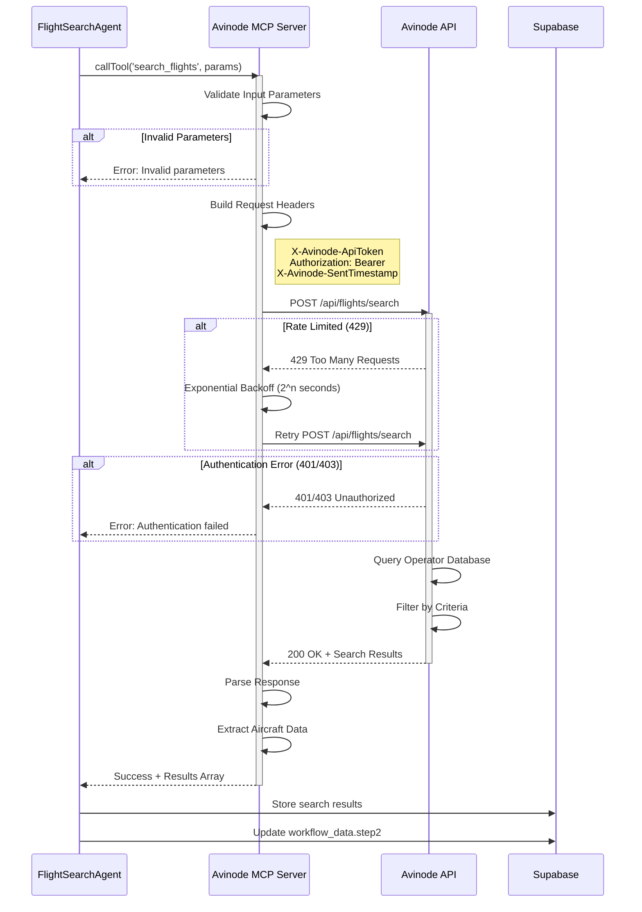
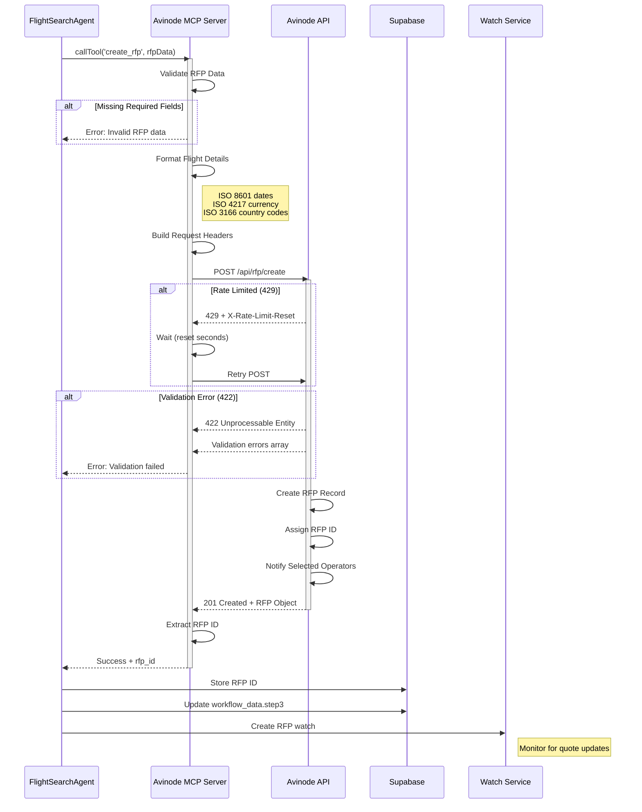
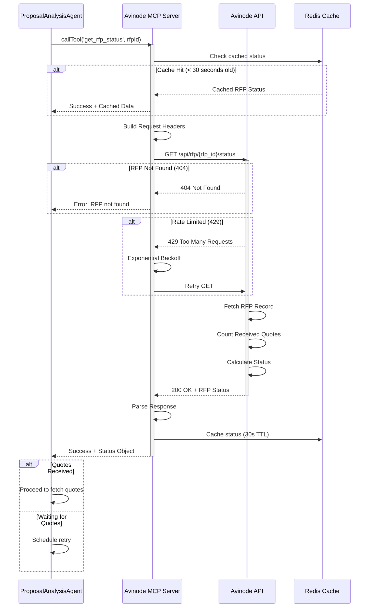
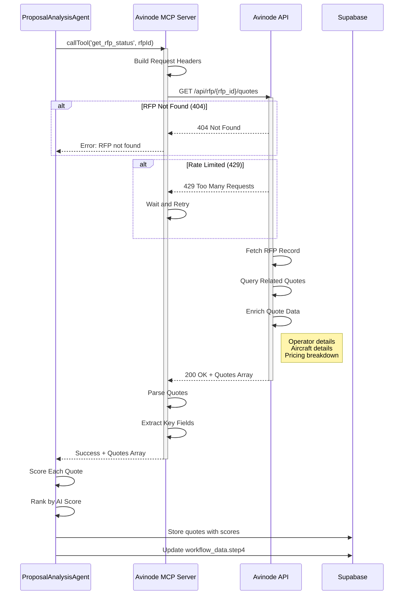
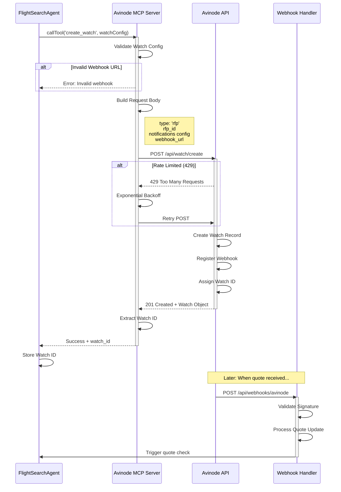
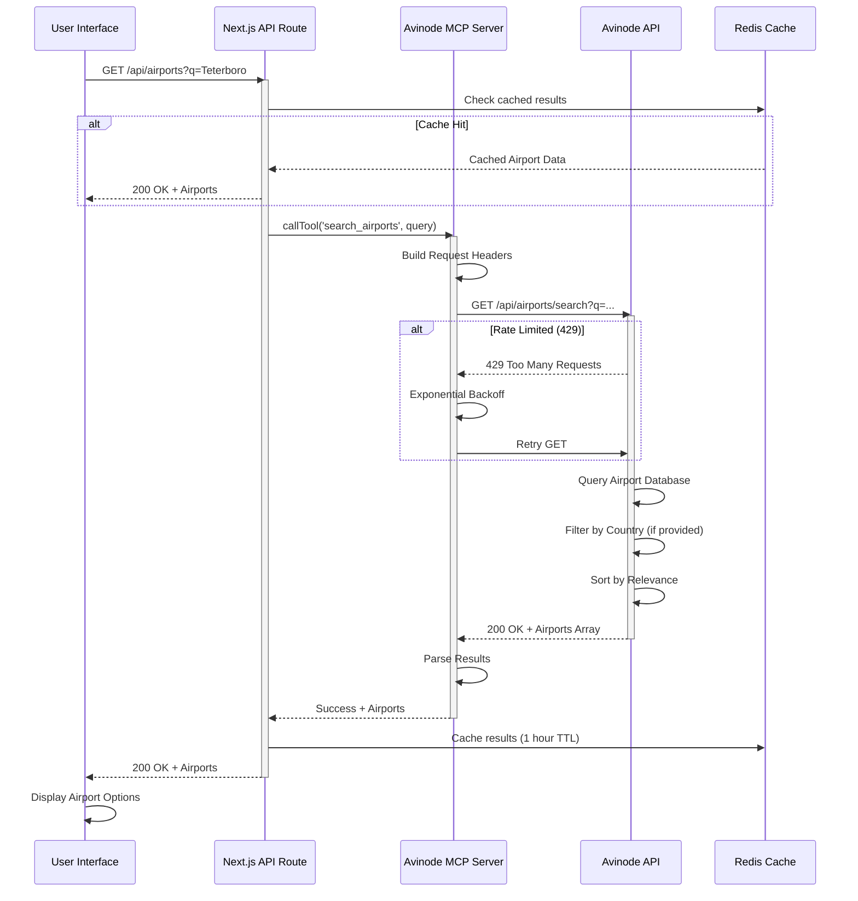
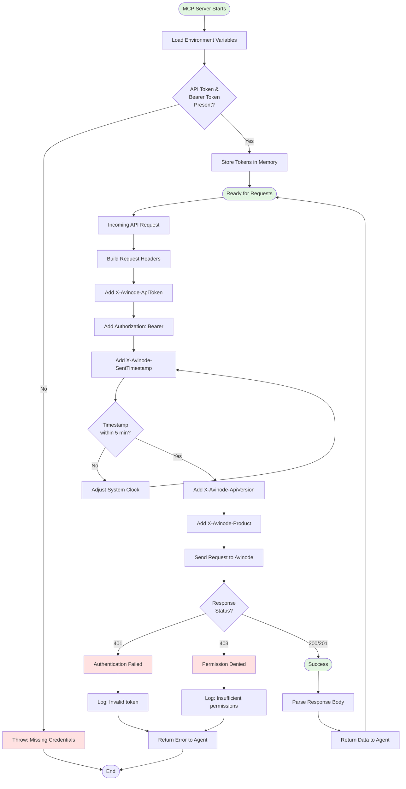
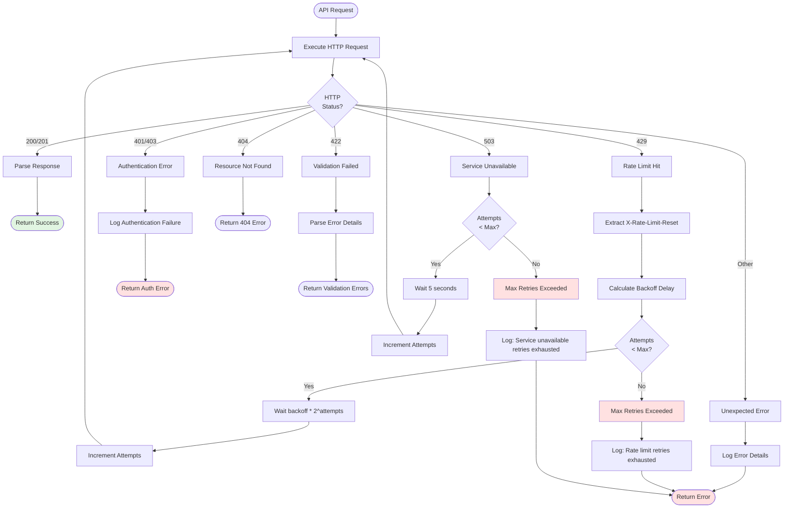

# Workflow Visualization - Avinode Integration Guide

**Date**: October 22, 2025
**Status**: Using Dummy Data (Sandbox Not Configured)
**Component**: `components/workflow-visualization.tsx`

---

## ⚠️ Current Implementation Status

### Dummy Data Mode
**The Avinode MCP server is currently using dummy/mock data** because the Avinode API Sandbox has not been configured yet. To use real Avinode data, you must:

1. **Contact Avinode Group** to request sandbox access
2. **Obtain API credentials** (API Token and Bearer Token)
3. **Configure authentication** in the MCP server
4. **Test in sandbox environment** before production deployment

See the [Avinode API Setup](#avinode-api-setup) section below for detailed instructions.

---

## Overview

The workflow visualization component has been enhanced to support:
1. **Clickable/expandable steps** - Users can click any step to show/hide details
2. **Real Avinode data** - Displays actual results from FlightSearchAgent and ProposalAnalysisAgent (when sandbox is configured)
3. **Sequential display** - Results appear automatically as each workflow step completes

## Master Activity Diagram

The following diagram shows the complete end-to-end Avinode API integration workflow for JetVision's flight search and booking process:

```mermaid
flowchart TD
    Start([User Submits Flight Request]) --> Parse[OrchestratorAgent: Parse Request]
    Parse --> ValidateInput{Valid Input?}
    ValidateInput -->|No| ErrorInput[Return Validation Error]
    ValidateInput -->|Yes| InitWorkflow[Initialize Workflow State Machine]

    InitWorkflow --> SearchFlights[FlightSearchAgent: Search Flights]
    SearchFlights --> AuthAvinode1{Authenticate<br/>with Avinode}
    AuthAvinode1 -->|401/403| AuthError1[Handle Auth Error]
    AuthError1 --> RetryAuth1{Retry?}
    RetryAuth1 -->|Yes| AuthAvinode1
    RetryAuth1 -->|No| FailWorkflow1[Fail Workflow]

    AuthAvinode1 -->|Success| CallSearchAPI[POST /api/flights/search]
    CallSearchAPI --> RateLimit1{Rate Limited<br/>429?}
    RateLimit1 -->|Yes| Backoff1[Exponential Backoff]
    Backoff1 --> CallSearchAPI
    RateLimit1 -->|No| ProcessSearch[Process Search Results]

    ProcessSearch --> CheckResults{Aircraft<br/>Found?}
    CheckResults -->|No| NoResults[Return: No Aircraft Available]
    CheckResults -->|Yes| FilterAircraft[Filter by Capacity/Range]

    FilterAircraft --> UpdateWorkflow1[Update Workflow: Step 2 Complete]
    UpdateWorkflow1 --> SelectOperators[Select Top Operators]

    SelectOperators --> CreateRFP[FlightSearchAgent: Create RFP]
    CreateRFP --> AuthAvinode2{Authenticate<br/>with Avinode}
    AuthAvinode2 -->|401/403| AuthError2[Handle Auth Error]
    AuthError2 --> RetryAuth2{Retry?}
    RetryAuth2 -->|Yes| AuthAvinode2
    RetryAuth2 -->|No| FailWorkflow2[Fail Workflow]

    AuthAvinode2 -->|Success| CallCreateRFP[POST /api/rfp/create]
    CallCreateRFP --> RateLimit2{Rate Limited<br/>429?}
    RateLimit2 -->|Yes| Backoff2[Exponential Backoff]
    Backoff2 --> CallCreateRFP
    RateLimit2 -->|No| RFPCreated[RFP Created Successfully]

    RFPCreated --> StoreRFPID[Store RFP ID in Workflow]
    StoreRFPID --> UpdateWorkflow2[Update Workflow: Step 3 In Progress]
    UpdateWorkflow2 --> CreateWatch[Create Watch for RFP Updates]

    CreateWatch --> WaitQuotes[Wait for Operator Quotes]
    WaitQuotes --> CheckQuotes{Check RFP<br/>Status}
    CheckQuotes --> CallGetStatus[GET /api/rfp/:id/status]
    CallGetStatus --> RateLimit3{Rate Limited<br/>429?}
    RateLimit3 -->|Yes| Backoff3[Exponential Backoff]
    Backoff3 --> CallGetStatus

    RateLimit3 -->|No| QuotesReceived{Quotes<br/>Received?}
    QuotesReceived -->|No| Timeout{Deadline<br/>Reached?}
    Timeout -->|No| WaitQuotes
    Timeout -->|Yes| PartialQuotes[Process Partial Quotes]
    QuotesReceived -->|Yes| UpdateWorkflow3[Update Workflow: Step 3 Complete]

    PartialQuotes --> UpdateWorkflow3
    UpdateWorkflow3 --> AnalyzeProposals[ProposalAnalysisAgent: Analyze Quotes]

    AnalyzeProposals --> FetchQuoteDetails[GET /api/rfp/:id/quotes]
    FetchQuoteDetails --> RateLimit4{Rate Limited<br/>429?}
    RateLimit4 -->|Yes| Backoff4[Exponential Backoff]
    Backoff4 --> FetchQuoteDetails
    RateLimit4 -->|No| ScoreQuotes[Score and Rank Quotes]

    ScoreQuotes --> ApplyAI[Apply AI Scoring Algorithm]
    ApplyAI --> CompareOptions[Compare Pricing & Features]
    CompareOptions --> RankProposals[Rank Top 3 Proposals]

    RankProposals --> UpdateWorkflow4[Update Workflow: Step 4 Complete]
    UpdateWorkflow4 --> UpdateSupabase[Store Quotes in Supabase]

    UpdateSupabase --> GenerateProposal[CommunicationAgent: Generate Proposal]
    GenerateProposal --> ApplyMargin[Apply JetVision Margin]
    ApplyMargin --> CreatePDF[Generate PDF Document]
    CreatePDF --> BrandingCheck{PDF<br/>Valid?}
    BrandingCheck -->|No| RetryPDF[Regenerate PDF]
    RetryPDF --> CreatePDF
    BrandingCheck -->|Yes| UpdateWorkflow5[Update Workflow: Step 5 Complete]

    UpdateWorkflow5 --> NotifyUser[Notify User: Proposal Ready]
    NotifyUser --> SendEmail{Auto-send<br/>Email?}
    SendEmail -->|Yes| EmailAgent[CommunicationAgent: Send Email]
    EmailAgent --> DeliveryStatus{Email<br/>Delivered?}
    DeliveryStatus -->|No| LogFailure[Log Email Failure]
    DeliveryStatus -->|Yes| MarkSent[Mark Proposal Sent]
    SendEmail -->|No| ManualReview[Await Manual Review]

    MarkSent --> Complete([Workflow Complete])
    ManualReview --> Complete
    LogFailure --> Complete

    ErrorInput --> End([End])
    NoResults --> End
    FailWorkflow1 --> End
    FailWorkflow2 --> End

    style Start fill:#e1f5e1
    style Complete fill:#e1f5e1
    style End fill:#ffe1e1
    style ErrorInput fill:#ffe1e1
    style NoResults fill:#fff4e1
    style FailWorkflow1 fill:#ffe1e1
    style FailWorkflow2 fill:#ffe1e1
```



## 5 Workflow Steps

```
Step 1: Understanding Request
  └─ Parsing natural language input

Step 2: Searching Aircraft
  └─ Querying Avinode operator database

Step 3: Requesting Quotes
  └─ Creating RFP in Avinode

Step 4: Analyzing Options
  └─ Scoring and ranking quotes

Step 5: Generate Proposal
  └─ Creating Jetvision branded quote
```

## New Features

### 1. Clickable Steps

**Both Embedded and Full Views**:
- Click any step header to expand/collapse details
- `+` icon when collapsed, `−` icon when expanded
- Smooth animations
- Details display in indented box with bullet points

### 2. Real Data Integration

Each step can now display real data from Avinode agents:

```typescript
export interface WorkflowStepData {
  // Real data from agents/API
  aircraftFound?: number          // Number of aircraft found
  operatorsQueried?: number       // Number of operators queried
  quotesReceived?: number         // Number of quotes received
  quotesAnalyzed?: number         // Number of quotes analyzed
  proposalGenerated?: boolean     // Whether proposal was created

  // Avinode-specific data
  avinodeRfpId?: string          // Avinode RFP ID
  avinodeQuotes?: any[]          // Array of quote objects from Avinode
  avinodeResults?: Record<string, any>  // Additional Avinode metadata
}
```

### 3. Sequential Display

Steps automatically update as workflow progresses:
- Status changes: `pending` → `in-progress` → `completed`
- Details populate from agent results
- Progress bar updates in real-time

## Task-Specific API Operation Diagrams

### 1. POST /api/flights/search - Search Available Flights



### 2. POST /api/rfp/create - Create Request for Proposal



### 3. GET /api/rfp/:id/status - Check RFP Status



### 4. GET /api/rfp/:id/quotes - Fetch All Quotes for RFP



### 5. POST /api/watch/create - Create RFP Watch



### 6. GET /api/airports/search - Search Airport Database



### 7. Authentication Flow



### 8. Error Handling & Retry Logic



## Integration with Agents

### Step 1: Understanding Request (OrchestratorAgent)

**Agent**: `OrchestratorAgent`
**No special data needed** - Uses hardcoded details

```typescript
// No workflowData required for Step 1
```

### Step 2: Searching Aircraft (FlightSearchAgent)

**Agent**: `FlightSearchAgent`
**Populates**: `workflowData.step2`

```typescript
// agents/implementations/flight-search-agent.ts

async execute(context: AgentContext): Promise<AgentResult> {
  // 1. Search for aircraft in Avinode
  const searchResults = await avinodeMCP.searchFlights({
    departure_airport: context.data.departureAirport,
    arrival_airport: context.data.arrivalAirport,
    passengers: context.data.passengers,
    // ... other params
  })

  // 2. Create workflow data
  const step2Data: WorkflowStepData = {
    operatorsQueried: searchResults.operators_queried || 0,
    aircraftFound: searchResults.aircraft_found || 0,
    avinodeResults: searchResults,
  }

  // 3. Update chat session
  await updateChatWorkflowData(context.sessionId, {
    step2: step2Data,
  })

  return {
    success: true,
    data: {
      searchResults,
      workflowData: step2Data,
    },
  }
}
```

**Display Example**:
```
Step 2: Searching Aircraft [Completed]
  • Queried 15 operators
  • Found 8 potential aircraft
  • Filtered by capacity and range
```

### Step 3: Requesting Quotes (FlightSearchAgent → Avinode RFP)

**Agent**: `FlightSearchAgent` (creates RFP)
**Populates**: `workflowData.step3`

```typescript
// agents/implementations/flight-search-agent.ts

async createRFP(context: AgentContext): Promise<AgentResult> {
  // 1. Create RFP in Avinode
  const rfp = await avinodeMCP.createRFP({
    flight_details: {
      departure_airport: context.data.departureAirport,
      arrival_airport: context.data.arrivalAirport,
      // ... flight details
    },
    operator_ids: operatorIds,
  })

  // 2. Create workflow data
  const step3Data: WorkflowStepData = {
    avinodeRfpId: rfp.rfp_id,
    operatorsQueried: operatorIds.length,
    quotesReceived: 0, // Initial value, updated later
  }

  // 3. Update chat session
  await updateChatWorkflowData(context.sessionId, {
    step3: step3Data,
    status: 'requesting_quotes',
  })

  return {
    success: true,
    data: {
      rfpId: rfp.rfp_id,
      workflowData: step3Data,
    },
  }
}
```

**Display Example (In Progress)**:
```
Step 3: Requesting Quotes [In Progress]
  • RFP ID: AVN-2025-10-22-ABC123
  • Sent requests to 6 operators
```

**Display Example (Completed)**:
```
Step 3: Requesting Quotes [Completed]
  • RFP ID: AVN-2025-10-22-ABC123
  • Received 6 quotes
  • Sent requests to 6 operators
```

### Step 4: Analyzing Options (ProposalAnalysisAgent)

**Agent**: `ProposalAnalysisAgent`
**Populates**: `workflowData.step4`

```typescript
// agents/implementations/proposal-analysis-agent.ts

async execute(context: AgentContext): Promise<AgentResult> {
  const rfpId = context.data.rfpId

  // 1. Fetch quotes from Avinode
  const rfpStatus = await avinodeMCP.getRFPStatus(rfpId)
  const quotes = rfpStatus.quotes || []

  // 2. Score and rank quotes
  const scoredQuotes = await this.scoreQuotes(quotes, context)

  // 3. Create workflow data
  const step4Data: WorkflowStepData = {
    quotesAnalyzed: quotes.length,
    avinodeQuotes: scoredQuotes,
  }

  // 4. Update chat session
  await updateChatWorkflowData(context.sessionId, {
    step4: step4Data,
    quotes: scoredQuotes.map(q => ({
      id: q.id,
      operatorName: q.operator_name,
      price: q.price,
      aiScore: q.ai_score,
      // ... other quote fields
    })),
    status: 'analyzing_options',
  })

  return {
    success: true,
    data: {
      scoredQuotes,
      workflowData: step4Data,
    },
  }
}
```

**Display Example**:
```
Step 4: Analyzing Options [Completed]
  • Analyzed 6 quotes
  • Compared 6 pricing options
  • Selected top 3 options
```

### Step 5: Generate Proposal (CommunicationAgent)

**Agent**: `CommunicationAgent`
**Populates**: `workflowData.step5`

```typescript
// agents/implementations/communication-agent.ts

async execute(context: AgentContext): Promise<AgentResult> {
  const selectedQuote = context.data.selectedQuote

  // 1. Generate proposal
  const proposal = await this.generateProposal(selectedQuote, context)

  // 2. Create workflow data
  const step5Data: WorkflowStepData = {
    proposalGenerated: true,
  }

  // 3. Update chat session
  await updateChatWorkflowData(context.sessionId, {
    step5: step5Data,
    status: 'proposal_ready',
  })

  return {
    success: true,
    data: {
      proposal,
      workflowData: step5Data,
    },
  }
}
```

**Display Example**:
```
Step 5: Generate Proposal [Completed]
  • Applied margin settings
  • Created Jetvision branded quote
  • Proposal ready for client
```

## API Integration

### Update Chat Session with Workflow Data

Create a helper function to update workflow data:

```typescript
// lib/helpers/workflow-helpers.ts

export async function updateChatWorkflowData(
  sessionId: string,
  updates: {
    step1?: WorkflowStepData
    step2?: WorkflowStepData
    step3?: WorkflowStepData
    step4?: WorkflowStepData
    step5?: WorkflowStepData
    status?: string
  }
) {
  // Update in-memory chat session (for real-time display)
  const chatSession = getChatSession(sessionId)
  if (chatSession) {
    chatSession.workflowData = {
      ...chatSession.workflowData,
      ...updates,
    }
    if (updates.status) {
      chatSession.status = updates.status
    }
  }

  // Optionally persist to database
  await supabase
    .from('chat_sessions')
    .update({
      workflow_data: updates,
      status: updates.status,
      updated_at: new Date().toISOString(),
    })
    .eq('id', sessionId)
}
```

### Real-time Updates via Supabase

```typescript
// lib/hooks/use-workflow-realtime.ts

export function useWorkflowRealtime(sessionId: string) {
  const [workflowData, setWorkflowData] = useState({})
  const supabase = createClientComponentClient()

  useEffect(() => {
    const channel = supabase
      .channel(`workflow-${sessionId}`)
      .on(
        'postgres_changes',
        {
          event: 'UPDATE',
          schema: 'public',
          table: 'chat_sessions',
          filter: `id=eq.${sessionId}`,
        },
        (payload) => {
          setWorkflowData(payload.new.workflow_data || {})
        }
      )
      .subscribe()

    return () => {
      supabase.removeChannel(channel)
    }
  }, [sessionId])

  return workflowData
}
```

## Usage in Chat Interface

Update the chat interface to pass workflow data:

```typescript
// components/chat-interface.tsx

import { WorkflowVisualization, type WorkflowStepData } from './workflow-visualization'
import { useWorkflowRealtime } from '@/lib/hooks/use-workflow-realtime'

export function ChatInterface({ activeChat, ... }: ChatInterfaceProps) {
  const workflowData = useWorkflowRealtime(activeChat.id)

  return (
    <div>
      {/* ... other chat UI */}

      {message.showWorkflow && (
        <div className="mt-4 p-4 bg-white dark:bg-gray-900 rounded-lg border">
          <WorkflowVisualization
            isProcessing={activeChat.status !== "proposal_ready"}
            embedded={true}
            currentStep={activeChat.currentStep}
            status={activeChat.status}
            workflowData={workflowData}  {/* Pass real data */}
          />
        </div>
      )}
    </div>
  )
}
```

## Testing

### Manual Testing

1. **Start a flight search**
2. **Click each step** to verify expand/collapse works
3. **Verify details display** for completed steps
4. **Check progress bar** updates correctly

### With Mock Data

```typescript
// Test with sample workflow data
const sampleWorkflowData = {
  step2: {
    operatorsQueried: 15,
    aircraftFound: 8,
  },
  step3: {
    avinodeRfpId: 'AVN-2025-10-22-TEST123',
    operatorsQueried: 6,
    quotesReceived: 6,
  },
  step4: {
    quotesAnalyzed: 6,
    avinodeQuotes: [/* quote objects */],
  },
  step5: {
    proposalGenerated: true,
  },
}

<WorkflowVisualization
  status="proposal_ready"
  currentStep={5}
  workflowData={sampleWorkflowData}
  embedded={true}
/>
```

### With Real Avinode Data

```typescript
// Integration test with real Avinode MCP
const rfp = await avinodeMCP.createRFP({
  flight_details: { /* ... */ },
  operator_ids: ['OP123', 'OP456'],
})

const rfpStatus = await avinodeMCP.getRFPStatus(rfp.rfp_id)

const workflowData = {
  step3: {
    avinodeRfpId: rfp.rfp_id,
    quotesReceived: rfpStatus.quotes_received,
    operatorsQueried: rfpStatus.operators_queried,
  },
}
```

## UI Behavior

### Embedded View (In Chat)

- Compact vertical list of steps
- Click step header to expand/collapse
- Shows + / − icon
- Details indent with left border
- Progress bar at bottom

### Full View (Workflow Page)

- Full-width cards
- Click anywhere on card to expand/collapse
- Shows + / − icon next to status badge
- Details in gray box with bullets
- Progress bar at bottom

## Benefits

✅ **User-friendly** - Click to see details on demand
✅ **Real data** - Shows actual Avinode results, not mock data
✅ **Sequential** - Updates automatically as workflow progresses
✅ **Transparent** - Users see exactly what's happening (RFP IDs, quote counts)
✅ **Reusable** - Same component works in chat and full-page views

## Avinode API Setup

### Prerequisites

Before integrating with the real Avinode API, complete these steps:

#### 1. Request Sandbox Access

Contact your Avinode Group representative to:
- Define your specific use case (schedule uploads, RFQ management, trip search, etc.)
- Obtain sandbox environment access
- Receive API credentials

**Access URL**: https://sandbox.avinode.com

#### 2. Authentication Configuration

The Avinode API requires **two authentication tokens**:

```typescript
// mcp-servers/avinode-mcp-server/.env
AVINODE_API_TOKEN=your-api-token-here          // X-Avinode-ApiToken header
AVINODE_BEARER_TOKEN=your-bearer-token-here    // Authorization: Bearer token
```

**Security Note**: Treat these tokens like passwords. Never commit them to version control or share publicly.

#### 3. Required HTTP Headers

All Avinode API requests must include:

```typescript
const headers = {
  'Content-Type': 'application/json',
  'X-Avinode-ApiToken': process.env.AVINODE_API_TOKEN,
  'Authorization': `Bearer ${process.env.AVINODE_BEARER_TOKEN}`,
  'X-Avinode-SentTimestamp': new Date().toISOString(), // ISO-8601 UTC (must be within 5 minutes)
  'X-Avinode-ApiVersion': 'v1.0',
  'X-Avinode-Product': 'Jetvision/1.0.0',
  'Accept-Encoding': 'gzip', // Optional, for compression
}
```

#### 4. Data Format Standards

Follow these ISO standards for API requests:

- **Dates/Times**: ISO 8601 format (e.g., `2025-11-20T14:00:00Z`)
- **Currency**: ISO 4217 codes (e.g., `USD`, `EUR`, `GBP`)
- **Countries**: ISO 3166-1 alpha-2 codes (e.g., `US`, `GB`, `FR`)
- **Provinces/States**: ISO 3166-2 format (e.g., `US-FL`, `US-CA`)

#### 5. Rate Limiting

Avinode enforces rate limits of **~1 call per second** with burst tolerance:

- **429 Too Many Requests** response when rate limited
- Response headers:
  - `X-Rate-Limit-Limit`: Allowed calls per hour
  - `X-Rate-Limit-Remaining`: Calls remaining in current window
  - `X-Rate-Limit-Reset`: Seconds until counter resets

**Recommendation**: Implement exponential backoff retry logic for 429 errors.

#### 6. Sandbox Environment Notes

**Important Limitations**:

- **Shared environment**: Multiple customers may be testing simultaneously
- **Weekly data reset**: Database rebuilds every Monday (6-8 AM UTC)
- **Password reset required**: After each weekly reset
- **Data confidentiality**: Do not extract or disclose sandbox data to third parties
- **Lifecycle**: Sandbox access continues alongside production access

**Test Data Setup**:
1. Log in to https://sandbox.avinode.com
2. Create test RFQs, quotes, and empty legs
3. Use test data to verify your integration

### MCP Server Configuration

Update the Avinode MCP server to use real credentials:

```typescript
// mcp-servers/avinode-mcp-server/src/index.ts

import { Client } from '@modelcontextprotocol/sdk/client/index.js';

const AVINODE_BASE_URL = process.env.AVINODE_SANDBOX_MODE === 'true'
  ? 'https://sandbox.avinode.com/api'
  : 'https://api.avinode.com';

const AVINODE_API_TOKEN = process.env.AVINODE_API_TOKEN;
const AVINODE_BEARER_TOKEN = process.env.AVINODE_BEARER_TOKEN;

if (!AVINODE_API_TOKEN || !AVINODE_BEARER_TOKEN) {
  throw new Error('Missing Avinode API credentials. Set AVINODE_API_TOKEN and AVINODE_BEARER_TOKEN in .env');
}

async function makeAvinodeRequest(endpoint: string, options: RequestInit = {}) {
  const url = `${AVINODE_BASE_URL}${endpoint}`;

  const headers = {
    'Content-Type': 'application/json',
    'X-Avinode-ApiToken': AVINODE_API_TOKEN,
    'Authorization': `Bearer ${AVINODE_BEARER_TOKEN}`,
    'X-Avinode-SentTimestamp': new Date().toISOString(),
    'X-Avinode-ApiVersion': 'v1.0',
    'X-Avinode-Product': 'Jetvision/1.0.0',
    'Accept-Encoding': 'gzip',
    ...options.headers,
  };

  const response = await fetch(url, {
    ...options,
    headers,
  });

  // Handle rate limiting
  if (response.status === 429) {
    const resetSeconds = parseInt(response.headers.get('X-Rate-Limit-Reset') || '60');
    throw new Error(`Rate limited. Retry after ${resetSeconds} seconds`);
  }

  if (!response.ok) {
    throw new Error(`Avinode API error: ${response.status} ${response.statusText}`);
  }

  return response.json();
}
```

### HTTP Status Codes

Handle these common API responses:

- **200 OK**: Successful GET/PUT request
- **201 Created**: Successful POST request
- **401 Unauthorized**: Invalid or missing authentication token
- **403 Forbidden**: Valid token but insufficient permissions
- **409 Conflict**: Simultaneous update conflict
- **422 Unprocessable Entity**: Validation failure
- **423 Locked**: Resource is locked
- **429 Too Many Requests**: Rate limit exceeded
- **503 Service Unavailable**: Temporary server issue

### Error Handling Example

```typescript
async function createRFPWithRetry(rfpData: RFPRequest, maxRetries = 3): Promise<RFPResponse> {
  let attempts = 0;

  while (attempts < maxRetries) {
    try {
      return await makeAvinodeRequest('/rfp/create', {
        method: 'POST',
        body: JSON.stringify(rfpData),
      });
    } catch (error) {
      attempts++;

      if (error.message.includes('Rate limited')) {
        // Exponential backoff
        const delay = Math.pow(2, attempts) * 1000;
        await new Promise(resolve => setTimeout(resolve, delay));
        continue;
      }

      throw error; // Non-rate-limit error, fail immediately
    }
  }

  throw new Error('Max retries exceeded for Avinode API request');
}
```

---

## Next Steps

### Phase 1: Sandbox Configuration (CURRENT)
1. ✅ **Contact Avinode** for sandbox access
2. ⏳ **Obtain API credentials** (API Token and Bearer Token)
3. ⏳ **Configure MCP server** with authentication
4. ⏳ **Test basic API calls** in sandbox environment
5. ⏳ **Verify data format compliance** with ISO standards

### Phase 2: Agent Integration
1. **Implement FlightSearchAgent** Avinode integration
2. **Implement ProposalAnalysisAgent** quote fetching
3. **Add real-time updates** via Supabase subscriptions
4. **Test with live Avinode** sandbox data
5. **Add error handling** for failed steps

### Phase 3: Production Deployment
1. **Pass Avinode implementation review**
2. **Obtain production API credentials**
3. **Configure production environment variables**
4. **Deploy to production**
5. **Monitor API usage and rate limits**

## Related Files

- `components/workflow-visualization.tsx` - Main component
- `agents/implementations/flight-search-agent.ts` - Step 2 & 3
- `agents/implementations/proposal-analysis-agent.ts` - Step 4
- `agents/implementations/communication-agent.ts` - Step 5
- `lib/hooks/use-workflow-realtime.ts` - Real-time updates
- `lib/helpers/workflow-helpers.ts` - Helper functions

## Summary

The workflow visualization is now **fully interactive** and ready to display **real Avinode results** from the agent workflow. Users can click each step to see detailed results, and the UI updates automatically as the workflow progresses through each stage! 🎯
