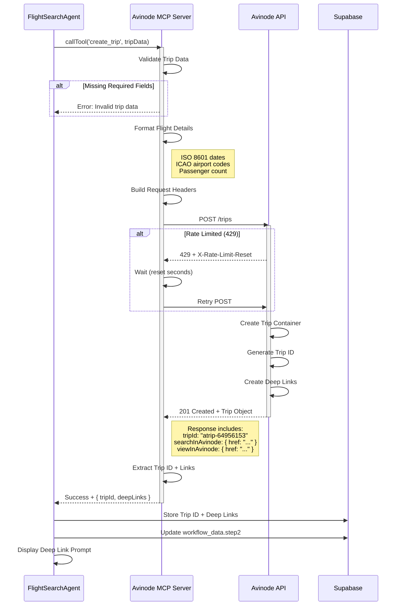
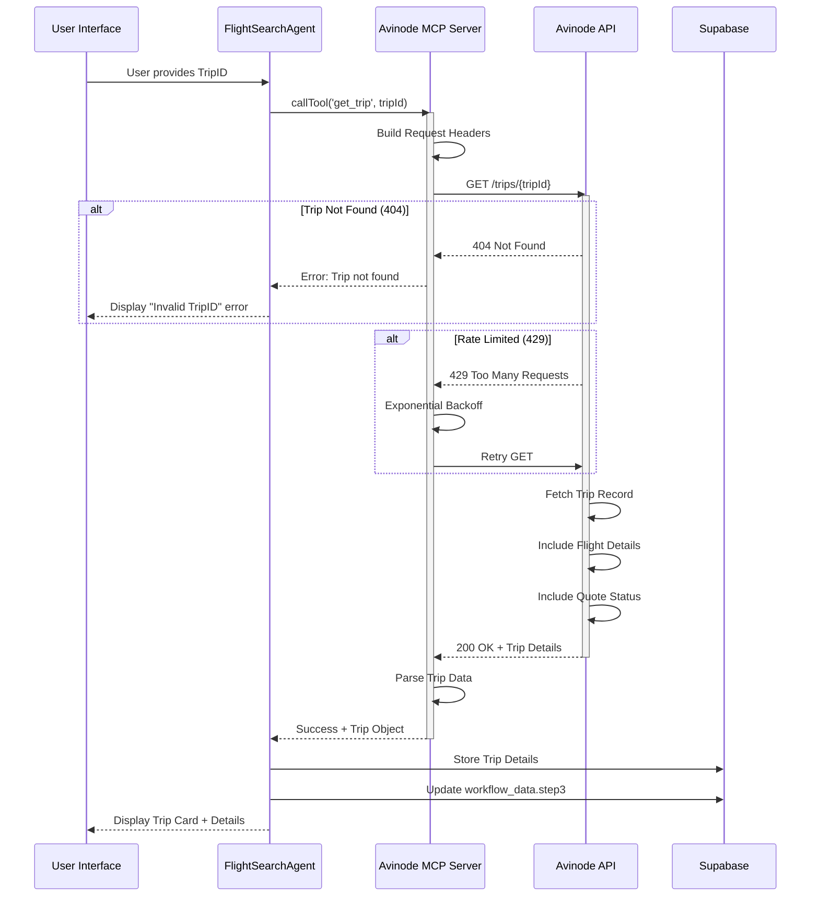
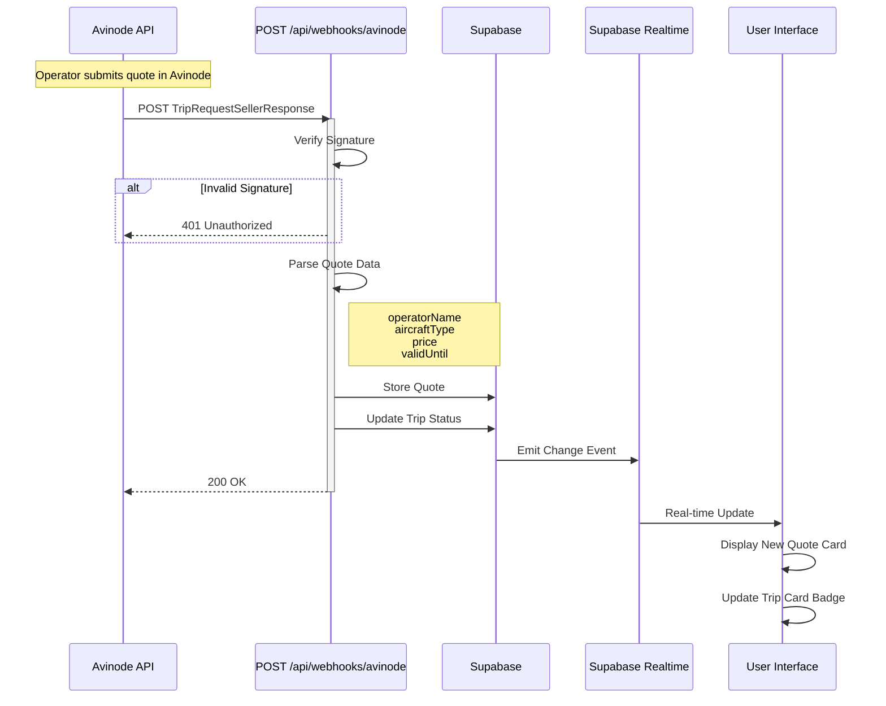
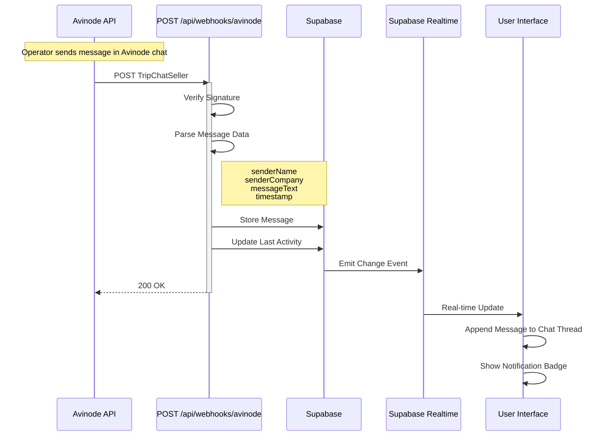

# Workflow Visualization - Avinode Integration Guide

**Date**: December 20, 2025
**Status**: Human-in-Loop Workflow (Deep Link + TripID)
**Component**: `components/workflow-visualization.tsx`

---

## Important: Avinode API Workflow Change

Due to Avinode API restrictions, the JetVision Assistant **cannot display flight availability directly** in the chat interface. Instead, the API returns a **Trip ID** and **deep link** for Sales Reps to manually search flights in the Avinode Web UI.

### What This Means

| Original Design (Deprecated) | Current Reality |
|------------------------------|-----------------|
| Agent searches flights via API | Agent creates a "trip container" |
| Agent displays flight options in chat | Agent provides deep link to Avinode |
| Agent requests quotes from operators | Sales Rep manually selects flights in Avinode |
| Agent receives quotes automatically | Quotes received via webhooks after manual RFQ |

### Why This Workflow Exists

Avinode's API has **restrictions on viewing/searching flights**:

1. **Proprietary Data**: Flight availability is proprietary marketplace data
2. **Licensing**: Displaying operator/flight data requires special licensing
3. **Human-in-Loop**: Avinode's broker workflow is designed for human interaction
4. **Regulatory**: Aviation industry requirements for quote handling

---

## Complete User Journey (5 Phases)

```
PHASE 1: INITIAL REQUEST (In Jetvision)
┌─────────────────────────────────────────────────────────────────────────────┐
│ 1. Sales rep opens Jetvision Assistant                                       │
│ 2. Rep submits flight request via chat:                                      │
│    - Departure airport (ICAO/IATA)                                          │
│    - Arrival airport (ICAO/IATA)                                            │
│    - Date and time                                                          │
│    - Passenger count                                                        │
│ 3. Agent processes request and calls Avinode API                            │
│ 4. API returns: Trip ID + Deep Link (NOT flight results)                    │
│ 5. Agent displays deep link prominently with clear instructions             │
└─────────────────────────────────────────────────────────────────────────────┘
                                    │
                                    ▼
PHASE 2: AVINODE MARKETPLACE (External - In Avinode Web UI)
┌─────────────────────────────────────────────────────────────────────────────┐
│ 6. Rep clicks deep link → opens Avinode Marketplace in new tab              │
│ 7. Rep confirms/adjusts flight details in Avinode                           │
│ 8. Rep browses available aircraft and operators                             │
│ 9. Rep selects one or multiple flights to request quotes                    │
│ 10. Rep communicates with operators via Avinode chat                        │
│ 11. Operators respond with quotes (creates TripID)                          │
│ 12. Rep notes the TripID from Avinode                                       │
└─────────────────────────────────────────────────────────────────────────────┘
                                    │
                                    ▼
PHASE 3: TRIPID SUBMISSION (Back in Jetvision)
┌─────────────────────────────────────────────────────────────────────────────┐
│ 13. Rep returns to Jetvision Assistant                                      │
│ 14. Rep provides TripID in chat or via dedicated input                      │
│ 15. Agent fetches trip details from Avinode API using TripID                │
│ 16. Trip card appears in left sidebar                                       │
│ 17. Full flight details displayed in chat thread                            │
└─────────────────────────────────────────────────────────────────────────────┘
                                    │
                                    ▼
PHASE 4: QUOTE MANAGEMENT (Webhook-driven updates)
┌─────────────────────────────────────────────────────────────────────────────┐
│ 18. Webhooks notify Jetvision of new quotes/status changes                  │
│ 19. Trip card updates automatically (pending → quoted)                      │
│ 20. Rep reviews quotes in Jetvision chat interface                          │
│ 21. Rep selects preferred quote                                             │
└─────────────────────────────────────────────────────────────────────────────┘
                                    │
                                    ▼
PHASE 5: PROPOSAL GENERATION (In Jetvision)
┌─────────────────────────────────────────────────────────────────────────────┐
│ 22. Agent generates quote PDF with:                                         │
│     - Flight details and aircraft image                                     │
│     - Price breakdown and payment instructions                              │
│     - Route map visualization                                               │
│ 23. Agent accesses Google Sheet for customer contacts                       │
│ 24. Rep reviews and approves proposal                                       │
│ 25. Agent sends email to customer                                           │
└─────────────────────────────────────────────────────────────────────────────┘
```

---

## Master Activity Diagram (Updated)

```mermaid
flowchart TD
    Start([User Submits Flight Request]) --> Parse[OrchestratorAgent: Parse Request]
    Parse --> ValidateInput{Valid Input?}
    ValidateInput -->|No| ErrorInput[Return Validation Error]
    ValidateInput -->|Yes| InitWorkflow[Initialize Workflow State Machine]

    InitWorkflow --> CreateTrip[FlightSearchAgent: Create Trip Container]
    CreateTrip --> AuthAvinode1{Authenticate<br/>with Avinode}
    AuthAvinode1 -->|401/403| AuthError1[Handle Auth Error]
    AuthError1 --> RetryAuth1{Retry?}
    RetryAuth1 -->|Yes| AuthAvinode1
    RetryAuth1 -->|No| FailWorkflow1[Fail Workflow]

    AuthAvinode1 -->|Success| CallCreateTrip[POST /trips]
    CallCreateTrip --> RateLimit1{Rate Limited<br/>429?}
    RateLimit1 -->|Yes| Backoff1[Exponential Backoff]
    Backoff1 --> CallCreateTrip
    RateLimit1 -->|No| TripCreated[Trip Container Created]

    TripCreated --> StoreTripID[Store Trip ID + Deep Links]
    StoreTripID --> UpdateWorkflow1[Update Workflow: Step 2 Complete]
    UpdateWorkflow1 --> DisplayDeepLink[Display Deep Link to User]

    DisplayDeepLink --> WaitUserAction[⏳ AWAIT USER ACTION IN AVINODE]

    WaitUserAction --> UserReturns{User Provides<br/>TripID?}
    UserReturns -->|No| WaitUserAction
    UserReturns -->|Yes| FetchTrip[Fetch Trip Details via TripID]

    FetchTrip --> AuthAvinode2{Authenticate<br/>with Avinode}
    AuthAvinode2 -->|401/403| AuthError2[Handle Auth Error]
    AuthError2 --> RetryAuth2{Retry?}
    RetryAuth2 -->|Yes| AuthAvinode2
    RetryAuth2 -->|No| FailWorkflow2[Fail Workflow]

    AuthAvinode2 -->|Success| CallGetTrip[GET /trips/:tripId]
    CallGetTrip --> RateLimit2{Rate Limited<br/>429?}
    RateLimit2 -->|Yes| Backoff2[Exponential Backoff]
    Backoff2 --> CallGetTrip
    RateLimit2 -->|No| TripFetched[Trip Details Retrieved]

    TripFetched --> UpdateSidebar[Add Trip Card to Sidebar]
    UpdateSidebar --> UpdateWorkflow2[Update Workflow: Step 3 Complete]
    UpdateWorkflow2 --> CreateWatch[Create Watch for Quote Updates]

    CreateWatch --> WaitQuotes[Wait for Operator Quotes via Webhook]
    WaitQuotes --> WebhookReceived{Webhook<br/>Received?}
    WebhookReceived -->|No| Timeout{Deadline<br/>Reached?}
    Timeout -->|No| WaitQuotes
    Timeout -->|Yes| PartialQuotes[Process Available Quotes]
    WebhookReceived -->|Yes| ProcessWebhook[Process Webhook Event]

    ProcessWebhook --> QuoteType{Quote or<br/>Message?}
    QuoteType -->|Quote| StoreQuote[Store Quote in Database]
    QuoteType -->|Message| StoreMessage[Store Message in Thread]
    StoreQuote --> NotifyUI[Real-time UI Update]
    StoreMessage --> NotifyUI
    NotifyUI --> MoreQuotes{More Quotes<br/>Expected?}
    MoreQuotes -->|Yes| WaitQuotes
    MoreQuotes -->|No| UpdateWorkflow3[Update Workflow: Step 4 Ready]
    PartialQuotes --> UpdateWorkflow3

    UpdateWorkflow3 --> AnalyzeProposals[ProposalAnalysisAgent: Analyze Quotes]
    AnalyzeProposals --> ScoreQuotes[Score and Rank Quotes]
    ScoreQuotes --> ApplyAI[Apply AI Scoring Algorithm]
    ApplyAI --> CompareOptions[Compare Pricing & Features]
    CompareOptions --> RankProposals[Rank Top 3 Proposals]

    RankProposals --> UpdateWorkflow4[Update Workflow: Step 4 Complete]
    UpdateWorkflow4 --> DisplayQuotes[Display Ranked Quotes to User]

    DisplayQuotes --> UserSelectsQuote{User Selects<br/>Quote?}
    UserSelectsQuote -->|No| WaitSelection[Await User Selection]
    WaitSelection --> UserSelectsQuote
    UserSelectsQuote -->|Yes| GenerateProposal[CommunicationAgent: Generate Proposal]

    GenerateProposal --> ApplyMargin[Apply JetVision Margin]
    ApplyMargin --> CreatePDF[Generate PDF Document]
    CreatePDF --> BrandingCheck{PDF<br/>Valid?}
    BrandingCheck -->|No| RetryPDF[Regenerate PDF]
    RetryPDF --> CreatePDF
    BrandingCheck -->|Yes| UpdateWorkflow5[Update Workflow: Step 5 Complete]

    UpdateWorkflow5 --> NotifyUser[Notify User: Proposal Ready]
    NotifyUser --> SendEmail{Auto-send<br/>Email?}
    SendEmail -->|Yes| EmailAgent[CommunicationAgent: Send Email]
    EmailAgent --> DeliveryStatus{Email<br/>Delivered?}
    DeliveryStatus -->|No| LogFailure[Log Email Failure]
    DeliveryStatus -->|Yes| MarkSent[Mark Proposal Sent]
    SendEmail -->|No| ManualReview[Await Manual Review]

    MarkSent --> Complete([Workflow Complete])
    ManualReview --> Complete
    LogFailure --> Complete

    ErrorInput --> End([End])
    FailWorkflow1 --> End
    FailWorkflow2 --> End

    style Start fill:#e1f5e1
    style Complete fill:#e1f5e1
    style End fill:#ffe1e1
    style ErrorInput fill:#ffe1e1
    style FailWorkflow1 fill:#ffe1e1
    style FailWorkflow2 fill:#ffe1e1
    style WaitUserAction fill:#fff4e1
    style DisplayDeepLink fill:#e1f0ff
```



---

## Updated 5 Workflow Steps

```
Step 1: Understanding Request
  └─ Parsing natural language input
  └─ Extracting: airports, date, time, passengers

Step 2: Creating Trip
  └─ Creating trip container in Avinode
  └─ Displaying deep link for manual selection
  └─ ⚠️ REQUIRES USER ACTION IN AVINODE

Step 3: Awaiting Selection
  └─ User manually searches in Avinode Marketplace
  └─ User submits TripID after selecting flights
  └─ Agent fetches trip details via TripID

Step 4: Receiving Quotes
  └─ Webhook receives operator quotes
  └─ Real-time updates to UI
  └─ Scoring and ranking quotes

Step 5: Generate Proposal
  └─ User selects preferred quote
  └─ Creating Jetvision branded quote
  └─ Sending proposal to customer
```

---

## Component Architecture

### Components to Modify

| Component | File Path | Required Modifications |
|-----------|-----------|----------------------|
| `ChatSidebar` | `components/chat-sidebar.tsx` | Replace session cards with TripID-based trip cards; add trip status filtering |
| `ChatInterface` | `components/chat-interface.tsx` | Add TripID input handling; integrate flight details display; remove simulated workflow |
| `AvinodeDeepLinks` | `components/avinode/avinode-deep-links.tsx` | Make more prominent; add copy-to-clipboard; add step-by-step instructions |
| `AvinodeSidebarCard` | `components/avinode/avinode-sidebar-card.tsx` | Enhance with quote status, multiple quotes support, webhook status indicator |
| `TripSummaryCard` | `components/avinode/trip-summary-card.tsx` | Add aircraft image, route map placeholder, airport thumbnails |
| `WorkflowVisualization` | `components/workflow-visualization.tsx` | Update steps to reflect new workflow (external Avinode step) |

### Components to Create

| Component | Proposed Path | Purpose |
|-----------|---------------|---------|
| `TripCardList` | `components/trips/trip-card-list.tsx` | Scrollable list of trip cards for sidebar |
| `TripCard` | `components/trips/trip-card.tsx` | Individual trip card with status, route, quote count |
| `TripIDInput` | `components/trips/trip-id-input.tsx` | Dedicated input for TripID submission with validation |
| `DeepLinkPrompt` | `components/avinode/deep-link-prompt.tsx` | Prominent CTA to navigate to Avinode with instructions |
| `FlightDetailsPanel` | `components/flight/flight-details-panel.tsx` | Complete flight info display with map and images |
| `FlightRouteMap` | `components/flight/flight-route-map.tsx` | Interactive map showing departure/arrival with flight path |
| `AircraftImageCard` | `components/flight/aircraft-image-card.tsx` | Aircraft image with type, tail number, capacity |
| `AirportThumbnail` | `components/flight/airport-thumbnail.tsx` | Small airport preview with image and basic info |
| `QuotePDFGenerator` | `components/quotes/quote-pdf-generator.tsx` | PDF generation preview and download |
| `QuoteEmailComposer` | `components/quotes/quote-email-composer.tsx` | Email composition with customer selection |
| `CustomerSelector` | `components/customers/customer-selector.tsx` | Google Sheets integration for customer lookup |
| `WebhookStatusIndicator` | `components/avinode/webhook-status-indicator.tsx` | Real-time webhook connection status |
| `AvinodeActionRequired` | `components/avinode/avinode-action-required.tsx` | Prominent CTA when user action needed in Avinode |

---

## Deep Link Presentation

After submitting a flight request, the agent displays a prominent action card:

```
┌─────────────────────────────────────────────────────────────────────────────┐
│ DeepLinkPrompt Component                                                     │
├─────────────────────────────────────────────────────────────────────────────┤
│                                                                              │
│  ┌─ Step Indicator ─────────────────────────────────────────────────────┐   │
│  │  ① Request Created  →  ② Select in Avinode  →  ③ Enter TripID       │   │
│  │       ✓ Done              ○ Current              ○ Next              │   │
│  └──────────────────────────────────────────────────────────────────────┘   │
│                                                                              │
│  ┌─ Action Card (Highlighted Border) ───────────────────────────────────┐   │
│  │                                                                       │   │
│  │   🌐  Open Avinode Marketplace                                        │   │
│  │                                                                       │   │
│  │   Your flight request has been submitted. Complete these steps        │   │
│  │   in Avinode:                                                         │   │
│  │                                                                       │   │
│  │   1. Review available aircraft options                                │   │
│  │   2. Select operators to request quotes from                          │   │
│  │   3. Communicate via Avinode chat if needed                           │   │
│  │   4. Note the TripID once quotes are received                         │   │
│  │                                                                       │   │
│  │   ┌───────────────────────────────────────────────────────────────┐   │   │
│  │   │  🚀  OPEN AVINODE  →                                          │   │   │
│  │   │  [Large Primary Button]                                       │   │   │
│  │   └───────────────────────────────────────────────────────────────┘   │   │
│  │                                                                       │   │
│  │   ┌───────────────────────────────────────────────────────────────┐   │   │
│  │   │  📋 Copy Link                                                 │   │   │
│  │   │  [Secondary Button]                                           │   │   │
│  │   └───────────────────────────────────────────────────────────────┘   │   │
│  │                                                                       │   │
│  └───────────────────────────────────────────────────────────────────────┘   │
│                                                                              │
│  💡 Tip: Keep this tab open. Return here after selecting flights.           │
│                                                                              │
└─────────────────────────────────────────────────────────────────────────────┘
```

---

## TripID Submission

### Input Methods

1. **Natural Language in Chat:**
   ```
   User: "My TripID is A1B2C3D4"
   User: "Trip ID: atrip-64956153"
   User: "Here's the trip: A1B2C3D4"
   ```

2. **Dedicated Input Component:**
   ```
   ┌─────────────────────────────────────────────────────────────────────────┐
   │ TripIDInput Component                                                    │
   ├─────────────────────────────────────────────────────────────────────────┤
   │                                                                          │
   │  📝 Enter TripID from Avinode                                           │
   │                                                                          │
   │  ┌─────────────────────────────────────┐  ┌──────────────────┐          │
   │  │  atrip-64956153                     │  │  Load Trip  →    │          │
   │  │  [Text Input with validation]       │  │  [Primary Btn]   │          │
   │  └─────────────────────────────────────┘  └──────────────────┘          │
   │                                                                          │
   │  ℹ️ Find the TripID in Avinode under "My Trips" after                    │
   │     operators have responded to your request.                            │
   │                                                                          │
   └─────────────────────────────────────────────────────────────────────────┘
   ```

### Validation Rules

- TripID format: Alphanumeric, typically `atrip-XXXXXXXX`
- Real-time validation as user types
- API verification before accepting
- Error states: Invalid format, Trip not found, Already added

---

## API Integration Flow

### 1. POST /trips - Create Trip Container



### 2. GET /trips/:tripId - Fetch Trip Details



### 3. Webhook: TripRequestSellerResponse



### 4. Webhook: TripChatSeller



---

## Data Interfaces

### WorkflowStepData (Updated)

```typescript
export interface WorkflowStepData {
  // Step 1: Understanding Request
  requestParsed?: boolean
  departure?: { icao: string; name: string; city: string }
  arrival?: { icao: string; name: string; city: string }
  date?: string
  passengers?: number

  // Step 2: Creating Trip
  tripId?: string                    // e.g., "atrip-64956153"
  searchDeepLink?: string            // URL to search in Avinode
  viewDeepLink?: string              // URL to view trip in Avinode
  tripCreatedAt?: string

  // Step 3: Awaiting Selection
  tripIdSubmitted?: boolean
  tripDetailsFetched?: boolean
  aircraft?: AircraftInfo
  operator?: OperatorInfo

  // Step 4: Receiving Quotes
  quotesReceived?: number
  quotesTotal?: number               // Expected total
  quotes?: QuoteInfo[]
  quotesAnalyzed?: number
  topQuotes?: QuoteInfo[]

  // Step 5: Generate Proposal
  selectedQuoteId?: string
  proposalGenerated?: boolean
  proposalPdfUrl?: string
  emailSent?: boolean
  emailSentAt?: string
}
```

### Trip Interface

```typescript
export interface Trip {
  tripId: string                     // Avinode Trip ID
  requestId?: string                 // Initial request reference

  // Deep Links
  searchDeepLink: string             // Opens Avinode search
  viewDeepLink: string               // Opens trip in Avinode

  // Flight Details
  departure: AirportInfo
  arrival: AirportInfo
  departureDate: string
  departureTime?: string
  passengers: number

  // Operator/Aircraft (after selection)
  operator?: OperatorInfo
  aircraft?: AircraftInfo

  // Status
  status: TripStatus
  createdAt: string
  updatedAt: string

  // Quotes
  quotes: Quote[]
  selectedQuoteId?: string

  // Messages from Avinode chat
  messages: ChatMessage[]

  // Webhook tracking
  lastWebhookAt?: string
}

type TripStatus =
  | 'created'           // Trip container created
  | 'pending'           // Awaiting user action in Avinode
  | 'searching'         // User clicked deep link
  | 'rfq_submitted'     // RFQs sent to operators
  | 'quoting'           // Some quotes received
  | 'quoted'            // All quotes received
  | 'selected'          // Quote selected
  | 'proposal_sent'     // Proposal emailed
  | 'completed'         // Trip booked
  | 'expired'           // Quotes expired
  | 'cancelled'         // Trip cancelled
```

### AvinodeActionRequiredProps

```typescript
interface AvinodeActionRequiredProps {
  tripId: string
  searchLink: string
  viewLink: string
  status: 'pending' | 'searching' | 'selected' | 'quotes_received'
  instructions: string[]
  route: {
    departure: { icao: string; city: string }
    arrival: { icao: string; city: string }
  }
  date: string
  passengers: number
  onSearchClick?: () => void
  onMarkComplete?: () => void
}
```

---

## Status Indicators

| Status | Badge Color | Icon | Description |
|--------|-------------|------|-------------|
| `created` | Blue | 🔵 | Trip container created, awaiting user action |
| `pending` | Yellow/Amber | 🟡 | Request submitted, awaiting user to search in Avinode |
| `searching` | Blue | 🔍 | User clicked deep link, searching in Avinode |
| `rfq_submitted` | Blue | 📤 | RFQs sent to operators |
| `quoting` | Blue | 🔵 | Some quotes received, more expected |
| `quoted` | Green | 🟢 | All quotes received, ready for selection |
| `selected` | Purple | 🟣 | Quote selected, pending proposal |
| `proposal_sent` | Cyan | 📧 | Proposal emailed to customer |
| `completed` | Gray | ✅ | Trip booked/completed |
| `expired` | Red | ⏰ | Quotes expired, needs refresh |
| `cancelled` | Dark Gray | ❌ | Trip cancelled |

---

## Webhook Integration

### Supported Events

| Event Type | Handler Action |
|------------|---------------|
| `TripRequestSellerResponse` | Update quote status, store new quote, notify UI |
| `TripChatSeller` | Store message, display in chat thread |
| `TripChatMine` | Store message, display in chat thread |
| `TripRequestMine` | Update trip status |

### Processing Flow

```
Webhook Received
       │
       ▼
┌──────────────────┐
│ Verify Signature │ ──No──▶ Return 401
└────────┬─────────┘
         │ Yes
         ▼
┌──────────────────┐
│ Parse Payload    │ ──Error──▶ Return 400
└────────┬─────────┘
         │ Valid
         ▼
┌──────────────────┐
│ Store in DB      │
│ (idempotent)     │
└────────┬─────────┘
         │
         ▼
┌──────────────────┐
│ Process Event    │
│ Type-specific    │
└────────┬─────────┘
         │
         ▼
┌──────────────────┐
│ Emit to UI       │
│ via Realtime     │
└────────┬─────────┘
         │
         ▼
    Return 200 OK
```

### Real-time Updates Hook

```typescript
// lib/hooks/use-avinode-quotes.ts

export function useAvinodeQuotes(tripId: string) {
  const [quotes, setQuotes] = useState<Quote[]>([])
  const supabase = createClientComponentClient()

  useEffect(() => {
    const channel = supabase
      .channel(`trip:${tripId}`)
      .on('postgres_changes', {
        event: 'INSERT',
        schema: 'public',
        table: 'quotes',
        filter: `trip_id=eq.${tripId}`
      }, (payload) => {
        setQuotes(prev => [...prev, payload.new as Quote])
      })
      .subscribe()

    return () => {
      supabase.removeChannel(channel)
    }
  }, [tripId])

  return quotes
}
```

---

## Agent Integration

### Step 1: Understanding Request (OrchestratorAgent)

**Agent**: `OrchestratorAgent`
**Populates**: `workflowData.step1`

```typescript
// agents/implementations/orchestrator-agent.ts

async execute(context: AgentContext): Promise<AgentResult> {
  // 1. Parse natural language input
  const parsed = await this.parseFlightRequest(context.input)

  // 2. Validate extracted data
  if (!parsed.departure || !parsed.arrival) {
    return { success: false, error: 'Could not parse flight details' }
  }

  // 3. Create workflow data
  const step1Data: WorkflowStepData = {
    requestParsed: true,
    departure: parsed.departure,
    arrival: parsed.arrival,
    date: parsed.date,
    passengers: parsed.passengers,
  }

  // 4. Update workflow
  await updateChatWorkflowData(context.sessionId, {
    step1: step1Data,
    status: 'parsing_complete',
  })

  return {
    success: true,
    data: { parsed, workflowData: step1Data },
  }
}
```

### Step 2: Creating Trip (FlightSearchAgent)

**Agent**: `FlightSearchAgent`
**Populates**: `workflowData.step2`

```typescript
// agents/implementations/flight-search-agent.ts

async execute(context: AgentContext): Promise<AgentResult> {
  // 1. Create trip container in Avinode
  const tripResult = await avinodeMCP.createTrip({
    departure_airport: context.data.departure.icao,
    arrival_airport: context.data.arrival.icao,
    departure_date: context.data.date,
    passengers: context.data.passengers,
  })

  // 2. Extract deep links
  const { tripId, actions } = tripResult
  const searchDeepLink = actions.searchInAvinode.href
  const viewDeepLink = actions.viewInAvinode.href

  // 3. Create workflow data
  const step2Data: WorkflowStepData = {
    tripId,
    searchDeepLink,
    viewDeepLink,
    tripCreatedAt: new Date().toISOString(),
  }

  // 4. Update workflow
  await updateChatWorkflowData(context.sessionId, {
    step2: step2Data,
    tripId,
    status: 'trip_created',
  })

  return {
    success: true,
    data: {
      tripId,
      searchDeepLink,
      viewDeepLink,
      workflowData: step2Data,
    },
  }
}
```

**Display Example**:
```
Step 2: Creating Trip [Completed]
  • Trip ID: atrip-64956153
  • Deep link generated
  • ⚠️ Action required: Search in Avinode
```

### Step 3: Awaiting Selection

**Agent**: `FlightSearchAgent` (triggered by TripID submission)
**Populates**: `workflowData.step3`

```typescript
async fetchTripDetails(tripId: string, context: AgentContext): Promise<AgentResult> {
  // 1. Fetch trip details from Avinode
  const tripDetails = await avinodeMCP.getTrip(tripId)

  // 2. Create workflow data
  const step3Data: WorkflowStepData = {
    tripIdSubmitted: true,
    tripDetailsFetched: true,
    aircraft: tripDetails.aircraft,
    operator: tripDetails.operator,
  }

  // 3. Update workflow
  await updateChatWorkflowData(context.sessionId, {
    step3: step3Data,
    status: 'trip_loaded',
  })

  // 4. Create watch for quote updates
  await avinodeMCP.createWatch({
    type: 'rfp',
    rfpId: tripDetails.rfpId,
    notifications: {
      on_new_quote: true,
      on_price_change: true,
    },
  })

  return {
    success: true,
    data: { tripDetails, workflowData: step3Data },
  }
}
```

**Display Example**:
```
Step 3: Awaiting Selection [Completed]
  • TripID submitted: atrip-64956153
  • Flight details loaded
  • Watching for quote updates
```

### Step 4: Receiving Quotes (Webhook-driven)

**Agent**: `ProposalAnalysisAgent`
**Populates**: `workflowData.step4`

```typescript
// Triggered by webhook or manual refresh
async analyzeQuotes(context: AgentContext): Promise<AgentResult> {
  const tripId = context.data.tripId

  // 1. Get all quotes for this trip
  const quotes = await supabase
    .from('quotes')
    .select('*')
    .eq('trip_id', tripId)

  // 2. Score and rank quotes
  const scoredQuotes = await this.scoreQuotes(quotes.data, context)

  // 3. Create workflow data
  const step4Data: WorkflowStepData = {
    quotesReceived: quotes.data.length,
    quotesAnalyzed: quotes.data.length,
    quotes: scoredQuotes,
    topQuotes: scoredQuotes.slice(0, 3),
  }

  // 4. Update workflow
  await updateChatWorkflowData(context.sessionId, {
    step4: step4Data,
    status: 'quotes_analyzed',
  })

  return {
    success: true,
    data: { scoredQuotes, workflowData: step4Data },
  }
}
```

**Display Example**:
```
Step 4: Receiving Quotes [Completed]
  • Received 4 quotes
  • Analyzed and ranked
  • Top recommendation: Prime Jet - $37,036
```

### Step 5: Generate Proposal (CommunicationAgent)

**Agent**: `CommunicationAgent`
**Populates**: `workflowData.step5`

```typescript
async generateProposal(context: AgentContext): Promise<AgentResult> {
  const selectedQuote = context.data.selectedQuote

  // 1. Generate PDF proposal
  const pdfUrl = await this.createProposalPDF({
    quote: selectedQuote,
    flightDetails: context.data.flightDetails,
    customer: context.data.customer,
  })

  // 2. Create workflow data
  const step5Data: WorkflowStepData = {
    selectedQuoteId: selectedQuote.id,
    proposalGenerated: true,
    proposalPdfUrl: pdfUrl,
  }

  // 3. Update workflow
  await updateChatWorkflowData(context.sessionId, {
    step5: step5Data,
    status: 'proposal_ready',
  })

  return {
    success: true,
    data: { pdfUrl, workflowData: step5Data },
  }
}
```

**Display Example**:
```
Step 5: Generate Proposal [Completed]
  • Selected quote from Prime Jet
  • Applied JetVision margin
  • PDF proposal ready
  • ✉️ Ready to send to customer
```

---

## Error Handling

### Expired Deep Links

Deep links typically expire after 24-48 hours:

```
┌─────────────────────────────────────────────────────────────────────────────┐
│ ExpiredLinkNotice Component                                                  │
├─────────────────────────────────────────────────────────────────────────────┤
│                                                                              │
│  ⏰ This search link has expired                                            │
│                                                                              │
│  The Avinode link from your original request is no longer valid.            │
│  Would you like to create a new flight search?                              │
│                                                                              │
│  Original Request:                                                           │
│  KTEB → KLAS • Dec 20, 2024 • 6 passengers                                  │
│                                                                              │
│  ┌─────────────────────────────────────────────────────────────────────┐    │
│  │  🔄 Create New Search with Same Details                             │    │
│  └─────────────────────────────────────────────────────────────────────┘    │
│                                                                              │
│  ┌─────────────────────────────────────────────────────────────────────┐    │
│  │  ✏️ Modify Search Details                                           │    │
│  └─────────────────────────────────────────────────────────────────────┘    │
│                                                                              │
└─────────────────────────────────────────────────────────────────────────────┘
```

### Invalid TripID

```
┌─────────────────────────────────────────────────────────────────────────────┐
│ TripIDInput - Error States                                                   │
├─────────────────────────────────────────────────────────────────────────────┤
│                                                                              │
│  Invalid Format:                                                             │
│  ┌─────────────────────────────────┐                                        │
│  │  AB@#12                         │  ❌ Only letters and numbers allowed   │
│  └─────────────────────────────────┘                                        │
│                                                                              │
│  Trip Not Found:                                                             │
│  ┌─────────────────────────────────┐                                        │
│  │  atrip-XXXXXX                   │  ❌ No trip found with this ID         │
│  └─────────────────────────────────┘                                        │
│     Double-check the TripID in Avinode                                      │
│                                                                              │
│  Already Added:                                                              │
│  ┌─────────────────────────────────┐                                        │
│  │  atrip-64956153                 │  ℹ️ This trip is already in your list  │
│  └─────────────────────────────────┘                                        │
│     [View Trip →]                                                            │
│                                                                              │
└─────────────────────────────────────────────────────────────────────────────┘
```

### Webhook Status Indicator

```
┌─────────────────────────────────────────────────────────────────────────────┐
│ WebhookStatusIndicator Component                                             │
├─────────────────────────────────────────────────────────────────────────────┤
│                                                                              │
│  Normal State:                                                               │
│  🟢 Live updates active                                                      │
│                                                                              │
│  Delayed State (>5 min since last update):                                  │
│  🟡 Updates may be delayed • Last update: 8 min ago                         │
│     [Refresh Now]                                                            │
│                                                                              │
│  Disconnected State:                                                         │
│  🔴 Live updates unavailable • Reconnecting...                              │
│     Some quote updates may not appear automatically.                        │
│     [Manual Refresh]                                                         │
│                                                                              │
└─────────────────────────────────────────────────────────────────────────────┘
```

---

## Database Schema

### Trips Table (Migration 015+)

```sql
CREATE TABLE trips (
  id UUID PRIMARY KEY DEFAULT gen_random_uuid(),
  trip_id VARCHAR(50) UNIQUE NOT NULL,  -- Avinode TripID (atrip-XXXXXXXX)
  request_id VARCHAR(50),                -- Initial request ID

  -- Deep Links
  search_deep_link TEXT,
  view_deep_link TEXT,

  -- Flight Details
  departure_icao VARCHAR(4) NOT NULL,
  departure_name VARCHAR(100),
  arrival_icao VARCHAR(4) NOT NULL,
  arrival_name VARCHAR(100),
  departure_date DATE NOT NULL,
  departure_time TIME,
  passengers INTEGER NOT NULL,

  -- Status
  status VARCHAR(20) DEFAULT 'created',
  user_id UUID REFERENCES users(id),

  -- Timestamps
  created_at TIMESTAMPTZ DEFAULT NOW(),
  updated_at TIMESTAMPTZ DEFAULT NOW(),

  -- Metadata
  metadata JSONB DEFAULT '{}'
);

-- Enable RLS
ALTER TABLE trips ENABLE ROW LEVEL SECURITY;
```

### Webhook Events Table

```sql
CREATE TABLE webhook_events (
  id UUID PRIMARY KEY DEFAULT gen_random_uuid(),
  trip_id VARCHAR(50) REFERENCES trips(trip_id),
  event_type VARCHAR(50) NOT NULL,
  payload JSONB NOT NULL,
  processed BOOLEAN DEFAULT FALSE,
  processed_at TIMESTAMPTZ,
  created_at TIMESTAMPTZ DEFAULT NOW()
);

CREATE INDEX idx_webhook_events_trip_id ON webhook_events(trip_id);
CREATE INDEX idx_webhook_events_event_type ON webhook_events(event_type);
```

---

## Avinode API Setup

### Prerequisites

Before integrating with the real Avinode API, complete these steps:

#### 1. Request Sandbox Access

Contact your Avinode Group representative to:
- Define your specific use case (trip management, RFQ flow)
- Obtain sandbox environment access
- Receive API credentials

**Access URL**: https://sandbox.avinode.com

#### 2. Authentication Configuration

The Avinode API requires **two authentication tokens**:

```typescript
// mcp-servers/avinode-mcp-server/.env
AVINODE_API_TOKEN=your-api-token-here          // X-Avinode-ApiToken header
AVINODE_BEARER_TOKEN=your-bearer-token-here    // Authorization: Bearer token
```

#### 3. Required HTTP Headers

```typescript
const headers = {
  'Content-Type': 'application/json',
  'X-Avinode-ApiToken': process.env.AVINODE_API_TOKEN,
  'Authorization': `Bearer ${process.env.AVINODE_BEARER_TOKEN}`,
  'X-Avinode-SentTimestamp': new Date().toISOString(),
  'X-Avinode-ApiVersion': 'v1.0',
  'X-Avinode-Product': 'Jetvision/1.0.0',
  'Accept-Encoding': 'gzip',
}
```

#### 4. Rate Limiting

Avinode enforces rate limits of **~1 call per second**:

- **429 Too Many Requests** response when rate limited
- Implement exponential backoff retry logic

---

## Implementation Checklist

### Phase 1: Core Workflow

- [x] `AvinodeDeepLinks` component exists
- [x] `AvinodeTripBadge` component exists
- [ ] Create `AvinodeActionRequired` component
- [ ] Create `DeepLinkPrompt` component
- [ ] Create `TripIDInput` component
- [ ] Update workflow visualization states
- [ ] Update chat interface for trip creation flow

### Phase 2: Webhook Integration

- [x] Webhook handler exists (needs enhancement)
- [ ] Store webhook data in Supabase
- [ ] Create real-time subscription hook (`useAvinodeQuotes`)
- [ ] Create quote notification component
- [ ] Bridge webhook events to chat thread

### Phase 3: UX Polish

- [ ] Add progress tracking for Avinode actions
- [ ] Create operator message display in chat
- [ ] Add quote comparison from webhook data
- [ ] Implement proposal generation with real quotes
- [ ] Add `WebhookStatusIndicator` component

---

## Related Files

- `components/workflow-visualization.tsx` - Main workflow component
- `components/avinode/avinode-deep-links.tsx` - Deep link display
- `components/avinode/avinode-action-required.tsx` - Action required prompt
- `components/avinode/webhook-status-indicator.tsx` - Webhook status
- `components/trips/trip-id-input.tsx` - TripID input
- `agents/implementations/flight-search-agent.ts` - Step 2 & 3
- `agents/implementations/proposal-analysis-agent.ts` - Step 4
- `agents/implementations/communication-agent.ts` - Step 5
- `app/api/webhooks/avinode/route.ts` - Webhook handler
- `lib/hooks/use-avinode-quotes.ts` - Real-time quote updates
- `lib/hooks/use-workflow-realtime.ts` - Workflow state updates

---

## Summary

The Avinode integration uses a **human-in-loop workflow** where:

1. **Agent creates a trip container** with deep link
2. **User manually searches** in Avinode Marketplace
3. **User provides TripID** after selecting flights
4. **Webhooks deliver quotes** in real-time
5. **Agent generates proposal** after user selects a quote

This workflow respects Avinode's API restrictions while providing a seamless experience for JetVision sales reps.

---

**Document Version**: 2.0
**Last Updated**: December 20, 2025
**Related Docs**:
- `docs/implementation/AVINODE-UX-WORKFLOW-ALIGNMENT.md`
- `docs/UX_REQUIREMENTS_AVINODE_WORKFLOW.md`
