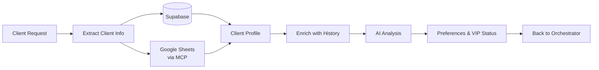

# Client Data Manager Agent

**Agent Type**: Data Management / Analysis
**Model**: GPT-5
**Version**: 1.0.0
**Last Updated**: October 20, 2025

---

## 📋 Overview

The Client Data Manager Agent handles all client-related data operations including profile analysis, Google Sheets synchronization, preference management, and historical interaction tracking. This agent enables personalized service by maintaining comprehensive client profiles.

### Responsibilities

- **Client Profile Analysis**: Extract and analyze client information from requests
- **Google Sheets Integration**: Synchronize client data with external spreadsheets
- **Preference Management**: Track and update client preferences
- **History Tracking**: Maintain records of past bookings and interactions
- **Data Enrichment**: Enhance profiles with additional context

---

## 🏗️ Architecture

### Agent Configuration

```typescript
// lib/agents/client-data-manager.ts
import { Agent } from 'openai-agents'
import { OPENAI_CONFIG } from '@/lib/config/openai-config'

export const clientDataAgent = new Agent({
  name: 'Client Data Manager',
  model: OPENAI_CONFIG.AGENT_MODELS.clientData, // gpt-5
  instructions: `You are the Client Data Manager for Jetvision AI Assistant.

Your role is to manage all client-related data by:
1. Analyzing client profiles and extracting relevant information
2. Syncing data with Google Sheets client database
3. Tracking client preferences (aircraft type, amenities, budget)
4. Maintaining booking history and past interactions
5. Identifying VIP clients and special requirements

Always ensure data privacy and handle PII (Personally Identifiable Information) securely.`,

  tools: [
    'get_client_profile',
    'update_client_profile',
    'get_client_history',
    'sync_with_google_sheets',
    'analyze_client_preferences',
    'search_clients',
  ],

  parallelToolCalls: true,
  responseFormat: { type: 'json_object' },
})
```

### Data Flow



---

## 🛠️ Implementation Guide

### Step 1: Define Client Profile Schema

```typescript
// lib/types/client.ts
export interface ClientProfile {
  id: string
  name: string
  email: string
  phone?: string
  company?: string

  // Preferences
  preferences: {
    aircraftType?: string[]
    amenities?: string[]
    budgetRange?: {
      min: number
      max: number
    }
    seatingPreference?: 'window' | 'aisle' | 'any'
    cateringPreferences?: string[]
  }

  // Status
  vipStatus: 'standard' | 'vip' | 'ultra_vip'
  totalBookings: number
  lifetimeValue: number

  // History
  bookingHistory: Booking[]
  lastBookingDate?: string
  frequentRoutes: Route[]

  // Metadata
  createdAt: string
  updatedAt: string
  isoAgentId: string
}

export interface Booking {
  id: string
  date: string
  route: Route
  aircraft: string
  cost: number
  satisfaction?: number
}

export interface Route {
  departure: string
  arrival: string
  frequency: number
}
```

### Step 2: Implement Client Data Manager Agent

```typescript
// lib/agents/client-data-manager.ts
import { BaseAgent } from './base-agent'
import { ToolContext } from 'openai-agents'
import { MCPClient } from '@/lib/mcp/client'

interface ClientDataContext {
  requestId: string
  clientName: string
  clientEmail?: string
  action: 'get_profile' | 'update_preferences' | 'get_history'
  clerkUserId: string
}

export class ClientDataManager extends BaseAgent {
  private mcpClient: MCPClient

  constructor() {
    super({
      name: 'Client Data Manager',
      model: 'gpt-5',
      instructions: CLIENT_DATA_INSTRUCTIONS,
      tools: [
        {
          type: 'function',
          function: {
            name: 'get_client_profile',
            description: 'Retrieve complete client profile from database',
            parameters: {
              type: 'object',
              properties: {
                clientName: { type: 'string' },
                clientEmail: { type: 'string' },
              },
              required: ['clientName'],
            },
          },
        },
        {
          type: 'function',
          function: {
            name: 'sync_with_google_sheets',
            description: 'Synchronize client data with Google Sheets database',
            parameters: {
              type: 'object',
              properties: {
                clientName: { type: 'string' },
                operation: {
                  type: 'string',
                  enum: ['fetch', 'update', 'create'],
                },
              },
              required: ['clientName', 'operation'],
            },
          },
        },
        {
          type: 'function',
          function: {
            name: 'get_client_history',
            description: 'Retrieve client booking history',
            parameters: {
              type: 'object',
              properties: {
                clientName: { type: 'string' },
                limit: { type: 'number', default: 10 },
              },
              required: ['clientName'],
            },
          },
        },
        {
          type: 'function',
          function: {
            name: 'analyze_client_preferences',
            description: 'Analyze client preferences from past bookings',
            parameters: {
              type: 'object',
              properties: {
                clientName: { type: 'string' },
                bookingHistory: {
                  type: 'array',
                  items: { type: 'object' },
                },
              },
              required: ['clientName', 'bookingHistory'],
            },
          },
        },
      ],
    })

    this.mcpClient = new MCPClient()
  }

  async execute(context: ClientDataContext): Promise<ClientProfile> {
    const { requestId, clientName, clientEmail, action, clerkUserId } = context

    try {
      // Set Clerk context for RLS
      await this.supabase.rpc('set_clerk_user_context', {
        user_id: clerkUserId,
      })

      await this.logActivity(requestId, 'client_data_started', {
        clientName,
        action,
      })

      // Run agent to analyze client data
      const session = await this.agent.run({
        context: {
          requestId,
          clientName,
          clientEmail,
          action,
        },
      })

      // Process tool calls to retrieve client data
      const profile = await this.processToolCalls(
        session,
        requestId,
        clientName,
        clerkUserId
      )

      await this.logActivity(requestId, 'client_data_completed', {
        clientName,
        vipStatus: profile.vipStatus,
      })

      return profile

    } catch (error) {
      await this.logActivity(requestId, 'client_data_error', {
        error: error.message,
        clientName,
      })
      throw error
    }
  }

  private async processToolCalls(
    session: AgentSession,
    requestId: string,
    clientName: string,
    clerkUserId: string
  ): Promise<ClientProfile> {
    const toolCalls = session.getToolCalls()
    let profile: ClientProfile | null = null
    let history: Booking[] = []
    let sheetsData: any = null

    for (const toolCall of toolCalls) {
      switch (toolCall.name) {
        case 'get_client_profile':
          profile = await this.getClientProfile(
            toolCall.arguments.clientName,
            toolCall.arguments.clientEmail
          )
          break

        case 'sync_with_google_sheets':
          sheetsData = await this.syncWithGoogleSheets(
            toolCall.arguments.clientName,
            toolCall.arguments.operation
          )
          break

        case 'get_client_history':
          history = await this.getClientHistory(
            toolCall.arguments.clientName,
            toolCall.arguments.limit || 10
          )
          break

        case 'analyze_client_preferences':
          const preferences = await this.analyzePreferences(history)
          if (profile) {
            profile.preferences = preferences
          }
          break
      }
    }

    // Merge database profile with Google Sheets data
    if (profile && sheetsData) {
      profile = this.mergeClientData(profile, sheetsData)
    }

    // If no profile found, create new one
    if (!profile) {
      profile = await this.createClientProfile(clientName, clerkUserId)
    }

    // Update profile with history
    if (history.length > 0) {
      profile.bookingHistory = history
      profile.totalBookings = history.length
      profile.lifetimeValue = this.calculateLifetimeValue(history)
    }

    // Save updated profile
    await this.saveClientProfile(profile)

    return profile
  }

  private async getClientProfile(
    clientName: string,
    clientEmail?: string
  ): Promise<ClientProfile | null> {
    const query = this.supabase
      .from('clients')
      .select('*')
      .eq('name', clientName)

    if (clientEmail) {
      query.eq('email', clientEmail)
    }

    const { data, error } = await query.single()

    if (error) {
      if (error.code === 'PGRST116') {
        // Not found
        return null
      }
      throw error
    }

    return data as ClientProfile
  }

  private async syncWithGoogleSheets(
    clientName: string,
    operation: 'fetch' | 'update' | 'create'
  ): Promise<any> {
    try {
      const result = await this.mcpClient.callTool('google-sheets', {
        tool: 'search_client',
        arguments: {
          clientName,
        },
      })

      return result

    } catch (error) {
      console.error('Google Sheets sync error:', error)
      // Continue without Sheets data if sync fails
      return null
    }
  }

  private async getClientHistory(
    clientName: string,
    limit: number
  ): Promise<Booking[]> {
    const { data, error } = await this.supabase
      .from('bookings')
      .select('*')
      .eq('client_name', clientName)
      .order('date', { ascending: false })
      .limit(limit)

    if (error) throw error

    return data as Booking[]
  }

  private async analyzePreferences(history: Booking[]): Promise<any> {
    if (history.length === 0) {
      return {
        aircraftType: [],
        amenities: [],
        budgetRange: null,
      }
    }

    // Use GPT-5 to analyze patterns
    const session = await this.agent.run({
      context: {
        task: 'analyze_preferences',
        bookingHistory: history,
      },
    })

    const analysis = JSON.parse(session.getLastMessage())

    return {
      aircraftType: analysis.preferred_aircraft || [],
      amenities: analysis.preferred_amenities || [],
      budgetRange: analysis.budget_range || null,
      frequentRoutes: analysis.frequent_routes || [],
    }
  }

  private mergeClientData(
    dbProfile: ClientProfile,
    sheetsData: any
  ): ClientProfile {
    return {
      ...dbProfile,
      // Sheets data takes precedence for contact info
      phone: sheetsData.phone || dbProfile.phone,
      company: sheetsData.company || dbProfile.company,
      // Merge preferences
      preferences: {
        ...dbProfile.preferences,
        ...sheetsData.preferences,
      },
    }
  }

  private async createClientProfile(
    clientName: string,
    isoAgentId: string
  ): Promise<ClientProfile> {
    const newProfile: ClientProfile = {
      id: crypto.randomUUID(),
      name: clientName,
      email: '',
      preferences: {},
      vipStatus: 'standard',
      totalBookings: 0,
      lifetimeValue: 0,
      bookingHistory: [],
      frequentRoutes: [],
      createdAt: new Date().toISOString(),
      updatedAt: new Date().toISOString(),
      isoAgentId,
    }

    const { data, error } = await this.supabase
      .from('clients')
      .insert(newProfile)
      .select()
      .single()

    if (error) throw error

    return data as ClientProfile
  }

  private calculateLifetimeValue(history: Booking[]): number {
    return history.reduce((total, booking) => total + booking.cost, 0)
  }

  private async saveClientProfile(profile: ClientProfile): Promise<void> {
    profile.updatedAt = new Date().toISOString()

    await this.supabase
      .from('clients')
      .upsert(profile)
      .eq('id', profile.id)
  }
}
```

### Step 3: Create BullMQ Worker

```typescript
// lib/workers/client-data-worker.ts
import { Worker, Job } from 'bullmq'
import { ClientDataManager } from '@/lib/agents/client-data-manager'

const clientDataManager = new ClientDataManager()

export const clientDataWorker = new Worker(
  'client-data-tasks',
  async (job: Job) => {
    const { requestId, clientName, clientEmail, action, clerkUserId } = job.data

    try {
      const profile = await clientDataManager.execute({
        requestId,
        clientName,
        clientEmail,
        action,
        clerkUserId,
      })

      // Store result for orchestrator to retrieve
      return {
        success: true,
        profile,
      }

    } catch (error) {
      console.error('Client data worker error:', error)
      throw error
    }
  },
  {
    connection: {
      host: process.env.REDIS_HOST,
      port: parseInt(process.env.REDIS_PORT || '6379'),
    },
    concurrency: 10,
  }
)
```

### Step 4: Google Sheets MCP Integration

```typescript
// mcp-servers/google-sheets/tools/search-client.ts
export const searchClientTool = {
  name: 'search_client',
  description: 'Search for client in Google Sheets database',
  inputSchema: {
    type: 'object',
    properties: {
      clientName: {
        type: 'string',
        description: 'Name of the client to search for',
      },
    },
    required: ['clientName'],
  },

  async execute(args: { clientName: string }) {
    const sheets = google.sheets({ version: 'v4', auth: oauth2Client })

    // Search in Clients sheet
    const response = await sheets.spreadsheets.values.get({
      spreadsheetId: process.env.GOOGLE_SHEETS_ID,
      range: 'Clients!A:H',
    })

    const rows = response.data.values
    const clientRow = rows.find(
      (row) => row[0].toLowerCase() === args.clientName.toLowerCase()
    )

    if (!clientRow) {
      return { found: false, data: null }
    }

    return {
      found: true,
      data: {
        name: clientRow[0],
        email: clientRow[1],
        phone: clientRow[2],
        company: clientRow[3],
        vipStatus: clientRow[4],
        preferences: JSON.parse(clientRow[5] || '{}'),
        notes: clientRow[6],
        lastContact: clientRow[7],
      },
    }
  },
}
```

---

## 🎯 Best Practices

### 1. Data Privacy & Security

Always handle PII (Personally Identifiable Information) securely:

```typescript
// ✅ GOOD: Log without PII
await this.logActivity(requestId, 'client_profile_retrieved', {
  clientId: profile.id,
  vipStatus: profile.vipStatus,
})

// ❌ BAD: Logging PII
await this.logActivity(requestId, 'client_profile_retrieved', {
  name: profile.name,
  email: profile.email,
  phone: profile.phone,
})
```

### 2. Handle Missing Data Gracefully

```typescript
const preferences = profile.preferences || {}
const aircraftType = preferences.aircraftType || []
const budgetRange = preferences.budgetRange || { min: 0, max: Infinity }
```

### 3. Sync with External Sources

Keep Google Sheets in sync:

```typescript
async syncToGoogleSheets(profile: ClientProfile) {
  try {
    await this.mcpClient.callTool('google-sheets', {
      tool: 'update_client',
      arguments: {
        clientName: profile.name,
        data: {
          email: profile.email,
          vipStatus: profile.vipStatus,
          lastBooking: profile.lastBookingDate,
        },
      },
    })
  } catch (error) {
    // Log but don't fail if Sheets sync fails
    console.warn('Google Sheets sync failed:', error)
  }
}
```

### 4. VIP Detection

Automatically identify VIP clients:

```typescript
private determineVIPStatus(profile: ClientProfile): 'standard' | 'vip' | 'ultra_vip' {
  const { totalBookings, lifetimeValue } = profile

  if (lifetimeValue > 500000 || totalBookings > 50) {
    return 'ultra_vip'
  } else if (lifetimeValue > 100000 || totalBookings > 10) {
    return 'vip'
  }

  return 'standard'
}
```

---

## ⚠️ Common Pitfalls

### 1. Stale Data

Always fetch fresh data from database:

```typescript
// ❌ BAD: Using cached profile
const profile = cachedProfiles[clientName]

// ✅ GOOD: Fetch fresh data
const profile = await this.getClientProfile(clientName)
```

### 2. Missing Google Sheets Fallback

Handle Google Sheets API failures:

```typescript
try {
  const sheetsData = await this.syncWithGoogleSheets(clientName, 'fetch')
  profile = this.mergeClientData(profile, sheetsData)
} catch (error) {
  // Continue with database data only
  console.warn('Sheets unavailable, using database only')
}
```

### 3. Not Normalizing Names

Always normalize client names for matching:

```typescript
const normalizedName = clientName.trim().toLowerCase()
```

---

## 🧪 Testing

```typescript
// __tests__/agents/client-data-manager.test.ts
import { ClientDataManager } from '@/lib/agents/client-data-manager'

describe('Client Data Manager Agent', () => {
  let manager: ClientDataManager

  beforeEach(() => {
    manager = new ClientDataManager()
  })

  it('should retrieve existing client profile', async () => {
    const profile = await manager.execute({
      requestId: 'test-1',
      clientName: 'John Smith',
      action: 'get_profile',
      clerkUserId: 'user_123',
    })

    expect(profile).toBeDefined()
    expect(profile.name).toBe('John Smith')
    expect(profile.vipStatus).toBeOneOf(['standard', 'vip', 'ultra_vip'])
  })

  it('should create new profile if not found', async () => {
    const profile = await manager.execute({
      requestId: 'test-2',
      clientName: 'New Client',
      action: 'get_profile',
      clerkUserId: 'user_123',
    })

    expect(profile).toBeDefined()
    expect(profile.name).toBe('New Client')
    expect(profile.totalBookings).toBe(0)
  })

  it('should sync with Google Sheets', async () => {
    const profile = await manager.execute({
      requestId: 'test-3',
      clientName: 'Jane Doe',
      action: 'get_profile',
      clerkUserId: 'user_123',
    })

    // Verify Sheets data was merged
    expect(profile.phone).toBeDefined()
    expect(profile.company).toBeDefined()
  })
})
```

---

## 📚 Related Documentation

- [RFP Orchestrator Agent](../orchestrator/README.md)
- [Google Sheets MCP Server](../../technology-stack/supporting-services/README.md#google-sheets-api)
- [Supabase Database Schema](../../../../IMPLEMENTATION_PLAN.md)
- [Data Privacy Best Practices](../../guides/best-practices.md)

---

## 🔄 Version History

| Version | Date | Changes |
|---------|------|---------|
| 1.0.0 | Oct 20, 2025 | Initial documentation |

---

**Next Steps**: Review [Flight Search Agent](../flight-search/README.md) documentation
