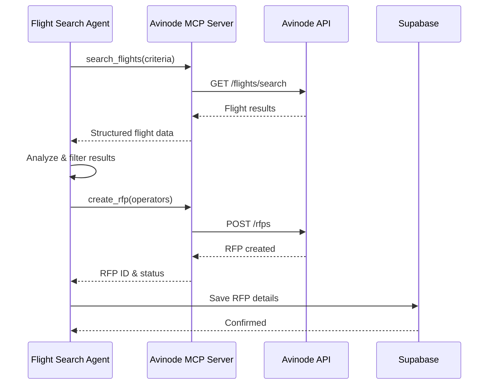

# Flight Search Agent

**Agent Type**: External API Integration / Search
**Model**: GPT-5
**Version**: 1.0.0
**Last Updated**: October 20, 2025
**External APIs**: Avinode (via MCP Server)

---

## 📋 Overview

The Flight Search Agent handles all aircraft search and RFP (Request for Proposal) operations through the Avinode API. It uses the Model Context Protocol (MCP) to interact with Avinode services, ensuring clean separation between AI logic and external API calls.

### Responsibilities

- **Aircraft Search**: Find available aircraft matching client requirements
- **Empty Leg Search**: Identify cost-effective empty leg flights
- **RFP Creation**: Create and distribute RFPs to operators
- **Quote Management**: Track and retrieve operator quotes
- **Watch Management**: Monitor flight availability and pricing changes

---

## 🏗️ Architecture

### Agent Configuration

```typescript
// lib/agents/flight-search-agent.ts
import { Agent } from 'openai-agents'
import { OPENAI_CONFIG } from '@/lib/config/openai-config'

export const flightSearchAgent = new Agent({
  name: 'Flight Search Agent',
  model: OPENAI_CONFIG.AGENT_MODELS.flightSearch, // gpt-5
  instructions: `You are the Flight Search Agent for Jetvision AI Assistant.

Your role is to search for private jet flights and create RFPs using the Avinode platform:

1. Search for aircraft matching client requirements:
   - Route (departure/arrival airports)
   - Date and time
   - Number of passengers
   - Aircraft preferences (type, amenities)

2. Filter and rank results based on:
   - Client preferences and history
   - Aircraft availability and condition
   - Operator ratings and reputation
   - Pricing competitiveness

3. Create targeted RFPs to selected operators
4. Track RFP status and quote responses
5. Handle empty leg searches for cost optimization

Always prioritize safety, client preferences, and cost-effectiveness.`,

  tools: [
    'search_flights',
    'search_empty_legs',
    'create_rfp',
    'get_rfp_status',
    'get_quotes',
    'create_watch',
  ],

  parallelToolCalls: true,
  responseFormat: { type: 'json_object' },
})
```

### MCP Integration Flow



---

## 🛠️ Implementation Guide

### Step 1: Define Search Types

```typescript
// lib/types/flight-search.ts
export interface FlightSearchCriteria {
  departure: {
    airport: string // ICAO code
    date: string // ISO 8601
    time?: string
  }
  arrival: {
    airport: string
    date?: string // For round trip
    time?: string
  }
  passengers: number
  preferences?: {
    aircraftType?: string[] // e.g., ['light_jet', 'midsize_jet']
    amenities?: string[]
    maxBudget?: number
    minOperatorRating?: number
  }
}

export interface FlightResult {
  id: string
  operator: {
    id: string
    name: string
    rating: number
    reputation: string
  }
  aircraft: {
    type: string
    model: string
    registration: string
    yearBuilt: number
    capacity: number
    amenities: string[]
  }
  availability: {
    status: 'available' | 'pending' | 'unavailable'
    departureTime: string
    arrivalTime: string
    duration: number // minutes
  }
  pricing: {
    estimatedCost: number
    currency: string
    pricePerHour?: number
  }
}

export interface RFPRequest {
  flightDetails: FlightSearchCriteria
  selectedOperators: string[] // Operator IDs
  message?: string
  deadline?: string // Quote deadline
}

export interface RFPResponse {
  rfpId: string
  status: 'sent' | 'in_progress' | 'completed'
  operatorCount: number
  quotesReceived: number
  quotes: Quote[]
}

export interface Quote {
  quoteId: string
  operatorId: string
  operatorName: string
  aircraft: string
  price: number
  currency: string
  validUntil: string
  notes?: string
  receivedAt: string
}
```

### Step 2: Implement Flight Search Agent

```typescript
// lib/agents/flight-search-agent.ts
import { BaseAgent } from './base-agent'
import { ToolContext } from 'openai-agents'
import { MCPClient } from '@/lib/mcp/client'

interface FlightSearchContext {
  requestId: string
  searchCriteria: FlightSearchCriteria
  clientProfile?: ClientProfile
  clerkUserId: string
}

export class FlightSearchAgent extends BaseAgent {
  private mcpClient: MCPClient

  constructor() {
    super({
      name: 'Flight Search Agent',
      model: 'gpt-5',
      instructions: FLIGHT_SEARCH_INSTRUCTIONS,
      tools: [
        {
          type: 'function',
          function: {
            name: 'search_flights',
            description: 'Search for available flights via Avinode API',
            parameters: {
              type: 'object',
              properties: {
                departure: {
                  type: 'object',
                  properties: {
                    airport: { type: 'string' },
                    date: { type: 'string' },
                    time: { type: 'string' },
                  },
                  required: ['airport', 'date'],
                },
                arrival: {
                  type: 'object',
                  properties: {
                    airport: { type: 'string' },
                  },
                  required: ['airport'],
                },
                passengers: { type: 'number' },
                preferences: { type: 'object' },
              },
              required: ['departure', 'arrival', 'passengers'],
            },
          },
        },
        {
          type: 'function',
          function: {
            name: 'search_empty_legs',
            description: 'Search for empty leg flights (cost-effective option)',
            parameters: {
              type: 'object',
              properties: {
                departure: { type: 'string' },
                arrival: { type: 'string' },
                dateRange: {
                  type: 'object',
                  properties: {
                    from: { type: 'string' },
                    to: { type: 'string' },
                  },
                },
                passengers: { type: 'number' },
              },
              required: ['departure', 'arrival', 'dateRange', 'passengers'],
            },
          },
        },
        {
          type: 'function',
          function: {
            name: 'create_rfp',
            description: 'Create RFP and send to selected operators',
            parameters: {
              type: 'object',
              properties: {
                flightDetails: { type: 'object' },
                operatorIds: {
                  type: 'array',
                  items: { type: 'string' },
                },
                message: { type: 'string' },
                deadline: { type: 'string' },
              },
              required: ['flightDetails', 'operatorIds'],
            },
          },
        },
        {
          type: 'function',
          function: {
            name: 'get_rfp_status',
            description: 'Check status of existing RFP',
            parameters: {
              type: 'object',
              properties: {
                rfpId: { type: 'string' },
              },
              required: ['rfpId'],
            },
          },
        },
      ],
    })

    this.mcpClient = new MCPClient()
  }

  async execute(context: FlightSearchContext): Promise<RFPResponse> {
    const { requestId, searchCriteria, clientProfile, clerkUserId } = context

    try {
      // Set Clerk context for RLS
      await this.supabase.rpc('set_clerk_user_context', {
        user_id: clerkUserId,
      })

      await this.logActivity(requestId, 'flight_search_started', {
        departure: searchCriteria.departure.airport,
        arrival: searchCriteria.arrival.airport,
      })

      // Search for flights
      const flightResults = await this.searchFlights(searchCriteria)

      // Also check empty legs for cost savings
      const emptyLegs = await this.searchEmptyLegs(searchCriteria)

      // Combine and analyze results
      const allResults = [...flightResults, ...emptyLegs]
      const filteredResults = this.filterByClientPreferences(
        allResults,
        clientProfile
      )

      // Select top operators
      const selectedOperators = this.selectOperators(filteredResults)

      // Create RFP
      const rfp = await this.createRFP({
        flightDetails: searchCriteria,
        selectedOperators: selectedOperators.map((op) => op.operator.id),
        message: this.generateRFPMessage(clientProfile, searchCriteria),
        deadline: this.calculateDeadline(searchCriteria.departure.date),
      })

      // Save RFP details to database
      await this.saveRFPToDatabase(requestId, rfp)

      await this.logActivity(requestId, 'rfp_created', {
        rfpId: rfp.rfpId,
        operatorCount: rfp.operatorCount,
      })

      return rfp

    } catch (error) {
      await this.logActivity(requestId, 'flight_search_error', {
        error: error.message,
      })
      throw error
    }
  }

  private async searchFlights(
    criteria: FlightSearchCriteria
  ): Promise<FlightResult[]> {
    try {
      const result = await this.mcpClient.callTool('avinode', {
        tool: 'search_flights',
        arguments: {
          departure_airport: criteria.departure.airport,
          departure_date: criteria.departure.date,
          departure_time: criteria.departure.time,
          arrival_airport: criteria.arrival.airport,
          passengers: criteria.passengers,
          aircraft_type: criteria.preferences?.aircraftType,
        },
      })

      return result.flights as FlightResult[]

    } catch (error) {
      console.error('Avinode flight search error:', error)
      throw new Error('Failed to search flights via Avinode')
    }
  }

  private async searchEmptyLegs(
    criteria: FlightSearchCriteria
  ): Promise<FlightResult[]> {
    try {
      // Calculate flexible date range for empty legs
      const departureDate = new Date(criteria.departure.date)
      const fromDate = new Date(departureDate)
      fromDate.setDate(fromDate.getDate() - 2) // 2 days before

      const toDate = new Date(departureDate)
      toDate.setDate(toDate.getDate() + 2) // 2 days after

      const result = await this.mcpClient.callTool('avinode', {
        tool: 'search_empty_legs',
        arguments: {
          departure_airport: criteria.departure.airport,
          arrival_airport: criteria.arrival.airport,
          date_range: {
            from: fromDate.toISOString().split('T')[0],
            to: toDate.toISOString().split('T')[0],
          },
          passengers: criteria.passengers,
        },
      })

      return result.empty_legs as FlightResult[]

    } catch (error) {
      console.error('Empty leg search error:', error)
      // Don't fail if empty legs search fails
      return []
    }
  }

  private filterByClientPreferences(
    results: FlightResult[],
    clientProfile?: ClientProfile
  ): FlightResult[] {
    if (!clientProfile?.preferences) {
      return results
    }

    const { preferences } = clientProfile

    return results.filter((result) => {
      // Filter by aircraft type
      if (
        preferences.aircraftType &&
        preferences.aircraftType.length > 0
      ) {
        if (!preferences.aircraftType.includes(result.aircraft.type)) {
          return false
        }
      }

      // Filter by budget
      if (preferences.budgetRange?.max) {
        if (result.pricing.estimatedCost > preferences.budgetRange.max) {
          return false
        }
      }

      // Filter by operator rating
      if (preferences.minOperatorRating) {
        if (result.operator.rating < preferences.minOperatorRating) {
          return false
        }
      }

      // Filter by amenities
      if (preferences.amenities && preferences.amenities.length > 0) {
        const hasRequiredAmenities = preferences.amenities.every((amenity) =>
          result.aircraft.amenities.includes(amenity)
        )
        if (!hasRequiredAmenities) {
          return false
        }
      }

      return true
    })
  }

  private selectOperators(results: FlightResult[]): FlightResult[] {
    // Sort by multiple factors
    const scored = results.map((result) => ({
      result,
      score: this.calculateOperatorScore(result),
    }))

    // Sort by score descending
    scored.sort((a, b) => b.score - a.score)

    // Return top 5-10 operators
    return scored.slice(0, 10).map((item) => item.result)
  }

  private calculateOperatorScore(result: FlightResult): number {
    let score = 0

    // Operator rating (0-5) * 20 = max 100 points
    score += result.operator.rating * 20

    // Availability bonus
    if (result.availability.status === 'available') {
      score += 50
    }

    // Price competitiveness (inverse, lower is better)
    const avgPrice = 15000 // Placeholder average
    const priceRatio = avgPrice / result.pricing.estimatedCost
    score += priceRatio * 30

    // Aircraft age (newer is better)
    const currentYear = new Date().getFullYear()
    const age = currentYear - result.aircraft.yearBuilt
    score += Math.max(0, (20 - age) * 2) // Newer = higher score

    return score
  }

  private async createRFP(request: RFPRequest): Promise<RFPResponse> {
    try {
      const result = await this.mcpClient.callTool('avinode', {
        tool: 'create_rfp',
        arguments: {
          flight_details: request.flightDetails,
          operator_ids: request.selectedOperators,
          message: request.message,
          quote_deadline: request.deadline,
        },
      })

      return {
        rfpId: result.rfp_id,
        status: 'sent',
        operatorCount: request.selectedOperators.length,
        quotesReceived: 0,
        quotes: [],
      }

    } catch (error) {
      console.error('RFP creation error:', error)
      throw new Error('Failed to create RFP via Avinode')
    }
  }

  private generateRFPMessage(
    clientProfile: ClientProfile | undefined,
    criteria: FlightSearchCriteria
  ): string {
    const vipNote =
      clientProfile?.vipStatus === 'ultra_vip'
        ? 'This is a VIP client. Please provide your best rates and service.'
        : ''

    return `
Private jet charter request:

Route: ${criteria.departure.airport} → ${criteria.arrival.airport}
Date: ${criteria.departure.date} ${criteria.departure.time || ''}
Passengers: ${criteria.passengers}
Aircraft Type: ${criteria.preferences?.aircraftType?.join(', ') || 'Any'}

${vipNote}

Please provide your best quote including all fees and taxes.
    `.trim()
  }

  private calculateDeadline(departureDate: string): string {
    const departure = new Date(departureDate)
    const deadline = new Date(departure)
    deadline.setHours(deadline.getHours() - 48) // 48 hours before departure

    return deadline.toISOString()
  }

  private async saveRFPToDatabase(
    requestId: string,
    rfp: RFPResponse
  ): Promise<void> {
    await this.supabase.from('rfps').insert({
      id: rfp.rfpId,
      request_id: requestId,
      status: rfp.status,
      operator_count: rfp.operatorCount,
      quotes_received: rfp.quotesReceived,
      created_at: new Date().toISOString(),
    })
  }
}
```

### Step 3: Avinode MCP Server Tool Implementations

```typescript
// mcp-servers/avinode/tools/search-flights.ts
import { avinodeClient } from '../client'

export const searchFlightsTool = {
  name: 'search_flights',
  description: 'Search for available flights on Avinode',
  inputSchema: {
    type: 'object',
    properties: {
      departure_airport: { type: 'string' },
      departure_date: { type: 'string' },
      departure_time: { type: 'string' },
      arrival_airport: { type: 'string' },
      passengers: { type: 'number' },
      aircraft_type: {
        type: 'array',
        items: { type: 'string' },
      },
    },
    required: [
      'departure_airport',
      'departure_date',
      'arrival_airport',
      'passengers',
    ],
  },

  async execute(args: any) {
    const response = await avinodeClient.post('/flights/search', {
      departure: {
        airport: args.departure_airport,
        date: args.departure_date,
        time: args.departure_time,
      },
      arrival: {
        airport: args.arrival_airport,
      },
      passengers: args.passengers,
      filters: {
        aircraft_type: args.aircraft_type,
      },
    })

    return {
      flights: response.data.results.map((flight: any) => ({
        id: flight.id,
        operator: {
          id: flight.operator.id,
          name: flight.operator.name,
          rating: flight.operator.rating,
        },
        aircraft: {
          type: flight.aircraft.type,
          model: flight.aircraft.model,
          registration: flight.aircraft.registration,
          capacity: flight.aircraft.capacity,
          amenities: flight.aircraft.amenities,
        },
        availability: {
          status: flight.availability.status,
          departureTime: flight.schedule.departure_time,
          arrivalTime: flight.schedule.arrival_time,
          duration: flight.schedule.duration_minutes,
        },
        pricing: {
          estimatedCost: flight.pricing.estimated_total,
          currency: flight.pricing.currency,
        },
      })),
    }
  },
}
```

---

## 🎯 Best Practices

### 1. Always Search Empty Legs

Empty legs can save clients 30-75% on costs:

```typescript
// Search both regular flights and empty legs in parallel
const [regularFlights, emptyLegs] = await Promise.all([
  this.searchFlights(criteria),
  this.searchEmptyLegs(criteria),
])
```

### 2. Implement Smart Operator Selection

Don't send RFPs to all operators:

```typescript
// Select top 5-10 based on:
// - Operator rating
// - Historical performance
// - Price competitiveness
// - Aircraft suitability
const selectedOperators = this.selectOperators(results, 10)
```

### 3. Handle API Rate Limits

Avinode has rate limits - implement retry logic:

```typescript
async searchWithRetry(criteria: FlightSearchCriteria, retries = 3) {
  try {
    return await this.searchFlights(criteria)
  } catch (error) {
    if (error.status === 429 && retries > 0) {
      await this.delay(2000) // Wait 2 seconds
      return this.searchWithRetry(criteria, retries - 1)
    }
    throw error
  }
}
```

### 4. Cache Search Results

Cache results for similar searches:

```typescript
const cacheKey = `search:${departure}:${arrival}:${date}`
const cached = await redis.get(cacheKey)

if (cached) {
  return JSON.parse(cached)
}

const results = await this.searchFlights(criteria)
await redis.set(cacheKey, JSON.stringify(results), 'EX', 1800) // 30 min TTL
```

---

## ⚠️ Common Pitfalls

### 1. Not Validating Airport Codes

Always validate ICAO codes:

```typescript
// ❌ BAD: No validation
const results = await searchFlights({ departure: 'NYC', ... })

// ✅ GOOD: Validate first
const icaoCode = await this.validateAirportCode('NYC')
const results = await searchFlights({ departure: icaoCode, ... })
```

### 2. Ignoring Quote Deadlines

Set realistic deadlines:

```typescript
// ❌ BAD: Too short deadline
deadline: new Date(Date.now() + 3600000) // 1 hour

// ✅ GOOD: Reasonable deadline
deadline: new Date(departureDate.getTime() - 48 * 3600000) // 48 hours before
```

### 3. Not Handling Avinode Downtime

Implement fallback strategies:

```typescript
try {
  return await this.searchFlights(criteria)
} catch (error) {
  if (this.isAvinodeDown(error)) {
    // Notify user and save request for later
    await this.queueForLater(criteria)
    throw new ServiceUnavailableError('Avinode temporarily unavailable')
  }
  throw error
}
```

---

## 🧪 Testing

```typescript
// __tests__/agents/flight-search.test.ts
import { FlightSearchAgent } from '@/lib/agents/flight-search-agent'

describe('Flight Search Agent', () => {
  let agent: FlightSearchAgent

  beforeEach(() => {
    agent = new FlightSearchAgent()
  })

  it('should search for flights successfully', async () => {
    const rfp = await agent.execute({
      requestId: 'test-1',
      searchCriteria: {
        departure: {
          airport: 'KTEB',
          date: '2025-11-01',
        },
        arrival: {
          airport: 'KMIA',
        },
        passengers: 4,
      },
      clerkUserId: 'user_123',
    })

    expect(rfp.rfpId).toBeDefined()
    expect(rfp.operatorCount).toBeGreaterThan(0)
  })

  it('should include empty legs in search', async () => {
    const searchSpy = jest.spyOn(agent as any, 'searchEmptyLegs')

    await agent.execute({
      requestId: 'test-2',
      searchCriteria: mockCriteria,
      clerkUserId: 'user_123',
    })

    expect(searchSpy).toHaveBeenCalled()
  })
})
```

---

## 📚 Related Documentation

- [Avinode API Documentation](../../technology-stack/avinode/README.md)
- [MCP Server Implementation](../../../../mcp-servers/avinode/README.md)
- [RFP Orchestrator Agent](../orchestrator/README.md)
- [Proposal Analysis Agent](../proposal-analysis/README.md)

---

## 🔄 Version History

| Version | Date | Changes |
|---------|------|---------|
| 1.0.0 | Oct 20, 2025 | Initial documentation |

---

**Next Steps**: Review [Avinode API Documentation](../../technology-stack/avinode/README.md)
