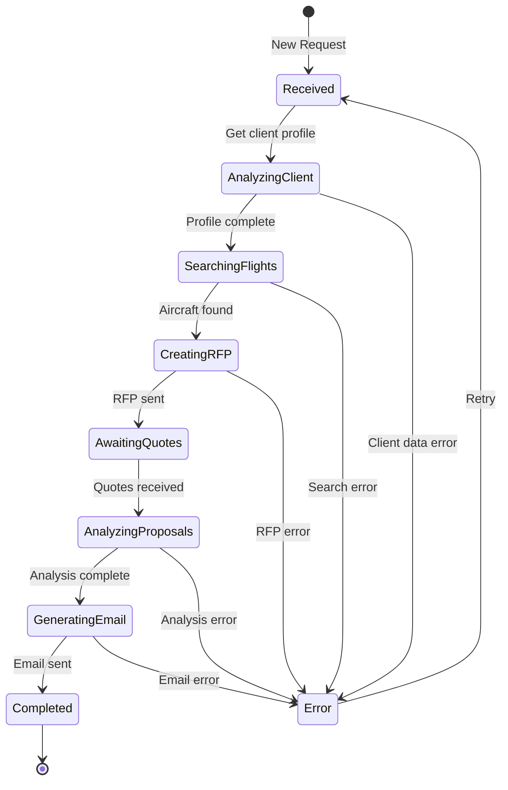

# RFP Orchestrator Agent

**Agent Type**: Orchestrator / Coordinator
**Model**: GPT-5
**Version**: 1.0.0
**Last Updated**: October 20, 2025

---

## 📋 Overview

The RFP Orchestrator Agent is the central coordinator of the Jetvision AI Assistant system. It manages the entire RFP workflow from initial client request to final proposal delivery by delegating tasks to specialized agents and maintaining workflow state.

### Responsibilities

- **Workflow Management**: Orchestrates the complete RFP process
- **Task Delegation**: Routes tasks to appropriate specialized agents
- **State Management**: Tracks request status and agent progress
- **Error Handling**: Coordinates error recovery with Error Monitor Agent
- **Real-time Updates**: Broadcasts workflow status to frontend

---

## 🏗️ Architecture

### Agent Configuration

```typescript
// lib/agents/rfp-orchestrator.ts
import { Agent } from 'openai-agents'
import { OPENAI_CONFIG } from '@/lib/config/openai-config'

export const orchestratorAgent = new Agent({
  name: 'RFP Orchestrator',
  model: OPENAI_CONFIG.AGENT_MODELS.orchestrator, // gpt-5
  instructions: `You are the RFP Orchestrator for Jetvision AI Assistant.

Your role is to coordinate the private jet booking workflow by:
1. Analyzing incoming client requests
2. Delegating tasks to specialized agents:
   - Client Data Manager: for client profile analysis
   - Flight Search Agent: for aircraft search and RFP creation
   - Proposal Analysis Agent: for quote evaluation
   - Communication Manager: for email generation
3. Managing workflow state and transitions
4. Handling errors and edge cases
5. Providing real-time status updates

Always maintain context about the current request state and make intelligent decisions about next steps.`,

  tools: [
    // Tool definitions for agent communication
    'delegate_to_client_data_manager',
    'delegate_to_flight_search',
    'delegate_to_proposal_analysis',
    'delegate_to_communication_manager',
    'update_request_status',
    'get_request_context',
  ],

  parallelToolCalls: true,
  responseFormat: { type: 'json_object' },
})
```

### Workflow State Machine

The Orchestrator manages these workflow states:



---

## 🛠️ Implementation Guide

### Step 1: Create Base Agent Class

```typescript
// lib/agents/base-agent.ts
import { Agent, ToolContext } from 'openai-agents'
import { createClient } from '@/lib/supabase/server'

export abstract class BaseAgent {
  protected agent: Agent
  protected supabase: ReturnType<typeof createClient>

  constructor(config: AgentConfig) {
    this.agent = new Agent(config)
    this.supabase = createClient()
  }

  abstract async execute(context: ToolContext): Promise<AgentResponse>

  protected async logActivity(
    requestId: string,
    activity: string,
    metadata?: Record<string, any>
  ): Promise<void> {
    await this.supabase
      .from('agent_activities')
      .insert({
        request_id: requestId,
        agent_name: this.agent.name,
        activity,
        metadata,
        timestamp: new Date().toISOString(),
      })
  }
}
```

### Step 2: Implement Orchestrator Agent

```typescript
// lib/agents/rfp-orchestrator.ts
import { BaseAgent } from './base-agent'
import { ToolContext } from 'openai-agents'
import { Queue } from 'bullmq'

interface OrchestratorContext {
  requestId: string
  clientMessage: string
  currentState: WorkflowState
  clerkUserId: string
}

export class RFPOrchestrator extends BaseAgent {
  private jobQueue: Queue

  constructor() {
    super({
      name: 'RFP Orchestrator',
      model: 'gpt-5',
      instructions: ORCHESTRATOR_INSTRUCTIONS,
      tools: [
        {
          type: 'function',
          function: {
            name: 'delegate_to_client_data_manager',
            description: 'Delegate client profile analysis to Client Data Manager',
            parameters: {
              type: 'object',
              properties: {
                requestId: { type: 'string' },
                clientName: { type: 'string' },
                action: {
                  type: 'string',
                  enum: ['get_profile', 'update_preferences', 'get_history']
                },
              },
              required: ['requestId', 'clientName', 'action'],
            },
          },
        },
        {
          type: 'function',
          function: {
            name: 'delegate_to_flight_search',
            description: 'Delegate flight search to Flight Search Agent',
            parameters: {
              type: 'object',
              properties: {
                requestId: { type: 'string' },
                searchCriteria: {
                  type: 'object',
                  properties: {
                    departure: { type: 'string' },
                    arrival: { type: 'string' },
                    date: { type: 'string' },
                    passengers: { type: 'number' },
                    preferences: { type: 'object' },
                  },
                },
              },
              required: ['requestId', 'searchCriteria'],
            },
          },
        },
        // Add other tool definitions...
      ],
    })

    this.jobQueue = new Queue('agent-tasks', {
      connection: {
        host: process.env.REDIS_HOST,
        port: parseInt(process.env.REDIS_PORT || '6379'),
      },
    })
  }

  async execute(context: OrchestratorContext): Promise<AgentResponse> {
    const { requestId, clientMessage, currentState, clerkUserId } = context

    try {
      // Set Clerk context for RLS
      await this.supabase.rpc('set_clerk_user_context', {
        user_id: clerkUserId,
      })

      // Log activity
      await this.logActivity(requestId, 'orchestrator_started', {
        currentState,
        message: clientMessage,
      })

      // Run agent to determine next action
      const session = await this.agent.run({
        context: {
          requestId,
          clientMessage,
          currentState,
        },
      })

      // Process agent's decision
      const response = await this.processAgentDecision(
        session,
        requestId,
        clerkUserId
      )

      // Update request status in database
      await this.updateRequestStatus(requestId, response.nextState)

      return response

    } catch (error) {
      await this.logActivity(requestId, 'orchestrator_error', {
        error: error.message,
      })

      // Delegate to Error Monitor Agent
      await this.delegateToErrorMonitor(requestId, error)

      throw error
    }
  }

  private async processAgentDecision(
    session: AgentSession,
    requestId: string,
    clerkUserId: string
  ): Promise<AgentResponse> {
    const toolCalls = session.getToolCalls()

    for (const toolCall of toolCalls) {
      switch (toolCall.name) {
        case 'delegate_to_client_data_manager':
          await this.jobQueue.add('client-data-task', {
            requestId,
            clerkUserId,
            ...toolCall.arguments,
          })
          break

        case 'delegate_to_flight_search':
          await this.jobQueue.add('flight-search-task', {
            requestId,
            clerkUserId,
            ...toolCall.arguments,
          })
          break

        // Handle other delegations...
      }
    }

    return {
      success: true,
      nextState: this.determineNextState(toolCalls),
      message: session.getLastMessage(),
    }
  }

  private async updateRequestStatus(
    requestId: string,
    newStatus: string
  ): Promise<void> {
    await this.supabase
      .from('requests')
      .update({
        status: newStatus,
        updated_at: new Date().toISOString(),
      })
      .eq('id', requestId)

    // Broadcast real-time update
    await this.supabase
      .channel(`request:${requestId}`)
      .send({
        type: 'broadcast',
        event: 'status_update',
        payload: { status: newStatus },
      })
  }

  private determineNextState(toolCalls: ToolCall[]): WorkflowState {
    // Logic to determine next workflow state based on agent's actions
    const lastTool = toolCalls[toolCalls.length - 1]

    if (lastTool.name === 'delegate_to_client_data_manager') {
      return 'analyzing_client'
    } else if (lastTool.name === 'delegate_to_flight_search') {
      return 'searching_flights'
    } else if (lastTool.name === 'delegate_to_proposal_analysis') {
      return 'analyzing_proposals'
    } else if (lastTool.name === 'delegate_to_communication_manager') {
      return 'generating_email'
    }

    return 'processing'
  }

  private async delegateToErrorMonitor(
    requestId: string,
    error: Error
  ): Promise<void> {
    await this.jobQueue.add('error-monitoring-task', {
      requestId,
      error: {
        message: error.message,
        stack: error.stack,
        agent: 'orchestrator',
      },
    })
  }
}
```

### Step 3: Create BullMQ Worker

```typescript
// lib/workers/orchestrator-worker.ts
import { Worker, Job } from 'bullmq'
import { RFPOrchestrator } from '@/lib/agents/rfp-orchestrator'

const orchestrator = new RFPOrchestrator()

export const orchestratorWorker = new Worker(
  'orchestrator-tasks',
  async (job: Job) => {
    const { requestId, clientMessage, currentState, clerkUserId } = job.data

    try {
      const result = await orchestrator.execute({
        requestId,
        clientMessage,
        currentState,
        clerkUserId,
      })

      return result

    } catch (error) {
      console.error('Orchestrator worker error:', error)
      throw error
    }
  },
  {
    connection: {
      host: process.env.REDIS_HOST,
      port: parseInt(process.env.REDIS_PORT || '6379'),
    },
    concurrency: 5,
  }
)

orchestratorWorker.on('completed', (job) => {
  console.log(`Orchestrator job ${job.id} completed`)
})

orchestratorWorker.on('failed', (job, err) => {
  console.error(`Orchestrator job ${job?.id} failed:`, err)
})
```

### Step 4: API Endpoint Integration

```typescript
// app/api/requests/route.ts
import { NextRequest, NextResponse } from 'next/server'
import { auth } from '@clerk/nextjs/server'
import { createClient } from '@/lib/supabase/server'
import { Queue } from 'bullmq'

const orchestratorQueue = new Queue('orchestrator-tasks', {
  connection: {
    host: process.env.REDIS_HOST,
    port: parseInt(process.env.REDIS_PORT || '6379'),
  },
})

export async function POST(request: NextRequest) {
  try {
    // Authenticate user
    const { userId: clerkUserId } = auth()
    if (!clerkUserId) {
      return NextResponse.json({ error: 'Unauthorized' }, { status: 401 })
    }

    // Parse request body
    const { clientMessage, clientName, flightDetails } = await request.json()

    // Create request in database
    const supabase = createClient()
    const { data: newRequest, error } = await supabase
      .from('requests')
      .insert({
        iso_agent_id: clerkUserId,
        client_name: clientName,
        message: clientMessage,
        flight_details: flightDetails,
        status: 'received',
      })
      .select()
      .single()

    if (error) throw error

    // Queue orchestrator job
    await orchestratorQueue.add('process-request', {
      requestId: newRequest.id,
      clientMessage,
      currentState: 'received',
      clerkUserId,
    })

    return NextResponse.json({
      success: true,
      requestId: newRequest.id,
      status: 'received',
    })

  } catch (error) {
    console.error('Request creation error:', error)
    return NextResponse.json(
      { error: 'Failed to create request' },
      { status: 500 }
    )
  }
}
```

---

## 🎯 Best Practices

### 1. Maintain Clear State

Always track the current workflow state and log transitions:

```typescript
await this.logActivity(requestId, 'state_transition', {
  from: currentState,
  to: nextState,
  reason: 'Client data analysis completed',
})
```

### 2. Handle Errors Gracefully

Implement retry logic and fallback strategies:

```typescript
try {
  await this.delegateTask(...)
} catch (error) {
  if (error.retryable) {
    await this.scheduleRetry(job, error)
  } else {
    await this.delegateToErrorMonitor(requestId, error)
  }
}
```

### 3. Use Parallel Processing

Leverage GPT-5's parallel tool calling:

```typescript
const results = await Promise.all([
  this.getClientProfile(clientName),
  this.getClientHistory(clientName),
  this.getPreferences(clientName),
])
```

### 4. Implement Timeouts

Set reasonable timeouts for agent operations:

```typescript
const result = await Promise.race([
  orchestrator.execute(context),
  new Promise((_, reject) =>
    setTimeout(() => reject(new Error('Timeout')), 30000)
  ),
])
```

---

## ⚠️ Common Pitfalls

### 1. Missing Clerk Context

Always set Clerk user context before database operations:

```typescript
// ❌ BAD: Missing context
await supabase.from('requests').select()

// ✅ GOOD: Set context first
await supabase.rpc('set_clerk_user_context', { user_id: clerkUserId })
await supabase.from('requests').select()
```

### 2. Not Handling Agent Failures

Always implement error recovery:

```typescript
// ❌ BAD: No error handling
const result = await agent.run(context)

// ✅ GOOD: Comprehensive error handling
try {
  const result = await agent.run(context)
} catch (error) {
  await this.delegateToErrorMonitor(requestId, error)
  throw new AgentExecutionError('Orchestrator failed', { cause: error })
}
```

### 3. Blocking Operations

Use BullMQ for long-running tasks:

```typescript
// ❌ BAD: Blocking API route
await orchestrator.execute(context) // Takes 30+ seconds

// ✅ GOOD: Async with job queue
await orchestratorQueue.add('process-request', context)
return { status: 'processing', jobId }
```

---

## 🧪 Testing

### Unit Tests

```typescript
// __tests__/agents/orchestrator.test.ts
import { RFPOrchestrator } from '@/lib/agents/rfp-orchestrator'

describe('RFP Orchestrator Agent', () => {
  let orchestrator: RFPOrchestrator

  beforeEach(() => {
    orchestrator = new RFPOrchestrator()
  })

  it('should delegate to client data manager for new request', async () => {
    const result = await orchestrator.execute({
      requestId: 'test-request-1',
      clientMessage: 'Need a flight to Miami',
      currentState: 'received',
      clerkUserId: 'user_123',
    })

    expect(result.nextState).toBe('analyzing_client')
    expect(result.success).toBe(true)
  })

  it('should handle delegation errors gracefully', async () => {
    // Mock delegation failure
    jest.spyOn(orchestrator, 'delegateTask').mockRejectedValue(
      new Error('Delegation failed')
    )

    await expect(
      orchestrator.execute({
        requestId: 'test-request-2',
        clientMessage: 'Test',
        currentState: 'received',
        clerkUserId: 'user_123',
      })
    ).rejects.toThrow('Delegation failed')
  })
})
```

### Integration Tests

```typescript
// __tests__/integration/orchestrator-workflow.test.ts
import { orchestratorQueue } from '@/lib/queues'
import { createClient } from '@/lib/supabase/server'

describe('Orchestrator Workflow Integration', () => {
  it('should process complete RFP workflow', async () => {
    const supabase = createClient()

    // Create test request
    const { data: request } = await supabase
      .from('requests')
      .insert({
        client_name: 'Test Client',
        message: 'Need flight to NYC',
        status: 'received',
      })
      .select()
      .single()

    // Queue orchestrator job
    await orchestratorQueue.add('process-request', {
      requestId: request.id,
      clientMessage: request.message,
      currentState: 'received',
      clerkUserId: 'user_test',
    })

    // Wait for job completion
    await waitForJobCompletion(request.id, 30000)

    // Verify final state
    const { data: completedRequest } = await supabase
      .from('requests')
      .select()
      .eq('id', request.id)
      .single()

    expect(completedRequest.status).toBe('completed')
  })
})
```

---

## 📚 Related Documentation

- [Client Data Manager Agent](../client-data/README.md)
- [Flight Search Agent](../flight-search/README.md)
- [BullMQ Documentation](../../technology-stack/bullmq/README.md)
- [OpenAI Agents SDK](../../technology-stack/openai-agents/README.md)
- [Integration Patterns](../../guides/integration-patterns.md)

---

## 🔄 Version History

| Version | Date | Changes |
|---------|------|---------|
| 1.0.0 | Oct 20, 2025 | Initial documentation |

---

**Next Steps**: Review [Client Data Manager Agent](../client-data/README.md) documentation
