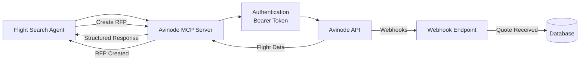

# Avinode API Integration

**API**: Avinode Group API
**Official Docs**: https://developer.avinodegroup.com/
**Version**: 1.0.0
**Last Updated**: October 20, 2025
**Integration Method**: MCP Server

---

## 📋 Overview

Avinode is the leading B2B marketplace for private aviation, connecting charter operators with flight buyers. The Jetvision system integrates with Avinode via an MCP (Model Context Protocol) server to search flights, create RFPs, and manage quotes.

### Key Features

- **Flight Search**: Find available aircraft across thousands of operators
- **Empty Leg Search**: Discover cost-effective empty leg flights
- **RFP Management**: Create and track Requests for Proposals
- **Quote Management**: Receive and compare operator quotes
- **Watch System**: Monitor flight availability and price changes
- **Airport Database**: Search airports and get pricing options

### Authentication

Avinode uses API Key authentication:

```bash
Authorization: Bearer YOUR_API_KEY
```

**Get your API key**: https://developer.avinodegroup.com/dashboard

---

## 🏗️ Architecture

### MCP Server Integration



---

## 🛠️ API Endpoints Reference

### 1. Empty Leg Search

**Endpoint**: `POST /v1/emptyLeg/search`
**Reference**: https://developer.avinodegroup.com/reference/create-emptyleg-search

Search for empty leg flights (repositioning flights at discounted prices).

#### Request

```typescript
interface EmptyLegSearchRequest {
  departure_airport: string // ICAO code
  arrival_airport: string // ICAO code
  date_range: {
    from: string // YYYY-MM-DD
    to: string // YYYY-MM-DD
  }
  passengers: number
  filters?: {
    max_price?: number
    aircraft_types?: string[]
    min_operator_rating?: number
  }
}
```

#### Example Request

```typescript
const response = await avinodeClient.post('/v1/emptyLeg/search', {
  departure_airport: 'KTEB', // Teterboro, NJ
  arrival_airport: 'KMIA', // Miami International
  date_range: {
    from: '2025-11-01',
    to: '2025-11-05',
  },
  passengers: 6,
  filters: {
    max_price: 25000,
    aircraft_types: ['light_jet', 'midsize_jet'],
  },
})
```

#### Response

```json
{
  "search_id": "search_abc123",
  "results": [
    {
      "empty_leg_id": "leg_xyz789",
      "operator": {
        "id": "op_123",
        "name": "Elite Air Charter",
        "rating": 4.8
      },
      "aircraft": {
        "type": "light_jet",
        "model": "Citation CJ3",
        "registration": "N123AB",
        "capacity": 7
      },
      "schedule": {
        "departure_airport": "KTEB",
        "departure_time": "2025-11-02T14:00:00Z",
        "arrival_airport": "KMIA",
        "arrival_time": "2025-11-02T17:00:00Z",
        "duration_minutes": 180
      },
      "pricing": {
        "total": 15000,
        "currency": "USD",
        "discount_percentage": 60,
        "original_price": 37500
      },
      "availability": {
        "status": "available",
        "valid_until": "2025-10-25T23:59:59Z"
      }
    }
  ],
  "total_results": 12,
  "page": 1,
  "per_page": 10
}
```

---

### 2. Regular Flight Search

**Endpoint**: `POST /v1/flights/search`

Search for regular charter flights.

#### Request

```typescript
interface FlightSearchRequest {
  departure: {
    airport: string // ICAO code
    date: string // YYYY-MM-DD
    time?: string // HH:MM (optional)
  }
  arrival: {
    airport: string
  }
  passengers: number
  preferences?: {
    aircraft_types?: string[]
    amenities?: string[]
    max_budget?: number
    min_operator_rating?: number
  }
}
```

#### Example

```typescript
const flights = await avinodeClient.post('/v1/flights/search', {
  departure: {
    airport: 'KJFK',
    date: '2025-12-15',
    time: '09:00',
  },
  arrival: {
    airport: 'EGLL', // London Heathrow
  },
  passengers: 8,
  preferences: {
    aircraft_types: ['heavy_jet', 'ultra_long_range'],
    amenities: ['wifi', 'full_galley', 'bedroom'],
    min_operator_rating: 4.5,
  },
})
```

---

### 3. Create RFP (Request for Proposal)

**Endpoint**: `POST /v1/rfqs`

Create an RFP and send to selected operators.

#### Request

```typescript
interface CreateRFPRequest {
  flight_details: FlightSearchRequest
  operator_ids: string[] // List of operator IDs to send RFP to
  message?: string // Optional message to operators
  quote_deadline?: string // ISO 8601 datetime
  client_reference?: string // Your internal reference ID
}
```

#### Example

```typescript
const rfp = await avinodeClient.post('/v1/rfqs', {
  flight_details: {
    departure: {
      airport: 'KTEB',
      date: '2025-11-10',
      time: '14:00',
    },
    arrival: {
      airport: 'KMIA',
    },
    passengers: 4,
  },
  operator_ids: ['op_123', 'op_456', 'op_789'],
  message: 'VIP client, please provide best rates with full service.',
  quote_deadline: '2025-11-08T18:00:00Z',
  client_reference: 'REQ-2025-1234',
})
```

#### Response

```json
{
  "rfp_id": "rfp_abc123",
  "status": "sent",
  "created_at": "2025-10-20T10:30:00Z",
  "operators_contacted": 3,
  "quote_deadline": "2025-11-08T18:00:00Z",
  "watch_url": "https://avinode.com/watch/rfp_abc123"
}
```

---

### 4. Get RFP Status & Quotes

**Endpoint**: `GET /v1/rfqs/{rfp_id}`

Check RFP status and retrieve quotes.

#### Example

```typescript
const rfpStatus = await avinodeClient.get('/v1/rfqs/rfp_abc123')
```

#### Response

```json
{
  "rfp_id": "rfp_abc123",
  "status": "in_progress",
  "created_at": "2025-10-20T10:30:00Z",
  "quote_deadline": "2025-11-08T18:00:00Z",
  "operators_contacted": 3,
  "quotes_received": 2,
  "quotes": [
    {
      "quote_id": "quote_xyz789",
      "operator": {
        "id": "op_123",
        "name": "Elite Air Charter",
        "rating": 4.8
      },
      "aircraft": {
        "type": "light_jet",
        "model": "Citation CJ3",
        "registration": "N123AB"
      },
      "pricing": {
        "total": 28500,
        "currency": "USD",
        "breakdown": {
          "base_price": 25000,
          "fuel_surcharge": 2000,
          "taxes_fees": 1500
        }
      },
      "terms": {
        "cancellation_policy": "50% if cancelled within 48 hours",
        "payment_terms": "Payment due 24 hours before departure"
      },
      "valid_until": "2025-11-05T23:59:59Z",
      "notes": "We can provide catering upon request.",
      "received_at": "2025-10-20T14:30:00Z"
    },
    {
      "quote_id": "quote_abc456",
      "operator": {
        "id": "op_456",
        "name": "Sky VIP Jets",
        "rating": 4.9
      },
      "aircraft": {
        "type": "midsize_jet",
        "model": "Hawker 900XP",
        "registration": "N456CD"
      },
      "pricing": {
        "total": 32000,
        "currency": "USD",
        "breakdown": {
          "base_price": 28000,
          "fuel_surcharge": 2500,
          "taxes_fees": 1500
        }
      },
      "valid_until": "2025-11-06T23:59:59Z",
      "received_at": "2025-10-20T16:00:00Z"
    }
  ]
}
```

---

### 5. Watch Management

Watches allow you to monitor flight availability and price changes.

#### Create Watch

**Endpoint**: `POST /v1/watches`

```typescript
const watch = await avinodeClient.post('/v1/watches', {
  type: 'rfp', // or 'empty_leg', 'price_alert'
  rfp_id: 'rfp_abc123',
  notifications: {
    on_new_quote: true,
    on_price_change: true,
    on_deadline_approaching: true,
  },
  webhook_url: 'https://your-domain.com/api/webhooks/avinode',
})
```

#### Response

```json
{
  "watch_id": "watch_123",
  "status": "active",
  "created_at": "2025-10-20T10:00:00Z"
}
```

#### Get Watch Status

**Endpoint**: `GET /v1/watches/{watch_id}`

#### Delete Watch

**Endpoint**: `DELETE /v1/watches/{watch_id}`

---

### 6. Airport Search

**Endpoint**: `GET /v1/airports/search`

Search for airports by name or code.

#### Example

```typescript
const airports = await avinodeClient.get('/v1/airports/search', {
  params: {
    query: 'Teterboro',
    country: 'US',
  },
})
```

#### Response

```json
{
  "airports": [
    {
      "icao": "KTEB",
      "iata": "TEB",
      "name": "Teterboro Airport",
      "city": "Teterboro",
      "state": "New Jersey",
      "country": "United States",
      "latitude": 40.8501,
      "longitude": -74.0608,
      "timezone": "America/New_York"
    }
  ]
}
```

---

### 7. Pricing Options

**Endpoint**: `GET /v1/pricing/options`

Get pricing information for a route.

```typescript
const pricing = await avinodeClient.get('/v1/pricing/options', {
  params: {
    departure: 'KTEB',
    arrival: 'KMIA',
    aircraft_type: 'light_jet',
  },
})
```

---

## 🔌 MCP Server Implementation

### MCP Server Structure

```
mcp-servers/avinode/
├── index.ts                # Main MCP server
├── client.ts              # Avinode API client
├── tools/
│   ├── search-flights.ts
│   ├── search-empty-legs.ts
│   ├── create-rfp.ts
│   ├── get-rfp-status.ts
│   ├── create-watch.ts
│   └── search-airports.ts
└── types/
    └── avinode.ts         # TypeScript types
```

### MCP Server Implementation

```typescript
// mcp-servers/avinode/index.ts
import { Server } from '@modelcontextprotocol/sdk/server/index.js'
import { StdioServerTransport } from '@modelcontextprotocol/sdk/server/stdio.js'
import {
  CallToolRequestSchema,
  ListToolsRequestSchema,
} from '@modelcontextprotocol/sdk/types.js'

// Import tools
import { searchFlightsTool } from './tools/search-flights.js'
import { searchEmptyLegsTool } from './tools/search-empty-legs.js'
import { createRFPTool } from './tools/create-rfp.js'
import { getRFPStatusTool } from './tools/get-rfp-status.js'
import { createWatchTool } from './tools/create-watch.js'
import { searchAirportsTool } from './tools/search-airports.js'

const server = new Server(
  {
    name: 'avinode-mcp-server',
    version: '1.0.0',
  },
  {
    capabilities: {
      tools: {},
    },
  }
)

// List available tools
server.setRequestHandler(ListToolsRequestSchema, async () => {
  return {
    tools: [
      {
        name: 'search_flights',
        description: searchFlightsTool.description,
        inputSchema: searchFlightsTool.inputSchema,
      },
      {
        name: 'search_empty_legs',
        description: searchEmptyLegsTool.description,
        inputSchema: searchEmptyLegsTool.inputSchema,
      },
      {
        name: 'create_rfp',
        description: createRFPTool.description,
        inputSchema: createRFPTool.inputSchema,
      },
      {
        name: 'get_rfp_status',
        description: getRFPStatusTool.description,
        inputSchema: getRFPStatusTool.inputSchema,
      },
      {
        name: 'create_watch',
        description: createWatchTool.description,
        inputSchema: createWatchTool.inputSchema,
      },
      {
        name: 'search_airports',
        description: searchAirportsTool.description,
        inputSchema: searchAirportsTool.inputSchema,
      },
    ],
  }
})

// Handle tool execution
server.setRequestHandler(CallToolRequestSchema, async (request) => {
  const { name, arguments: args } = request.params

  try {
    let result

    switch (name) {
      case 'search_flights':
        result = await searchFlightsTool.execute(args)
        break
      case 'search_empty_legs':
        result = await searchEmptyLegsTool.execute(args)
        break
      case 'create_rfp':
        result = await createRFPTool.execute(args)
        break
      case 'get_rfp_status':
        result = await getRFPStatusTool.execute(args)
        break
      case 'create_watch':
        result = await createWatchTool.execute(args)
        break
      case 'search_airports':
        result = await searchAirportsTool.execute(args)
        break
      default:
        throw new Error(`Unknown tool: ${name}`)
    }

    return {
      content: [
        {
          type: 'text',
          text: JSON.stringify(result, null, 2),
        },
      ],
    }
  } catch (error) {
    return {
      content: [
        {
          type: 'text',
          text: `Error: ${error.message}`,
        },
      ],
      isError: true,
    }
  }
})

// Start server
async function main() {
  const transport = new StdioServerTransport()
  await server.connect(transport)
  console.error('Avinode MCP server running on stdio')
}

main().catch((error) => {
  console.error('Fatal error:', error)
  process.exit(1)
})
```

### Avinode API Client

```typescript
// mcp-servers/avinode/client.ts
import axios, { AxiosInstance } from 'axios'

export class AvinodeClient {
  private client: AxiosInstance

  constructor() {
    const apiKey = process.env.AVINODE_API_KEY

    if (!apiKey) {
      throw new Error('AVINODE_API_KEY environment variable is required')
    }

    this.client = axios.create({
      baseURL: 'https://api.avinode.com',
      headers: {
        Authorization: `Bearer ${apiKey}`,
        'Content-Type': 'application/json',
      },
      timeout: 30000,
    })

    // Add response interceptor for error handling
    this.client.interceptors.response.use(
      (response) => response,
      (error) => {
        if (error.response) {
          throw new Error(
            `Avinode API error: ${error.response.status} - ${error.response.data.message}`
          )
        } else if (error.request) {
          throw new Error('No response from Avinode API')
        } else {
          throw error
        }
      }
    )
  }

  async get(endpoint: string, config?: any) {
    const response = await this.client.get(endpoint, config)
    return response.data
  }

  async post(endpoint: string, data: any) {
    const response = await this.client.post(endpoint, data)
    return response.data
  }

  async delete(endpoint: string) {
    const response = await this.client.delete(endpoint)
    return response.data
  }
}

export const avinodeClient = new AvinodeClient()
```

---

## 🎯 Best Practices

### 1. Handle Rate Limits

Avinode has rate limits (varies by plan):

```typescript
async function searchWithRateLimit(criteria: SearchCriteria) {
  try {
    return await avinodeClient.post('/v1/flights/search', criteria)
  } catch (error) {
    if (error.response?.status === 429) {
      const retryAfter = error.response.headers['retry-after'] || 60
      console.log(`Rate limited, retrying after ${retryAfter}s`)
      await sleep(retryAfter * 1000)
      return searchWithRateLimit(criteria)
    }
    throw error
  }
}
```

### 2. Cache Results

Cache flight searches to reduce API calls:

```typescript
const cacheKey = `avinode:search:${departure}:${arrival}:${date}`
const cached = await redis.get(cacheKey)

if (cached) {
  return JSON.parse(cached)
}

const results = await searchFlights(criteria)
await redis.set(cacheKey, JSON.stringify(results), 'EX', 1800) // 30 min
```

### 3. Webhook Handlers

Handle Avinode webhooks for real-time updates:

```typescript
// app/api/webhooks/avinode/route.ts
export async function POST(request: NextRequest) {
  const body = await request.json()
  const signature = request.headers.get('x-avinode-signature')

  // Verify webhook signature
  if (!verifySignature(body, signature)) {
    return NextResponse.json({ error: 'Invalid signature' }, { status: 401 })
  }

  switch (body.event_type) {
    case 'quote.received':
      await handleQuoteReceived(body.data)
      break
    case 'rfp.deadline_approaching':
      await handleDeadlineApproaching(body.data)
      break
    case 'empty_leg.available':
      await handleEmptyLegAvailable(body.data)
      break
  }

  return NextResponse.json({ received: true })
}
```

---

## ⚠️ Common Pitfalls

### 1. Not Validating Airport Codes

```typescript
// ❌ BAD
const results = await searchFlights({ departure: 'NYC', ... })

// ✅ GOOD
const icao = await validateAirportCode('NYC') // Returns KJFK
const results = await searchFlights({ departure: icao, ... })
```

### 2. Ignoring API Errors

```typescript
// ❌ BAD
const results = await avinodeClient.post('/v1/flights/search', data)

// ✅ GOOD
try {
  const results = await avinodeClient.post('/v1/flights/search', data)
} catch (error) {
  if (error.response?.status === 404) {
    // No flights found
    return []
  }
  throw error
}
```

---

## 🔗 Related Documentation

- [Official Avinode API Docs](https://developer.avinodegroup.com/)
- [Empty Leg Search API](https://developer.avinodegroup.com/reference/create-emptyleg-search)
- [Flight Search Agent](../../agents/flight-search/README.md)
- [MCP Server Implementation](../../../../mcp-servers/avinode/README.md)

---

## 🔄 Version History

| Version | Date | Changes |
|---------|------|---------|
| 1.0.0 | Oct 20, 2025 | Initial documentation |

---

**Next Steps**: Review [OpenAI Agents SDK Documentation](../openai-agents/README.md)
