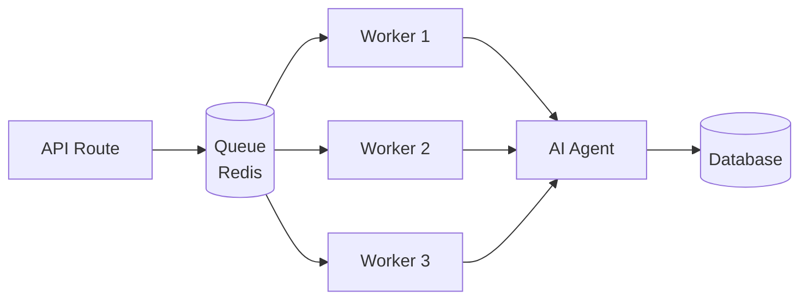

# BullMQ - Queue Management

**Technology**: BullMQ v5.x
**Official Docs**: https://docs.bullmq.io/
**Version**: 1.0.0
**Last Updated**: October 20, 2025

---

## 📋 Overview

BullMQ is a Redis-based queue system for Node.js used in JetVision to handle asynchronous agent tasks, long-running operations, and job scheduling. It provides reliable job processing with features like retry logic, job prioritization, and real-time monitoring.

### Why BullMQ?

- **Reliability**: Jobs are persisted in Redis, survive crashes
- **Scalability**: Horizontal scaling with multiple workers
- **Features**: Built-in retry logic, delayed jobs, job prioritization
- **Monitoring**: Real-time job status and metrics
- **Type Safety**: Full TypeScript support

---

## 🏗️ Architecture

### Queue Structure



### Queue Types in JetVision

```typescript
// Queue configuration
export const queueConfig = {
  // High-priority queue for orchestrator tasks
  orchestratorTasks: {
    name: 'orchestrator-tasks',
    concurrency: 5,
    priority: 1,
  },

  // Client data operations
  clientDataTasks: {
    name: 'client-data-tasks',
    concurrency: 10,
    priority: 2,
  },

  // Flight search operations (can be slow)
  flightSearchTasks: {
    name: 'flight-search-tasks',
    concurrency: 5,
    priority: 2,
  },

  // Proposal analysis
  proposalAnalysisTasks: {
    name: 'proposal-analysis-tasks',
    concurrency: 3,
    priority: 3,
  },

  // Email generation and sending
  communicationTasks: {
    name: 'communication-tasks',
    concurrency: 10,
    priority: 4,
  },

  // Error monitoring (low priority)
  errorMonitoringTasks: {
    name: 'error-monitoring-tasks',
    concurrency: 5,
    priority: 5,
  },
}
```

---

## 🛠️ Implementation Guide

### Step 1: Install BullMQ

```bash
npm install bullmq ioredis
```

### Step 2: Create Queue Configuration

```typescript
// lib/queues/config.ts
import { QueueOptions } from 'bullmq'

export const redisConnection = {
  host: process.env.REDIS_HOST || 'localhost',
  port: parseInt(process.env.REDIS_PORT || '6379'),
  password: process.env.REDIS_PASSWORD,
  maxRetriesPerRequest: null, // Required for BullMQ
  enableReadyCheck: false,
}

export const defaultQueueOptions: QueueOptions = {
  connection: redisConnection,
  defaultJobOptions: {
    attempts: 3,
    backoff: {
      type: 'exponential',
      delay: 2000,
    },
    removeOnComplete: {
      age: 3600, // Keep completed jobs for 1 hour
      count: 1000,
    },
    removeOnFail: {
      age: 86400, // Keep failed jobs for 24 hours
    },
  },
}
```

### Step 3: Create Queue Instances

```typescript
// lib/queues/index.ts
import { Queue } from 'bullmq'
import { defaultQueueOptions, queueConfig } from './config'

// Export all queue instances
export const orchestratorQueue = new Queue(
  queueConfig.orchestratorTasks.name,
  defaultQueueOptions
)

export const clientDataQueue = new Queue(
  queueConfig.clientDataTasks.name,
  defaultQueueOptions
)

export const flightSearchQueue = new Queue(
  queueConfig.flightSearchTasks.name,
  defaultQueueOptions
)

export const proposalAnalysisQueue = new Queue(
  queueConfig.proposalAnalysisTasks.name,
  defaultQueueOptions
)

export const communicationQueue = new Queue(
  queueConfig.communicationTasks.name,
  defaultQueueOptions
)

export const errorMonitoringQueue = new Queue(
  queueConfig.errorMonitoringTasks.name,
  defaultQueueOptions
)

// Graceful shutdown
const queues = [
  orchestratorQueue,
  clientDataQueue,
  flightSearchQueue,
  proposalAnalysisQueue,
  communicationQueue,
  errorMonitoringQueue,
]

process.on('SIGTERM', async () => {
  await Promise.all(queues.map((queue) => queue.close()))
})
```

### Step 4: Create Workers

```typescript
// lib/workers/orchestrator-worker.ts
import { Worker, Job, WorkerOptions } from 'bullmq'
import { redisConnection } from '../queues/config'
import { RFPOrchestrator } from '../agents/rfp-orchestrator'

const orchestrator = new RFPOrchestrator()

const workerOptions: WorkerOptions = {
  connection: redisConnection,
  concurrency: 5,
  limiter: {
    max: 10, // Max 10 jobs per duration
    duration: 1000, // 1 second
  },
}

export const orchestratorWorker = new Worker(
  'orchestrator-tasks',
  async (job: Job) => {
    console.log(`Processing job ${job.id} of type ${job.name}`)

    try {
      // Update job progress
      await job.updateProgress(10)

      const result = await orchestrator.execute(job.data)

      await job.updateProgress(100)

      return result

    } catch (error) {
      console.error(`Job ${job.id} failed:`, error)
      throw error
    }
  },
  workerOptions
)

// Event listeners
orchestratorWorker.on('completed', (job, result) => {
  console.log(`Job ${job.id} completed`, result)
})

orchestratorWorker.on('failed', (job, err) => {
  console.error(`Job ${job?.id} failed:`, err.message)
})

orchestratorWorker.on('progress', (job, progress) => {
  console.log(`Job ${job.id} progress: ${progress}%`)
})

orchestratorWorker.on('error', (err) => {
  console.error('Worker error:', err)
})
```

### Step 5: Add Jobs to Queue

```typescript
// app/api/requests/route.ts
import { orchestratorQueue } from '@/lib/queues'

export async function POST(request: NextRequest) {
  // ... authentication and validation ...

  // Add job to queue
  const job = await orchestratorQueue.add(
    'process-request', // Job name
    {
      // Job data
      requestId: newRequest.id,
      clientMessage,
      currentState: 'received',
      clerkUserId,
    },
    {
      // Job options
      priority: 1, // High priority
      attempts: 3,
      backoff: {
        type: 'exponential',
        delay: 2000,
      },
      timeout: 60000, // 60 second timeout
    }
  )

  return NextResponse.json({
    success: true,
    requestId: newRequest.id,
    jobId: job.id,
    status: 'queued',
  })
}
```

### Step 6: Get Job Status

```typescript
// app/api/jobs/[jobId]/route.ts
import { orchestratorQueue } from '@/lib/queues'

export async function GET(
  request: NextRequest,
  { params }: { params: { jobId: string } }
) {
  const job = await orchestratorQueue.getJob(params.jobId)

  if (!job) {
    return NextResponse.json({ error: 'Job not found' }, { status: 404 })
  }

  const state = await job.getState()
  const progress = job.progress

  return NextResponse.json({
    jobId: job.id,
    name: job.name,
    state, // 'waiting' | 'active' | 'completed' | 'failed' | 'delayed'
    progress,
    data: job.data,
    returnvalue: job.returnvalue,
    failedReason: job.failedReason,
    processedOn: job.processedOn,
    finishedOn: job.finishedOn,
  })
}
```

### Step 7: Scheduled/Delayed Jobs

```typescript
// Schedule job for future execution
await orchestratorQueue.add(
  'follow-up-email',
  { clientId: '123', requestId: '456' },
  {
    delay: 86400000, // 24 hours in milliseconds
  }
)

// Repeatable jobs (cron-like)
await orchestratorQueue.add(
  'daily-report',
  { type: 'daily' },
  {
    repeat: {
      pattern: '0 9 * * *', // Every day at 9 AM
      tz: 'America/New_York',
    },
  }
)
```

---

## 🎯 Best Practices

### 1. Job Idempotency

Make job handlers idempotent to handle retries safely:

```typescript
async function processJob(job: Job) {
  const { requestId } = job.data

  // Check if already processed
  const existing = await db.query(
    'SELECT * FROM processed_jobs WHERE job_id = $1',
    [job.id]
  )

  if (existing.rows.length > 0) {
    console.log('Job already processed, skipping')
    return existing.rows[0].result
  }

  // Process job
  const result = await doWork(requestId)

  // Mark as processed
  await db.query(
    'INSERT INTO processed_jobs (job_id, result) VALUES ($1, $2)',
    [job.id, result]
  )

  return result
}
```

### 2. Rate Limiting

Prevent overwhelming external APIs:

```typescript
const workerOptions: WorkerOptions = {
  connection: redisConnection,
  limiter: {
    max: 10, // Max 10 jobs
    duration: 1000, // per second
  },
}
```

### 3. Job Priority

Use priority for time-sensitive jobs:

```typescript
// High priority (processed first)
await queue.add('urgent-request', data, { priority: 1 })

// Normal priority
await queue.add('normal-request', data, { priority: 5 })

// Low priority (processed last)
await queue.add('background-task', data, { priority: 10 })
```

### 4. Dead Letter Queue

Handle consistently failing jobs:

```typescript
orchestratorWorker.on('failed', async (job, err) => {
  if (job && job.attemptsMade >= job.opts.attempts) {
    // Job exhausted all retries, move to dead letter queue
    await deadLetterQueue.add('failed-job', {
      originalJob: job.data,
      error: err.message,
      attempts: job.attemptsMade,
    })
  }
})
```

### 5. Monitoring & Metrics

Track queue metrics:

```typescript
// Get queue metrics
const counts = await queue.getJobCounts()
console.log({
  waiting: counts.waiting,
  active: counts.active,
  completed: counts.completed,
  failed: counts.failed,
  delayed: counts.delayed,
})

// Get waiting jobs
const waitingJobs = await queue.getWaiting()

// Get failed jobs
const failedJobs = await queue.getFailed()

// Clean old jobs
await queue.clean(3600000, 1000, 'completed') // Remove completed jobs older than 1 hour
```

---

## ⚠️ Common Pitfalls

### 1. Not Handling Job Failures

Always implement error handling:

```typescript
// ❌ BAD: No error handling
const worker = new Worker('my-queue', async (job) => {
  await processData(job.data)
})

// ✅ GOOD: Comprehensive error handling
const worker = new Worker('my-queue', async (job) => {
  try {
    await processData(job.data)
  } catch (error) {
    console.error(`Job ${job.id} failed:`, error)

    // Determine if retryable
    if (error.code === 'ETIMEDOUT') {
      throw error // Retry
    } else {
      // Log to monitoring and don't retry
      await errorMonitoring.log(error)
      throw new Error('Non-retryable error')
    }
  }
})
```

### 2. Memory Leaks in Workers

Clean up resources properly:

```typescript
const worker = new Worker('my-queue', async (job) => {
  const client = new SomeAPIClient()

  try {
    return await client.doSomething(job.data)
  } finally {
    // Always clean up
    await client.close()
  }
})
```

### 3. Not Setting Job Timeouts

Prevent jobs from running forever:

```typescript
await queue.add('long-task', data, {
  timeout: 300000, // 5 minute timeout
})
```

### 4. Redis Connection Issues

Handle connection failures:

```typescript
const worker = new Worker('my-queue', processor, workerOptions)

worker.on('error', (err) => {
  console.error('Worker error:', err)
  // Implement reconnection logic or alerting
})

worker.on('failed', async (job, err) => {
  if (err.message.includes('Redis')) {
    // Redis connection issue, log and alert
    await alertOps('Redis connection failed in worker')
  }
})
```

---

## 🧪 Testing

### Unit Testing Workers

```typescript
// __tests__/workers/orchestrator.test.ts
import { Queue, Worker } from 'bullmq'

describe('Orchestrator Worker', () => {
  let queue: Queue
  let worker: Worker

  beforeEach(() => {
    queue = new Queue('test-queue', { connection: testRedisConnection })
    worker = createOrchestratorWorker('test-queue')
  })

  afterEach(async () => {
    await queue.close()
    await worker.close()
  })

  it('should process job successfully', async () => {
    const job = await queue.add('test-job', {
      requestId: 'test-123',
      clientMessage: 'Test message',
    })

    // Wait for job to complete
    await job.waitUntilFinished(queue.events)

    const result = job.returnvalue
    expect(result.success).toBe(true)
  })

  it('should retry on failure', async () => {
    const job = await queue.add('test-job', { shouldFail: true })

    try {
      await job.waitUntilFinished(queue.events)
    } catch (error) {
      // Job should have failed after retries
      const jobData = await queue.getJob(job.id)
      expect(jobData.attemptsMade).toBeGreaterThan(1)
    }
  })
})
```

### Integration Testing

```typescript
// __tests__/integration/queue-flow.test.ts
describe('Queue Flow Integration', () => {
  it('should process end-to-end workflow', async () => {
    // Add job
    const job = await orchestratorQueue.add('process-request', testData)

    // Wait for completion
    const result = await job.waitUntilFinished(orchestratorQueue.events)

    // Verify database updates
    const request = await db.query(
      'SELECT * FROM requests WHERE id = $1',
      [testData.requestId]
    )

    expect(request.rows[0].status).toBe('completed')
    expect(result.success).toBe(true)
  })
})
```

---

## 📊 Monitoring Dashboard

### BullMQ Board (Optional UI)

```bash
npm install @bull-board/express @bull-board/api
```

```typescript
// server.ts (if using Express)
import { createBullBoard } from '@bull-board/api'
import { BullMQAdapter } from '@bull-board/api/bullMQAdapter'
import { ExpressAdapter } from '@bull-board/express'

const serverAdapter = new ExpressAdapter()
serverAdapter.setBasePath('/admin/queues')

createBullBoard({
  queues: [
    new BullMQAdapter(orchestratorQueue),
    new BullMQAdapter(clientDataQueue),
    // Add all queues
  ],
  serverAdapter,
})

app.use('/admin/queues', serverAdapter.getRouter())
```

Access at: `http://localhost:3000/admin/queues`

---

## 🔗 Related Documentation

- [Official BullMQ Docs](https://docs.bullmq.io/)
- [BullMQ Patterns](https://docs.bullmq.io/patterns/)
- [Redis Configuration](https://redis.io/docs/management/config/)
- [RFP Orchestrator Agent](../../agents/orchestrator/README.md)
- [Integration Patterns](../../guides/integration-patterns.md)

---

## 🔄 Version History

| Version | Date | Changes |
|---------|------|---------|
| 1.0.0 | Oct 20, 2025 | Initial documentation |

---

**Next Steps**: Review [Avinode API Documentation](../avinode/README.md)
