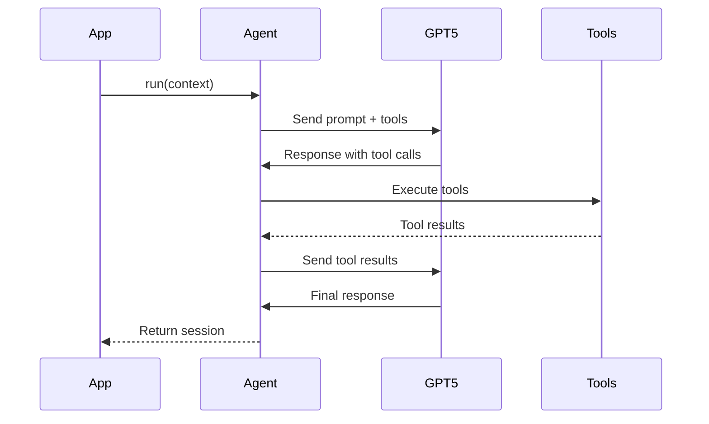

# OpenAI Agents Python SDK

**Framework**: OpenAI Agents Python Library
**Official Docs**: https://openai.github.io/openai-agents-python/
**Model**: GPT-5
**Version**: 1.0.0
**Last Updated**: October 20, 2025

---

## 📋 Overview

The OpenAI Agents Python SDK provides a framework for building AI agents with GPT-5. It handles tool calling, session management, streaming, and MCP (Model Context Protocol) integration, making it easy to create intelligent, autonomous agents.

### Key Features

- **Agent Creation**: Define agents with instructions and tools
- **Tool Context**: Execute functions and interact with external services
- **Sessions**: Maintain conversation context across interactions
- **Streaming**: Real-time response streaming
- **MCP Integration**: Native support for Model Context Protocol
- **Type Safety**: Full TypeScript/Python type definitions

---

## 🏗 Architecture

### Agent Lifecycle



---

## 🛠️ Implementation Guide

### Installation

```bash
npm install openai-agents
# or
pip install openai-agents
```

### Configuration

```typescript
// lib/config/openai-agents.ts
import { AgentConfig } from 'openai-agents'

export const baseAgentConfig: AgentConfig = {
  apiKey: process.env.OPENAI_API_KEY!,
  model: 'gpt-5',
  temperature: 0.7,
  maxTokens: 8192,
}
```

### Creating an Agent

```typescript
import { Agent } from 'openai-agents'

const agent = new Agent({
  name: 'Flight Search Agent',
  model: 'gpt-5',
  instructions: `You are a flight search specialist...`,
  tools: [
    {
      type: 'function',
      function: {
        name: 'search_flights',
        description: 'Search for available flights',
        parameters: {
          type: 'object',
          properties: {
            departure: { type: 'string' },
            arrival: { type: 'string' },
            date: { type: 'string' },
          },
          required: ['departure', 'arrival', 'date'],
        },
      },
    },
  ],
})
```

### Running an Agent

```typescript
const session = await agent.run({
  context: {
    userId: 'user_123',
    requestId: 'req_456',
  },
  input: 'Find flights from New York to Miami on November 15',
})

// Get response
const response = session.getLastMessage()

// Get tool calls
const toolCalls = session.getToolCalls()
```

### Tool Context

```typescript
import { ToolContext } from 'openai-agents'

async function searchFlights(
  args: { departure: string; arrival: string; date: string },
  context: ToolContext
) {
  // Access context
  const userId = context.get('userId')
  const requestId = context.get('requestId')

  // Execute search
  const results = await avinodeAPI.search(args)

  // Return structured data
  return {
    flights: results,
    count: results.length,
  }
}
```

### Sessions & Streaming

```typescript
// Create session
const session = await agent.createSession({
  context: { userId: 'user_123' },
})

// Stream responses
for await (const chunk of session.stream('What flights are available?')) {
  console.log(chunk.delta)
}

// Continue conversation
const response2 = await session.send('Show me the cheapest option')
```

---

## 🎯 Best Practices

1. **Clear Instructions**: Provide detailed agent instructions
2. **Structured Tools**: Well-defined tool schemas
3. **Error Handling**: Handle tool execution errors
4. **Context Management**: Use sessions for multi-turn conversations
5. **Type Safety**: Leverage TypeScript types

---

## 📚 Related Documentation

- [Official OpenAI Agents Docs](https://openai.github.io/openai-agents-python/ref/)
- [Tool Context Reference](https://openai.github.io/openai-agents-python/ref/tool_context/)
- [All Agent Implementations](../../agents/)

---

**Version**: 1.0.0 | **Last Updated**: Oct 20, 2025
