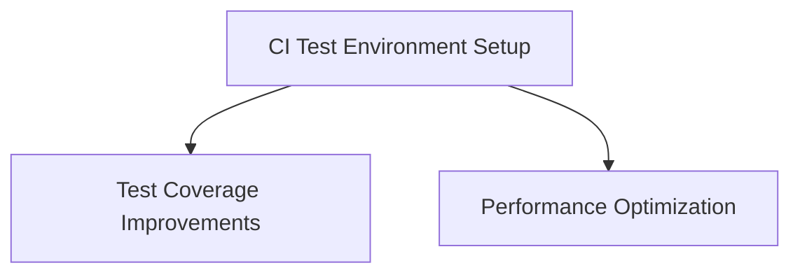

# Linear Task Templates

This directory contains detailed task specifications for creating Linear issues.

## Post-PR #22 Follow-up Tasks

After merging PR #22 (Database Schema Implementation), the following tasks were identified:

### 1. CI Test Environment Setup
**File**: [TASK-CI-TEST-ENVIRONMENT.md](./TASK-CI-TEST-ENVIRONMENT.md)
- **Priority**: High (Urgent)
- **Estimated Effort**: 2-3 hours
- **Blocking**: Test coverage improvements
- **Description**: Configure Supabase test database in GitHub Actions CI

### 2. Test Coverage Improvements
**File**: [TASK-TEST-COVERAGE-IMPROVEMENTS.md](./TASK-TEST-COVERAGE-IMPROVEMENTS.md)
- **Priority**: High
- **Estimated Effort**: 20 hours (2-3 days)
- **Depends On**: CI Test Environment Setup
- **Description**: Expand test coverage to reach 75% threshold

### 3. Performance Optimization
**File**: [TASK-PERFORMANCE-OPTIMIZATION.md](./TASK-PERFORMANCE-OPTIMIZATION.md)
- **Priority**: Medium
- **Estimated Effort**: 10 hours (1-2 days)
- **Description**: Optimize Next.js build and bundle size

---

## How to Create Linear Issues

### Option 1: Using Linear Web UI

1. Open [Linear](https://linear.app/one-kaleidoscope/team/ONEK/active)
2. Click "New Issue"
3. Copy content from the markdown file
4. Fill in:
   - **Title**: Use the file heading (e.g., "CI Test Environment Setup")
   - **Description**: Copy the full markdown content
   - **Priority**: As specified in the file
   - **Team**: One Kaleidoscope
   - **Project**: Jetvision MAS
   - **Labels**: As specified in file
   - **Assignee**: @kingler

### Option 2: Using Linear MCP (via Claude Code)

If you have Linear MCP configured, you can create issues programmatically:

```typescript
// Example: Create CI Test Environment issue
await mcp__linear__create_issue({
  teamId: "d79d93c9-3cb4-4859-bd94-6f001183b431", // One Kaleidoscope
  projectId: "f9b76257-a731-4679-bf78-aa3172bfe7d2", // Jetvision MAS
  title: "CI Test Environment Setup",
  description: "Content from TASK-CI-TEST-ENVIRONMENT.md",
  priority: 1, // Urgent
  labels: ["ci/cd", "testing", "supabase", "infrastructure"],
  assigneeId: "your-linear-user-id",
})
```

### Option 3: Using GitHub CLI (create draft PR)

Since GitHub issues are disabled, you can create draft PRs as tasks:

```bash
gh pr create --draft \
  --title "TASK: CI Test Environment Setup" \
  --body "$(cat docs/tasks/TASK-CI-TEST-ENVIRONMENT.md)"
```

---

## Task Priority Mapping

Linear Priority Values:
- **0** = No Priority
- **1** = Urgent
- **2** = High
- **3** = Medium
- **4** = Low

---

## Linear Team & Project IDs

**Team**: One Kaleidoscope
- ID: `d79d93c9-3cb4-4859-bd94-6f001183b431`

**Project**: Jetvision MAS
- ID: `f9b76257-a731-4679-bf78-aa3172bfe7d2`

---

## Task Dependencies



**Critical Path**: CI Test Environment Setup → Test Coverage Improvements

---

## Labels Used

- `ci/cd` - Continuous Integration/Deployment
- `testing` - Testing infrastructure and tests
- `supabase` - Supabase database related
- `infrastructure` - Infrastructure setup
- `quality` - Code quality improvements
- `coverage` - Test coverage related
- `performance` - Performance optimization
- `optimization` - General optimization
- `build` - Build system related

---

## References

- **PR #22**: https://github.com/kingler/v0-jetvision-assistant/pull/22
- **Linear Migration Script**: `scripts/linear/migrate-linear-issues.js`
- **Linear Status Sync**: `docs/LINEAR_STATUS_SYNC.md`

---

**Created**: 2025-11-08
**Context**: Post-PR #22 merge follow-up tasks
**Purpose**: Linear issue creation templates
