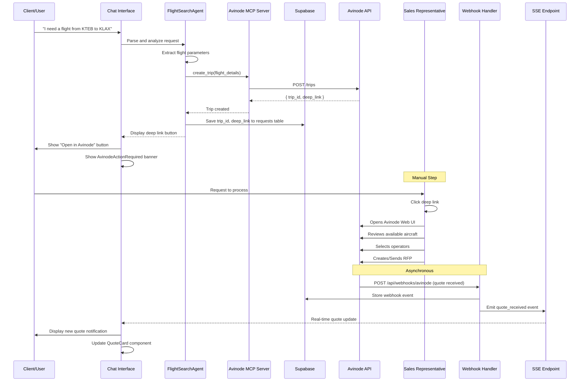

# Avinode Deep Link Workflow - UX Requirements

**Version**: 2.0.0
**Updated**: December 2025
**Status**: Production Ready
**Related Issues**: ONEK-120, ONEK-117, ONEK-118, ONEK-119

---

## Executive Summary

This document defines the UX requirements for the updated Avinode integration workflow. The key architectural change is the introduction of a **deep link-based workflow** where:

1. The system generates an Avinode deep link for the sales representative
2. The sales representative manually interacts with the Avinode marketplace
3. The TripID is captured and returned to the system
4. Real-time webhook events provide quote updates

This approach enables human-in-the-loop decision making while maintaining automation benefits.

---

## Workflow Overview

### Old Workflow (Deprecated)

```
User Request → AI Search → Automated RFP → Automated Quote Collection → Display
```

### New Deep Link Workflow (Current)

```
User Request → AI Flight Analysis → Deep Link Generation → Manual Sales Rep Action
                                                                      ↓
Display Quotes ← Webhook Events ← Sales Rep Creates RFP ← Sales Rep Opens Avinode
                                                                      ↓
                                                            TripID Returned to System
```

---

## Key Workflow Changes

### 1. Deep Link Generation and Display

**What Changed**: Instead of automatically creating RFPs in Avinode, the system now generates a deep link that opens the Avinode Web UI.

**UX Impact**:
- Users see a prominent "Open in Avinode" button
- Deep link opens Avinode marketplace in a new tab
- Sales representative can review and customize the RFP before sending

**Implementation Details**:

```typescript
// MCP Tool: create_trip
interface CreateTripResponse {
  trip_id: string      // e.g., "trp456789"
  deep_link: string    // e.g., "https://www.avinode.com/web/trips/trp456789"
  status: string       // "created" | "pending"
  created_at: string   // ISO 8601 timestamp
}
```

### 2. Manual Sales Representative Interaction

**What Changed**: A human sales representative now reviews flight options in Avinode before creating/sending the RFP.

**UX Flow**:

1. **AI Analyzes Request** → Parses user's flight requirements
2. **System Creates Trip** → Calls `create_trip` MCP tool
3. **Deep Link Displayed** → User sees "Open in Avinode" button
4. **Sales Rep Opens Link** → Avinode Web UI opens in new tab
5. **Sales Rep Selects Operators** → Manual selection of aircraft/operators
6. **Sales Rep Creates RFP** → Sends RFP to selected operators
7. **System Receives TripID** → Stores for tracking

**Benefits**:
- Human judgment in operator selection
- Ability to negotiate directly
- Quality control before sending RFPs
- Personalized operator messaging

### 3. TripID Return and Persistence

**What Changed**: The TripID is now captured and persisted immediately after trip creation.

**Database Schema** (existing from migration 015):

```sql
-- In requests table:
avinode_rfp_id TEXT      -- The RFP identifier
avinode_trip_id TEXT     -- The Trip identifier (e.g., "trp456789")
avinode_deep_link TEXT   -- Full URL to Avinode Web UI
```

**UI Display Locations**:
- Chat header (badge format)
- Chat sidebar (per-session)
- Workflow visualization (Step 3)

### 4. Webhook-Based Quote Updates

**What Changed**: Quotes are received via real-time webhooks instead of polling.

**Webhook Events**:
- `TripRequestSellerResponse` - Operator submitted a quote
- `TripChatSeller` - Operator sent a message
- `TripChatMine` - Confirmation of sent message

**Real-time Infrastructure**:
- SSE endpoint at `app/api/avinode/events/route.ts`
- Client hook: `useAvinodeEvents()`
- Database table: `avinode_webhook_events`

---

## UI Component Specifications

### 1. AvinodeDeepLinks Component

**Location**: `components/avinode/avinode-deep-links.tsx`
**Purpose**: Display clickable deep link button

**Props**:
```typescript
interface AvinodeDeepLinksProps {
  tripId: string
  deepLink: string
  isLoading?: boolean
  className?: string
}
```

**Visual States**:
- **Loading**: Spinner with "Creating trip..."
- **Ready**: "Open in Avinode" button with external link icon
- **Error**: "Failed to create trip" with retry option

**Example**:
```
┌─────────────────────────────────────────────────┐
│ ✈️ Avinode Trip: trp456789                       │
│ ┌───────────────────────────────────────────┐   │
│ │     🔗 Open in Avinode Marketplace        │   │
│ └───────────────────────────────────────────┘   │
└─────────────────────────────────────────────────┘
```

### 2. TripSummaryCard Component

**Location**: `components/avinode/trip-summary-card.tsx`
**Purpose**: Display trip overview with key details

**Props**:
```typescript
interface TripSummaryCardProps {
  tripId: string
  route: {
    departure: { icao: string; name: string; city: string }
    arrival: { icao: string; name: string; city: string }
  }
  departureDate: string
  passengers: number
  status: 'active' | 'pending' | 'completed' | 'cancelled'
}
```

**Visual Layout**:
```
┌─────────────────────────────────────────────────┐
│ Trip: trp456789                    [📋 Copy]    │
├─────────────────────────────────────────────────┤
│ KTEB ────────────✈️────────────→ KLAX           │
│ Teterboro, NJ              Los Angeles, CA      │
├─────────────────────────────────────────────────┤
│ 📅 Dec 20, 2025    👥 8 passengers              │
│ Status: 🟢 Active                               │
└─────────────────────────────────────────────────┘
```

### 3. RFQQuoteDetailsCard Component

**Location**: `components/avinode/rfq-quote-details-card.tsx`
**Purpose**: Display received quote with pricing

**Props**:
```typescript
interface RFQQuoteDetailsCardProps {
  quoteId: string
  operatorName: string
  aircraftType: string
  price: number
  currency: string
  validUntil: string
  receivedAt: string
  operatorRating?: number
}
```

### 4. AvinodeSidebarCard Component

**Location**: `components/avinode/avinode-sidebar-card.tsx`
**Purpose**: Compact trip info for sidebar display

### 5. AvinodeConnectionStatus Component

**Location**: `components/avinode/avinode-connection-status.tsx`
**Purpose**: Show SSE connection status indicator

**States**:
- 🟢 Connected - Receiving real-time updates
- 🟡 Connecting - Establishing connection
- 🔴 Disconnected - Connection lost, retrying

### 6. AvinodeAuthStatus Component

**Location**: `components/avinode/avinode-auth-status.tsx`
**Purpose**: Show Avinode authentication status

### 7. WebhookStatusIndicator Component

**Location**: `components/avinode/webhook-status-indicator.tsx`
**Purpose**: Show webhook event processing status

### 8. AvinodeActionRequired Component

**Location**: `components/avinode/avinode-action-required.tsx`
**Purpose**: Prominent banner when sales rep action needed

**Visual**:
```
┌─────────────────────────────────────────────────┐
│ ⚠️ ACTION REQUIRED                              │
│                                                 │
│ Please open Avinode to review operators and     │
│ send the RFP to your preferred aircraft.        │
│                                                 │
│ [🔗 Open in Avinode]                            │
└─────────────────────────────────────────────────┘
```

---

## Workflow Sequence Diagram



---

## Data Flow Architecture

### Trip Creation Flow

```
┌──────────────────┐      ┌──────────────────┐      ┌──────────────────┐
│   Chat Interface │──────│  FlightSearch    │──────│   Avinode MCP    │
│                  │      │     Agent        │      │     Server       │
└────────┬─────────┘      └────────┬─────────┘      └────────┬─────────┘
         │                         │                         │
         │  User submits request   │                         │
         │─────────────────────────>                         │
         │                         │  create_trip(params)    │
         │                         │─────────────────────────>
         │                         │                         │
         │                         │  { trip_id, deep_link } │
         │                         │<─────────────────────────
         │                         │                         │
         │                         │  Save to Supabase       │
         │                         │──────────┐              │
         │                         │          │              │
         │                         │<─────────┘              │
         │                         │                         │
         │  Display deep link      │                         │
         │<─────────────────────────                         │
         │                         │                         │
```

### Quote Reception Flow

```
┌──────────────────┐      ┌──────────────────┐      ┌──────────────────┐
│   Avinode API    │──────│  Webhook Handler │──────│   SSE Endpoint   │
│                  │      │                  │      │                  │
└────────┬─────────┘      └────────┬─────────┘      └────────┬─────────┘
         │                         │                         │
         │  POST webhook event     │                         │
         │─────────────────────────>                         │
         │                         │                         │
         │                         │  Validate signature     │
         │                         │──────────┐              │
         │                         │<─────────┘              │
         │                         │                         │
         │                         │  Store in DB            │
         │                         │──────────┐              │
         │                         │<─────────┘              │
         │                         │                         │
         │                         │  Emit to SSE            │
         │                         │─────────────────────────>
         │                         │                         │
         │                         │                         │  Push to clients
         │                         │                         │──────────────────>
```

---

## State Management

### Trip States

| State | Description | UI Indication |
|-------|-------------|---------------|
| `pending` | Trip created, awaiting action | Yellow badge, action required banner |
| `active` | RFP sent, awaiting quotes | Blue badge, "Waiting for quotes" |
| `quotes_received` | Quotes available | Green badge, quote count |
| `completed` | Trip finalized | Gray badge, completion timestamp |
| `cancelled` | Trip cancelled | Red badge with strike-through |

### Quote States

| State | Description | UI Indication |
|-------|-------------|---------------|
| `received` | New quote from operator | Green notification dot |
| `viewed` | User has seen the quote | No indicator |
| `selected` | Quote chosen for booking | Checkmark badge |
| `expired` | Quote validity passed | Grayed out with expiry message |

---

## Accessibility Requirements

### Keyboard Navigation
- All deep link buttons are focusable (tabindex)
- Enter/Space activates buttons
- Escape closes modals
- Arrow keys navigate quote list

### Screen Reader Support
- Proper ARIA labels on all components
- Live regions for quote notifications
- Role="status" for connection indicators

### Visual Accessibility
- Minimum 4.5:1 contrast ratio
- Color not sole indicator (use icons)
- Focus visible indicators
- Reduced motion support

---

## Error Handling

### Trip Creation Errors

| Error | User Message | Recovery Action |
|-------|--------------|-----------------|
| Network failure | "Unable to connect to Avinode" | Retry button |
| Auth expired | "Session expired" | Re-authenticate |
| Rate limited | "Too many requests" | Auto-retry with backoff |
| Invalid params | "Invalid flight details" | Highlight invalid fields |

### Webhook Errors

| Error | System Action | User Impact |
|-------|---------------|-------------|
| Invalid signature | Log and reject | None (silent) |
| DB write failure | Retry queue | Delayed update |
| SSE disconnect | Auto-reconnect | Brief indicator |

---

## Performance Requirements

### Response Times
- Deep link generation: < 2 seconds
- UI state update: < 100ms
- SSE reconnection: < 5 seconds

### Resource Limits
- Max concurrent SSE connections: 1000
- Webhook processing: < 500ms
- Quote list pagination: 20 items

---

## Testing Requirements

### Unit Tests
- [ ] AvinodeDeepLinks renders correctly
- [ ] TripSummaryCard displays all states
- [ ] QuoteCard handles all pricing formats
- [ ] Connection status updates properly

### Integration Tests
- [ ] create_trip returns valid deep link
- [ ] Webhook events update UI in real-time
- [ ] SSE reconnects after disconnect
- [ ] Database persistence works

### E2E Tests
- [ ] Full workflow from request to quote display
- [ ] Deep link opens Avinode correctly
- [ ] Quote notifications appear in real-time

---

## Related Documentation

- [ONEK-120: Enhance Chat Interface with Avinode Integration](https://linear.app/designthru-ai/issue/ONEK-120)
- [ONEK-117: Build RFQ ID Input Component](https://linear.app/designthru-ai/issue/ONEK-117)
- [ONEK-118: Build Avinode Chat Thread Component](https://linear.app/designthru-ai/issue/ONEK-118)
- [ONEK-119: Real-time Webhook-to-Frontend Bridge](https://linear.app/designthru-ai/issue/ONEK-119)
- [Workflow Visualization Integration](./WORKFLOW-AVINODE-INTEGRATION.md)

---

## Changelog

| Version | Date | Changes |
|---------|------|---------|
| 2.0.0 | Dec 2025 | Major update: Deep link workflow, manual sales rep interaction |
| 1.0.0 | Oct 2025 | Initial automated workflow documentation |
