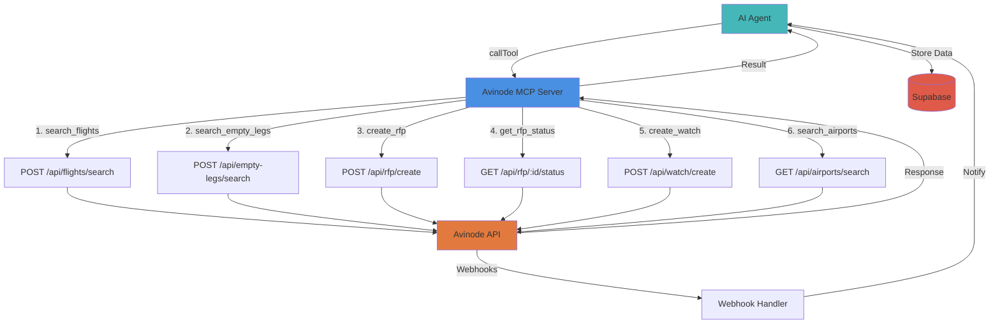
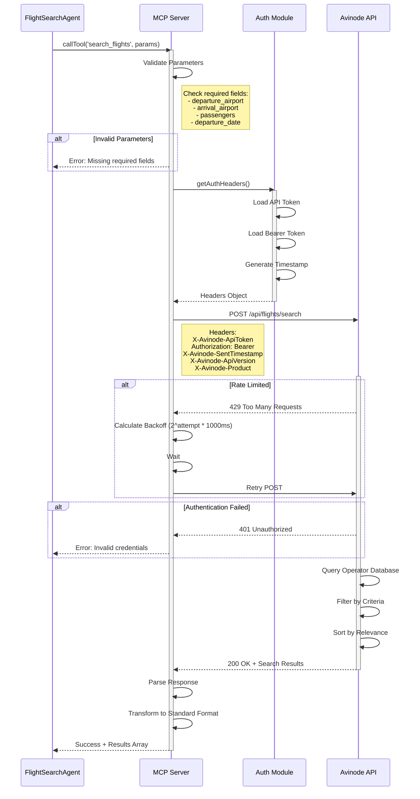
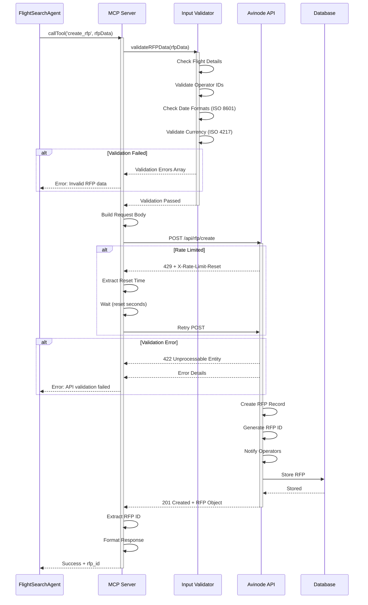
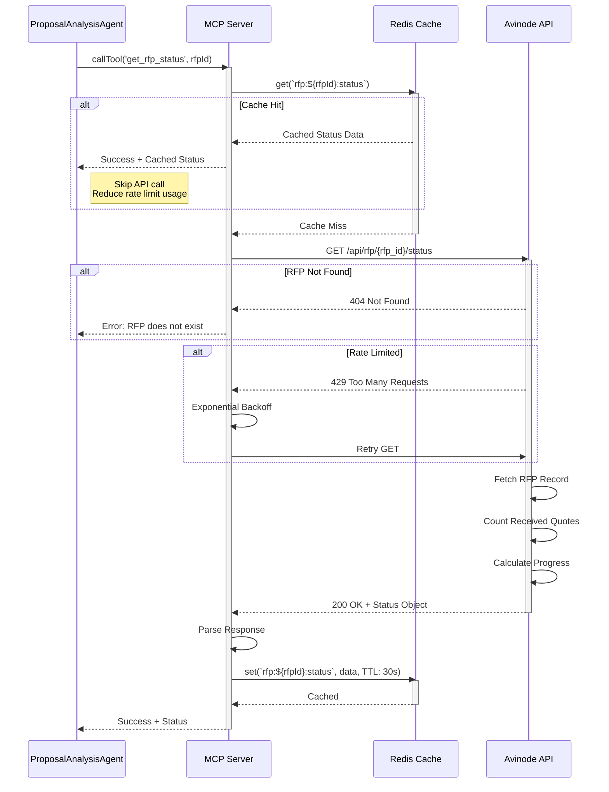
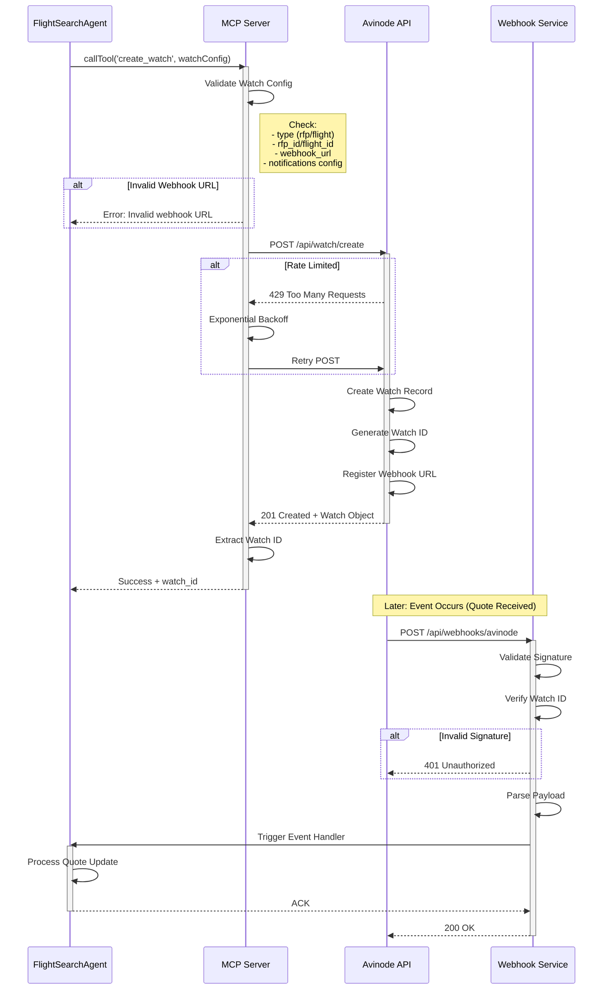
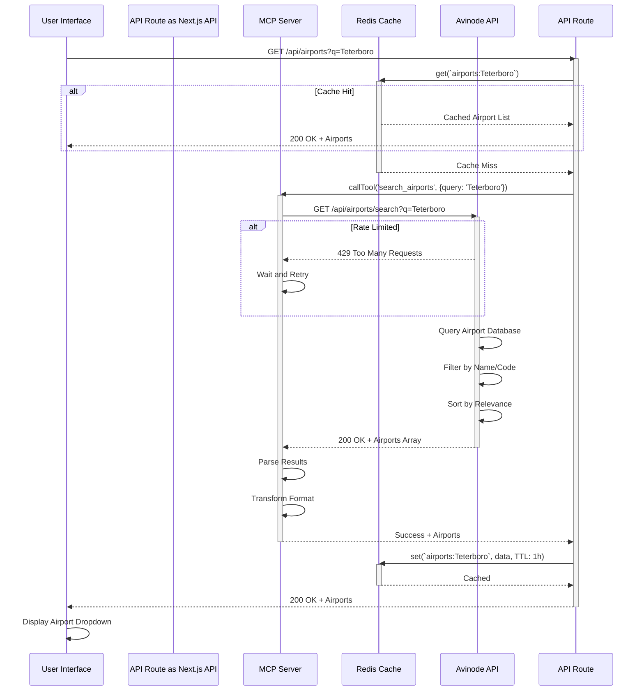
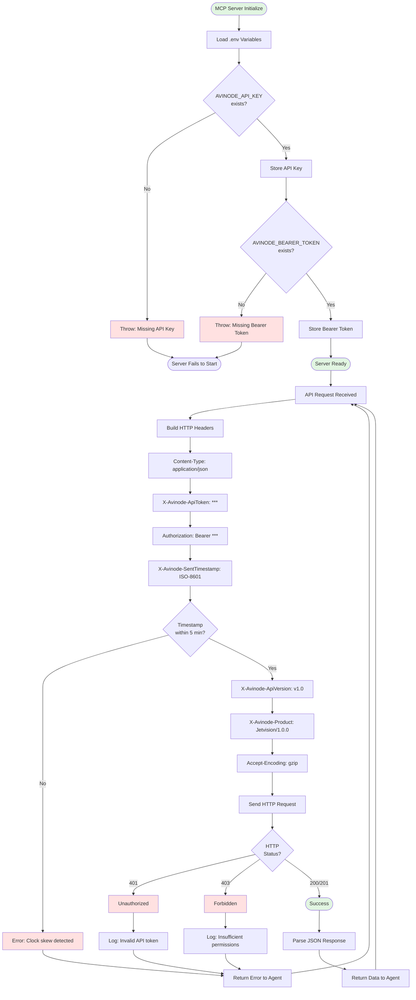
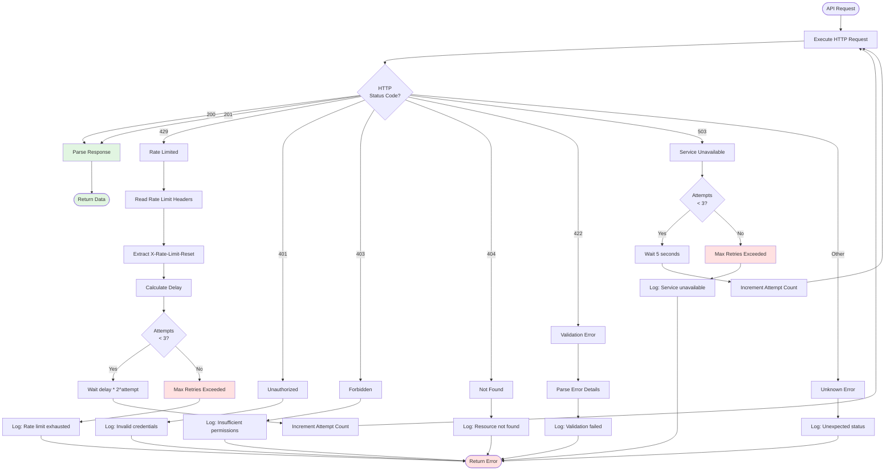

# Avinode MCP Server

MCP server for Avinode API integration - flight search and RFP management.

## Overview

This MCP server provides tools for interacting with the Avinode API:
- Search for charter flights
- Search for empty leg flights
- Create and manage RFPs (Requests for Proposal)
- Track quotes from operators
- Monitor flight availability via watches
- Search airport database

## Architecture Diagram

### Master API Integration Flow



## Tools

1. **search_flights** - Search available charter flights
2. **search_empty_legs** - Find discounted empty leg flights
3. **create_rfp** - Create RFP and send to operators
4. **get_rfp_status** - Check RFP status and retrieve quotes
5. **create_watch** - Monitor RFPs and price changes
6. **search_airports** - Search airports by name/code

## Prerequisites

### Avinode API Access

1. Sign up at [Avinode Developer Portal](https://developer.avinodegroup.com/)
2. Create an API key from the dashboard
3. Note your API key and base URL

### Environment Variables

Add to `.env.local`:

```env
# Avinode MCP Server
AVINODE_API_KEY=your-api-key-here
```

## Installation

```bash
cd mcp-servers/avinode-mcp-server
pnpm install
```

## Development

```bash
# Run in development mode
npm run dev

# Build for production
npm run build

# Run production build
npm start
```

## API Operation Diagrams

### 1. search_flights Tool - Sequence Diagram



### 2. create_rfp Tool - Sequence Diagram



### 3. get_rfp_status Tool - Sequence Diagram



### 4. create_watch Tool - Sequence Diagram



### 5. search_airports Tool - Sequence Diagram



### 6. Authentication Flow Diagram



### 7. Error Handling Flow



## Usage Examples

### Search Flights

```typescript
{
  tool: 'search_flights',
  arguments: {
    departure_airport: 'KTEB',  // Teterboro, NJ
    departure_date: '2025-11-01',
    departure_time: '14:00',
    arrival_airport: 'KMIA',    // Miami
    passengers: 6,
    aircraft_types: ['light_jet', 'midsize_jet'],
    max_budget: 50000,
    min_operator_rating: 4.5
  }
}
```

### Search Empty Legs

```typescript
{
  tool: 'search_empty_legs',
  arguments: {
    departure_airport: 'KTEB',
    arrival_airport: 'KMIA',
    date_range: {
      from: '2025-11-01',
      to: '2025-11-05'
    },
    passengers: 4,
    max_price: 25000
  }
}
```

### Create RFP

```typescript
{
  tool: 'create_rfp',
  arguments: {
    flight_details: {
      departure_airport: 'KTEB',
      departure_date: '2025-11-10',
      departure_time: '14:00',
      arrival_airport: 'KMIA',
      passengers: 4
    },
    operator_ids: ['op_123', 'op_456', 'op_789'],
    message: 'VIP client, please provide best rates',
    quote_deadline: '2025-11-08T18:00:00Z',
    client_reference: 'REQ-2025-1234'
  }
}
```

### Get RFP Status

```typescript
{
  tool: 'get_rfp_status',
  arguments: {
    rfp_id: 'rfp_abc123'
  }
}
```

**Response:**
```json
{
  "rfp_id": "rfp_abc123",
  "status": "in_progress",
  "quotes_received": 2,
  "quotes": [
    {
      "quote_id": "quote_xyz789",
      "operator": {
        "id": "op_123",
        "name": "Elite Air Charter",
        "rating": 4.8
      },
      "aircraft": {
        "type": "light_jet",
        "model": "Citation CJ3",
        "registration": "N123AB"
      },
      "pricing": {
        "total": 28500,
        "currency": "USD"
      },
      "valid_until": "2025-11-05T23:59:59Z"
    }
  ]
}
```

### Create Watch

```typescript
{
  tool: 'create_watch',
  arguments: {
    type: 'rfp',
    rfp_id: 'rfp_abc123',
    notifications: {
      on_new_quote: true,
      on_price_change: true,
      on_deadline_approaching: true
    },
    webhook_url: 'https://your-domain.com/api/webhooks/avinode'
  }
}
```

### Search Airports

```typescript
{
  tool: 'search_airports',
  arguments: {
    query: 'Teterboro',
    country: 'US'
  }
}
```

**Response:**
```json
{
  "airports": [
    {
      "icao": "KTEB",
      "iata": "TEB",
      "name": "Teterboro Airport",
      "city": "Teterboro",
      "state": "New Jersey",
      "country": "United States"
    }
  ]
}
```

## Agent Integration

### Flight Search Agent

```typescript
import { MCPClient } from '@/lib/mcp/client'

const mcpClient = new MCPClient()

// Search for flights
const results = await mcpClient.callTool('avinode', {
  tool: 'search_flights',
  arguments: {
    departure_airport: 'KTEB',
    departure_date: '2025-11-01',
    arrival_airport: 'KMIA',
    passengers: 6
  }
})

// Create RFP with top operators
const rfp = await mcpClient.callTool('avinode', {
  tool: 'create_rfp',
  arguments: {
    flight_details: searchCriteria,
    operator_ids: selectedOperatorIds,
    message: 'VIP client request'
  }
})
```

## API Rate Limits

Avinode enforces rate limits based on your plan:
- **Basic**: 100 requests/hour
- **Pro**: 1000 requests/hour
- **Enterprise**: Custom limits

The client automatically retries on 429 (Rate Limit) errors with exponential backoff.

## Error Handling

The server returns structured error responses:

```json
{
  "content": [{
    "type": "text",
    "text": "Error executing tool: Avinode API error (404): Flight not found"
  }],
  "isError": true
}
```

## Testing

```bash
# Test connection
npx tsx src/index.ts

# Expected output:
# Avinode MCP server running on stdio
```

## Troubleshooting

### Error: Missing AVINODE_API_KEY

Add your API key to `.env.local`:
```env
AVINODE_API_KEY=your-key-here
```

### Error: No response from Avinode API

Check your network connection and verify the API endpoint is accessible.

### Error: Rate limit exceeded

Wait for the rate limit window to reset or upgrade your Avinode plan.

## Security Notes

- **Never commit** API keys to git
- Store credentials in `.env.local` (gitignored)
- Use environment variables only
- Rotate API keys regularly
- Monitor API usage in Avinode dashboard

## Related Documentation

- [Flight Search Agent](../../docs/subagents/agents/flight-search/README.md)
- [Avinode API Documentation](../../docs/subagents/technology-stack/avinode/README.md)
- [Official Avinode API](https://developer.avinodegroup.com/)
- [MCP Server Template](../TEMPLATE.md)

## Version History

| Version | Date | Changes |
|---------|------|---------|
| 1.0.0 | Jan 2025 | Initial implementation |
